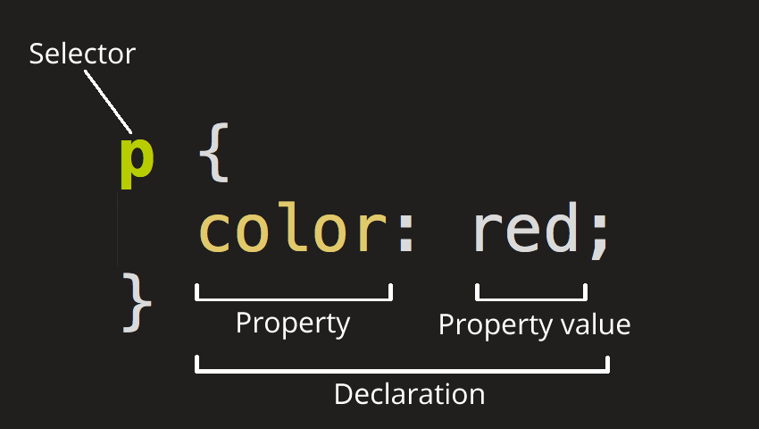
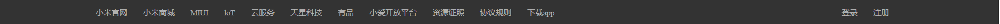

# 第一章 CSS基础

​	CSS（**C**ascading **S**tyle **S**heets）的全称为**层叠样式表**，是一种用来为结构化文档（如 HTML 文档或 XML 应用）添加样式（字体、间距和颜色等）的样式表语言，CSS 文件扩展名为 .css。

## 注释

- 单行注释：Ctrl + /    多行注释：Ctrl + Shift + /

  ``` html
  <style>
      .demo{
          /*这是一个单行注释*/
  
          /*多行注释第一行
          多行注释第二行
          多行注释第三行*/
      }
  </style>
  ```

## [CSS 规则集](https://developer.mozilla.org/zh-CN/docs/Learn/Getting_started_with_the_web/CSS_basics#“css_规则集”详解)

- 规则集结构

  

  规则集各个部分的名称：

  1. [**选择器**（Selector）](https://developer.mozilla.org/zh-CN/docs/Learn/Getting_started_with_the_web/CSS_basics#选择器（selector）)：用于指定为哪种元素添加样式
  2. [**声明**（Declaration）](https://developer.mozilla.org/zh-CN/docs/Learn/Getting_started_with_the_web/CSS_basics#声明（declaration）)：即属性名值对
  3. [**属性**（Properties）](https://developer.mozilla.org/zh-CN/docs/Learn/Getting_started_with_the_web/CSS_basics#属性（properties）)：用于指定改变元素的哪种样式
  4. [**属性值**（Property value）](https://developer.mozilla.org/zh-CN/docs/Learn/Getting_started_with_the_web/CSS_basics#属性的值（property_value）)：用于指定元素样式的值


- 规则集说明
  - 用大括号 `{}` 包含声明
  - 属性与属性值用冒号 `:` 分隔
  - 1个规则集里多个声明用分号 `;` 分隔
  - 1个声明里多个属性值用空格分隔

## CSS来源

- **语法**

  - 实际上 CSS 就是 HTML 的 **style** 属性，对于 HTML 而言，CSS可以有不同的来源。

- **内联样式**

  内联样式是元素内部使用 `style` 属性直接定义样式的一种方式。

  ```html
  <p style="color: blue; font-size: 24px;">这是蓝色的文本。</p>
  ```

- **内部样式表**

  内部样式表是指将 CSS 样式直接嵌入到 HTML 文档的 `<style>` 标签中，放置在文档的 `<head>` 部分。

  ```html
  <!DOCTYPE html>
  <html lang="en">
  <head>
      <meta charset="UTF-8">
      <meta name="viewport" content="width=device-width, initial-scale=1.0">
      <title>内嵌样式示例</title>
      <style>
          body {
              font-family: Arial, sans-serif;
              background-color: #f7f8fa;
          }
  
          h1 {
              color: #333;
          }
  
          p {
              font-size: 16px;
              line-height: 1.5;
          }
      </style>
  </head>
  <body>
      <h1>这是一个标题</h1>
      <p>这是一个段落文本。</p>
  </body>
  </html>
  ```

- **外部样式表**

  外部样式表是一种将 CSS 样式规则放置在名为 `style.css` 的外部样式表文件中。然后，通过在 HTML 文档的 `<head>` 部分使用 `<link>` 标签，将外部样式表链接到 HTML 文件中。这种方式使得可以在多个页面之间共享相同的样式，提高了代码的可维护性和复用性。

  1. **创建外部样式表文件（style.css）**

     ```css
     /* style.css */
     body {
         font-family: Arial, sans-serif;
         background-color: #f7f8fa;
     }
     
     h1 {
         color: #333;
     }
     
     p {
         font-size: 16px;
         line-height: 1.5;
     }
     ```

  2. **在 HTML 文档中链接外部样式表：**

     ```html
     <head>
         <link rel="stylesheet" href="style.css">
     </head>
     ```

## 样式优先级

- 样式来源优先级
  - `!important` > 内联样式 > 内部样式表 > 外部样式表 > 浏览器默认样式
- 同一样式表内优先级
  - ID选择器 > 类选择器、属性选择器、伪类 >元素选择器、伪元素 > 通用选择器、继承
  - 同一样式表中同一种样式写法，后声明的样式比先声明的优先级高

## 继承

- 子元素的某个属性值与父元素相同，有些属性值可以继承，有些不能

- [`inherit`](https://developer.mozilla.org/zh-CN/docs/Web/CSS/inherit) 开启继承

- [`initial`](https://developer.mozilla.org/zh-CN/docs/Web/CSS/initial) 将属性值设置为该属性的默认值

- [`revert`](https://developer.mozilla.org/en-US/docs/Web/CSS/revert)  将属性值设置为该属性的用户代理样式（即浏览器默认样式）

- [`unset`](https://developer.mozilla.org/zh-CN/docs/Web/CSS/unset) 将属性重置为自然值，也就是如果属性是自然继承那么就是 `inherit`，否则和 `initial` 一样

- 重设所有属性 `all`

- 示例

  ```html
  <div style="color: red;">
      <!-- 将 <p> 元素的 color 属性设置为默认值，否则应继承父元素 -->
      <p style="color: initial;">颜色变化</p>
      
      <!-- 将 <p> 元素的所有属性设置为默认值，否则应继承父元素 -->
      <p style="all: initial;">颜色变化</p>
  </div>
  ```

## [值和单位](https://developer.mozilla.org/zh-CN/docs/Learn/CSS/Building_blocks/Values_and_units)

### 长度和百分比

#### [长度值](https://www.runoob.com/cssref/css-units.html)

- 长度值 `length` 有一个数字和单位组成如 10px, 2em, 等。
  - 数字与单位之间不能出现空格。
  - 如果长度值为 0，则可以省略单位。
  - 对于某些 CSS 属性，长度可以是负数。
- 有两种类型的长度单位：相对和绝对。

- **绝对长度单位**

  - 绝对长度单位是一个固定的值，它反应一个真实的物理尺寸。绝对长度单位视输出介质而定，不依赖于环境（显示器、分辨率、操作系统等）。

  - 像素 `px`，厘米 `cm`，毫米 `mm`，英寸 `in` ，...

  - 1px = 1/96th of 1in


- **相对长度单位**

  - 相对长度单位指定了一个长度相对于另一个长度的属性。对于不同的设备相对长度更适用。

    | 单位      | 描述                                                         |
    | --------- | ------------------------------------------------------------ |
    | em        | 一般浏览器字体大小默认16px，1em == 16px                      |
    | vw/vh     | 视窗宽度/高度，1vw = 视窗宽度的1%                            |
    | vmin/vmax | vw和vh中较小/大的那个                                        |
    | ex        | 依赖于英文字母小 x 的高度                                    |
    | ch        | 数字 0 的宽度                                                |
    | rem       | rem 是根 em（root em）的缩写，rem作用于非根元素时，相对于根元素字体大小；rem作用于根元素字体大小时，相对于其出初始字体大小。 |


#### 百分比

- 百分比 `%` 一般基于父元素

### 颜色

- CSS中，颜色值通常以以下方式定义:
  - 十六进制 - 如："#ff0000"
  - RGB - 如："rgb(255,0,0)"
  - 颜色名称 - 如："red"

### 其它值

- 数字、字符串、标识符、函数

# 第二章 选择器

## [选择器](https://developer.mozilla.org/zh-CN/docs/Learn/CSS/Building_blocks/Selectors)

- **选择器**用来指定网页上我们想要样式化的 HTML 元素。
- **选择器的对象**：选择器所选择的元素
- **选择器列表**：多个选择器组合在一起
  - 通过逗号 `,` 将多个选择器列在一起
  - 当你使用选择器列表时，如果任何一个选择器无效 (存在语法错误)，那么整条规则都会被忽略。
- **选择器种类**
  - 标签选择器、ID选择器、类选择器、属性选择器、伪类、伪元素

## 类选择器

- **类选择器**

  以类选择器为例，其它同理

  ```html
  <head>
      <meta charset="UTF-8">
      <title>测试页面</title>
      <style>
          .xxx {
              background-color: red;
              color: green;
          }
      </style>
  </head>
  <body>
      <div class="xxx">测试字体1</div>
      <div class="xxx">测试字体2</div>
      <div class="xxx">测试字体3</div>
  </body>
  ```

- **常见选择器**

  | 选择器                                                       | 示例       | 示例说明                                            | css  |
  | ------------------------------------------------------------ | ---------- | --------------------------------------------------- | ---- |
  | 通用选择器                                                   | *          | 选择所有元素                                        | 2    |
  | 元素选择器                                                   | p          | 选择所有<p>元素                                     | 1    |
  | 类选择器                                                     | .class     | 选择所有class="class"的元素                         | 1    |
  | ID选择器                                                     | \#id       | 选择所有id="id"的元素                               | 1    |
  | [属性选择器](https://developer.mozilla.org/zh-CN/docs/Learn/CSS/Building_blocks/Selectors/Attribute_selectors) | [target]   | 选择所有带有target属性的元素                        | 2    |
  |                                                              |            |                                                     |      |
  | 关系选择器                                                   |            |                                                     |      |
  | 后代选择器（所有后代）                                       | div p      | 选择<div>元素内的所有<p>元素                        | 1    |
  | 子代选择器（直系后代）                                       | div>p      | 选择<div>元素内的直系<p>元素                        | 2    |
  | 相邻兄弟选择器                                               | div+p      | 选择 <div> 元素之后的第一个 <p> 元素                | 2    |
  | 通用兄弟选择器                                               | div~p      | 选择<div> 元素之后的所有 <p> 元素                   |      |
  |                                                              |            |                                                     |      |
  | [选择器列表](https://developer.mozilla.org/zh-CN/docs/Web/CSS/Selector_list) | div,p      | 选择所有<div>元素和 <p> 元素                        | 1    |
  | 组合选择器                                                   | p.class#id | 选择同时具有class="class"、id="id"属性的所有<p>元素 | 1    |

## [属性选择器](https://developer.mozilla.org/zh-CN/docs/Learn/CSS/Building_blocks/Selectors/Attribute_selectors)

- **属性选择器**

  | 选择器         | 示例              | 示例说明                                                 |
  | -------------- | ----------------- | -------------------------------------------------------- |
  | [attr]         | [attr]            | 选择所有带有attr属性的元素                               |
  | [attr=value]   | [attr=value]      | 选择所有 attr 值为 "value" 的元素                        |
  | [attr=value i] | [attr=value i]    | 选择所有 attr 值为 "value" 的元素，并对大小写不敏感      |
  | [attr\|=value] | [class\|="class"] | 选择所有 class 名为 "class" 或者以 "class" 开头的元素    |
  | [attr~=value]  | [class~="class"]  | 选择所有 class 名内含有 "special" 值的元素（多个属性值） |
  | [attr^=value]  | [class^="cla"]    | 选择所有 class 名以子字符串 "cla" 开头的元素             |
  | [attr$=value]  | [class$="cla"]    | 选择所有 class 名以子字符串 "cla" 结尾的元素             |
  | [attr*=value]  | [class*="cla"]    | 选择所有 class 名带有子字符串 "cla" 的元素               |

## [伪类](https://developer.mozilla.org/zh-CN/docs/Web/CSS/Pseudo-classes)

- 伪类是添加到选择器的关键字，也是选择器的一种，用于选择处于特定状态的元素。
- 伪类由冒号（`:`）后跟着伪类名称组成（例如，`:hover`）。

## [伪元素](https://developer.mozilla.org/zh-CN/docs/Web/CSS/Pseudo-elements)

- 伪元素是添加到选择器的关键字，也是选择器的一种，用于选择一个元素的特定部分。
- 伪类由双冒号（`::`）（兼容单冒号）后跟着伪类名称组成（例如，`::first-line`）。
- 一个选择器中只能使用一个伪元素。

## 关系选择器

## [选择器列表](https://developer.mozilla.org/zh-CN/docs/Web/CSS/Selector_list)

## 组合选择器

# 第n章 未整理

## [背景](https://www.runoob.com/css/css-background.html)

### [背景颜色](https://www.runoob.com/cssref/pr-background-color.html)

**background-color** 属性设置一个元素的背景颜色。

- 默认情况下，元素的背景是元素的总大小，包括填充和边框（但不包括外边距）

### [背景图像](https://www.runoob.com/cssref/pr-background-image.html)

**background-image** 属性描述了元素的背景图像。

- 默认情况下，元素的背景包括内容区域、内边距（padding），以及边框（border），但不包括外边距（margin）
- 默认情况下，背景图像进行平铺重复显示，以覆盖整个元素实体。

### [背景平铺](https://www.runoob.com/cssref/pr-background-repeat.html)

**background-repeat** 设置如何平铺对象的 background-image 属性。

- 默认垂直和水平方向平铺。
- 水平 `repeat-x`   垂直 `repeat-y`   不平铺 `no-repeat`

### [背景固定](https://www.runoob.com/cssref/pr-background-attachment.html)

**background-attachment** 设置背景图像是否固定或者随着页面的其余部分滚动。

- 默认背景图片随着页面的滚动而滚动
- 不滚动 `fixed`

### [背景位置](https://www.runoob.com/cssref/pr-background-position.html)

- `background-position` 属性设置背景图像的起始位置。

- 默认 `0px 0px`

  - xy方向两个值，用空格分隔，如果仅指定一个关键字，其他值将会是"center"
  - 像素值 `px` 表示图像左上角的坐标
  - 百分比 `%` 表示图像中心在xy方向的位置
  - 左、中、右 `left` `center` `right`   左上 `left top` ...

  ```html
  <style>
      body {
          background-image: url(images/00.png);
          background-repeat: no-repeat;
          background-position: 50px 50px;
      }
  </style>
  ```

  

### [背景简写](https://www.runoob.com/cssref/css3-pr-background.html)

- `background` 属性用于在一个声明中设置多个属性。

  ```html
  <style>
      body {
          background: #00ff00 url("images/b.jpg") no-repeat fixed center;
      }
  </style>
  ```

## [文本](https://www.runoob.com/css/css-text.html)

### [文本颜色](https://www.runoob.com/cssref/pr-text-color.html)

`color` 属性设置元素的文本颜色。

### [文本对齐](https://www.runoob.com/cssref/pr-text-text-align.html)

1. **水平对齐**

   - text-align属性指定元素文本的水平对齐方式。

   - 通常用于块级元素和部分行内元素（如 `<span>`）

   - 属性值

     - 默认靠左 left
     - 靠右 right、居中 center、两端 justify

     ```css
     .example {text-align: center}
     ```

2. **垂直对齐**

   1. 使用 `line-height` 属性

      ```CSS
      .container {
          height: 100px; /* 容器高度 */
          line-height: 100px; /* 行高等于容器高度 */
      }
      ```

      ```html
      <div class="container">
          <div>这个元素内容将会基于容器垂直对齐。</div>
      </div>
      ```

   2. 使用 `padding` 属性

      ```css
      .container {
          padding: 10px 0; /* 容器上下内边距相等 */
          border: 3px solid green;
      }
      ```

      ```html
      <div class="container">
          <div>这个元素内容将会基于容器垂直对齐。</div>
      </div>
      ```

### [行高](https://www.runoob.com/cssref/pr-dim-line-height.html)

- `line-height` 属性用于设置行高

- 通常用于行内元素和表格单元格。

  - 默认 `normal`
    - 大多数浏览器的默认行高约为110%至120%
  - `px`  固定像素值的行间距
  - `数字`  此数字会与当前的字体尺寸相乘来设置行间距。
  - `%` 基于当前字体尺寸的百分比行间距。

- 使用`line-height` 属性设置文本基于容器垂直居中


### [文本装饰](https://www.runoob.com/cssref/pr-text-text-decoration.html)

text-decoration 属性规定添加到文本的修饰，下划线、上划线、删除线等。

- 默认无装饰线 `none`
- 上划线 `overline`   下划线 `underline`   删除线 `line-through`   闪烁 `blink`   继承 `inherit`

### [大小写](https://www.runoob.com/cssref/pr-text-text-transform.html)

- `text-transform` 属性控制文本的大小写。

- 默认不强制转换 `none`。
  - `capitalize` 每个单词以大写字母开头
  - `uppercase` 仅有大写字母
  - `lowercase` 仅有小写字母
  - `inherit`  继承

### [文本缩进](https://www.runoob.com/cssref/pr-text-text-indent.html)

- text-indent 属性规定文本块中首行文本的缩进。
- 默认无缩进 `0`
  - 像素值 `px`   百分比 `%`

## [字体](https://www.runoob.com/css/css-font.html)

### [字体系列](https://www.runoob.com/cssref/pr-font-font-family.html)

- `font-family` 属性指定一个元素文本的字体系列
- 为了防止浏览器不支持第一种字体，font-family 属性应该同时设置几个字体名称作为一种"后备"机制，多个字体系列用逗号分隔。
- 如果字体系列的名称超过一个字，它必须用引号，如Font Family："宋体"。

### [字号](https://www.runoob.com/cssref/pr-font-font-size.html)

- `font-size` 属性用于设置字体大小。
- body默认大小为 `medium` = `16px`
  - 像素 `px`   百分比 `%`   `em`   小 `small`   正常 `medium`   大 `large` ...
  - `em` 和  `%` 都基于父元素，例如父元素字体大小为16px，那么子元素 `1em` 和 `100%` 都等同于16px

### [粗细](https://www.runoob.com/cssref/pr-font-weight.html)

- `font-weight` 属性设置文本的粗细
- 默认粗细为 `normal` = 400
  - `bold` = 700   `bolder`  `lighter`

### [字体样式](https://www.runoob.com/cssref/pr-font-font-style.html)

- font-style属性指定文本的字体样式。
- 默认正常显示 `normal`
- 斜体 `italic`

### [小型大写字母](https://www.runoob.com/cssref/pr-font-font-variant.html)

- font-variant 属性设置小型大写字母的字体显示文本，即所有小写字母都会转换为大写字母，但字体尺寸会比正常大写字母的小。
- 默认为 `normal` 浏览器正常显示
  - 小型大写字母 `small-caps`

### [字体简写](https://www.runoob.com/cssref/pr-font-font.html)

- `font` 属性用于在一个声明中设置多个属性。

  - 可设置的属性是（按顺序）： "font-style font-variant font-weight font-size/line-height font-family"
  - font-size和font-family的值是必需的。
  - 如果缺少了其他值，默认值将被插入，如果有默认值的话。

  ```html
  <style>
      p {
          font: bolder 50px 微软雅黑, sans-serif;
      }
  </style>
  ```

## [链接](https://www.runoob.com/css/css-link.html)

### 链接状态

- 链接状态：
  - a:link - 正常，未访问过的链接
  - a:visited - 用户已访问过的链接
  - a:hover - 当用户鼠标放在链接上时
  - a:active - 链接被点击的那一刻
- 当设置为若干链路状态的样式，也有一些顺序规则：
  - a:hover 必须跟在 a:link 和 a:visited后面
  - a:active 必须跟在 a:hover后面

### 链接样式

- 可以用任何CSS属性（如下划线、字体颜色、背景色等）修改各个链接状态的样式。

- **下划线**

  - 可以使用`text-decoration` 属性删除链接中的下划线

  - 默认为 `underline` 有下划线

  - 无下划线 `none`

    ```html
    <style>
        a:link {text-decoration: none;}
    </style>
    ```

- **字体颜色**

  - 可以使用 `background-color` 属性指定链接字体颜色

    ```html
    <style>
        a:link {color: #000000;}
        a:hover {color: #4183C4;}
    </style>
    ```
    

## [列表](https://www.runoob.com/css/css-list.html)

### [标记类型](https://www.runoob.com/cssref/pr-list-style-type.html)

- `list-style-type` 属性用于指定列表项标记的类型

- 默认有序 `<ol>` 标记 `decimal`，无序 `<ul>` 标记 `disc`

  - 实心圆 `disc`   空心圆 `circle`
  - 数字 `decimal`   小写英文 `lower-alpha`   大写英文 `upper-alpha`   小写罗马 `lower-roman`
  - 移除标记 `none`

  ```html
  <style>
      ul {
          list-style-type: circle;
      }
  
      ol {
          list-style-type: lower-alpha;
      }
  </style>
  ```

### [图像标记](https://www.runoob.com/cssref/pr-list-style-image.html)

- `list-style-image` 属性使用图像来替换列表项的标记。

- 默认为 `none`

  ```html
  <style>
      ul {
          list-style-image: url('sqpurple.gif');
      }
  </style>
  ```

### [列表简写](https://www.runoob.com/cssref/pr-list-style.html)

- list-style 属性用于在一个声明中设置多个属性。
- 可以设置的属性（按顺序）： list-style-type, list-style-position, list-style-image.
- 默认 `disc` `outside` `none`
- 默认情况下列表 `<ul>` 或 `<ol>` 还设置了内边距和外边距，可使用 `margin:0` 和 `padding:0` 来移除

## [表格](https://www.runoob.com/css/css-table.html)

### 折叠边框

- 元素 `<table>` 的 `boder` 属性控制边框已经弃用，在实际开发中，建议使用 CSS 样式来进行更灵活和精细的样式控制，或者引入BootStrap。

- CSS 中的 `border` 样式属性可以给表格加边框

  - 线宽 `px`  线型 `solid`  颜色 `black`
  - 但是由于表格和th/ td元素有独立的边界，所以表格有双边框。

  

  ```html
  <style>
      table,th,td {
          border: 1px solid black;
      }
  </style>
  ```

- 添加`border-collapse` 属性可设置表格的边框是否被折叠成一个单一的边框或隔开，即折叠边框，解决双边框问题。

  

  ```html
  <style>
      table {
          border-collapse: collapse;
      }
      table,th,td {
          border: 1px solid black;
      }
  </style>
  ```

- 引入BootStrap

  

  ```html
  <!DOCTYPE html>
  <html lang="en">
  <head>
      <meta charset="UTF-8">
      <meta name="viewport" content="width=device-width, initial-scale=1.0">
      <title>百分比宽度示例</title>
      
      <!-- 引入BootStrap -->
      <link rel="stylesheet" href="bootstrap/css/bootstrap.css">
  </head>
  <body>
      <!-- 使用border属性 -->
      <table border="1"></table>
      
      <!-- 使用BootStrap -->
      <table class="table">
          <tr>
              <th>表头1</th>
              <th>表头2</th>
          </tr>
          <tr>
              <td>数据1</td>
              <td>数据2</td>
          </tr>
          <tr>
              <td>数据3</td>
              <td>数据4</td>
          </tr>
      </table>
  </body>
  </html>
  ```

### 表格颜色

- 表格颜色

  ```html
  <style>
      table, td, th{
          border:1px solid green;
      }
      th{
          background-color:green;
          color:red;
      }
  </style>
  ```

### 表格尺寸

- `width`  和 `height` 属性用来设置表格尺寸
- 像素值 `px`   百分比 `%`
- `<table>`
  - 宽度 `width`   `px`   `%`
  - 高度 `height`   `px`
- `<th>`
  - 高度 `height`   `px`   `%`
- `<td>`
  - 高度 `height`   `px`   `%`

### 表格文字对齐

- 水平 `text-align`  垂直 `vertical-align`

- 注意 `vertical-align` 不能直接用于 `<table>`元素，而应该用在 `<th>` 和 `<td>` 中

  - `left  center  right`    `top  middle  bottom`

  ```html
  <!DOCTYPE html>
  <html lang="en">
  <head>
      <meta charset="utf-8">
      <title>表格文本居中</title>
      <style>
          table {
              border-collapse: collapse; /* 折叠边框 */
              width: 100%;
              height: 200px;
              text-align: center; /* 水平居中 */
          }
  
          table,th,td {
              border: 1px solid black;
          }
          td {
              vertical-align: middle; /* 垂直居中 */
          }
          th {
              vertical-align: middle; /* 垂直居中 */
          }
      </style>
  </head>
  <body>
      <table>
          <tr>
              <th>表头1</th>
              <th>表头2</th>
          </tr>
          <tr>
              <td>数据1</td>
              <td>数据2</td>
          </tr>
          <tr>
              <td>数据3</td>
              <td>数据4</td>
          </tr>
      </table>
  </body>
  </html>
  ```

### 表格填充

- 如需控制边框和表格内容之间的间距，应使用td和th元素的填充属性

  ```html
  <style>
      td {
          padding: 5px;
      }
  </style>
  ```

## 盒子模型

### 模型概述

- HTML元素可以看作盒子，它包括：外边距、边框、内边距、内容和边框

  

- 不同部分的说明：
  - **Margin(外边距)** - 清除边框外的区域，外边距是透明的。
  - **Border(边框)** - 围绕在内边距和内容外的边框。
  - **Padding(内边距)** - 清除内容周围的区域，内边距是透明的。
  - **Content(内容)** - 盒子的内容，显示文本和图像。
  - **Outline(轮廓)** - 元素周围的轮廓线，可以与其它元素任何部分重合。

### [元素尺寸](https://www.runoob.com/css/css-dimension.html)

- height 和 width 属性设置元素内容区的高度和宽度。
- 属性值

  - 默认 auto，无继承

  - 长度值，%（基于父级元素高度）
- 最大值和最小值  max-height，min-height，max-width，min-width

- **注意：**
  - height 和 width 属性只包括内容区，不包括内边距、边框、外边距
  - height 和 width 属性对于纯行内标签无效
  - body标签默认宽度为一整行，无默认高度

### [轮廓](https://www.runoob.com/css/css-outline.html)

- 轮廓 outline 属性用于绘制元素周围的轮廓线，可起到突出元素的作用。

- 轮廓位于 border 外边缘的外围

- 轮廓可以与元素本身外边距及其它元素任何部分重合

- outline 属性用于在一个声明中设置多个属性。

  - **样式 outline-style** - 实心圆点 dotted、虚线 dashed、...
  - **线宽 outline-width** - 长度值、粗细 thin/thick、...
  - **颜色 outline-color**

  ```html
  <style>
      .example {
          outline:#00FF00 dotted 10px;
      }
  </style>
  ```

### [边框](https://developer.mozilla.org/zh-CN/docs/Web/CSS/border)

- 边框 border 属性用于绘制内边距和外边距之间的空间
- 边框位于内边距和外边距之间

- **边框样式**

  - border-style 属性用来定义边框的样式

  - 默认 none
    - 实线 solid，虚线 dashed，点线 dotted，...
  - border-style 属性可以有一到四个值
    - 一个值：上下左右相同
    - 两个值：上下 - 左右
    - 三个值：上 - 左右 - 下
    - 四个值：上 - 右 - 下 - 左

- **边框线宽**

  - border-width 属性用于设置边框线宽
  - 默认 medium
    - 长度值，thin/thick
  - border-width 属性可以有一到四个值
    - 设置规则同 border-style

- **边框颜色**

  - border-color 属性用于设置边框颜色
  - border-color 属性应该写在 border-style 之后
  - 无默认值
    - 颜色值，透明 transparent
  - border-color 属性可以有一到四个值
    - 设置规则同 border-style

- **边框圆角**

  - border-radius 属性用于设置边框圆角
  - 默认值为0
    - 长度值，%（基于元素的 width 和 height 属性值）
  - border-radius 属性可以有一到四个值
    - 一个值：四个角相同
    - 两个值：左上和右下 - 右上和左下
    - 三个值：左上 - 左下和右上 - 右下
    - 四个值：左上 - 右上 - 右下 - 左下

- **边框简写**

  - border 属性用于在一个声明中设置多个属性。
  - 可以设置的属性 border-style、border-width、border-color

  ```html
  <style>
      .example {
          border:solid 10px red;
      }
  </style>
  ```

- **单侧边框**
  - 可用以下属性设置单侧边框 border-top、border-right、border-bottom、border-left
    - 如果单侧边框不存在，会新创建单侧边框
    - 如果单侧边框存在，会改变单侧边框的属性
  - 单侧边框属性也可简写到一个声明中

### [外边距](https://developer.mozilla.org/zh-CN/docs/Web/CSS/margin)

- 外边距 margin 属性定义元素 border 以外的空间
- 上、下外边距的设置对**不可替换**内联元素无效。
- margin 没有背景颜色，完全透明
- margin 的值默认为0
  - auto 由浏览器设置
  - 长度值（可以使用负值，重叠的内容）
  - 百分比 %（基于包含块的 width）
- margin 属性可以有一到四个值
  - 一个值：上下左右相同
  - 两个值：上下 - 左右
  - 三个值：上 - 左右 - 下
  - 四个值：上 - 右 - 下 - 左
- 单侧外边距：margin-top、margin-right、margin-bottom、margin-left
- **外边距折叠**：两个外边距相接的元素，这些外边距将合并为一个外边距，即最大的单个外边距的大小。
- 可以利用 margin 使元素基于其父元素水平对齐
  - 元素必须是块级或显示为块级
  - 元素必须有width


### [内边距](https://developer.mozilla.org/zh-CN/docs/Web/CSS/padding)

- 内边距 padding 属性定义元素 border 和 content 之间的空间
- padding 本身没有背景颜色，完全透明，但有背景色时，会受到背景色影响
- padding 的值默认为0
  - 长度值
  - 百分比 %（基于包含块的 width）
- padding 属性可以有一到四个值
  - 设置规则同 margin
- 单侧内边距：padding-top、padding-right、padding-bottom、padding-left

### [溢出](https://developer.mozilla.org/zh-CN/docs/Web/CSS/overflow)

- overflow 属性用于控制内容溢出元素框时显示的方式。
- 属性值
  - 默认值 visible，如果有溢出内容，会呈现在元素框之外。
  - hidden 溢出内容不可见，但**可以**以编程的方式滚动。
  - clip 溢出内容不可见，但**不可以**以编程的方式滚动。
  - scroll 无论是否溢出，浏览器**总是**显示滚动条，所有内容通过滚动条查看。
  - auto 如果有溢出内容，浏览器显示滚动条，所有内容通过滚动条查看，否则正常显示。
- 说明
  - overflow 属性只工作于指定高度的块元素上。

## [显示方式](https://www.runoob.com/css/css-display-visibility.html)

​	在 HTML 中，元素可以分为块级元素和内联元素，它们在文档中的显示和布局方式不同。

1. **块级元素（Block-level Elements）**

   - 块级元素以块的形式显示，通常新起一行，默认宽度会占据父元素的100%。
   - 常见的块级元素包括 `<div>`、`<p>`、`<h1>` 到 `<h6>`、`<ul>`、`<ol>`、`<li>`、`<table>`、`<header>`、`<footer>` 等。

2. **内联元素（Inline Elements）**

   - 内联元素不会新起一行，它们在同一行上显示，只占据它所包含内容的宽度。
   - 常见的内联元素包括 `<span>`、`<a>`、`<strong>`、`<em>`、``、`<br>`、`<i>` 等。

3. **区别**

   - **显示方式：**
     - 块级元素：以块的形式显示，独占一行。
     - 内联元素：在同一行上显示，只占据内容的宽度。
   - **宽度：**
     - 块级元素：默认情况下宽度是父元素的100%。
     - 内联元素：宽度仅占据它所包含内容的宽度。
   - **高度：**
     - 块级元素：高度由内容和内边距决定，可以设置。
     - 内联元素：由所包含内容的高度决定，不可以设置。
   - **边距：**
     - 块级元素：全部可以设置。
     - 内联元素：不可以设置上下边距。
   - **可包含元素：**
     - 块级元素：可以包含块级元素和内联元素。
     - 内联元素：只能包含内联元素和部分其他内联元素。

4. **显示方式**

   - display 属性设置元素是否被视为块级或者内联元素以及用于子元素的布局。
   - `display:inline;` 显示为内联元素
   - `display:block;` 显示为块级元素
   - `display:inline-block` 显示为内联块元素，表现为同行显示并可修改宽高内外边距等属性
   - `display:flex;` 将元素设为弹性容器，子元素显示为弹性项目
     - 子元素水平居中 `justify-content: center;`
     - 子元素垂直居中 `align-items: center;`
   - `display:grid;` 将元素设为网格容器，子元素显示为网格项目
     - 子元素水平和垂直都居中 `place-items: center;`

5. **可见性**

   - `display:none;` 可以隐藏某个元素，且隐藏的元素不会占用任何空间，即不再影响页面布局。

   - `visibility:hidden;` 可以隐藏某个元素，但隐藏的元素仍需占用与未隐藏之前一样的空间，即仍会影响布局。

   - 鼠标悬停显示示例

     ```html
     <!DOCTYPE html>
     <html lang="en">
     
     <head>
         <meta charset="UTF-8">
         <meta name="viewport" content="width=device-width, initial-scale=1.0">
         <style>
             .hidden-element {
                 display: none;
             }
     
             .trigger-element:hover+.hidden-element {
                 display: block;
             }
         </style>
         <title>Show on Hover</title>
     </head>
     
     <body>
         <div class="trigger-element">Hover me</div>
         <div class="hidden-element">I appear on hover!</div>
     </body>
     
     </html>
     ```

     在上述示例中，不能将选择器 `.trigger-element:hover+.hidden-element` 中的“+”改成“,” 

## [元素定位](https://developer.mozilla.org/zh-CN/docs/Web/CSS/position)

- position 属性指定了元素的定位类型。

- 默认值为 static，即没有定位，遵循正常的文档流对象。

- position 属性的五个值（定位类型）：

  - 默认 static
  - 固定 fixed
  - 绝对 absolute
  - 相对 relative
  - 粘性 sticky

- **定位方法**

  - top，bottom，left，right，...
  - 定位值：默认 auto，长度值，百分比
  - 定位类型为 `static` 的元素不会受到 top、 bottom、 left、right影响
  - 可以省略定位方法

  ```html
  <style>
      .example {
          position: fixed;
          right: 20px;
          bottom: 20px;
      }
  </style>
  ```

- **[固定定位](https://www.runoob.com/css/css-positioning.html#position-fixed)**

  - `position: fixed;` 
  - 元素会被移出正常文档流，并不为元素预留空间，基于屏幕视口（viewport）的位置来指定元素位置。
  - 元素的位置在屏幕滚动时不会改变。

  - 元素不占据空间，可与其它元素重叠。

- **[绝对定位](https://www.runoob.com/css/css-positioning.html#position-absolute)**

  - `position:absolute;` 
  - 元素会被移出正常文档流，并不为元素预留空间，基于最近的非 static 定位的祖先元素位置来指定元素位置。
  - 元素不占据空间，可与其它元素重叠。
  - 绝对定位的元素可以设置外边距（margins），且不会与其他边距合并。

- **[相对定位](https://www.runoob.com/css/css-positioning.html#position-absolute)**

  - `position:relative;` 
  - 元素不会被移出正常文档流，并为元素预留空间，基于元素未定位的位置来指定元素位置。
  - 元素不占据空间，可与其它元素重叠。

- **[粘性定位](https://www.runoob.com/css/css-positioning.html#position-sticky)**

  - `position: sticky;`
  - 粘性定位可以被认为是相对定位和固定定位的混合。元素在跨越特定阈值前为相对定位，之后为固定定位。
  - 须指定四个阈值top、bottom、left、right其中之一，才可使粘性定位生效。否则其行为与相对定位相同。
  - Safari 需要使用 `position: -webkit-sticky;` 才能兼容。

- 下面是`position: sticky;`在两种元素中的对比案例

  ```html
  <!DOCTYPE html>
  <html lang="en">
  
  <head>
      <meta charset="UTF-8">
      <meta name="viewport" content="width=device-width, initial-scale=1.0">
      <style>
          /* header元素会始终停靠在页面顶部 */
          header {
              background-color: #333;
              color: #fff;
              text-align: center;
              position: sticky;
              top: 0;
              z-index: 100;
          }
  
          section {
              padding: 20px;
          }
  
          footer {
              background-color: #333;
              color: #fff;
              padding: 10px;
              text-align: center;
          }
  
          * {
              box-sizing: border-box;
          }
  
          dl {
              margin: 0;
              padding: 24px 0 0 0;
          }
  
          /*
              在描述列表<dl>里的<dt>元素，
              指定position: sticky，
              <dt>元素会呈现特殊显示
          */
          dt {
              background: #b8c1c8;
              border-bottom: 1px solid #989ea4;
              border-top: 1px solid #717d85;
              color: #fff;
              font:
                  bold 18px/21px Helvetica,
                  Arial,
                  sans-serif;
              margin: 0;
              padding: 2px 0 0 12px;
              position: -webkit-sticky;
              position: sticky;
              top: 16px;
          }
  
          dd {
              font:
                  bold 20px/45px Helvetica,
                  Arial,
                  sans-serif;
              margin: 0;
              padding: 0 0 0 12px;
              white-space: nowrap;
          }
  
          dd+dd {
              border-top: 1px solid #ccc;
          }
      </style>
  </head>
  
  <body>
      <header>
          <p>Sticky Header</p>
      </header>
  
      <section>
          <p>This is some content. Scroll down to see the header stick to the top.</p>
      </section>
  
      <footer>
          <p>Sticky Footer</p>
      </footer>
  
  
      <div>
          <dl>
              <dt>A</dt>
              <dd>Andrew W.K.</dd>
              <dd>Apparat</dd>
              <dd>Arcade Fire</dd>
              <dd>At The Drive-In</dd>
              <dd>Aziz Ansari</dd>
              <dd>Andrew W.K.</dd>
              <dd>Apparat</dd>
              <dd>Arcade Fire</dd>
              <dd>At The Drive-In</dd>
              <dd>Aziz Ansari</dd>
              <dd>Andrew W.K.</dd>
              <dd>Apparat</dd>
              <dd>Arcade Fire</dd>
              <dd>At The Drive-In</dd>
              <dd>Aziz Ansari</dd>
              <dd>Andrew W.K.</dd>
              <dd>Apparat</dd>
              <dd>Arcade Fire</dd>
              <dd>At The Drive-In</dd>
              <dd>Aziz Ansari</dd>
              <dd>Andrew W.K.</dd>
              <dd>Apparat</dd>
              <dd>Arcade Fire</dd>
              <dd>At The Drive-In</dd>
              <dd>Aziz Ansari</dd>
          </dl>
          <dl>
              <dt>C</dt>
              <dd>Chromeo</dd>
              <dd>Common</dd>
              <dd>Converge</dd>
              <dd>Crystal Castles</dd>
              <dd>Cursive</dd>
          </dl>
          <dl>
              <dt>E</dt>
              <dd>Explosions In The Sky</dd>
          </dl>
          <dl>
              <dt>T</dt>
              <dd>Ted Leo & The Pharmacists</dd>
              <dd>T-Pain</dd>
              <dd>Thrice</dd>
              <dd>TV On The Radio</dd>
              <dd>Two Gallants</dd>
          </dl>
      </div>
  </body>
  </html>
  ```

- **[元素堆叠](https://developer.mozilla.org/zh-CN/docs/Web/CSS/z-index)**

  - z-index 属性指定一个元素的堆叠顺序。
  - 只有定位类型为 fixed、absolute、relative的元素才能使用 z-index 属性。
  - 拥有更高堆叠顺序的元素总是会处于堆叠顺序较低的元素的前面。
  - 默认值为 auto，修改值为数字

  ```html
  <body>
      <h1 style="position: absolute; z-index: 2;">中国移动</h1>
      <p>因为“中国移动”设置了 z-index:2，所以它会显示本行之后。</p>
  </body>
  ```

- 案例：固定在窗口中上部的登录对话框，有遮盖cove

  ```html
  <!DOCTYPE html>
  <html lang="en">
  <head>
      <meta charset="UTF-8">
      <title>测试页面</title>
      <style>
          body{
              margin: 0;
          }
          .bg{
              height: 3000px;
              background-color: pink;
          }
          .cover{
              /*固定在整个窗口*/
              position: fixed;
              top: 0;
              bottom: 0;
              left: 0;
              right: 0;
  
              background-color: black;
              opacity: 0.5;
          }
          .dialog{
              position: fixed;
              top: 100px;
  
              /*左右居中*/
              left: 0;
              right: 0;
              margin: auto;
  
              width: 400px;
              height: 300px;
              background-color: white;
          }
      </style>
  </head>
  <body>
      <!--注意三者顺序，cover一定在dialog之前，否则会遮盖住dialog-->
      <!--或者通过z-index控制-->
      <div class="bg"></div>
      <div class="cover"></div>
      <div class="dialog"></div>
  </body>
  </html>
  ```


## [浮动](https://developer.mozilla.org/zh-CN/docs/Web/CSS/float)

- float 属性指定元素是否应该浮动，以及向哪个方向移动。

- **浮动效果**

  - 当一个元素浮动之后，它会被移出正常的文档流，然后向左或者向右平移，一直平移到所处的容器内容区边界，或者碰到另外一个浮动的元素。
  - 浮动元素之后的其它元素（块级元素的文本或者内联元素）将围绕它，之前的其它元素不受影响。
  - 块级元素浮动之后不再独占一行

- **属性值**

  - 默认值 none
  - left、right

- **清除浮动**

  1. 方案1：利用属性 **clear**

     - clear 属性让受浮动影响的其它元素不受浮动的影响，即不环绕元素，回归正常位置。

     - 默认值 none，其它属性值 left、right、both。
     - 该属性设置在受浮动影响的其它元素内。

     ```html
     <!DOCTYPE html>
     <html>
     <head>
         <meta charset="utf-8">
         <title>菜鸟教程(runoob.com)</title>
         <style>
             .wrapper {
                 border: 1px solid black;
                 width: 80%;
                 height: 500px;
     
                 /* 验证浮动到padding以内 */
                 /* padding: 10px; */
             }
     
             .black {
                 background-color: black;
                 width: 20%;
                 height: 200px;
                 float: left;
             }
     
             .blue {
                 background-color: blue;
                 width: 20%;
                 height: 100px;
                 float: right;
             }
     
             .con {
                 clear: both;
             }
         </style>
     </head>
     <body>
         <div class="wrapper">
             <div class="black"></div>
     
             <div class="blue"></div>
     
             <div class="con">
                 This paragraph clears both.This paragraph clears both.
                 This paragraph clears both.This paragraph clears both.
                 This paragraph clears both.This paragraph clears both.
                 This paragraph clears both.This paragraph clears both.
                 This paragraph clears both.This paragraph clears both.
                 This paragraph clears both.This paragraph clears both.
                 This paragraph clears both.This paragraph clears both.
                 This paragraph clears both.This paragraph clears both.
             </div>
         </div>
     </body>
     </html>
     ```

  2. 方案2：利用伪元素 **`:after`** 

     ```html
     <!DOCTYPE html>
     <html>
     <head>
         <meta charset="utf-8">
         <title>菜鸟教程(runoob.com)</title>
         <style>
             /*在style中添加clearfix style*/
             .clearfix::after {
                 content: "";
                 display: table;
                 clear: both;
             }
     
             .float-left {
                 float: left;
             }
     
             .float-right {
                 float: right;
             }
         </style>
     </head>
     <body>
         <div class="clearfix">
             <div class="float-left">浮动元素 1</div>
             <div class="float-right">浮动元素 2</div>
         </div>
         <p>这个段落不会环绕在浮动元素的周围。</p>
     </body>
     </html>
     ```

## 元素对齐

- **元素水平和垂直对齐**

  1. 使用 `display:flex`

     ```css
     .container {
         display: flex;
         justify-content: center; /* 子元素水平居中 */
         align-items: center; /* 子元素垂直居中 */
     }
     ```

     ```html
     <div class="container">
         <p class="content">这个元素将会基于容器水平垂直居中。</p>
     </div>
     ```

  2. 使用 `display:grid`

     ```css
     .container {
         display: grid;
         place-items: center; /* 子元素水平和垂直居中 */ 
     }
     ```

     ```html
     <div class="container">
         <p class="content">这个元素将会基于容器水平垂直居中。</p>
     </div>
     ```

- **元素垂直居中**

  - 使用 position 和 transform

  ```css
  .container {
      border: 3px solid green;
      height: 100px;
      position: relative; /* 父元素是相对定位 */
  }
  .content {
      margin: 0;
      background-color: pink;
      position: absolute; /* 子元素是绝对定位 */
      top: 50%;
      left: 50%;
      /* -ms-transform: translate(-50%, -50%); */
      transform: translate(-50%, -50%);
  }
  ```

  ```html
  <div class="container">
      <p class="content">这个元素将会基于容器水平垂直居中。</p>
  </div>
  ```

- **元素水平对齐**

  - 利用 margin，元素必须有宽度，元素必须是块级或显示为块级

  ```html
  <style>
      /* 水平靠左 */
      .example {
          width: 60%;
          margin-right: auto;
      }
      
      /* 水平居中 */
      .example {
          width: 60%;
          margin: auto;
      }
      
      /* 水平靠左 */
      .example {
          width: 60%;
          margin-left: auto;
      }
      
      /* 内联元素显示为块级并居中 */
      .example {
          width: 60%;
          margin: auto;
          display: block;
      }
  </style>
  ```

# 第..章 案例留存

## 小米商城顶部

- 小米

  

  ```html
  <!DOCTYPE html>
  <html lang="en">
  <head>
      <meta charset="UTF-8">
      <title>小米商城</title>
      <style>
          .line{
              height: 40px;
              line-height: 40px;
              background-color: #333;
          }
          .container{
              margin: auto;
              width: 1226px;
          }
          .left{
              float: left;
          }
          .right{
              float: right;
          }
          .menu{
              color: #b0b0b0;
              font-size: 12px;
              margin-right: 20px;
              text-decoration: none;
          }
          .menu:hover{
              color: white;
          }
          .download{
              width: 100px;
              position: absolute;
              left: -29px;
              display: None;
          }
          .download img{
              width: 100%;
          }
  
          /*注意是menu:hover，悬停在menu上，而不是download上*/
          .menu:hover .download{
              display: block;
          }
      </style>
  </head>
  <body>
  <!--贯穿整行整体-->
  <div class="line">
  
      <!--居中整体-->
      <div class="container">
  
          <!--左侧浮动整体-->
          <div class="left">
              <a target="_blank" href="https://www.mi.com/" class="menu">小米官网</a>
              <a target="_blank" href="https://www.mi.com/" class="menu">小米商城</a>
              <a target="_blank" href="https://www.mi.com/" class="menu">MIUI</a>
              <a target="_blank" href="https://www.mi.com/" class="menu">loT</a>
              <a target="_blank" href="https://www.mi.com/" class="menu">云服务</a>
              <a target="_blank" href="https://www.mi.com/" class="menu">天星科技</a>
              <a target="_blank" href="https://www.mi.com/" class="menu">有品</a>
              <a target="_blank" href="https://www.mi.com/" class="menu">小爱平台</a>
              <a target="_blank" href="https://www.mi.com/" class="menu">资源证照</a>
              <a target="_blank" href="https://www.mi.com/" class="menu">协议规则</a>
              
              <!--悬停展示二维码-->
              <a target="_blank" href="https://www.mi.com/" class="menu" 							style="position: relative">下载app
                  <div class="download">
                      
                  </div>
              </a>
          </div>
  
          <!--右侧浮动整体-->
          <div class="right">
              <a target="_blank" href="https://www.mi.com/" class="menu">登录</a>
              <a target="_blank" href="https://www.mi.com/" class="menu">注册</a>
          </div>
      </div>
  </div>
  </body>
  </html>
  ```

# Font Awesome

- 用法同BootStrap，老师使用V4.7版，现在官方最早版本为V5.15.4，使用时出现问题。

# 其它未整理

此部分是当初学Python时未整理的CSS剩余部分

## 悬停 hover

- 鼠标悬停到标签上面，标签style发生变化

  ```html
  <!DOCTYPE html>
  <html lang="en">
  <head>
      <meta charset="UTF-8">
      <title>测试页面</title>
      <style>
          span{
              font-size: 100px;
              background-color: green;
          }
          span:hover{
              font-size: 300px;
              color: red;
          }
      </style>
  </head>
  <body>
  <span>中国联通</span>
  </body>
  </html>
  ```

  - hover中未写的style依旧保持原style不变，如上述案例中的background-color: green


## 添加 after

- 自动为标签里的文字末尾添加内容

  ``` html
  <!DOCTYPE html>
  <html lang="en">
  <head>
      <meta charset="UTF-8">
      <title>测试页面</title>
      <style>
          span{
              font-size: 100px;
              background-color: green;
          }
          span:after{
              content: "公司";
          }
      </style>
  </head>
  <body>
  <span>中国联通</span>
  </body>
  </html>
  ```

  - 添加之后页面将展示“中国联通公司”
  - 注意content添加内容要加引号
  - 可以加内容，也可加其它style，详见清除浮动
