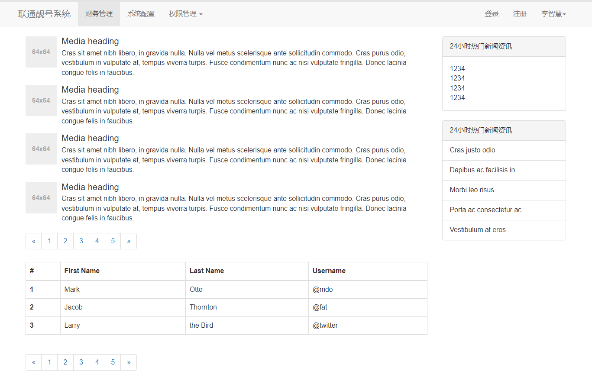
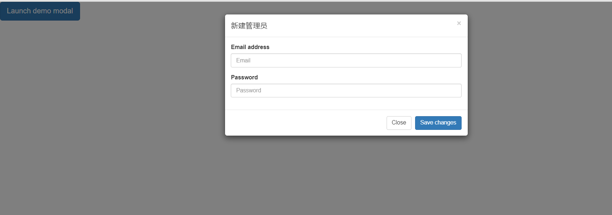

# 第一章 Web基础

## 概述

- 前端开发是创建WEB页面或APP等前端界面呈现给用户的过程，通过HTML，CSS及JavaScript以及衍生出来的各种技术、框架、解决方案，来实现互联网产品的用户界面交互。
- 前端三剑客
  1. HTML             结构层  从语义角度描述页面结构
  2. CSS                 样式层  从美观角度描述页面样式
  3. JavaScript      行为层  从交互角度描述页面行为

## 文件处理

1. 创建一个名为 `web-projects` 的新文件夹。这是你所有的网站项目的存放地。
2. 在 `web-projects` 中，创建名为 `test-site` 的文件夹来存放你的第一个网站。
3. 关于文件名

   - 完全用小写字母

   - 最好用连字符而不是下划线来分隔单词
4. 项目结构

   - **`index.html` 文件**
   - **`images` 文件夹**：存图片
   - **`styles` 文件夹**：存 CSS 文件
   - **`scripts` 文件夹**：存 JS 文件
5. 引用路径

   - 同级：`my-image.jpg`
   - 子目录：`subdirectory/my-image.jpg`
   - 上级：`../my-image.jpg`
   - 以上方法可以随意组合，比如：`../subdirectory/another-subdirectory/my-image.jpg`
   - 即使 Windows 的文件系统使用反斜杠而不是正斜杠，但在 HTML 中也应该在代码中使用正斜杠

# 第二章 BootStrap框架

​	Bootstrap 是一个流行的开源前端框架，由 Twitter 团队开发和维护。它基于HTML、CSS和JavaScript，提供了一系列的样式、组件和工具，以帮助开发者更容易地创建响应式、移动设备友好的网站和Web应用。

- 以下是 Bootstrap 的一些主要特点和组件：
  1. **响应式布局：** Bootstrap 基于响应式设计原则，能够自适应不同屏幕尺寸，从而确保网站在各种设备上都有良好的显示效果。
  2. **移动设备优先：** Bootstrap 将移动设备作为首要目标，通过使用弹性网格系统和媒体查询，确保网站在移动设备上具有良好的可用性。
  3. **CSS 样式：** Bootstrap 提供了一套样式化组件，包括按钮、表单、导航栏、进度条等，使得开发者能够轻松地为网站添加现代和一致的外观。
  4. **JavaScript 插件：** Bootstrap 提供了一系列强大的 JavaScript 插件，如轮播、模态框、滚动监听等，以增强用户交互和功能。
  5. **字体图标：** 使用 Bootstrap 可以轻松地集成图标字体，提供了丰富的图标库，用于增强界面的可视化效果。
  6. **组件：** Bootstrap 提供了多种组件，如导航栏、面包屑、警告框等，使得开发者能够更快速地构建功能完善的页面。
  7. **模板：** Bootstrap 还提供了一些现成的页面模板，使得开发者可以更快速地搭建网站。

## 引入及使用

### 使用 CDN *

- 进入[Bootstrap官网](https://v5.bootcss.com/)，点击`中文文档`，在 `CDN links` 中复制Bootstrap的CDN地址，在html文件 `<head>` 元素中引入Bootstrap的CSS样式，在 `<body>` 底部引入JS组件。

  - CSS：https://cdn.jsdelivr.net/npm/bootstrap@5.3.2/dist/css/bootstrap.min.css
  - JS：https://cdn.jsdelivr.net/npm/bootstrap@5.3.0-alpha1/dist/js/bootstrap.bundle.min.js

  ```html
  <head>
      <!-- 其它 head 元素 -->
  
      <!-- 使用 CDN 引入 Bootstrap 的样式表 -->
      <link rel="stylesheet" href="https://cdn.jsdelivr.net/npm/bootstrap@5.3.2/dist/css/bootstrap.min.css">
  </head>
  <body>
      <!-- 使用 Bootstrap 的样式 -->
      <a class="btn btn-primary">点击</a>
      <!-- 其它 body 元素 -->
      
      <!-- 使用 CDN 引入 Bootstrap 的JS组件 -->
      <script src="https://cdn.jsdelivr.net/npm/bootstrap@5.3.0/dist/js/bootstrap.bundle.min.js"></script>
  </body>
  ```

  在上述示例中，`rel="stylesheet"` 是HTML中`<link>`标签的一个属性，用于指定关联的文档是一个样式表。

### 本地引入

- 官网[下载Bootstrap](https://github.com/twbs/bootstrap/releases/download/v5.3.0-alpha1/bootstrap-5.3.0-alpha1-dist.zip)

- 下载BootStrap文件并解压，文件夹名字改为bootStrap，与html文件放入同级目录。

  ```html
  <head>
      <!-- 其它 head 元素 -->
  
      <!-- 本地引入 Bootstrap 的样式表-->
      <link rel="stylesheet" href="bootstrap/css/bootstrap.css">
  </head>
  <body>
      <!-- 使用 Bootstrap 的样式 -->
      <a class="btn btn-primary">点击</a>
      <!-- 其它 body 元素 -->
      
      <!-- 本地引入 Bootstrap 的JS组件 -->
      <script src="bootStrap/js/bootstrap.bundle.min.js"></script>
  </body>
  ```

### jQuery依赖

从Bootstrap4开始，移除了对 `JS组件` 对 `jQuery` 的硬性依赖，如果使用的是Bootstrap4以前的版本，在引入 `JS组件` 时，应事先引入jQuery。

- **引入方式**

  ```html
  <body>
  	<!-- 其它 body 元素 -->
      
      <script src="js/jquery-3.7.1.min.js"></script>
      <!-- bootstrap.js需要依赖jquery，所以要在jquery后面引入 -->
      <script src="bootstrap/js/bootstrap.js"></script>
  </body>
  ```

# 第2.1章 BootStrap

本章节是之前学习的留本，待再次学习时应归纳到第二章

## BootStrap

​	BootStrap对于CSS而言，就是把style存于文件中。

### 安装及语法

- 下载BootStrap文件并解压，文件夹名字改为bootStrap，与html文件放入同级目录。

- 应该在head中引入：`<link rel="stylesheet" href="bootstrap/css/bootstrap.css">`

  ```html
  <!DOCTYPE html>
  <html lang="en">
  <head>
      <meta charset="UTF-8">
      <title>测试</title>
      
      <!--引入BootStrap-->
      <link rel="stylesheet" href="bootstrap/css/bootstrap.css">
  </head>
  <body>
      <!--使用style-->
      <a class="btn btn-primary">点击</a>
      <a class="btn btn-danger">点击</a>
  </body>
  </html>
  ```


### 栅格系统

​	将父级标签（整行/整块）分成12份，针对12份布局

- **语法**

  以分成3块为例

  ``` html
  <!--将一整行分3份-->
  <div class="col-sm-4">左</div>
  <div class="col-sm-4">中</div>
  <div class="col-sm-4">右</div>
  
  <!--将500px宽度分3份-->
  <div style="width: 500px">
      <div class="col-sm-4">左</div>
      <div class="col-sm-4">中</div>
      <div class="col-sm-4">右</div>
  </div>
  ```

  - 所有栅格自带float属性

- **响应式布局**

  - .col-xs-   None （自动）

  - .col-sm-  750px

  - .col-md-  970px

  - .col-lg-  1170px

    

### container

- **container**
  - .container  用于固定宽度（非整行）并支持响应式布局的容器，容器居中。
  - .container-fluid  用于 100% 宽度（整行），占据全部视口（viewport）的容器，容器不居中。

### clearfix

- 清除浮动，详见float

### 面板

### 导航

### 表格

### 媒体对象

### 分页

- 

### 按钮

### 图标

除了BootStrap以外，还有Font Awesome插件

### 模态框

- 模态框为动态JavaScript插件，需引入jQuery

  ``` html
  <!DOCTYPE html>
  <html lang="en">
  <head>
      <meta charset="UTF-8">
      <title>模态框</title>
  
      <!--引入bootstrap和jquery-->
      <link rel="stylesheet" href="bootstrap/css/bootstrap.css">
      <script src="js/jquery-3.7.1.min.js"></script>
      <script src="bootstrap/js/bootstrap.js"></script>
  </head>
  <body>
  
  <!-- Button trigger modal -->
  <button type="button" class="btn btn-primary btn-lg" data-toggle="modal" data-target="#myModal">
      Launch demo modal
  </button>
  
  <!-- Modal -->
  <div class="modal fade" id="myModal" tabindex="-1" role="dialog" aria-labelledby="myModalLabel">
      <div class="modal-dialog" role="document">
          <div class="modal-content">
              <div class="modal-header">
                  <button type="button" class="close" data-dismiss="modal" aria-label="Close"><span aria-hidden="true">&times;</span>
                  </button>
                  <h4 class="modal-title" id="myModalLabel">新建管理员</h4>
              </div>
              <div class="modal-body">
  
                  <!--将...换成表单-->
                  <form>
                      <div class="form-group">
                          <label for="exampleInputEmail1">Email address</label>
                          <input type="email" class="form-control" id="exampleInputEmail1" placeholder="Email">
                      </div>
                      <div class="form-group">
                          <label for="exampleInputPassword1">Password</label>
                          <input type="password" class="form-control" id="exampleInputPassword1" placeholder="Password">
                      </div>
                  </form>
  
              </div>
              <div class="modal-footer">
                  <button type="button" class="btn btn-default" data-dismiss="modal">Close</button>
                  <button type="button" class="btn btn-primary">Save changes</button>
              </div>
          </div>
      </div>
  </div>
  
  
  </body>
  </html>
  ```

  

### 工具提示

- 类似于悬停展示

  

  ``` html
  <!DOCTYPE html>
  <html lang="en">
  <head>
      <meta charset="UTF-8">
      <title>其它html</title>
  
      <!--引入bootstrap和jquery-->
      <link rel="stylesheet" href="bootstrap/css/bootstrap.css">
      <script src="js/jquery-3.7.1.min.js"></script>
      <script src="bootstrap/js/bootstrap.js"></script>
  </head>
  <body>
  <div style="margin: 300px">
      <button type="button" class="btn btn-default" data-toggle="tooltip" data-placement="left" title="Tooltip on left">
          Tooltip on left
      </button>
  </div>
  
  <!--添加如下代码才能显示动态效果-->
  <script>
      $(function () {
          $('[data-toggle="tooltip"]').tooltip()
      })
  </script>
  </body>
  </html>
  ```


# 员工管理系统（web）

- 这是一个训练案例，预先安装 MySQL。
- flask框架、前端、MySQL

## 创建数据库和表结构

- 使用cmd

  - 创建数据库：unicom
  - 创建数据表：admin
  - 按格式先添加几条数据

  ```
  表名：admin
  结构
  	id bigint unsigned primary key auto_increment not null,
  	username varchar(16) not null,
  	password varchar(16) not null,
      mobile char(11) not null
  ```

  ```sql
  create database unicom default charset=utf8;
  
  use unicom;
  
  create table admin(
  	id bigint unsigned primary key auto_increment not null,
  	username varchar(16) not null,
  	password varchar(16) not null,
      mobile char(11) not null
  )default charset=utf8;
  
  ```

## 创建flask框架

- flask框架和html文件

  ```python
  from flask import Flask, render_template
  app = Flask(__name__)
  @app.route('/home')
  def home():
      return render_template('home.html')
  if __name__ == '__main__':
      app.run()
  ```

## 连接MySQL

- 连接MySQL获取数据并以n2传入html

  ```python
  conn = pymysql.Connect(
          host = "localhost",
          port = 3306,
          user = "root",
          password = "123456",
          charset = "utf8",
          database = "unicom"
  )
  print("MySQL已连接.....")
  cursor = conn.cursor(cursor = DictCursor)
  cursor.execute("select id, username, password, mobile from admin")
  user_list = cursor.fetchall()
  cursor.close()
  conn.close()
  return render_template('home.html',n2 = user_list)
  ```

  - 同时在render_template里添加n2 = user_list

## html接收数据并渲染

- 使用for循环接收数据

  ```html
  <table border="1">
      <thead>
      <tr>
          <th>ID</th>
          <th>姓名</th>
          <th>密码</th>
          <th>手机号</th>
      </tr>
      </thead>
      <tbody>
      
      <tr>
          <td>{{item.id}}</td>
          <td>{{item.username}}</td>
          <td>{{item.password}}</td>
          <td>{{item.mobile}}</td>
      </tr>
      
      </tbody>
  </table>
  ```

## CSS美化

- 引入bootstrap

  ```html
  <div class="container">
      <table class="table table-bordered">...</table>
  </div>
  ```

## html添加数据

- 添加数据库以外内容

  ```html
  <td>
  	<a class="btn btn-danger btn-xs">删除</a>
  </td>
  ```

## 获取id并删除数据行

- 获取id并删除数据行

  ```html
  <td>
  	<a href="/admin/delete?aid={{ item.id }}" class="btn btn-danger btn-xs">删除</a>
  </td>
  ```

  ``` python
  @app.route('/admin/delete')
  def admin_delete():
      # 获取id
      aid = request.args.get("aid")
  
      # 连接MySQL
      conn = pymysql.Connect(
          host = "localhost",
          port = 3306,
          user = "root",
          password = "123456",
          charset = "utf8",
          database = "unicom"
      )
      print("MySQL已连接.....")
      cursor = conn.cursor(cursor = DictCursor)
  
      # 删除数据行
      cursor.execute("delete from admin where id=%s", [aid])
      conn.commit()
      return redirect('/home')  # 返回home
  ```

  - 同时引入request，redirect
  - aid为html中接收浏览器返回内容的变量 
