# 第一章 HTML基础

HTML（**H**yper**T**ext **M**arkup **L**anguage）的全称为**超文本标记语言**，是一种用来结构化 Web 网页及其内容的标记语言。

## [HTML 结构](https://developer.mozilla.org/zh-CN/docs/Learn/Getting_started_with_the_web/HTML_basics#html_文档详解)

- **基本结构**

  ```html
  <!DOCTYPE html>
  <html lang="en">
  <head>
      <meta charset="UTF-8">
      <meta name="viewport" content="width=device-width, initial-scale=1.0">
      <title>Document</title>
  </head>
  <body>
      
  </body>
  </html>
  ```

  基本结构包含：

  1. `<!DOCTYPE html>`——**[文档类型](https://developer.mozilla.org/zh-CN/docs/Glossary/Doctype)**。

     用于指示浏览器使用 HTML5 解析文档。

  2. `<html>`——  [**根元素**](https://developer.mozilla.org/zh-CN/docs/Web/HTML/Element/html)

     该元素包含整个页面的所有内容，里面也包含了 `lang` 属性，写明了页面的主要语种。

  3. `<head>`——**[`<head>`](https://developer.mozilla.org/zh-CN/docs/Web/HTML/Element/head) 元素**。

     - 所有那些你加到页面中，且不向用户展示的页面成员，都以这个元素为容器。
     - 其中包含诸如提供给搜索引擎的关键字和页面描述、用作风格化页面的 CSS、字符集声明等等。

  4. `<body>`——**[`<body>`](https://developer.mozilla.org/zh-CN/docs/Web/HTML/Element/body) 元素**。

     - 该元素包含期望让用户在访问页面时看到的全部内容。

  5. `<meta>`——**元数据**。

     - 元数据就是描述数据的数据

  6. `<title>`——**[`<title>`](https://developer.mozilla.org/zh-CN/docs/Web/HTML/Element/title) 元素**。

     - 该元素设置页面的标题，显示在浏览器标签页上。
     - 也作为收藏网页的描述文字。
     - 也被用在搜索的结果中。

- **`<meta>`元数据**

  - 元数据就是描述数据的数据
  - `<meta charset="UTF-8">` **字符集（编码）**
  - `<meta name="author" content="Chris Mills" />` **作者信息**
  - `<meta name="description" content="content..." />` **描述信息**
    - description 的内容会出现在搜索引擎的搜索结果页面中

  - `<meta name="viewport" content="width=device-width">` [**视口**](https://developer.mozilla.org/zh-CN/docs/Web/CSS/Viewport_concepts)
    - 可以确保页面以视口宽度进行渲染，避免移动端浏览器上因页面过宽导致缩放。

## [内容结构](https://developer.mozilla.org/zh-CN/docs/Learn/HTML/Introduction_to_HTML/Document_and_website_structure)

- 内容结构就是 `<body>` 的结构
- 为了实现语义化标记，HTML 提供了明确这些区段的专用标签：页眉、导航栏、主内容、页脚

### [ 页眉`<header>`](https://developer.mozilla.org/zh-CN/docs/Web/HTML/Element/header)

-  **`<header>` 元素**用于展示介绍性内容，通常包含一组介绍性的或是辅助导航的实用元素。它可能包含一些标题元素，但也可能包含其他元素，比如 Logo、搜索框、作者名称，等等。

### [ 导航栏`<nav>`](https://developer.mozilla.org/zh-CN/docs/Web/HTML/Element/header)

-  **`<nav>`元素**用于在当前文档或其他文档中提供导航链接。导航部分的常见示例是菜单，目录和索引。

### [ 主内容`<main>`](https://developer.mozilla.org/zh-CN/docs/Web/HTML/Element/header)

- **`<main>` 元素**呈现了文档的 `<body>` 或应用的主体部分。主体部分由与文档直接相关，或者扩展于文档的中心主题、应用的主要功能部分的内容组成。
- 主内容中还可以有各种子内容区段，可用 [`<article>`](https://developer.mozilla.org/zh-CN/docs/Web/HTML/Element/article)、[`<section>`](https://developer.mozilla.org/zh-CN/docs/Web/HTML/Element/section) 和 [`<div>`](https://developer.mozilla.org/zh-CN/docs/Web/HTML/Element/div) 等元素表示。
- [侧边栏 `<aside>`](https://developer.mozilla.org/zh-CN/docs/Web/HTML/Element/aside)、 独立结构 [`<article>`](https://developer.mozilla.org/zh-CN/docs/Web/HTML/Element/article)、独立章节 [`<section>`](https://developer.mozilla.org/zh-CN/docs/Web/HTML/Element/section) 和 [`<div>`](https://developer.mozilla.org/zh-CN/docs/Web/HTML/Element/div) 经常嵌套在 `<main>` 中。

### [ 页脚`<footer>`](https://developer.mozilla.org/zh-CN/docs/Web/HTML/Element/footer)

- 一个页脚通常包含该章节作者、版权数据或者与文档相关的链接等信息。

### [换行`<br>`](https://developer.mozilla.org/zh-CN/docs/Web/HTML/Element/br)

- 元素 `<br>` 用于在文本中创建换行，是一个空元素。

  ```html
  <body>
      <p>This is a paragraph with some <br>line breaks.</p>    
  </body>
  ```

  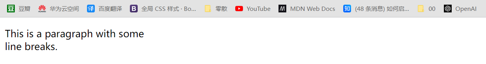

- **注意**

  - 不要用 `<br>` 来增加文本之间的行间隔。


### [分割线`<hr>`](https://developer.mozilla.org/zh-CN/docs/Web/HTML/Element/hr)

- 元素 `<hr>` 表示段落级元素之间的主题转换（例如，一个故事中的场景的改变，或一个章节的主题的改变）。
- 虽然在可视化浏览器中表现为水平线，但它目前被定义为是语义上而非表现层面上的术语。

## 元素结构

HTML 由一系列的元素组成，这些元素可以用来包围不同部分的内容，使其以某种方式呈现或者工作。

- **元素结构**

  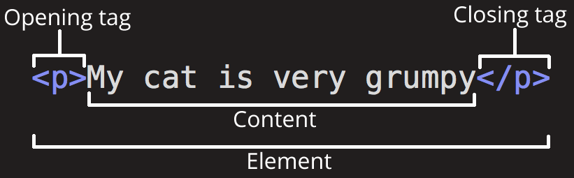

  这个元素的主要结构有：

  1. **开始标签**（Opening tag）：包含元素的名称（本例为 p），被大于号、小于号所包围。表示元素从这里开始或者开始起作用——在本例中即段落由此开始。
  2. **结束标签**（Closing tag）：与开始标签相似，只是其在元素名之前包含了一个斜杠。这表示着元素的结尾——在本例中即段落在此结束。
  3. **内容**（Content）：元素的内容，本例中就是所输入的文本本身。
  4. **元素**（Element）：开始标签、结束标签与内容相结合，便是一个完整的元素。

## 空元素

- 不包含任何内容的元素称为**空元素**。

  - 空元素只有开始标签，没有结束标签。

  ```html
  
  ```

- **注意**

  -  `<tag>` 和 `<tag />` 都表示空元素
  -  HTML5 使用 `<tag>`，同时兼容 `<tag />`
  -  XML 和 XHTML 使用 `<tag />`，但不支持 `<tag>`

## 无语义元素

无语义元素没有特殊语义，只用于分组

### [`<div>`](https://developer.mozilla.org/zh-CN/docs/Web/HTML/Element/div)

- **语法**

  `<div>`  元素是用于组织和布局页面的内容的一个区块或容器，是块级元素。

  通常没有特定的样式或语义，它主要用于将内容分组在一起，以便通过 CSS 样式或脚本进行操作。

  ```html
  <div id="myContainer" class="highlight">
    <!-- 这里是放置内容的区块 -->
  </div>
  ```

  ```css
  #myContainer {
    /* 样式规则 */
  }
  
  .highlight {
    /* 样式规则 */
  }
  ```

### [`<span>`](https://developer.mozilla.org/zh-CN/docs/Web/HTML/Element/span)

- **语法**

  `<span>` 元素用于标记文档中的小块文本，是内联元素。

  通常没有特定的样式或语义，类似于 `<div>` 元素，但与 `<div>` 不同的是，它是一个内联元素，不会打破文本流。因此，`<span>` 通常用于对文本的一部分进行样式设置、脚本操作或其他行内处理。

  ```html
  <span class="highlight">
    <!-- 这里是需要特殊样式的文本 -->
  </span>
  ```

  ```css
  .highlight {
    /* 样式规则 */
  }
  ```


## 注释

- 单行注释：Ctrl + /    多行注释：Ctrl + Shift + /

  ```html
  <div>
      <!-- 这是一个单行注释 -->
  	<h1>Hello, World!</h1>
      
      <!--
          多行注释第一行
          多行注释第二行
      	多行注释第三行
      -->
      <h1>Hello, World!</h1>
  </div>
  ```
  
  

## 字符引用

- 在 HTML 中，某些特殊字符是 HTML 语法自身的一部分，如果想将这些字符包含进文本中，必须使用字符引用。

  每个字符引用以符号 & 开始，以分号（;）结束。

  | 原义字符 | 等价字符引用 |
  | -------- | ------------ |
  | <        | `&lt;`       |
  | >        | `&gt;`       |
  | "        | `&quot;`     |
  | '        | `&apos;`     |
  | &        | `&amp;`      |
  | 空格     | `&nbsp;`     |

  ```html
  <!-- 错误写法 -->
  <p>HTML 中用 <p> 来定义段落元素。</p>
  
  <!-- 正确写法 -->
  <p>HTML 中用 &lt;p&gt; 来定义段落元素</p>
  ```

# 第二章 元素属性

- **元素属性**

  关于 **`元素属性`** 的基础，详见 **`元素`** 章节

## 属性基础

- **元素属性**

  

  属性（Attribute）应包含：

  1. 在属性与元素名称（或上一个属性，如果有超过一个属性的话）之间的空格符。
  2. 属性的名称，并接上一个等号。
  3. 由双（单）引号所包围的属性值。

- **属性说明**

  1. 一个元素可以有多个属性，每个属性之间用空格分隔。
  2. 一个属性可以有多个属性值，每个属性值之间用空格分隔。
  3. 属性一般描述于开始标签。
  4. 属性和属性值对大小写不敏感，但新版本的 (X)HTML 要求使用小写属性。

## 标识 `id` 

- **语法**
  - `id` 属性用于为元素指定唯一的标识符。
  - 每个HTML文档中的 `id` 属性值必须是唯一的，不同元素之间不能有相同的 `id` 值。
  - 命名规则
    - 必须以字母（a-z，A-Z）开头。
    - 可以包含字母、数字（0-9）、连字符（-）、下划线（_）和句点（.）。
    - 区分大小写。
    - 不应包含空格和其他特殊字符。
- **应用**
  - 在JS中通过 `document.getElementById` 方法，访问和操作元素。
  - 在CSS中通过 `#id` 方法，访问和操作元素。

## 类名 `class`

- **语法**
  - `class` 属性用于为一个或多个元素定义一个或多个类名。
  - 类名通常用于标识具有相似特征或用途的一组元素。
- **应用**
  - 在JS中通过 `getElementsByClassName` 方法，访问和操作元素。
  - 在CSS中通过 `.类名` 方法，访问和操作元素。

## 样式 `style`

- `style` 属性用于为 HTML 元素添加样式，详见CSS。

## 路径 `src`

- **语法**

  `src` 属性指定了相应元素引用的外部资源的路径。这可以是本地文件系统上的路径，也可以是网络上的 URL。

  通常用于元素，如 ``、`<script>`、`<audio>`、`<video>` 等，`src` 主要用于指定脚本文件的路径

  ```html
  
  ```

## 超链接 `href`

- **语法**

  `href`（超文本引用）是用于指定超链接目标的属性。

  通常用于`<a>`（锚）元素、`<link>` 元素、和`<area>` 元素，一般用于链接资源文件，比如样式表。

  ```html
  <a href="https://www.example.com">点击这里</a>
  ```

  - 跳转目标可以是绝对路径、相对路径、锚点、电话号、E-mail、JS代码和文件等。

- `锚点`：通过在 `href` 中指定目标元素的 `ID`，点击后跳转至目标元素。

  ```html
  <div id = "i1">中国联通</div>
  
  <a href = "#i1">点击跳转至中国联通</a>
  ```

## 跳转方式 `target`

- **语法**

  `target` 属性通常用于指定链接的打开方式或者指定提交表单时的目标窗口。

  ```html
  <a href="https://www.example.com" target="_blank">Visit Example.com</a>
  ```

- **打开方式**

  - `_blank`：在新窗口或新标签页中打开。
  - `_self`：在当前窗口中打开（默认行为）。
    - 不填target默认为在当前页面打开
  - `_parent`：在父级框架中打开。
  - `_top`：在顶级窗口中打开。

- **常用元素**

  跳转 `<a>`  表单 `<form>` 

## 替代文本 `alt`

- **语法**

  `alt` 属性是HTML中一种用于提供替代文本的属性。

  这个属性通常用于图像元素 `` 中，用于描述图像的内容或作用。如果图像无法加载，`alt` 属性的文本将被显示。屏幕阅读器等辅助技术可以读取 `alt` 文本，以提供对图像的描述，帮助视觉障碍用户理解图像内容。

  ```html
  
  ```

## 宽度 `width`

- **语法**

  `width` 和 `height` 属性是HTML中用于指定元素宽度和高度的属性。

  属性值的单位可以是像素 `px`、百分比 `%`、视口 `vw` `vh`、`em`、`rem`和绝对长度单位（如mm）等

- **像素**

  单位px可省略

  ```html
  
  ```

- **百分比**

  将元素的宽度设置为包含它的元素的相对大小

  ```html
  <!DOCTYPE html>
  <html lang="en">
  <head>
      <meta charset="UTF-8">
      <meta name="viewport" content="width=device-width, initial-scale=1.0">
      <title>百分比宽度示例</title>
      <style>
          .container {
              width: 80%; /* 容器宽度为页面宽度的80% */
              margin: 0 auto; /* 居中显示容器 */
          }
  
          img {
              width: 100%; /* 图像宽度相对于包含它的容器宽度的100% */
              height: auto; /* 保持图像的纵横比，高度自适应 */
              display: block; /* 去除底部空白 */
          }
      </style>
  </head>
  <body>
      <div class="container">
          
      </div>
  </body>
  </html>
  ```

- **自适应**

  通常情况下，如果只设置 `width: 200px;`，而没有设置 `height`，浏览器将根据图像的纵横比自动计算 `height`。

## 文本方向 `dir`

- **语法**

  `dir` 属性是 HTML 元素中用于设置文本呈现方向的属性。

  ```html
  <p dir="ltr">这是一段从左到右的文本。</p>
  <p dir="rtl">这是一段从右到左的文本。</p>
  ```

  `注意` 对于中文、英文等大多数语言而言，阅读习惯都是从左到右，所以无论 `ltr` 还是 `rtl` ，最终都会呈现从左到右，只有阿拉伯语或希伯来语等语言，才会与从右到左的呈现

## 悬停提示 `title`

- **语法**

  `title` 属性用于提供有关元素的附加信息，当用户将鼠标悬停在带有 `title` 属性的元素上时，浏览器通常会显示该属性的值。

  ```html
  <a href="https://www.baidu.com/" title="点击跳转至百度">百度</a>
  ```

## 禁用 `disabled`

- **语法**

  `disabled` 属性用于禁用用户与某个元素进行交互。

  ```html
  <input type="text" disabled>
  ```

# 第三章 文本结构

## [标题`<h>`](https://developer.mozilla.org/zh-CN/docs/Web/HTML/Element/Heading_Elements)

- 标题元素 `<h>` 是用于定义页面中标题级别的 HTML 元素，是块级元素。

- 标题元素按照级别从 `<h1>` 到 `<h6>`

  -  `<h1>` 表示最高级别的标题
  - `<h6>` 表示最低级别的标题

- **注意**

  - 不要为了减小标题的字体而使用低级别的标题
  - 避免跳过某级标题：始终要从 `<h1>` 开始，接下来依次使用 `<h2>` 等等

- 标题元素用于标识文档结构，同时也对网页的可访问性和搜索引擎优化（SEO）起到重要作用。

  ```html
  <body>
    <h1>Main Title</h1>
    <p>This is the main content of the page.</p>
  
    <h2>Section 1</h2>
    <p>Content of section 1.</p>
  
    <h2>Section 2</h2>
    <p>Content of section 2.</p>
  
    <h3>Subsection 2.1</h3>
    <p>Content of subsection 2.1.</p>
  </body>
  ```

  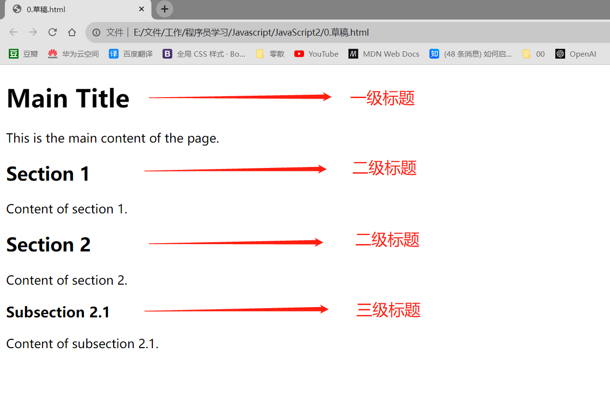

## [段落`<p>`](https://developer.mozilla.org/zh-CN/docs/Web/HTML/Element/p)

- 段落元素 `<p>` 用于定义 HTML 文档中的段落，是块级元素。

- 浏览器会自动地在段落的前后添加空行。

  ```html
  <body>
      <p>This is the first paragraph.</p>
      <p>This is the second paragraph.</p>
  </body>
  ```

  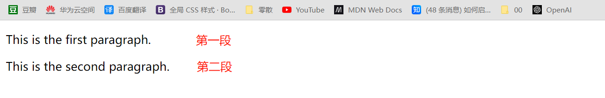

## 列表

- **语法**
  - 列表：有序列表、无序列表、定义列表。
  
  - 列表项 `<li>`：定义列表中的每一项。`<li>` 元素可以容纳文本或其它元素。
  - 缩进：列表与前一个标签会有一个缩进。

### [无序列表 `<ul>`](https://developer.mozilla.org/zh-CN/docs/Web/HTML/Element/ul)

- 无序列表 `<ul>` 显示无顺序排列的列表项 `<li>`，默认以圆点等符号进行标记。

  ```html
  <ul>
    <li>项目一</li>
    <li>项目二</li>
    <li>项目三</li>
  </ul>
  ```

- **无序列表说明**

  - 应该在 CSS 中修改 `<li>` 的标记样式

### [有序列表 `<ol>`](https://developer.mozilla.org/zh-CN/docs/Web/HTML/Element/ol)

- 有序列表 `<ol>` 显示按顺序排列的列表项 `<li>`，默认以数字等符号进行标记。

  ```html
  <ol>
    <li>第一项</li>
    <li>第二项</li>
    <li>第三项</li>
  </ol>
  ```

- **`<ol>` 的属性**

  - `type` 属性，用于指定有序列表的计数器类型，即序列号的类型

    ```html
    <ol type="A">
      <li>第一项</li>
      <li>第二项</li>
      <li>第三项</li>
    </ol>
    ```

  - `start` 属性，用于指定有序列表的起始值。

    ```html
    <ol start="5">
        <li>第五项</li>
        <li>第六项</li>
        <li>第七项</li>
    </ol>
    ```

  - `<ol>` 中的`<li>` 元素具有一个 `value` 属性，用于指定有序列表项的值。

    ```html
    <ol>
      <li value="100">第一百项</li>
      <li value="200">第二百项</li>
      <li value="300">第三百项</li>
    </ol>
    ```

### [描述列表 `<dl>`](https://developer.mozilla.org/zh-CN/docs/Web/HTML/Element/dl)

- 描述列表 `<dl>` 用于对术语或名词解释和描述。

  ```html
  <dl>
      <dt>名词1</dt>
      <dd>解释1</dd>
      <dd>解释2</dd>
      <dt>名词2</dt>
      <dd>解释1</dd>
      <dd>解释2</dd>
  </dl>
  ```

- `<dd>` 元素可以容纳文本或其它元素。

### 列表嵌套

- `<ol>` 和 `<ul>` 元素可以嵌套任意深度，即在一个列表项 `<li>` 中包含另一个列表。

- **注意**：不要将一个列表当成列表项 `<li>` 进行嵌套，而是要把列表放在 `<li>` 中。

  ```html
  <!-- 规范写法 -->
  <ul>
      <li>项目1
          <ol>
              <li>子项目 1</li>
              <li>子项目 2</li>
          </ol>
      </li>
      <li>项目2</li>
  </ul>
  
  <!-- 不规范写法 -->
  <ul>
      <li>项目1</li>
      <ol>
          <li>子项目 1</li>
          <li>子项目 2</li>
      </ol>
  
      <li>项目2</li>
  </ul>
  ```

## [表格 `<table>`](https://developer.mozilla.org/zh-CN/docs/Web/HTML/Element/table)

### 表格基础

- **表格整体结构**

  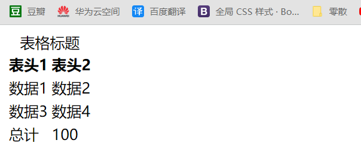

  ```html
  <table>
      <caption>表格标题</caption>
      <thead>
          <tr>
              <th>表头1</th>
              <th>表头2</th>
          </tr>
      </thead>
      <tbody>
          <tr>
              <td>数据1</td>
              <td>数据2</td>
          </tr>
          <tr>
              <td>数据3</td>
              <td>数据4</td>
          </tr>
      </tbody>
      <tfoot>
          <tr>
            <td>总计</td>
            <td>100</td>
          </tr>
    </tfoot>
  </table>
  ```

  - `<table>` 元素用于定义整个表格。
  - `<caption>` 标题  `<thead>` 表头  `<tbody>` 主体   `<tfoot>` 页脚，可省略。
  - `<tr>` 元素用于定义表格中的行，不可省略。
  - `<th>` 元素用于定义表格中的表头单元格（表头单元格会加粗且默认居中显示）。
  - `<td>` 元素用于定义表格中的数据单元格。

- **表格基本结构**

  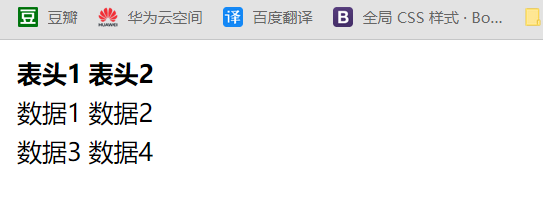

  ```html
  <table>
      <tr>
          <th>表头1</th>
          <th>表头2</th>
      </tr>
      <tr>
          <td>数据1</td>
          <td>数据2</td>
      </tr>
      <tr>
          <td>数据3</td>
          <td>数据4</td>
      </tr>
  </table>
  ```

- **`border` 属性**

  属性`<table border="1">` 控制边框已经弃用，在实际开发中，建议使用 CSS 样式来进行更灵活和精细的样式控制，或者引入BootStrap。

- `<table>` 可以嵌套在 `<th>` 或 `<td>` 中

### 合并单元格

- 合并列 `colspan`，合并行  `rowspan`，单元格占几行（列），值就等于几。

  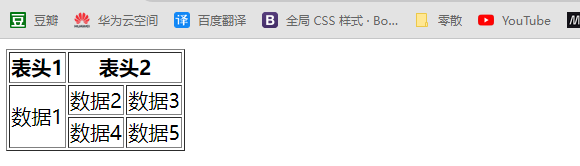

  ```html
  <table border="1">
      <tr>
          <th>表头1</th>
          <th colspan="2">表头2</th>
      </tr>
      <tr>
          <td rowspan="2">数据1</td>
          <td>数据2</td>
          <td>数据3</td>
      </tr>
      <tr>
          <td>数据4</td>
          <td>数据5</td>
      </tr>
  </table>
  ```

### 自由表头

- 属性 `scope` 可以添加在 `<th>` 元素中，以告诉屏幕阅读器该表头的类型——它是所在行的表头，还是所在列的表头。

- `scope` 的值

  - 单列表头 `col`
  - 多列表头 `colgroup`
  - 单行表头 `row`
  - 多行表头 `rowgroup`

- 示例

  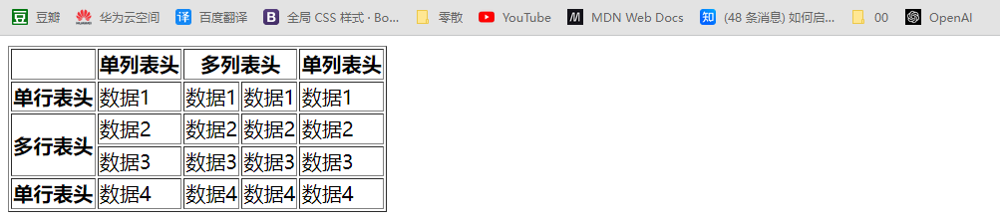

  ```html
  <table border="1">
      <tr>
          <th>&nbsp</th>
          <th scope="col">单列表头</th>
          <th colspan="2" scope="colgroup">多列表头</th>
          <th scope="col">单列表头</th>
      </tr>
      <tr>
          <th scope="row">单行表头</th>
          <td>数据1</td>
          <td>数据1</td>
          <td>数据1</td>
          <td>数据1</td>
      </tr>
      <tr>
          <th rowspan="2" scope="rowgroup">多行表头</th>
          <td>数据2</td>
          <td>数据2</td>
          <td>数据2</td>
          <td>数据2</td>
      </tr>
      <tr>
          <td>数据3</td>
          <td>数据3</td>
          <td>数据3</td>
          <td>数据3</td>
      </tr>
      <tr>
          <th scope="row">单行表头</th>
          <td>数据4</td>
          <td>数据4</td>
          <td>数据4</td>
          <td>数据4</td>
      </tr>
  </table>
  ```

  

## 链接

### [链接`<a>`](https://developer.mozilla.org/zh-CN/docs/Web/HTML/Element/a)

- 链接元素 `<a>` 用于创建超链接，属于内联元素，其中 `a` 表示 "anchor"，即锚点。

- 链接元素可以包含文本或其他元素，如图像、标题等。

  ```html
  <body>
      <!-- 包含文本 -->
      <a href="https://www.baidu.com">点击跳转至百度</a>
      
      <!-- 包含图像 -->
      <a href="https://www.baidu.com">
          
      </a>
  </body>
  ```

- **常用属性**

  `href`  `target`  `title`  `download`

# 第四章 文本格式化

## 强调

- [粗体 `<strong>`](https://developer.mozilla.org/zh-CN/docs/Web/HTML/Element/strong) 用于对一个句子的部分内容增加重要性，一般用粗体显示。

- [斜体 `<em>`](https://developer.mozilla.org/zh-CN/docs/Web/HTML/Element/em) 用于改变一个句子的意思，一般用斜体显示。

- 粗体 `<strong>`、斜体 `<em>` 都含有**语义**，在一些辅助技术（如屏幕阅读器）中，能更好理解它们的语义。

- 如果仅仅为了视觉效果而不增加语义辅助

  - 应该使用 CSS 的 `font-weight` 属性来设置文本的粗细
  - 应该使用 CSS 的 `font-style` 属性来设置文本的斜体

- [粗体 `<b>`](https://developer.mozilla.org/zh-CN/docs/Web/HTML/Element/b) 、[斜体 `<i>`](https://developer.mozilla.org/zh-CN/docs/Web/HTML/Element/i) 

  - 在 HTML4 之前，不强调语义，显示粗体/斜体文本，仅仅是一种视觉效果。
  - 在 HTML4 之后，有难以理解的语义，显示粗体/斜体文本，不推荐使用。

- 以下是 `<strong>`、`<em>`、`<b>`、`<i>` 的对比

  ```html
  <body>
      <p>This is <strong>important</strong> text.</p>
      
      <!-- 不推荐 -->
      <p>This is <b>bold</b> text.</p>
      <!-- 推荐 -->
      <p style="font-weight: bold;">This is bold text using CSS.</p>
  </body>
  ```

  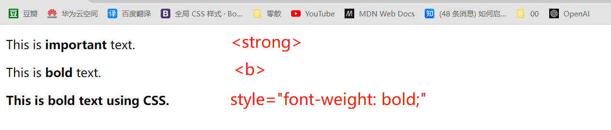

  ```html
  <body>
      <p>This is <em>emphasized</em> text.</p>
      <p>This is <i>italic</i> text.</p>
      <p style="font-style: italic;">This is italic text using CSS.</p>
  </body>
  ```

  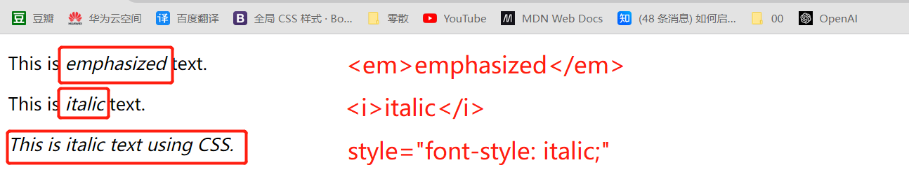

## 删除线`<del>`和下划线`<ins>`

- [删除元素 `<del>`](https://developer.mozilla.org/zh-CN/docs/Web/HTML/Element/del)表示删除的文本，包含的文本是不再准确或不再有效的，通常以删除线的形式显示。

- [插入元素 `<ins>`](https://developer.mozilla.org/zh-CN/docs/Web/HTML/Element/ins) 表示添加的文本，包含的文本是新增的文本，通常以下滑线的形式显示。

  ```html
  <body>
      <p>This is <del>deleted</del> text.</p>
      <p>This is <ins>inserted</ins> text.</p>
  </body>
  ```

  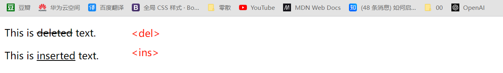


## [引用](https://developer.mozilla.org/zh-CN/docs/Learn/HTML/Introduction_to_HTML/Advanced_text_formatting)

- 引用元素用于将引用的文本与其它内容区分开，同时还有助于提供引用文本的语义信息。

### [块级引用`<blockquote>`](https://developer.mozilla.org/zh-CN/docs/Web/HTML/Element/blockquote)

- 块级引用 `<blockquote>` 用于定义长引用，代表其中的文字是引用内容，在渲染时会有一定的缩进。

  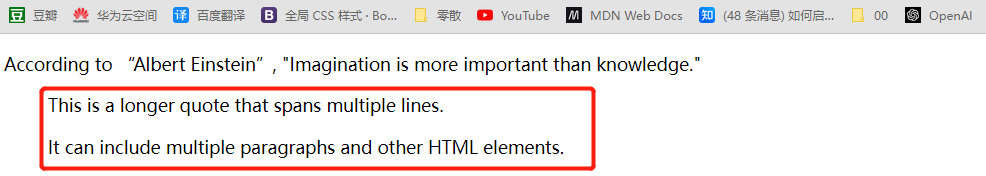

  ```html
  <blockquote>
      <p>This is a longer quote that spans multiple lines.</p>
      <p>It can include multiple paragraphs and other HTML elements.</p>
  </blockquote>
  ```

### [行内引用`<q>`](https://developer.mozilla.org/zh-CN/docs/Web/HTML/Element/q)

- 行内引用 `<q>` 用于定义短引用，通常包含在引号中。浏览器通常会自动添加引号。

  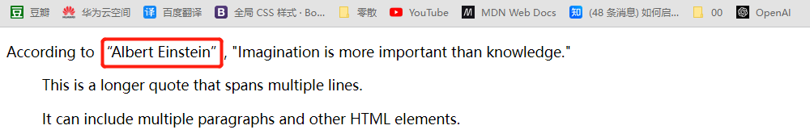

  ```html
  <p>According to <q>Albert Einstein</q>, "Imagination is more important than knowledge."</p>
  ```

### [作品引用`<cite>`](https://developer.mozilla.org/zh-CN/docs/Web/HTML/Element/cite)

- 作品引用 `<cite>` 用于一个作品的引用，且必须包含作品的标题。

  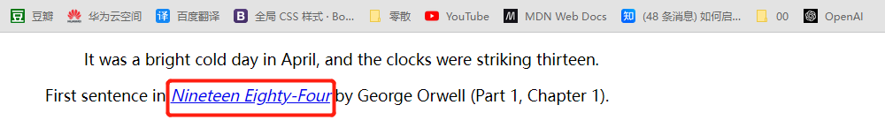

  ```html
  <figure>
      <blockquote>
          <p>It was a bright cold day in April, and the clocks were striking thirteen.</p>
      </blockquote>
      <figcaption>
          First sentence in <cite><a href="http://www.george-orwell.org/1984/0.html">Nineteen Eighty-Four</a></cite>
          by George
          Orwell (Part 1, Chapter 1).
      </figcaption>
  </figure>
  ```

### 引用的样式

- 浏览器通常会自动添加引用的样式，但您也可以使用 CSS 进行自定义。

  ```css
  q {
  color: blue;
  }
  
  blockquote {
  margin: 0 0 10px 0;
  padding: 10px;
  border-left: 2px solid #ccc;
  }
  ```

## [说明`<figure>`](https://developer.mozilla.org/zh-CN/docs/Web/HTML/Element/figure)

- 元素 `<figure>` 用于将两个不相干的元素建立联系，用语义的方式告诉浏览器二者之间的联系。

  - 通常包含 [`<figcaption>`](https://developer.mozilla.org/zh-CN/docs/Web/HTML/Element/figcaption) 元素配合使用。
  - 元素 `<figure>` 带有缩进
  - 注意 `<figure>` 里不一定要是一张图片，只要是一个独立内容单元即可

- 比如给一张图片配文字说明，文字本来和图片在语义上没有关系，但 `<figure>` 使二者可以相互关联

  ```html
  <!-- 只有图像 -->
  <figure>
      
  </figure>
  
  <!-- 有标题的图像 -->
  <figure>
      
      <figcaption>这是火狐浏览器的图标</figcaption>
  </figure>
  ```


## [标记高亮`<mark>`](https://developer.mozilla.org/zh-CN/docs/Web/HTML/Element/mark)

- 高亮元素 `<mark>` 用于对文本进行标记或突出显示，通常以黄色背景高亮显示。

  ```html
  <p>This is a paragraph with some <mark>highlighted</mark> text.</p>
  ```

  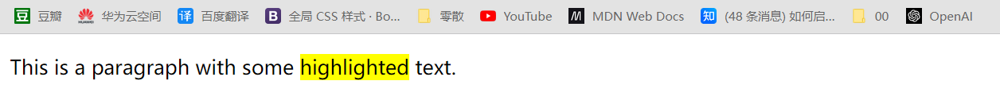

- 浏览器通常以黄色背景高亮显示 `<mark>` 元素的内容，但您可以通过 CSS 进行自定义样式。

  ```html
  <style>
    mark {
      background-color: yellow;
      color: black;
    }
  </style>
  ```

## [时间标记`<time>`](https://developer.mozilla.org/zh-CN/docs/Web/HTML/Element/time)

- 时间标记 `<time>` 用来表示 24 小时制时间

  ```html
  <!-- 标准简单日期 -->
  <time datetime="2016-01-20">20 January 2016</time>
  <!-- 只包含年份和月份-->
  <time datetime="2016-01">January 2016</time>
  <!-- 只包含月份和日期 -->
  <time datetime="01-20">20 January</time>
  <!-- 只包含时间，小时和分钟数 -->
  <time datetime="19:30">19:30</time>
  <!-- 还可包含秒和毫秒 -->
  <time datetime="19:30:01.856">19:30:01.856</time>
  <!-- 日期和时间 -->
  <time datetime="2016-01-20T19:30">7.30pm, 20 January 2016</time>
  <!-- 含有时区偏移值的日期时间 -->
  <time datetime="2016-01-20T19:30+01:00"
    >7.30pm, 20 January 2016 is 8.30pm in France</time
  >
  <!-- 提及特定周 -->
  <time datetime="2016-W04">The fourth week of 2016</time>
  ```

## [其它标记](https://developer.mozilla.org/zh-CN/docs/Learn/HTML/Introduction_to_HTML/Advanced_text_formatting)

- [缩略语 `<abbr>`](https://developer.mozilla.org/zh-CN/docs/Web/HTML/Element/abbr)
- [联系方式 `<address>`](https://developer.mozilla.org/zh-CN/docs/Web/HTML/Element/address)
- [上标 `<sup>`](https://developer.mozilla.org/zh-CN/docs/Web/HTML/Element/sup)
- [下标 `<sub>`](https://developer.mozilla.org/zh-CN/docs/Web/HTML/Element/sub)
- 计算机代码
  - [通用代码 `<code>`](https://developer.mozilla.org/zh-CN/docs/Web/HTML/Element/code)
  - [空白字符 `<pre>`](https://developer.mozilla.org/zh-CN/docs/Web/HTML/Element/pre)
  - [键盘输入 `<kdd>`](https://developer.mozilla.org/zh-CN/docs/Web/HTML/Element/kdd)
  - [程序输出 `<samp>`](https://developer.mozilla.org/zh-CN/docs/Web/HTML/Element/samp)

# 第五章 多媒体与嵌入

## [图像 ``](https://developer.mozilla.org/zh-CN/docs/Web/HTML/Element/img)

- **语法**

  `` 标签用于在页面中嵌入图像，是一个空元素，无闭合元素，内联元素。

  ```html
  
  ```

- **常用属性**

  `src`  `alt`  `title`  `width`  `height`

### [响应式图片](https://developer.mozilla.org/zh-CN/docs/Learn/HTML/Multimedia_and_embedding/Responsive_images)

响应式可以解决不同尺寸屏幕对图片的要求

## [视频 `<video>`](https://developer.mozilla.org/zh-CN/docs/Web/HTML/Element/video)

- 元素 `<video>` 用于支持文档内的视频播放，属性 `controls` 用于添加播放按钮。

  ```html
  <video src="video/终局第01集.mp4" controls></video>
  ```

### [播放源`<source>`](https://developer.mozilla.org/en-US/docs/Web/HTML/Element/source)

- 在 `<video>` 里嵌套 `<source>` 使视频有备用播放源，浏览器将会使用它所支持的第一个源。

  ```html
  <video controls>
      <source src="video/终局第01集.mp4" type="video/MP4" />
      <source src="video/终局第01集.mkv" type="video/mkv" />
  </video>
  ```

### [视频属性](https://developer.mozilla.org/zh-CN/docs/Web/HTML/Element/video)

- src、height、width
- `autoplay` 自动播放
- `loop` 布尔属性；指定后，会在视频播放结束的时候，自动返回视频开始的地方，继续播放。
- `muted` 默认静音
- `poster` 播放前显示海报

### 视频事件

## [音频 `<audio>`](https://developer.mozilla.org/zh-CN/docs/Web/HTML/Element/audio)

音频大多数功能与音频相似

## [内联框架`<iframe>`](https://developer.mozilla.org/zh-CN/docs/Web/HTML/Element/iframe)

它能够将另一个 HTML 页面嵌入到当前页面中。

## [外部内容嵌入`<embed>`](https://developer.mozilla.org/zh-CN/docs/Web/HTML/Element/embed)

将外部内容嵌入文档中的指定位置。

## [嵌入对象`<object>`](https://developer.mozilla.org/zh-CN/docs/Web/HTML/Element/object)

表示引入一个外部资源，这个资源可能是一张图片，一个嵌入的浏览上下文，亦或是一个插件所使用的资源。

# 第六章 表单

跳过 MDN 中 Guides 下的 Web 表单

## [表单`<form>`](https://developer.mozilla.org/zh-CN/docs/Learn/Forms)

### 表单 `<form>`

- **语法**

  `<form>` 元素用于创建表单，表单是用户与网页进行交互的一种方式，用户可以通过表单输入数据，然后将数据发送到服务器进行处理。`<form>` 元素包裹了表单中的各种输入元素，按钮等，定义了这些元素如何组织并与服务器进行交互。

  ```html
  <form action="/submit" method="post">
    <!-- 这里是表单内容，包括输入框、按钮等 -->
  </form>
  ```

- 在Django框架下，必须校验，否则无法提交。

  ```html
  <form action="/login/" method="post">
        <!-- 校验，否则无法提交 -->
      ...
      <input type="submit" value="提交">
  </form>
  ```

### `<form>`属性

- `action`

  `action` 用于指定表单数据提交的目标 URL。当用户填写表单并点击提交按钮时，浏览器会将表单数据发送到指定的 `action` URL。

- `method`

  `method` 用于指定表单数据提交时使用的 HTTP 方法。HTTP 方法定义了浏览器将如何发送表单数据以及服务器应该如何处理这些数据。`method` 属性有两个常用的取值： "get" 和 "post"。

  1. **GET方法**

     当使用 GET 方法提交表单时，表单数据会附加在 URL 的末尾（query string），并以键值对的形式出现。这种方式适合用于获取数据，但不适合包含敏感信息，因为数据会明文显示在 URL 中。GET 方法通常用于数据检索，而不涉及对服务器上数据的修改。

  2. **POST方法**

     使用 POST 方法提交表单时，表单数据会被包含在请求的消息体中，而不会显示在 URL 中。这种方式更适合用于提交敏感信息和对服务器上数据进行修改。POST 方法通常用于表单提交，文件上传等需要传输大量数据或包含敏感信息的场景。传递文件必须使用post形式传递。

### 输入框 `<input>`

- **语法**

  `<input>` 元素用于创建各种表单控件的标签，允许用户输入数据或进行选择，是一个空元素，自闭和元素。

  通常在表单中与其他元素一起使用，以便用户可以输入、选择或提交数据。

  ```html
  <form>
  	<input type="text" name="username" value="默认值" required>
  </form>
  ```

- **`<input>` 常用属性**

  1. `type` 元素类型，用于区分创建哪种类型的输入框/按钮
  2. `name` 输入框名称，用于在提交表单时标识输入框的内容
  3. `value` 输入框默认值
  4. `placeholder` 输入框提示
  5. `required` 当存在时，要求用户在提交表单之前必须填写该字段
  6. `readonly` 当存在时，使输入框变为只读，用户无法编辑输入框的内容
  7. `disabled` 当存在时，禁用输入框或按钮，使其不可编辑或不可点击

#### 文本输入框 text

- **语法**

  `text` 类型用于创建单行文本输入框，允许用户输入文本信息。

  ```html
  <form>
  	<input type="text" name="username" placeholder="请输入用户名">
  </form>
  ```

#### 密码输入框 password

- **语法**

  `password` 类型用于创建密码输入框，允许用户输入密码或其他敏感信息。与普通的文本输入框不同，密码输入框中的输入通常以点或星号的形式显示，以隐藏实际输入的字符。

  ```html
  <form>
  	<input type="password" name="password" placeholder="请输入密码">
  </form>
  ```

#### 文件上传 file

- **语法**

  `file` 类型用于创建文件上传表单控件，允许用户从本地文件系统中选择一个或多个文件，并将其上传到服务器。

  ```html
  <form action="/upload" method="post" enctype="multipart/form-data">
      <label>
          选择文件:
          <input type="file" name="fileInput">
      </label>
      <input type="submit" value="上传">
  </form>
  ```

  在上述示例中：

  1. `type="file"`：表示创建一个文件上传控件。
  2. `name`：定义在提交表单时将该文件上传控件的值关联到的名称。
  3. `method="post"`：传递文件必须使用post形式传递。
  4. `enctype="multipart/form-data"`：指定了表单数据的编码类型，通常在上传文件时使用。

  在服务器端，处理文件上传通常需要后端语言（如PHP、Node.js、Python等）的支持。文件上传可能涉及到更复杂的处理和安全性考虑，因此需要特别注意确保服务器端对文件上传进行了适当的验证和处理。

#### 单选框 radio

- **语法**

  `radio` 类型用于用户从一组选项中选择一个选项。

  用户只能选择单选框组中的一个选项。当用户选择其中一个单选框时，其他单选框将自动取消选择。这是通过使用相同的 `name` 属性来实现的。

  ```html
  <form>
  	<input type="radio" name="gender" value="male"> 男性
  	<input type="radio" name="gender" value="female"> 女性
  </form>
  ```
  
  解释一下上述代码：
  
  1. 使用 `<input>` 元素，并将 `type` 属性设置为 "radio"。
  2. 使用 `name` 属性将单选框分组在一起，确保用户只能从同一组中选择一个选项。
  3. 使用 `value` 属性为每个选项指定一个值，这个值将在表单提交时被发送到服务器。

#### 复选框 checkbox

- **语法**

  `checkbox` 类型用于创建复选框，允许用户选择或取消选择一个或多个选项。

  ```html
  <form>
  	<input type="checkbox" name="vehicle" value="Bike">我喜欢自行车<br>
  	<input type="checkbox" name="vehicle" value="Car">我喜欢小汽车
  </form>
  ```
  
  在上述示例中：
  
  1. 使用 `<input>` 元素，并将 `type` 属性设置为 "checkbox"。
  2. 使用 `name` 属性将复选框分组在一起，确保用户可以从同一组中选择多个选项。
  3. 使用 `value` 属性为每个选项指定一个值，这个值将在表单提交时被发送到服务器。
  

用户可以点击复选框以选择或取消选择相应的选项。如果 `value` 属性未指定，提交表单时将默认使用 "on" 作为复选框的值。

#### 提交 `submit`

- **语法**

  `submit` 类型用于创建表单中的提交按钮。当用户点击该按钮时，将触发表单的提交行为，将表单中的数据发送到服务器。

  ```html
  <form action="/submit" method="post">
    <!-- 其他表单元素 -->
  
    <input type="submit" value="提交">
  </form>
  ```

  在上述示例中：

  1. 使用 `<input>` 元素，并将 `type` 属性设置为 "submit"。
  2. `value` 属性定义了按钮上显示的文本，这里是 "提交"。
  3. 当用户点击 "提交" 按钮时，表单将按照指定的 `action` 和 `method` 属性提交到服务器。

  

  除了 `<input>` 元素之外，也可以使用 `<button>` 元素创建提交按钮：

  ```html
  <form action="/submit" method="post">
    <!-- 其他表单元素 -->
  
    <button type="submit">提交</button>
  </form>
  ```

### 多行文本 `<textarea>`

- **语法**

  `<textarea>` 元素用于在 HTML 表单中创建多行文本输入框，允许用户输入大段的文本。与单行文本输入框不同，`<textarea>` 元素可以容纳多行文本。

  ```html
  <form>
      留言:
      <textarea name="message" rows="4" cols="50">默认的留言内容</textarea>
  </form>
  ```
  
  在上述示例中：
  
  1. 使用 `<textarea>` 元素创建文本输入框。
  2. `name` 属性定义了在提交表单时将文本输入框的值关联到的名称。
  3. `rows` 和 `cols` 属性定义了文本框的行数和列数，这是可选的。
  4. 默认的留言内容可省略

### 下拉框 `<select>` 

- **语法**

  `<select>` 元素用于创建下拉列表框，允许用户从预定义的选项中选择一个或多个值。通常与 `<option>` 元素结合使用，每个 `<option>` 表示一个可选项。

  ```html
  <form>
      选择一辆汽车:
      <select name="cars">
          <option value="volvo">沃尔沃</option>
          <option value="saab">萨博</option>
          <option value="mercedes">奔驰</option>
          <option value="audi">奥迪</option>
      </select>
      <input type="submit" value="提交">
  </form>
  ```
  
  在上述示例中：

  1. 使用 `<select>` 元素创建下拉列表框。
  2. 使用 `<option>` 元素定义了下拉列表中的每个选项。
  3. 使用 `name` 属性定义了在提交表单时将选择的值关联到的名称。
  4. 用户可以通过点击下拉列表框并选择其中的一个选项。当表单被提交时，所选选项的值将被作为表单数据的一部分发送到服务器。
  
  

  `<select>` 元素还支持 `multiple` 属性，允许用户选择多个选项：

  ```html
  <form>
      选择一辆汽车:
      <select name="cars" multiple>
          <option value="volvo">沃尔沃</option>
          <option value="saab">萨博</option>
          <option value="mercedes">奔驰</option>
          <option value="audi">奥迪</option>
      </select>
      <input type="submit" value="提交">
  </form>
  ```
  
  在上述示例中，用户可以按住 Ctrl 键（在 Windows 或 Linux 系统上）或 Command 键（在 macOS 上）选择多个选项。

### 按钮 `<button>`

- **语法**

  `<button>` 元素用于在 HTML 中创建按钮，可以包含文本、图像或其他 HTML 元素。它是一个多功能的元素，通常用于与 JavaScript 配合执行自定义操作。

  ```html
  <button>点击我</button>
  ```

  `<button>` 元素有一个可选的 `type` 属性，用于指定按钮的类型。常见的值有：

  - `"submit"`: 提交按钮，在表单内点击时会提交表单。
  - `"button"`: 普通按钮，没有默认行为。
  - `"reset"`: 重置按钮，在表单内点击时会重置表单中的输入字段为默认值。

  

  以下是一个带有类型属性的 `<button>` 元素的示例：

  ```html
  <button type="submit">提交</button>
  <button type="button">点击我</button>
  <button type="reset">重置</button>
  ```

  

  与 `<input>` 元素的按钮相比，`<button>` 元素具有更多的自定义选项和样式，可以包含其他 HTML 元素，并且更容易通过 CSS 进行样式化。

  示例，一个包含图标的按钮：

  ```html
  <button>
     点击我
  </button>
  ```

  

  在使用 `<button>` 元素时，通常会结合 JavaScript 使用，例如：

  ```html
  <button onclick="myFunction()">点击我</button>
  
  <script>
    function myFunction() {
      alert("按钮被点击了！");
      // 执行其他自定义操作
    }
  </script>
  ```


### `<label>`

- **语法**

  `<label>` 元素用于为表单元素提供标签，并且在用户界面上通常表现为可点击的文本。 `<label>` 元素的主要目的是提高用户体验，使得用户在点击文本时，关联的表单元素（比如输入框或单选框）获得焦点或执行相应的操作。

  ```html
  <form>
    <label for="username">用户名:</label>
    <input type="text" id="username" name="username">
    <input type="submit" value="提交">
  </form>
  ```

  在上述示例中：

  1. 使用 `<label>` 元素来标识用户名字段。
  2. 使用 `for` 属性指定 `<label>` 与其关联的表单元素的 `id`。
  3. 使用 `<input>` 元素来创建文本输入框。

  这样，用户在点击 "用户名:" 文本时，文本框将获得焦点。这种关联对于可访问性（Accessibility）也很重要，特别是对于屏幕阅读器用户。

  此外，如果将 `<input>` 元素直接放在 `<label>` 元素内部，就不需要使用 `for` 和 `id` 属性，因为它们将自动关联。

  ```html
  <form>
    <label>
      用户名:
      <input type="text" name="username">
    </label>
    <input type="submit" value="提交">
  </form>
  ```


# 第n章 其它


