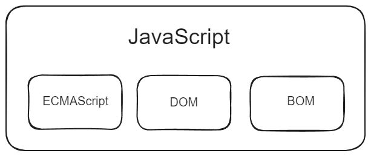
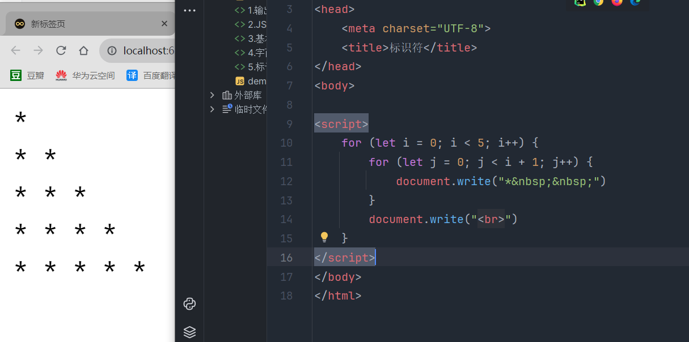

# JS基础

- 简介

  ```
  JavaScript（简称“JS”）是一种具有函数优先的轻量级，解释型或即时编译型的编程语言。
  Ecma国际以JS为基础制定了ECMAScript标准。
  JS作为前端开发的行为层，从交互角度描述页面行为。
  JavaScript 是一种基于对象和事件驱动的脚本语言。它的语法类似于 Java 和 C，适用于在网页上编写交互性程序。
  ```
  
  

## 环境搭建

- Node.js 是 Java Script 的运行环境

- npm 是 Node.js 的包管理器


## npm

- **命令**

  ```bash
  # 查看 npm 版本
  npm --version
  # 更新 npm 包管理工具到最新版
  npm install -g npm@latest
  # 创建静态文件夹
  npm run build
  ```

- **选项**

  ```bash
  -g # 全局
  ```

## http-server

- http-server 是一个基于 Node.js 的简单的静态文件服务器，可以用来快速地在本地启动一个 HTTP 服务器，用于提供静态文件服务。

  ```bash
  # 安装
  npm install -g http-server
  # 启动
  http-server -p 8080
  ```

  

## 代码位置

- JS代码存放位置

  ```
  - JS代码存放位置
      - 放在html标签属性中
      	- 放在超链接中
      - 放在html的script标签中
      - js文件中，需在HTML中引入\<script src="0.草稿.js">\</script>
      	- 注意：引用js文件的script标签中不能写JS代码。
  ```

  ```html
  <script src="my-js-file.js" defer></script>
  ```

  

  正常情况，浏览器会按照代码在文件中的顺序加载 HTML。如果先加载的 JavaScript 期望修改其下方的 HTML，那么它可能由于 HTML 尚未被加载而失效。因此，将 JavaScript 代码放在 HTML 页面的底部（`</body>`之前）通常是最好的策略。

  ``` html
  <!DOCTYPE html>
  <html lang="en">
  <head>
      <meta charset="UTF-8">
      <title>初始JS</title>
  
      <!--1.引入js文件-->
      <script src="demo.js"></script>
  
      <!--2.放在html的script标签中-->
      <script>
          console.log(456);
      </script>
  </head>
  <body>
  
  <!--3.放在html标签属性中-->
  <button onclick="alert('点我干嘛')">点我一下</button>
  
  <!--4.放在超链接中-->
  <a href="javascript:alert('我是超链接');">超链接</a>
  
  <!--5.javascript:alert('我是超链接');复制到浏览器可以直接看到效果-->
  </body>
  </html>
  ```

## 代码规范

- 除以下规范，其余同编程语言通用规范
- **分号**：每行结束加分号
  - 即使不写分号，JS有自动添加分号机制，解释器会自动添加，但不确保。
- **换行**：不敏感

## 标识符

- **规范**

  - 只能含有字母、数字、下划线、$，且不能以数字开头
  - 大小写敏感

  - 不能是 java 里的关键字和保留字

- **命名习惯**
  - **变量**：驼峰命名法，首字母小写，后续每个单词首字母大写，例 **maxLength**。
  - **类名**：大驼峰，首字母大写，后续每个单词首字母大写，例 **MyFirstJavaClass**。
  - **常量**：全大写，例 **MAX_LENGTH**。


## 注释

- **单行注释**：Ctrl + /    **多行注释**：Ctrl + Shift + /

  ``` javascript
  alert(123);  // 这是一个单行注释
  
  /* 多行注释第一行
  多行注释第二行
  多行注释第三行 */
  ```

## 代码块

​	代码块是由花括号 `{}` 括起来的一组语句。在大多数编程语言中，代码块用于定义一段逻辑代码，通常作为控制流语句（如条件语句和循环语句）的执行体。在 JavaScript 中，代码块也用于创建局部作用域。

### 控制流语句中的代码块

- **if 语句**

  ```javascript
  if (condition) {
    // 这里是 if 语句的代码块
    // 如果条件为真，这里的代码会被执行
  } else {
    // 这里是 else 语句的代码块
    // 如果条件为假，这里的代码会被执行
  }
  ```

- **for 循环**

  ```javascript
  for (let i = 0; i < 5; i++) {
    // 这里是 for 循环的代码块
    // 循环体中的代码会被执行 5 次
  }
  ```

- **while 循环**

  ```javascript
  let i = 0;
  while (i < 5) {
    // 这里是 while 循环的代码块
    // 循环体中的代码会被执行 5 次
    i++;
  }
  ```

### 函数中的代码块

- 在函数中，代码块用于定义函数体，即函数要执行的一系列语句。

  ```javascript
  function greet(name) {
    // 这里是函数体的代码块
    console.log("Hello, " + name + "!");
  }
  
  greet("Alice"); // 调用函数，执行代码块
  ```

### 创建局部作用域

- 在 JavaScript 中，代码块也用于创建局部作用域，这意味着在代码块内声明的变量在代码块外不可见。

  ```javascript
  {
    // 这里是代码块，也是局部作用域
    let localVar = "I am local!";
    console.log(localVar); // 可以在代码块内访问
  }
  
  console.log(localVar); // 无法在代码块外访问，会报错
  ```

## 字面量、变量、常量

- **关键字let、var和const的区别**

  ```
  - 产生时期
  	- var是ES5提出的
  	- let和const是ES6提出的
  - 声明对象
      - const用于声明常量，且必须立即赋值，不能使用null占位
      - let和var用于声明变量，可以不立即赋值，可以使用null占位
  - 重新赋值
  	- const不允许重新赋值
  	- let和var允许重新赋值
  - 全局作用域
  	- 即非块级/函数作用域
  	- 在全局作用域，任何声明变量/常量的方式，都具有全局作用域
  - 函数作用域
  	- 即函数内部的作用域
  	- let、var和const都具有函数作用域
  	- 如果想声明一个局部变量/常量，必须使用关键字，禁止省略关键字
  - 块级作用域
  	- 即代码块{}内的作用域
  	- var不存在块级作用域
  	- let和const存在块级作用域
  - 变量提升
  	- 详见函数章节预解析和变量提升
  	- var支持变量提升
  	- let和const不存在变量提升，否则报ReferenceError错
  - 在全局作用域，作为window的属性
  	- 用var声明的变量，会作为window的一个属性
  	- 用let和const声明的变量或常量，并不会作为window的属性
  ```

  ```
  let、var和const区别
  	- let
  		- let是ES6提出的
  		- 支持块作用域，更适合于现代 JavaScript 开发
  	- var
  		- var是ES5提出的
  		- 支持变量提升，因此并不是最佳选择
  		- 支持window属性
      - const
      	- const是ES6提出的
      	- const声明的变量是常量
      	- const也具有块级作用域
  综上所述，尽量使用let去声明变量
  ```

  ```javascript
  {
      let a = 1;
      var b = 2;
  }
  console.log(a);  // 报错 外部无法访问
  console.log(b);  // 2 外部可以访问
  ```

- **字面量**

  ```
  - 字面量其实就是一个值，代表的含义就是字面的信息
  - 比如：1 100 “Hello” true null
  - 在JS中，所有的字面量都可以直接使用
  ```

- **常量**

  常量，即不可改变值的内存地址的量，用来接收字面量。

  ```
  - 使用const声明常量
  	- 详见关键字let、var和const的区别
  - 常量一般用全大写
  ```

  - 声明和赋值常量

  ```javascript
  const PI = 3.14, PP = 5;
  console.log(PI, PP);
  ```

- **变量**

  ```
  - 使用let/var声明变量
  	- 详见关键字let、var和const的区别
  - 省略关键字声明并赋值变量
  - 函数内声明变量
  	- 如果想声明一个函数局部变量，必须使用声明关键字
  	- 否则函数内部变量会对同名全局变量产生污染
  	- 详见函数变量
  ```

  ```javascript
  a = 5;  // 省略声明关键字，声明并赋值变量
  
  let b;  // 使用let声明变量
  console.log(b);  // undefined  声明但未赋值的变量的值为undefined
  b = 5;  // 给变量赋值
  console.log(b);  // 5  赋值后的变量的值为5
  
  let c = 5;  // 使用let声明并赋值变量
  c = 6;  // 给变量重新赋值
  console.log(c);  // 6
  
  let d = 1, e = 2, f = 3;  // 同时声明多个变量并赋值
  console.log(d, e, f);  // 1 2 3
  ```

## 输入与输出

- **输入**

  ```
  - prompt的返回结果为字符串
  - JS中，prompt可以输入默认参数，默认参数可省略
  	prompt("请输入用户名", "张三")
  		"张三"即为默认参数，默认显示在输入窗口
  ```

  ```javascript
  let a = prompt("请输入用户名");
  console.log(a);
  ```

- **输出**

  ```
  如果输出内容为字符串，加双/单引号。
  ```

  ```javascript
  // 浏览器弹窗警告
  alert("哈哈哈");
  
  // 浏览器控制台输出日志
  console.log("你猜我在哪？");
  
  // 网页输出
  document.write("你猜我在哪");
  ```

  - 控制台

  ```
  - 每个浏览器都有控制台console
  	- 右键 >>> 检查  /  F12
  	- JS中有一个内置对象console，里面封装了大量属性和方法，可以通过console.方法名()/属性名调用
  		- log()就是其中一个方法，用来实现在控制台输出
      - 可以在控制台直接运行JS代码
      - 控制台还可以帮助我们检验代码
  ```

# 第二章 数据类型

​	JS是一种弱类型语言，不用提前声明变量的数据类型，在程序运行过程中，变量的数据类型会被自动确定。JS中的数据类型分为两大类，由原始值（基本数据类型）和对象（复杂数据类型或称为引用数据类型）组成。

## 原始值

- 原始值，即基本数据类型，一共7种

  ```
  - 原始值是不可变类型，一旦创建，就不能修改。
      - 数字 Number
      - 大整数 BigInt
      - 字符串 String
      - 布尔值 Boolean
      - 空值 Null
      - 未定义 Undefined
  ```

### 数字 Number

​	JS中的数字型可以用来保存整数或浮点数(小数)

- 说明

  ```
  - JS中位数多的数值在输出时不会十分精确，应该使用大整数
  - 浮点数运算时不会十分精确
  ```

#### 进制

- JS中的进制

  ```
  - 常见的进制有二进制、八进制、十进制和十六进制;
  - 在JS中还可以用八进制和十六进制，输出时统一用十进制表示；
  ```

- 八进制

  ```
  在数字开头加上0，表示八进制数，八进制数由0~7组成，逢8进位。
  ```

  ```javascript
  let num1 = 07;
  console.log(num1);  // 7
   
  let num2 = 010;
  console.log(num2);  // 8
  ```

- 十六进制

  ```
  - 在数字开头加上0x，表示十六进制数，十六进制数由0-9，a-f组成。
  - 十六进制数中的“x” 和“a~f"不区分大小写。
  ```

  ```javascript
  let numl = 0x9;
  console.log((numl);  // 9
  let num2 = Oxa;
  console.log(num2);  // 10
  ```

#### 范围

- 数字型有一定的范围

  ```javascript
  console.log(Number.MAX_VALUE);  // 1.7976931348623157e+308
  console.log(Number.MIN_VALUE);  // 5e-324
  ```

#### 特殊值

- 特殊值

  ```
  - 数字型有3个特殊值
  	- 无穷大 Infinity
  		- 大于或等于2的1024次方的数值，JS无法表示，会返回Infinity
  	- 无穷小 -Infinity
  	- 非数字 NaN（Not a Number）
  		- 使用isNaN()函数检查一个数值是不是NaN，返回true/false
  ```

### 大整数 BigInt

​	JS中的任意精度整数，没有位数的限制，即使超出Number能够表示的安全整数范围。是 chrome 67中的新功能。

- 语法

  ```
  - 大整数表示一些数值比较大的整数
  - 大整数必须添加后缀n
  - 大整数与普通整数是两种值，它们之间并不相等
  	100 == 100n;  // false
  ```

### 字符串 String

- **定义字符串**

  - 字面量方式


  ```javascript
  let data1 = "hello world";  // 文本形式的字符串
  let data2 = "";  // 空字符串
  let data3 = "6";  // 数值形式的字符串
  ```

  - 构造函数方式

  ```javascript
  let data = new String();
  ```

  ```
  - String首字母大写
  - 此处new可以省略
  ```


#### 字符串独有功能

- **基本包装类型**

  在JS中，只有对象数据类型才有属性和方法，原始值没有。但通过基本类型包装，会暂时将字符串包装成一个对象，可以使字符串暂时拥有属性和方法，结束后对象再被销毁

- **切换大小写**

  ```
  - 语法
  	字符串名.方法名()
  	- data.toUpperCase()  转大写
  	- data.toLowerCase()  转小写
  ```

  ``` javascript
  let data = "abc";
  let res = data.toUpperCase();
  console.log(res);  // ABC
  ```

- **startsWith 判断以某个字符开头**

  ```
  - 语法
  	字符串名.startsWith()
  	- 返回布尔值
  ```

  ```javascript
  let data = "中国联通";
  let res = data.startsWith("中国");
  console.log(res);  // true
  ```

- **replace 替换**

  ```
  - 语法
  	字符串名.replace("旧元素", "新元素")
  	- JS中，replace只能替换一个符合要求元素（最左侧一个）
  ```

  ```javascript
  let data = " 中国 联通 联通 ";
  let res = str.replace("联通", "移动");
  console.log(res);  // " 中国 移动 联通 "
  ```

- **split 切割**

  ```
  - 将一个字符串按切割标识分成几个子字符串，放入一个数组
  - 字符串名.split(separator, limit)
      - 形参separator 切割标识
      	- 如果不传入切割标识，则将每个字符分别切割，再放入一个数组
      - 形参limit 子字符串数限制，可省略
      - 返回一个数组
  - 此方法可以使字符串变成符合要求的数组
  ```

  ```javascript
  let data = "马化腾,40,XXXX@qq.com";
  let res1 = data.split(",")  // 把所有序列都切割，分别放入子字符串，逗号是切割标识依据
  let res2 = data.split(".")  // "."为切割标识
  let res3 = data.split(",", 1)  // 从左到右，保留几个子字符串
  
  console.log(res1);  // ['马化腾', '40', 'XXXX@qq.com']
  console.log(res1[0]);  // 马化腾
  console.log(res2);  // ['马化腾,40,XXXX@qq', 'com']
  console.log(res3);  // ['马化腾']
  ```


- **substring 截取**

  ```
  - 在一个字符串中截取从起始索引到结束索引（不包括）的部分，返回一个新字符串
  - 字符串名.substring(indexStart, indexEnd)
  	- 形参  indexStart 起始索引  indexEnd 结束索引
  		- 如果省略了 indexEnd，则截取到字符串的末尾
  		- 如果 indexStart 等于 indexEnd，则返回一个空字符串
  		- 如果 indexStart 大于 indexEnd，则这两个参数对调
  		- 任何小于 0 的参数值都会被视为等于 0 和 str.length
  		- 任何大于 str.length的参数值都会被视为等于 str.length
  		- 任何值为 NaN 的参数将被视为等于 0
  ```

  ```javascript
  let data = "中国江西联通";
  
  console.log(data.substring(2, 4));  // 江西
  console.log(data.substring(2));  // 江西联通
  ```

- **trim 去除空格、去除换行**

  ```
  - 去除字符串开头和结尾的空格，不能去除中间的空格
  	- 去除中间空格应使用str.replace(" ", "")，将空格替换成空白
  - 语法
  	字符串名.trim()
  	- 去除开头空格 trimStart()
  	- 去除结尾空格 trimEnd()
  ```

  ```javascript
  let str = " 中国 联通 ";
  
  let res1 = str.trim();
  console.log(res1);  // "中国 联通"
  
  let res2 = str.trimStart();
  console.log(res2);  // "中国 联通 "
  
  let res3 = str.trimEnd();
  console.log(res3);  // " 中国 联通"
  ```

  ```javascript
  let str = "中国联通\n";
  console.log(str);  // 中国联通（后面有换行）
  
  res4 = str.trim();
  console.log(res4);  // 中国联通（后面没有换行）
  ```

- **模板字符串**

  用反单引号`表示模板字符串

  ```
  - 语法
  	- 用反单引号`表示模板字符串
  	- 模板字符串可直接跨行
  	- 模板字符串可嵌套变量
  ```

  ```javascript
  let a = `Hello World`;
  ```

  - 直接跨行

  ```javascript
  let a = "今天天气真不错\
  真不错啊\
  真不错";
  console.log(a);  // 天气真不错    真不错啊    真不错
  
  let b = `今天天气真不错
  真不错啊
  真不错`;
  console.log(b);  // 天气真不错    真不错啊    真不错
  ```

  - 嵌套变量


  ```javascript
  let a = "你好";
  let b = `${a}世界`;
  console.log(b);  // 你好世界
  ```

#### 字符串公共功能

- **length 获取长度**

  ```
  字符串名.length
  	- 返回字符串长度
  ```

  ```javascript
  let data = "中国江西联通"
  let res = name.length;
  console.log(res);  // 6
  console.log(typeof res);  // number
  ```

- **索引**

  ```
  字符串名[索引号]
      - 返回字符
      - 支持索引的数据类型每个元素都有一个序号，正序从0开始，逆序从-1开始
      - 获取某个序号的值用中括号
          - JS中，逆向索引字符串/数组获取元素时，会返回undefined，但在大多数方法中又支持逆向索引
      - 多维容器可以用多级索引
  方式2：调用方法
  	字符串名.charAt(索引号)
  	- 此方法仅支持字符串
  ```

  - 一级索引

  ```
  JS中，逆向索引会返回undefined
  ```

  ```javascript
  //         0 1 2 3 4 5，正向索引号
  let name = "中国江西联通";
  console.log(name[0]);  // 中
  console.log(name.charAt(0));  // 中
  console.log(name[-6]);  // undefined
  console.log(typeof name[0]);  // string
  ```

  - 多级索引

  ```javascript
  let arr = ["中国", ["上海", "北京", "深圳"], 123];
  let data1 = arr[1][0];
  let data2 = arr[1][0][0];
  console.log(data1);  // 上海
  console.log(data2);  // 上
  ```

  - 示例

  ```javascript
  let name = "中国江西联通";
  let index = 0;  // index为索引号
  while (index < name.length) {
      let data = name[index];
      console.log(data);
      index += 1;
  }
  
  // 依次打印“中国江西联通”
  ```

- **concat 合并**

  ```
  - 合并字符串：将多个字符串合并为一个新字符串
  - 字符串名.concat(形参)
      - 实参可以是多个字符串的字面量、字符串变量或零散的任意数据类型
      - 原字符串不受影响
      - 返回新字符串
  ```

  ```javascript
  let data1 = "abc";
  let data2 = "def";
  
  let data3 = data1.concat(data2);  // 参数为字符串变量
  // let data3 = data1.concat("def");  // 参数为字符串字面量
  let data4 = data1.concat(null, 4, "f");  // 参数为零散的任意数据类型
  
  console.log(data1);  // abc  原字符串不变
  console.log(data2);  // def  原字符串不变
  console.log(data1.concat(data2));  // abcdef  输出返回值为新字符串
  console.log(data3);  // abcdef  输出新字符串
  console.log(data4);  // abcnull4f  输出新字符串
  ```

- **slice 拆分**

  ```
  - 拆分字符串是为了截取某一部分元素
  	- 类似于Python中的切片
  - 字符串名.slice(索引号1, 索引号2)
      - 不包含索引号2，即左闭右开
      - 原字符串不受影响
      - 返回新字符串
      - 特殊拆分
      	- 字符串名.slice(索引号)  从索引号截取到最后
      	- JS不支持步长值
      	- JS不支持从开始到终结索引    
  ```

  ```javascript
  //      0 1 2 3 4 5，正向索引号
  let data = "中国江西联通";
  
  console.log(data.slice(2, 4));  // 江西
  console.log(data.slice(2));  // 江西联通
  ```

- **遍历**

  详见for-in语句

- **in包含**

  ```
  in包含：判断字符串中是否含有某个元素
  - 字符串名.includes(元素)
  	- 返回布尔值
  ```

  ```javascript
  let data = "中国联通";
  let res = data.includes("中国");
  console.log(res);  // true
  ```

- **indexOf 找下标**

  ```
  - 在字符串中搜索指定子字符串，并返回其第一次出现的位置下标。
  - indexOf(searchString, position)
  	- 形参
  		- searchString  目标子字符串
  		- position  位置  暂时没学
      - 返回值为目标元素下标
      	- 当没找到目标元素时，返回-1
  - lastIndexOf(searchString, position)  最后一次出现的位置下标
  ```

  ```javascript
  let data = "12342";
  
  console.log(data.indexOf("2"));  // 1
  console.log(data.lastIndexOf("2"));  // 4
  console.log(data.indexOf("5"));  // -1
  ```

#### 转义字符

​	转义字符是字符串中一些表达特殊意义的字符

- **换行符**

  可以实现一个字符串分多行输出

  ``` javascript
  let data = "这是第一行！\n这是第二行！";  // \n换行符
  console.log(data);
  
  // 这是第一行！
  // 这是第二行！
  ```

- **制表符**

  可以实现字符串中相邻两个字符距离远一些

  ``` javascript
  let data = "你是谁？\t离我远一点！";  // \t制表符
  console.log(data);  // 你是谁？	离我远一点！
  ```

- **取消转义**

  ```
  - 某些字符串中掺杂转义字符，比如路径、网址等，导致高亮报错无法获取结果，此时需要取消转义。
  - 取消转义方式
  	- 转义字符"\"
  		- JS中不支持 r"字符串" 取消转义
  ```

  ``` javascript
  let data = "E:\\文件\\python\\python2021资料和练习\\test";  // 两个“\”代表双重转义=不转义
  console.log(data);  // E:\文件\python\python2021资料和练习\test
  ```

### 布尔值 Boolean

- 语法

  ```
  - 布尔值表示真假的判断，用boolean表示；
  - 一个布尔值只有true和false两种值，注意小写
  ```

  ```javascript
  let a = true;
  let b = false;
  console.log(5 > 3);  // true
  console.log(6 < 2);  // false
  ```

### 空值 Null

- 语法

  ```
  - null本身就是一个数据
  - 从逻辑角度，null表示空对象指针
  	- JS中使用typeof获取null的数据类型会返回object
  - 如果定义的变量准备在将来用于保存对象，最好将该变量初始化为null
  ```

  

### 未定义 Undefined

- 语法

  ```
  - undefined本身就是一个数据
  - 声明一个变量，但未赋值，它的值就是undefined
  ```

### 标识 Symbol

- 语法

  ```
  - Symbol 指的是独一无二的值，这是ES6新增的数据类型。
  - 每个通过 Symbol() 生成的值都是唯一的。
  	- Symbol 类型的对象永远不相等，即便创建的时候传入相同的值
  ```
  
  ```javascript
  let a = Symbol();
  let b = Symbol();
  console.log(a);  // Symbol()
  console.log(typeof a);  // Symbol
  console.log(a == b);  // false

## 数据类型转换

​	JS是一门弱类型语言，对数据类型要求没那么严格，如果数据类型不符合要求，系统会按规定自动转换为符合要求的类型。

### 获取数据类型

- 语法

  ```
  - typeof
  	- 用于检测大方向的数据类型，返回数据类型
  - instansof
  	- 用于检测具体数据类型，返回布尔值
  	- 此种方式不能检测原始值，只能检测对象
  
  - 比如数组在大方向属于对象object，但具体方向属于数组Array
  ```
  
  ```javascript
  let a = 8;
  console.log(typeof a);  // number
  console.log(typeof(a));  // number
  
  let arr = [];
  console.log(typeof arr);  // object
  console.log(arr instanceof Array);  // true
  ```

### 转换成字符串

- **调用函数  String(a)**

  显式转换

  ```javascript
  let a = true;
  console.log(typeof a);  // boolean
  
  a = String(a);
  console.log(a);  // true
  console.log(typeof a)  // string
  ```

- **调用方法  a.toString()**

  ```
  - null和undefined没有toString()方法
  - a可以是数组...
  ```

  ```javascript
  let a = true;
  console.log(typeof a);  // boolean
  
  a = a.toString();
  console.log(a);  // true
  console.log(typeof a)  // string
  ```

- **利用空字符串拼接**

  即隐式转换，详见数学运算符

  ```javascript
  let a = true;
  a = a + "";  //  字符串加法，将a自动转换为字符串"true"，a可以为任意类型
  console.log(a);  // true
  console.log(typeof a)  // string
  ```

### 转换成数字

- **调用函数  Number(a)**

  ```javascript
  let a = "1";
  console.log(typeof a);  // string
  
  a = Number(a);
  console.log(a);  // 1
  console.log(typeof a);  // number
  ```

  ```
  - 字符串转换为数值
      - 合法数字的字符串将被转换为相应数值
      - 不合法数字的字符串(如123px)将被转换为NaN
      - 空字符串将被转换为0
  - 布尔值转换为数值
  	- true  // 1
  	- false  // 0
  - 空值转换为数值  // 0
  - undefined转换为数值  // NaN
  ```

- **使用正号一元运算 +a**

- **将字符串转换为数值的函数**

  ```
  - parseInt()/parseFloat()
      - 与Number(a)和+a不同
          - 不合法数字的字符串(如123px456/12.3px45.6)将被转换为整数/浮点数
          - 解析时，将会自左向右读取一个字符串，直到读取到不是有效整数/浮点数截止
          - 如果第一个字符就不是整数/浮点数（如"a123"），则被转换为NaN
  ```

  ```javascript
  let a = "123px456";
  console.log(typeof a);  // string
  
  b = parseInt(a);
  console.log(b);  // 123
  console.log(typeof b);  // number
  
  c = parseFloat(a);
  console.log(c);  // 123
  console.log(typeof c);  // number
  ```

  ```javascript
  let d = "12.3px456";
  console.log(typeof d);  // string
  
  e = parseInt(d);
  console.log(e);  // 12
  console.log(typeof e);  // number
  
  f = parseFloat(d);
  console.log(f);  // 12.3
  console.log(typeof f);  // number
  ```

### 转换成布尔值

- 使用Boolean()函数将其它类型转换为布尔值

  ```
  - 0、NaN、null、undefined、空字符串和false将被转换为false
  - 其余将被转换为true
  ```

  ```javascript
  let a = 1;
  a = Boolean(a);
  console.log(a);  // true
  console.log(typeof a);  // boolean
  ```

- 利用逻辑运算符!

## 对象

- 详见对象章节

# 第三章 运算符

## 算术运算符

- **语法**

  ```
  - JS中的算术运算符大致与Python相同
  	- JS中，Infiny参与数学运算
  		- 作为加减乘除的第一个数，会返回Infiny
  		- 作为取余的第一个数，会返回NaN
  	- JS中，10/0会返回Infiny
  	- JS中，NaN参与的运算，都会返回NaN
  - JS是一门弱类型语言，当进行数学运算时，除了字符串的加法，其它都会自动转换成数值来完成运算。
  ```

- 字符串加法

  其它数据类型自动转换为字符串，进行字符串拼接

  ```javascript
  let a = 10 + "5";  // 10转为字符串为"10"，10可以为其它任意类型数据
  console.log(a);  // 105
  console.log(typeof a);  // string
  ```

- 其它类型运算

  其它数据类型自动转换为数字，进行数学运算

  ```javascript
  let a = 10 - "5";  // "5"转为数值为5
  console.log(a);  // 5
  console.log(typeof a);  // number
  
  let a = 10 + true;  // true转为数值为1
  console.log(a);  // 11
  console.log(typeof a);  // number
  
  let a = 10 + NaN;  // NaN为非法数值
  console.log(a);  // NaN
  console.log(typeof a);  // number
  ```

## 赋值运算符

- **赋值运算符**

  ```
  - JS中的赋值运算符大致与Python相同
  - JS中可以进行空赋值 ??=
  	- 变量的值为null和undefined时，可以进行空赋值
  ```

  ```javascript
  let a = null;
  a ??= 5;
  console.log(a);  // 5
  console.log(typeof a);  // number
  ```

## 一元运算符

- **数值的一元运算符**

  ```
  - 数值的一元运算符
  	+ 取当前符号
  	- 取相反符号
  ```

  ```javascript
  let a = -10;
  a = +a;
  console.log(a);  // -10
  console.log(typeof a);  // number
  
  let b = -10;
  b = -b;
  console.log(b);  // 10
  console.log(typeof b);  // number
  ```

- **字符串的一元运算符**

  ```
  - 字符串的一元运算符
  	+ 自动转换为数值，并取当前符号
  	- 自动转换为数值，并取相反符号
  ```

  ```javascript
  let a = "-10";
  a = +a;
  console.log(a);  // -10
  console.log(typeof a);  // number
  
  let b = "-10";
  b = -b;
  console.log(b);  // 10
  console.log(typeof b);  // number
  ```

### 自增和自减

- 自增和自减无需再对原变量进行赋值，会立即改变原变量的值

- **自增运算符**

  ```
  - 自增运算符
  	++ 原变量的值在自身基础上加1
  		++a 前自增
  		a++ 后自增
  		- 二者对原变量a的自增效果一样，都是在自身基础上加1
  		- 区别在于自增表达式返回的值不同，了解即可
  			- let b = ++a;
  			- console.log(b);
  			- 前自增返回a自增后的值
  			- 后自增返回a自增前的值
  - 自减运算符同理
  ```

  ```javascript
  let a = 1;
  a++;  // 无需再对a进行赋值，即可改变a的值
  console.log(a);  // 2
  console.log(typeof a);  // number
  ```

  练习

  ```javascript
  let n = 5;
  let result = n++ + ++n + n;
  console.log(result);  // 19
  ```

  ```
  n++ = 5  此时n = 6
  ++n = 7  此时n = 7
  n++ + ++n + n = 5 + 7 +7
  ```

- **自减运算符**

  原变量的值在自身基础上加1，其它同自增运算符

  ```javascript
  let a = 1;
  a--;  // 无需再对a进行赋值，即可改变a的值
  console.log(a);  // 0
  console.log(typeof a);  // number
  ```


## 逻辑运算符

- **逻辑与 &&**

  当&&左右布尔表达式都为true，则返回true，否则返回false

  ```
  - 与运算的结果核心就是找false
  	- 如果第一个值是false，则直接返回第一个值，不看第二个
  	- 如果第一个值是true，则返回第二个值
  ```

  ```javascript
  let a = 5 > 3 && 6 <3;
  console.log(a ,typeof a)  // false 'boolean'
  ```

  与运算为短路运算，如果第一个值为false，则第二个值不执行，否则执行第二个

  ```javascript
  let res = true && alert(123);  // 执行alert(123)
  res = false && alert(123);  // false 不执行alert(123)
  console.log(res)；
  ```

  如果对其它数据类型进行与运算，系统会先将其转换为布尔值，然后进行与运算，但最终会返回原值

  ```javascript
  let a = 1 && 2;  // 2 'number'
  a = 1 && 0;  // 0 'number'
  a = 0 && NaN;  // 0 'number'
  console.log(a ,typeof a)
  ```

- **逻辑或 ||**

  当||左右布尔表达式只要有一个为true，则返回true，否则返回false

  ```
  - 或运算的结果核心就是找true
  	- 如果第一个值是true，则直接返回第一个值，不看第二个
  	- 如果第一个值是false，则返回第二个值
  ```

  ```javascript
  let a = 5 > 3 || 6 <3;
  console.log(a ,typeof a)  // true 'boolean'
  ```

  或运算为短路运算，如果第一个值为true，则第二个值不执行，否则执行第二个

  ```javascript
  let res = true || alert(123);  // true 不执行alert(123)
  res = false || alert(123);  // 执行alert(123)
  console.log(res)；
  ```

  如果对其它数据类型进行与运算，系统会先将其转换为布尔值，然后进行与运算，但最终会返回原值

  ```javascript
  let a = 1 || 2;  // 1 'number'
      a = 0 || 1;  // 0 'number'
      a = 0 || NaN;  // NaN 'number'
      console.log(a ,typeof a)
  ```

- **逻辑非 !**

  对等号右侧布尔表达式取反，如果右边为true，则整体为false，如果右边为false，则整体为true

  如果对其它数据类型进行非运算，系统会先将其转换为布尔值，然后进行非运算

  ``` javascript
  let a = true;
  a = !a;
  console.log(a)  // false
  
  let b = 5;
  b = !b;
  console.log(b, typeof b)  // false 'boolean'
  ```

  连续取非，将其它数据类型转换为布尔值

  ```javascript
  let b = 5;
  console.log(typeof b);  // number
  
  b = !!b;
  console.log(b, typeof b)  // true 'boolean'
  ```

- 逻辑运算顺序

  非 与 或

## 关系运算符

- 用来检查两个值之间的关系是否成立，关系运算符运算的结果是布尔值

  ```
  大于>  小于<  大于等于>=  小于等于<=  相等==  不等!=  全等===  不全等!==
  ```

- 当两个值都是数值类型时，即根据数学运算判断得出布尔值

  ```javascript
  let a = 5 > 6;
  console.log(a ,typeof a)  // false 'boolean'
  ```

- 当两个值都是字符串时，不会自动转换为数值，而是逐位比较字符的Unicode编码再得出布尔值

  ```javascript
  let a = "15" > "6";  // "15"中1的Unicode码在"6"的前面
  console.log(a ,typeof a)  // false 'boolean'
  ```

- 当两个值不全是数值/字符串类型时，先自动转换为数值，再进行数学判断得出布尔值

  ```javascript
  let a = 5 > "6";  // 先自动将"6"转换成6
  console.log(a ,typeof a)  // false 'boolean'
  ```

- 特例

  ```
  - 全等和不全等运算不会进行自动数据类型转换，如果两个值类型不同，则直接返回false，其它同理。
  - null
  	- null与其它作比较，会自动转换为0
  	- null与0作比较，只有 >= 和 <= 会返回true，其余都是false
  	- null == undefined 会返回true
  - NaN不与任何值（包括本身）等于/相等/全等，都会返回false
  ```

## 条件运算符

- 语法

  ```
  条件表达式 ? 表达式1 ： 表达式2
  - 执行顺序
  	如果条件为true，则执行表达式1
  	如果条件为false，则执行表达式2
  ```

  ```javascript
  true ? alert(1) : alert(2);  // 执行alert(1)
  ```

  ```javascript
  let a = 1;
  let b = 2;
  let max = a > b ? a : b;
  console.log(max);
  ```

## 运算符的优先级

- **总体规律**

  优先级表格中，优先级高的先执行，优先级相等时自左向右执行

  ```
  - ()小括号
  - 一元运算符
  - 算术运算符
  - 关系运算符 
  	- 然后相等运算符
  - 逻辑运算符 非 与 或
  - 赋值运算符
  ```

- **技巧**

  ()具有最高优先级，可以用小括号制造符合需求的优先级

# 第四章 控制结构

## 选择结构

- JS中有if、switch和三元表达式三种选择结构

### if语句

- **if语法**

  ```
  - 语法
      if (条件表达式) {
      	执行语句;
      }
  - 执行流程
  	if语句在执行时，会先对条件表达式进行判断
  		- 如果结果为true，则执行语句
  		- 如果结果为false，则不执行语句
  ```

  ```javascript
  let a = 2;
  if (a > 1) {
      console.log(a);  // 2
  }
  ```

  ```
  在JS中，如果条件表达式的结果不是布尔值，则转换为布尔值再判断
  ```

  ```javascript
  let a = 2;
  if (a) {  // a转换为布尔值为true
  	console.log(a);
  }
  ```

- **if-else**

  ```
  - 语法
      if (条件表达式) {
          执行语句A;
      } else {
          执行语句B;
      }        
  - 执行流程
  	if-else语句在执行时，会先对条件表达式判断
      	- 如果结果为true，则执行语句A
  		- 如果结果为false，则不执行语句B
  ```

- **if-else if-else**

  类似于Python中的if-elif-else

  ```
  - 语法
      if (条件表达式1) {
          执行语句A;
      } else if (条件表达式2) {
          执行语句B;
      } else if (条件表达式3) {
          执行语句c;
      } else {
          执行语句D;
      }
          
  - 执行流程
  	- if-else if-else语句在执行时，会先对条件表达式1进行判断
  		- 如果结果为true，则执行语句A
  		- 如果结果为false，则判断条件表达式2
  			- 如果结果为true，则执行语句B
  			- 如果结果为false，则判断条件表达式3
  				- 如果结果为true，则执行语句C
  				- 如果条件表达式1、2、3...都为false，则执行语句D
  ```

- 综合练习

  ```
  - 从键盘输入分数
  	- 分数100，奖励汽车
  	- 分数80-99，奖励手机
  	- 分数60-79，奖励参考书
  	- 分数0-59，继续努力
  ```

  ```javascript
  let score = +prompt("请输入分数：")
  if (isNaN(score) || score < 0 || score > 100) {
      console.log("请输入正确分数！")
  } else {
      if (score == 100) {
          console.log("奖励汽车")
      } else if (score >= 80) {
          console.log("奖励手机")
      } else if (score >= 60) {
          console.log("奖励参考书")
      } else {
          console.log("请继续努力")
      }
  }
  ```

### 三元表达式

- 三元表达式是一种简单的选择结构

  ```
  - 语法
  	布尔表达式? 执行语句1: 执行语句2
  - 执行流程
  	- 三元表达式在执行时，会先对布尔表达式进行判断
  		- 如果结果为true，则执行语句1
  		- 如果结果为false，则执行语句2
  ```

  ```javascript
  console.log(true? 1: 0);  // 1
  ```

### switch语句

- 即开关语句，switch语句完全可以用if语句代替，只不过switch语句在结构上更清晰。

  ```
  - 语法
      switch (表达式) {
      	case 表达式1:
          	语句1;
          	break;
          case 表达式2:
          	语句2;
          	break;
          case 表达式3:
          	语句3;
          	break;
          .....
          default:
              语句4;
              break;
      }
  - 执行流程
  	switch语句在执行时，会依次将switch后的表达式和case后的表达式进行全等比较
      	- 如果结果为true，则执行当前case后的代码
  			- 如果没有break，则自当前case处，依次执行之后所有case后的语句
  		- 如果结果为false，则继续比较其它case后的表达式，直到结果为true
  			- 如果所有比较结果都为false，则执行default后的语句
  ```

  ```javascript
  let num = +prompt("请输入数字")
  switch (num) {
      case 1:
          console.log("壹");
          break;
      case 2:
          console.log("贰");
          break;
      case 3:
          console.log("叁");
          break;
      default:
          console.log("没有这个数");
          break;
  }
  ```

## 循环结构

- JS中有for循环、while循环和do-while循环三种循环结构。

### for 循环

- 语法

  ```
  - 语法
  	for (初始化表达式; 条件表达式; 更新表达式){
  		循环体
  	}
  	
  - 执行流程
  	- 1.初始化表达式，初始化变量
      - 2.判断条件表达式（true执行，false终止）
      - 3.如果结果为true，则执行循环体
      	- 如果结果为false，则循环结束
      - 4.更新表达式，对初始化变量修改，继续判断条件表达式，直到判断结果为false
      
  - 说明
  	- 初始化表达式中使用let声明的变量是局部变量，只能在本次for循环内部访问
  	- 三个表达式都可以省略，形成一个死循环
  		for (;;){
  			循环体
  		}
  ```

  ```javascript
  for (let a = 0; a <= 5; a++){
      console.log(a);  // 0 1 2 3 4 5
  }
  ```

#### for-in语句

- 语法

  ```
  - 语法
  	for (let 变量名 in 对象){
  		循环体
  	}
  - 执行流程
  	- 对象有几个属性，就会执行几次循环体
  		- JS中，并非所有属性都支持枚举，比如用符号添加的属性
  	- 每次循环都会将对象的属性名赋值给变量
  ```

  ```javascript
  let arr = ["中国", "上海", 123]
  for(let i in arr){  // 与Python不同，JS中循环字符串和数组，遍历到的是元素的索引号
      console.log(arr[i]);
  }
  ```

- 遍历对象

  ```javascript
  let user = {name: "张三", age: 18, gender: "男"};
  for (let k in user){
      console.log(1);  // 输出3次1
      console.log(k, user[k]);  // 依次输出属性名和属性值，这里不能使用user.i获取属性值
  }
  ```

### while循环

- 语法

  ```
  - 语法
      while (条件表达式){
      	循环体
      }
  
  - 执行流程
       while循环在执行时，会先对条件表达式进行判断
          - 如果结果为true，则执行循环体
              - 执行完毕，继续判断条件表达式，直到判断结果为false
          - 如果结果为false，则循环结束
  ```

  ```javascript
  let a = 1;
  while (a < 5) {
      console.log(a);
      a += 1;
  }
  ```

### do-while循环

- do-while循环通过判断条件来控制一段代码（循环体）重复执行

  do-while 循环与 while 循环的本质区别就是 do-while 循环至少可以执行循环体一次。
  
- 语法

  ```
  - 语法
      do {
      	循环体
      } while (条件表达式)
  
  - 执行流程
      do-while循环在执行时，会先执行循环体，再对条件表达式进行判断
          - 如果结果为true，则继续执行循环体，直到判断结果为false
          - 如果结果为false，则循环结束
  ```
  
  ```javascript
  let a = 10;
  do {
      console.log(a);
      a += 1;
  } while (a < 5);
  ```

### 死循环

- JS 中创建死循环的方式

  ```
  for (;;){
  	循环体
  }
  ```

  ```
  while (true){
  	循环体
  }
  ```

### 嵌套循环

- 语法

  
  
  ```javascript
  for (let i = 0; i < 5; i++) {
      for (let j = 0; j < i + 1; j++) {
          document.write("*&nbsp;&nbsp;")
      }
      document.write("<br>")
  }
  ```

### break和continue

- 语法

  ```
  语法
  	- break执行后，终止当前switch语句或循环，程序向下执行当前循环以外内容
  	- continue执行后，跳过本次switch语句或循环，程序继续执行下次该循环
  	- break和continue只会作用于离它最近的switch语句或循环
  ```

  ```javascript
  for (let i = 0; i < 5; i++) {
      console.log(`外层-----${i}`)
      for (let j = 0; j < 5; j++) {
          if (j === 3) {
              continue  // 跳过本次内层循环的j = 3，继续循环j = 4
          }
          console.log(j)
      }
  }
  ```

  ```javascript
  for (let i = 0; i < 5; i++) {
      console.log(`外层-----${i}`)
      for (let j = 0; j < 5; j++) {
          if (j === 3) {
              break  // 结束内层循环，不再继续循环j = 4
          }
          console.log(j)
      }
  }
  ```

# 第五章 对象

​	对象是JS中一种复合数据类型object（类似于Python中的字典），在对象中可以存储各种不同数据类型。

​	JS中的对象：自定义对象，内置对象，浏览器对象。

## 语法

- **基本语法**

  ```
  let 对象名 = {属性名: "属性值"};
  - 存储的数据称为属性（类似于字典的键值对）
  	- 属性名 （类似于字典的键）
  		- JS中属性名加不加引号都没影响
  	- 属性值 （类似于字典的值）
  		- JS中如果属性值为函数的时候，就把属性称为方法
  ```

  ```javascript
  let obj = {
      name: "张三",
      age: 20,
      gender: "男",
      sayHi: function () {  // 属性值为函数，此时属性称为方法
          console.log("你好");
      }
  };
  console.log(typeof obj);  // object
  ```

- **属性名**

  ```
  - 属性名可以是任何数据类型，但通常都是字符串
  - 如果属性名太特殊，不能直接设置，应该使用[]
  	- 使用[]操作属性时，可以使用变量
  - 也可以使用符号作为属性名添加属性
  - 如果读取的属性名不存在，则返回undefined
  ```

- **属性值**

  ```
  - 属性值可以是任意数据类型
  	- 原始值
  	- 函数
  	- 对象
  	- ...
  ```

- **mySymbol作为对象名**

  使用symbol添加的属性，通常是那些不希望被外界访问的属性

  ```javascript
  let obj = Object();
  let mySymbol = Symbol()
  obj[mySymbol] = "通过symbol添加的属性"
  console.log(obj)
  ```

- **可变类型**

  ```
  - 对象属于可变类型
  - 新创建一个对象，一定会指向一个新内存地址
  	- 新对象 = 旧对象 除外
  - 对于对象来说，作相等或全等比较时，比较的是内存地址。
  	- 当改变两个相等对象（内存地址相同）中任意一个属性时，另外一个对象的相应属性也会变化。
  - 为了不改变对象的内存地址，通常使用const声明对象
  ```

  ```javascript
  let a = 1;
  let b = a;
  a = 2;
  console.log(b);  // 1  b为a旧值
  
  let obj1 = {name: "张三"};
  let obj2 = obj1;
  obj1.name = "李四"
  console.log(obj2);  // {name: "李四"}  obj2为obj1新值
  ```
  
  ```javascript
  const obj1 = {name: "张三"};
  const obj2 = obj1;
  console.log(obj2.name);  // 张三
  obj2 = {};  // 报错
  ```

## 对象的操作

### 调用属性

- **对象外部调用**

  ```
  - 调用方式
  	- 对象名.属性名/方法名()
  		- 此种方式在增加属性/方法时，不可以使用变量代指属性名/方法名
  		- 此种方式在for-in语句中，不能使用
  	- 对象名["属性名"]/["方法名"]()
  - 调用结果
  	- 得到属性值/执行方法
  ```

  ```javascript
  let obj = {
      name: "张三",
      age: 20,
      gender: "男",
      sayHi: function () {
          console.log("你好");
      }
  };
  
  console.log(obj.name);  // 张三
  console.log(obj["name"]);  // 张三
  obj.sayHi();  // 你好
  obj["sayHi"]();  // 你好
  ```

- **对象内部调用**

  ```
  - 调用方式
  	this.属性名
  	this["属性名"]
  - 其它同外部调用
  ```

  ```javascript
  let obj = {
      name: "张三",
      age: 20,
      gender: "男",
      sayHi: function () {
          console.log(`${this.name}你好`);  // 对象内部调用自己的属性
      }
  };
  
  obj.sayHi();  // 你好
  ```

### 增删改查

- **增删改查**

  ```javascript
  // 创建对象
  let obj1 = {};  // 字面量方式创建，可以直接写属性
  let obj2 = Object();  // 函数方式创建
  console.log(typeof obj1);  // object
  
  // 增加属性
  // 对象.属性名 = 属性值
  obj.name = "张三";
  obj.age = 18;
  obj.gender = "男";
  
  // 删除属性
  // delete 对象.属性名
  delete obj.name
  
  // 修改属性值
  // 对象.属性名 = 属性值
  obj.name = "李四"
  
  // 检查属性是否存在
  console.log("name" in obj);  // true 返回布尔值
  ```

### 创建对象

- **字面量方式**

  ```javascript
  let obj1 = {};
  ```

- **构造函数方式**

  ```javascript
  let obj2 = new Object();  // Object首字母大写，此处new可以省略
  ```

  ```
  - new的作用
  	- new可以省略
  	- 在内存中创建一个新的空对象
  	- 让this指向这个新对象
  	- 执行构造函数  目的：给这个新对象添加属性和方法
  	- 返回新对象
  ```

- **自定义构造函数方式**

  自定义一个创建对象的构造函数，创建多个相同属性的对象

  ```javascript
  function Person(name, age, gender) {  // 创建构造函数，函数名首字母大写
  
      // 使用this调用并添加对象属性
      this.name = name;
      this.age = age;
      this.gender = gender;
      this.sayHi = function () {
          console.log("你好");
      };
      // 不需要添加返回值，因为接下来使用new Person调用构造函数，自带返回值
  }
  
  // 使用new Person调用构造函数创建多个新对象，并用变量接收
  // 此处new不能省略
  let p1 = new Person("张三", 20, "男");
  let p2 = new Person("李四", 22, "男");
  let p3 = new Person("王五", 30, "女");
  
  console.log(p1);  // {name: '张三', age: 20, gender: '男', sayHi: ƒ}
  console.log(p2);  // {name: '李四', age: 22, gender: '男', sayHi: ƒ}
  console.log(p3);  // {name: '王五', age: 30, gender: '女', sayHi: ƒ}
  ```

- **工厂函数方式**

  构造一个创建对象的工厂函数，创建多个相同属性的对象

  ```javascript
  function creatPerson(name, age, gender) {  // 构造工厂函数
      let person = Object();  // 创建对象
  
      // 添加对象属性
      person.name = name;
      person.age = age;
      person.gender = gender;
      person.sayHi = function () {
          console.log("你好");
      };
      
      return person;  // 将创建的新对象作为返回值
  }
  
  // 调用工厂函数创建多个新对象，并用变量接收
  let p1 = creatPerson("张三", 20, "男");
  let p2 = creatPerson("李四", 22, "男");
  let p3 = creatPerson("王五", 30, "女");
  
  console.log(p1);  // {name: '张三', age: 20, gender: '男', sayHi: ƒ}
  console.log(p2);  // {name: '李四', age: 22, gender: '男', sayHi: ƒ}
  console.log(p3);  // {name: '王五', age: 30, gender: '女', sayHi: ƒ}
  ```


### 遍历对象

- 详见for-in语句

## 内置对象

​	JS提前设置好的对象，自带一些属性和方法。

### Math 数学


...

# 第六章 数组 Array

​	数组（Array）是一个有序的序列结构，是一个特殊的对象，大方向数据类型为object，具体数据类型为Array。

- **语法**

  ```
  - 语法
  	let 数组名 = [元素1, 元素2, 元素3...]
  - 特性：类似于Python中的列表，但不支持in包含...
  	- 可存放多种数据类型；元素可重复；有序索引（下标）；元素支持修改。
  ```
  
  ```javascript
  let data = ["中国", "上海", 123];
  console.log(data);  // ['中国', '上海', 123]
  console.log(typeof data);  // object
  ```

## 创建数组

- **字面量方式**

  ```javascript
  let data = ["中国", "上海", 123];
  ```

- **构造函数方式**

  ```javascript
  let data = new Array();
  ```

  ```
  - Array首字母大写
  - 此处new可以省略
  ```

## 数组独有功能

- **获取元素**

  ```
  - 语法
  	数组名[索引号]
  - 说明
  	JS中获取元素时，如果索引号超过数组最大项，会返回undefined
  ```

  ```javascript
  let data = ["中国", "上海", 123];
  console.log(data[0]);  // 中国
  console.log(data[4]);  // undefined
  ```

- **修改元素**

  ```
  - 语法
  	数组名[索引号] = 值
  - 说明
  	JS中修改元素时，如果索引号超过数组最大项，会创建新元素，并在新元素与旧元素之间创建空属性，同时被动增加数组长度
  ```

  ```javascript
  let data = ["中国", "上海", 123];
  data[0] = "杭州";
  console.log(data);  // ["杭州", "上海", 123]
  ```

  ```javascript
  let data = ["中国", "上海", 123];
  data[5] = 456;
  console.log(data);  // ['中国', '上海', 123, 空属性 × 2, 456]
  console.log(data[3], data[4])  // undefined undefined
  console.log(data.length);  // 6
  ```

- **追加元素**

  ```
  - 语法
  	数组名.push(元素1, 元素2...)
  		- JS中可以追加多个元素
  		- JS中返回添加后的数组长度
  		- 原数组受影响
  - 索引方式添加详见修改元素
  ```

  ```javascript
  let data = [1, 2, 3, 4];
  // console.log(data.push(5, 6, 7, 8));  // 8
  data.push(5, 6, 7, 8);
  console.log(data);  // [1, 2, 3, 4, 5, 6, 7, 8]
  ```

- **开头添加元素**

  ```
  - 语法
  	数组名.unshift(元素1, 元素2...)
  	返回添加后的数组长度
  ```

  ```javascript
  let data = [1, 2, 3, 4];
  // console.log(data.unshift(5, 6, 7, 8));  // 8
  data.unshift(5, 6, 7, 8);
  console.log(data);  // [5, 6, 7, 8, 1, 2, 3, 4]
  ```

- **删除最后一项**

  ```
  - 语法
  	数组名.pop()
  		- JS中pop只能删除最后一个元素
  		- JS中返回删除项
  		- 原数组受影响
  ```

  ```javascript
  let data = [1, 2, 3, 4];
  // console.log(data.pop());  // 4
  data.pop();
  console.log(data);  // [1, 2, 3]
  ```

- **删除第一项**

  ```
  - 语法
  	数组名.shift()
  		- 返回删除项
  		- 原数组受影响
  ```

  ```javascript
  let data = [1, 2, 3, 4];
  // console.log(data.shift());  // 1
  data.shift();
  console.log(data);  // [2, 3, 4]
  ```

- **splice 删除、替换和插入元素**

  ```
  splice集删除、替换和插入元素功能于一体
  数组名.splice(startIndex, deleteCount, item1, item2, /* …, */ itemN)
  	- 形参
  		- startIndex 起始索引  控制从第几个序号开始操作
  		- deleteCount 删除数量  控制想不想删除元素，以及删除多少元素
  		- item 替换/插入元素  放入的新元素
  	- 原数组受影响
  	- 返回一个数组，数组里放删除的元素
  ```

  - **删除**

  ```
  数组名.splice(startIndex, deleteCount)
  ```

  ```javascript
  let data = [1, 2, 3, 4];
  data.splice(1,2);
  // console.log(data.splice(1,2));  // [2, 3]
  console.log(data);  // [1, 4]
  ```

  - **替换**

  ```
  数组名.splice(startIndex, deleteCount, item1, item2, /* …, */ itemN)
  ```

  ```javascript
  let data = [1, 2, 3, 4];
  data.splice(1,2, 11, 22);
  // console.log(data.splice(1,2, 11, 22, 33));  // [2, 3]
  console.log(data);  // [1, 11, 22, 4]
  ```

  ```javascript
  let data = [1, 2, 3, 4];
  data.splice(1,2, 11, 22, 33);
  // console.log(data.splice(1,2, 11, 22, 33));  // [2, 3]
  console.log(data);  // [1, 11, 22, 33, 4]
  ```

  - **插入**

  ```
  数组名.splice(startIndex, 0, item1, item2, /* …, */ itemN)
  ```

  ```javascript
  let data = [1, 2, 3, 4];
  data.splice(1,0, 11, 22, 33);
  // console.log(data.splice(1,0, 11, 22, 33));  // []
  console.log(data);  // [1, 11, 22, 33, 2, 3, 4]
  ```

- **获取数组长度**

  ```
  - 语法
  	数组名.length
  - 说明
  	JS中，数组长度可以强制改变
  ```

  ```javascript
  let data = ["中国", "上海", 123];
  console.log(data.length);  // 3
  ```

- **增加数组长度**

  ```
  - 语法
  	数组名.length = 长度
  - 说明
  	JS中，强制增加数组长度时，会创建新元素，获取新元素会返回undefined
  ```

  ```javascript
  let data = ["中国", "上海", 123];
  console.log(data.length);  // 3
  data.length = 5
  console.log(data.length)  // 5
  
  console.log(data);  // ['中国', '上海', 123, 空属性 × 2]
  console.log(data[3], data[4])  // undefined undefined
  ```

- **缩短数组长度**

  ```
  - 语法
  	数组名.length = 长度
  - 说明
  	JS中，强制缩短数组长度时，会同时删除超过新数组长度的元素，并且删除不可逆
  ```

  ```javascript
  let data = ["中国", "上海", 123];
  console.log(data.length);  // 3
  data.length = 2
  console.log(data.length)  // 2
  console.log(data);  // ['中国', '上海']
  ```

- **清空数组**

  ```
  - 方式1*
  	data = []
  - 方式2
  	data.length = 0
  - 方式3
  	data.splice(0, data.length)
  ```

- **reverse 反转**

  ```
  - 反转数组：将数组里元素的顺序反转
  - 数组名.reverse()
  	- 原数组受影响
  		- 如果想让原数组不受影响，应使用.toReversed()
  	- 返回反转之后的数组
  ```

  ```javascript
  let data = [1, 2, 3, 4];
  data1 = data.reverse();
  
  console.log(data);  // [4, 3, 2, 1]  原数组受影响
  console.log(data1);  // [4, 3, 2, 1]  reverse返回反转之后的数组
  ```

  ```javascript
  let data = [1, 2, 3, 4];
  let data2 = data.toReversed();
  
  console.log(data);  // [1, 2, 3, 4]  原数组不受影响
  console.log(data2);  // [4, 3, 2, 1]  reverse返回反转之后的数组
  ```

- **sort 排序**

  ```
  - 对数组的元素进行排序
  - 默认排序是将元素转换为字符串，然后按照它们的 UTF-16 码元值升序排序。
      - 数组名.sort()
          - 原数组受影响
              - 如果想让原数组不受影响，应使用toSorted()
          - 返回排序之后的数组
  ```

  ```javascript
  let data = ["80", "9", "700", 40, 1, 5, 200];
  let res = data.sort();
  
  console.log(data);  // [1, 200, 40, 5, '700', '80', '9']
  console.log(res);  // [1, 200, 40, 5, '700', '80', '9']
  ```

  ```
  - 如果想按数字大小进行升序排序，应传入一个自定义的比较函数
  	- 数组名.sort(compareFn)
          - 原数组受影响
              - 如果想让原数组不受影响，应使用toSorted()
          - 返回排序之后的数组
          - 所有的 undefined 元素都会被排序到数组的末尾，并且不调用 compareFn
      - 比较函数 compareFn
      	function compareFn(a, b) {
            return a - b;
          }
          - a 和 b 就是要比较的数组里的元素
          - 函数的返回值是 a 与 b 的差值
          - 按照sort()方法内部规则，差值的正负性表示两个元素的相对顺序
          	a - b < 0，a 在 b 前
          	a - b > 0，a 在 b 后
          	a - b = 0，保持 a 和 b 原来的顺序
  - 想降序排序，只需要将比较函数的返回值改为 b - a
  ```

  ```javascript
  let data = ["80", "9", "700", 40, 1, 5, 200];
  function compareFn(a, b) {
    return a - b;
  }
  let res = data.sort(compareFn);
  
  console.log(data);  // [1, 5, '9', 40, '80', 200, '700']
  console.log(res);  // [1, 5, '9', 40, '80', 200, '700']
  ```

- **join 连接**

  ```
  - 将一个数组（或类数组对象）的所有元素，用逗号或指定的分隔符连接成一个字符串。
  - 数组名.join(separation)
  	- 形参separation 分隔符
  		- 如果不传入指定分隔符，返回结果各个元素将以“,”连接
      - 原数组不受影响
      - 返回一个字符串
  - 此方法可以使数组变成符合要求的字符串
  ```

  ```javascript
  let data = ["中国", "上海", 123];
  let res = data.join("_");  // "_"为连接符，可替换，可不填
  console.log(res);  // 中国_上海_123
  console.log(data);  // ["中国", "上海", 123]
  ```

- **JS中没有的独有功能**

  ```
  - 
  ```

## 数组公共功能

- 数组公共功能

  ```
  - 获取长度 .length
  - 索引
  - 合并 .concat()  拆分 .slice()
  - 遍历 for-in
  - in包含
  - 找下标 indexOf
  ```

# 第七章 函数

​	函数是实现某个功能的业务代码，定义好可以重复使用。函数是一个特殊的对象，数据类型为function。

- 说明

  ```
  - JS中有内置函数和自定义函数。
  - 函数也是一种数据类型，类型为function，可以当做普通数据去使用。
  ```

## 自定义函数

​	自定义函数是开发人员自己编写的函数，可以在项目中的多个地方调用。

- **定义方式**

  ```
  - 函数的定义方式
  	- 函数声明
  	- 函数表达式
  	- 箭头函数
  ```

  ```
  - 函数声明
      function 函数名(形参) {
          函数体
      }
  
  - 函数表达式
  	const 变量名 = function(形参) {
          函数体
      };
  
  - 箭头函数
  	const 变量名 = (形参) => {
          函数体
      };
      
  
  - 使用函数
  	函数名(实参)
  	变量名(实参)
  ```

  ```javascript
  function sum(a, b) {  // 定义函数格式
      let result = a + b;  // 定义函数规则
      console.log(result);  // 定义函数结果
  }
  
  sum(4, 5);  // 9  调用函数
  console.log(typeof sum);  // function
  console.log(sum instanceof Object);  // true
  console.log(sum instanceof Function);  // true
  ```
  
  ```
  - function为关键字，sum为函数名，a和b为形参，4和5为实参；
  - 函数里面使用let声明的变量result，在函数外面无法直接访问到；
  - 函数名遵从标识符命名规范。
  ```

### 函数声明变量

- 语法

  ```
  - 如果想声明一个函数局部变量，必须使用声明关键字
  - 否则函数内部变量会对同名全局变量产生污染
  	- 注意函数的形参属于局部变量
  ```
  
  ```javascript
  let a = 1;
  console.log(a);  // 1
  
  function outer() {
      a = 2;  // 函数内部未使用声明关键字
      console.log(a);
  }
  
  outer();  // 2
  console.log(a);  // 2  外部变量a受到函数内部变量污染
  ```
  
  ```javascript
  let a = 1;
  console.log(a);  // 1
  
  function outer() {
      let a = 2;  // 函数内部使用声明关键字
      console.log(a);
  }
  
  outer();  // 2
  console.log(a);  // 1  外部变量a没有受到函数内部变量污染
  ```

### 返回值

- **语法**

  ```
  - 返回值就是函数执行后返回的结果
  - 函数内部遇到return，函数立即终止；
  - 返回值可以是任意类型；
  - 函数末尾没有return或return没有赋值，则默认返回undefined；
  ```

  ```javascript
  function sum(a, b) {
      let result = a + b;
      return result;  // 函数的输出结果返回result，函数停止
      console.log("求和", result);  // 由于前面有return，所以此行代码不执行
  }
  
  res = sum(4, 5);  // 调用函数并接收返回值
  console.log(res);  // 9
  ```

### arguments对象

- JS中，函数有一个内置属性arguments对象，其存储了传递的所有实参。

- 语法

  ```
  - arguments是一个伪数组，因此具有数组的一些功能，比如索引，遍历，获取长度...
  - 由于arguments的存在，JS中允许实参和形参个数不一致。
  ```

  ```javascript
  function sum(a, b) {
      console.log(arguments);
  }
  
  sum(1, 2, 3, 4)  // Arguments(4)[1, 2, 3, 4, callee: ƒ, Symbol(Symbol.iterator): ƒ]
  ```

  ```javascript
  function sum(a, b) {
      return a + b;
  }
  
  console.log(sum(1, 2));  // 3
  console.log(sum(1));  // NaN
  console.log(sum(1, 2, 3, 4));  // 3
  ```

- 示例

  ```
  定义一个求和函数，如果传入 1 个参数，返回它自己；如果传入 2 个参数，返回它们的和；如果传入 3 个参数，先比较前两个的大小，大的与第三个参数求和；如果传入 4 个及以上，输出提示错误。
  ```

  ```javascript
  function sum(a, b, c) {
      switch (arguments.length) {
          case 1:
              return a;
          case 2:
              return a + b;
          case 3:
              return a > b ? a + c : b + c;
          default:
              throw new Error("参数个数不能超过 3 个");
      }
  }
  
  console.log(sum(1));  // 1
  console.log(sum(1, 2));  // 3
  console.log(sum(1, 2, 3));  // 5
  console.log(sum(1, 2, 3, 4));  // 报错
  ```

### 函数递归

- 函数内部可以通过函数名调用函数自身的方式，就是函数递归。

  ```
  - 递归次数太多容易出现错误，超出计算机最大计算能力
  - 一般使用递归解决一些数学中的问题
  ```

- 示例

  ```
  定义一个函数，如果传入的参数是1，则返回1；如果传入的数字是1以上的数字，则返回参数 + 函数调用上一项
  ```

  ```javascript
  function fun(a) {
      if (a < 1) {
          alert("请输入0以上的整数");
      } else if (a === 1) {
          return 1;
      } else {
          return a + fun(a - 1);  // 函数内部调用自身
      }
  }
  
  console.log(fun(1))
  console.log(fun(3))
  ```

### 预解析和声明提升

- 预解析与声明提升

  ```
  - JS代码的执行是由浏览器中的JS解析器执行的，分为两个过程：预解析和代码执行。
  - 预解析
      - 把变量的声明提升到当前作用域的最前面
          - 只会提升声明，不会提升赋值，相当于声明但未赋值，此时变量的值为undefined
      - 把函数的声明提升到当前作用域的最前面
          - 提升定义，在前面调用后定义的函数可以正常执行。
          	- 注意函数表达式的声明提升，是变量声明提升，而不是函数声明提升
      - 先提升变量，后提升函数，如果变量与函数同名，函数会覆盖变量
  - 代码执行
  	- 预解析之后，按既定规律执行代码
  ```

### 自调用函数

- **语法**

  IIFE：immediately-invoked function expression，叫做即时调用的函数表达式，也叫做自调用函数，表示函数在定义时就立即调用。

  ```
  - 如果声明函数想实现自调用，可以想办法将声明函数矮化成函数表达式
  	给函数前面加一些运算符，如 + - () !	
  	- 此法可以省略函数名	
  - 调用方法
  	- 在函数体的代码块后加小括号()
  	- 自调用函数在IIFE结构以外无法被调用
  ```

- **函数表达式自调用**

  ```javascript
  let foo = function () {
      console.log(1);
  }();  // 1  ()就是自调用
  ```

- **声明函数自调用**

  ```javascript
  +function fun() {  // 通过+将声明函数矮化成函数表达式，可以替换为-或！
      console.log(1);
  }();  // 自调用函数
  
  (function fun() {  // 通过()将声明函数包围，矮化成函数表达式
      console.log(1);
  })();  // 自调用函数
  ```

  ```javascript
  // 常用的IIFE结构
  
  (function (a) {  // 通过()将声明函数包围，矮化成函数表达式，并且省略函数名
      console.log(a);
  })(1);  // 1
  ```

# 第八章 DOM

​	DOM（Document Object Model），文档对象模型，是一套操作页面元素的API

- DOM又称文档树模型


- 文档树模型

  ```
  - 文档：一个网页可以称为文档
  - 节点：网页中所有内容都是节点（标签、属性、文本，注释等）
  - 元素：网页中的标签
  - 属性：标签的属性
  ```

## 元素操作

### 获取元素

- **根据选择器获取标签**

  ```
  - 语法
  	- 类似CSS中style的样式层级
  		document.querySelector("样式层级")
              - 返回值  第一个符合要求的元素对象
              - 返回类型  object
          document.querySelectorAll("样式层级")
              - 返回值  所有符合要求元素的节点列表集合
              - 返回类型  object  原型为NodeList  是个伪数组        
      - 不支持提前调用
      - 兼容性问题
          - 不支持IE8及以下浏览器
  ```

  ```html
  <body>
      <div id="demo">
          <p class="text">text1</p>
          <p class="text">text2</p>
          <p>text3</p>
      </div>
      <script>
          let elements = document.querySelector("#demo  .text");
          console.log(elements);  // <p class="text">text1</p>
          console.log(typeof elements);  // object
          console.log(elements[0]);  // undefined
      </script>
  </body>
  ```

  ```html
  <body>
      <div id="demo">
          <p class="text">text1</p>
          <p class="text">text2</p>
          <p>text3</p>
      </div>
      <script>
          let elements = document.querySelectorAll("#demo  .text");
          console.log(elements);  // NodeList(2) [p.text, p.text]
          console.log(typeof elements);  // object
          console.log(elements[0]);  // <p class="text">text1</p>
      </script>
  </body>
  ```

- **根据id获取元素**

  ```
  - 语法
  	- 类似CSS中的ID选择器
  		document.getElementById("元素id")
  	- 返回值  元素对象
  	- 返回类型  object
  ```

  ```html
  <body>
      <p id="demo">text1</p>
      <script>
          let element = document.getElementById("demo");
          console.log(element);  // <p id="demo">text1</p>
          console.log(typeof element);  // object
      </script>
  </body>
  ```

- **根据标签名获取元素**

  ```
  - 语法
  	- 类似CSS中的标签选择器
  		document.getElementByTagName("元素名")
  	- 返回值  元素名相同的标签组成的元素集合
  	- 返回类型  object  原型为HTMLCollection  是个伪数组
  ```

  ```html
  <body>
      <p>text1</p>
      <p>text2</p>
      <p>text3</p>
      <div>text4</div>
      <script>
          let elements = document.getElementsByTagName("p");
          console.log(elements);  // HTMLCollection(3) [p, p, p]
          console.log(typeof elements);  // object
          console.log(elements[0]);  // <p>text1</p>
      </script>
  </body>
  ```

- **根据层级获取元素**

  ```
  - 语法
  	- 类似CSS中的层级选择器
  		父元素.getElementsByTagName("子元素名")
  	- 返回值  父元素下所有符合要求的元素集合
  	- 返回类型  object  原型为HTMLCollection  是个伪数组
  ```

  ```html
  <body>
      <div id="demo">
          <p>text1</p>
          <p>text2</p>
          <p>text3</p>
      </div>
      <script>
          let element1 = document.getElementById("demo");
          let element2 = element1.getElementsByTagName("p");
          console.log(element2);  // HTMLCollection(3) [p, p, p]
          console.log(typeof element2);  // object
          console.log(element2[0]);  // <p>text1</p>
      </script>
  </body>
  ```

- **根据类名获取标签**

  ```
  - 语法
  	- 类似CSS中的class选择器
          document.getElementsByClassName("类名")
          父标签.getElementsByClassName("类名")
  	- 返回值  class属性值相同的元素组成的节点列表集合
  	- 返回类型  object  原型为原型为HTMLCollection  是个伪数组
  - 兼容性问题
  	- 不支持IE8及以下浏览器
  ```

  ```html
  <body>
      <div id="demo">
          <p class="text">text1</p>
          <p class="text">text2</p>
          <p>text3</p>
      </div>
      <script>
          let elements = document.getElementsByClassName("text");
          console.log(elements);  // HTMLCollection(2) [p.text, p.text]
          console.log(typeof elements);  // object
          console.log(elements[0]);  // <p class="text">text1</p>
      </script>
  </body>
  ```

- **根据name属性获取元素**

  ```
  - 语法
  	类似CSS中的属性选择器
  	父元素.getElementsByTagName("子元素名")
  	- 返回值  name属性值相同的元素组成的节点列表集合
  	- 返回类型  object  原型为原型为 NodeList  是个伪数组
  - 不建议使用
  	- 在IE、Opera浏览器中有兼容问题，会同时获取id与name属性值相同的元素
  ```

  ```html
  <body>
      <form>
          <input type="radio" name="age">20<br>
          <input type="radio" name="age">21<br>
          <input type="radio" name="age">22<br>
      </form>
      <h1></h1>
      
      <script>
          let elements = document.getElementsByName("age");
          console.log(elements);  // NodeList(3) [input, input, input]
          console.log(typeof elements);  // object
          console.log(elements[0]);  // <input type="radio" name="age">
      </script>
  </body>
  ```

### 标签其它操作

- **其它操作**

  此项为早期学习内容

  ```javascript
  // 以下tag均为JS创建/获取的标签的变量
  
  // 创建标签
  let tag = document.createElement("div");  // li为标签形式
  
  // 获取标签
  let tag = document.getElementById("city");  // city为原标签id
  
  // 添加标签
  tagFather.append(tag);  // 添加至尾部
  tagFarher.prepend(tag);  // 添加至顶部
  
  // 获取标签内容
  let data = tag.innerText
  
  // 更改标签内容
  tag.innerText = data;  // tag 标签变量  data 更改内容的变量
  
  // 获取输入框内容text/password
  let data = tag.value
  ```

  ```html
  <!DOCTYPE html>
  <html lang="en">
  <head>
      <meta charset="UTF-8">
      <title>案例</title>
  </head>
  <body>
  <ul id="city">
      <li>北京</li>
  </ul>
  
  <script>
      let cityList = ["上海", "广州", "深圳"];
  
      // 循环数组
      for(let idx in cityList){
          // 获取到cityList的元素
          let text = cityList[idx];
  
          // 创建li标签
          let tag = document.createElement("li");
          // 更改标签内容
          tag.innerText = text;
  
          // 获取ul标签
          let parent = document.getElementById("city");
  
          // 将li标签添加到ul标签
          parent.append(tag)
      }
  </script>
  </body>
  </html>
  ```

## 事件

### 事件简介

​	JS解释器会给有绑定事件的元素添加一个监听，解释器会一直监测这个元素，只要触发对应的绑定事件，会立刻执行事件函数。

- **绑定事件（注册事件）三要素**

  ```
  - 事件源，给谁绑定事件，即元素对象
  - 事件类型：绑定什么类型的事件，如click单击
  - 事件函数：函数体就是事件发生后执行的内容
  ```

- **绑定方法**

  - 绑定在HTML元素属性中

  ```html
  <body>
      <input type="button" id="btn" value="点我" onclick="alert('点我干嘛？')">
  </body>
  ```

  - 绑定在DOM对象属性上*

  ```
  - 语法
  	事件源.事件类型 = 事件函数
  ```

  ```html
  <body>
      <input type="button" id="btn" value="点我">
      <script>
          let btn = document.getElementById("btn");
          btn.onclick = function () {
              alert("点我干嘛");
          };
      </script>
  </body>
  ```

### 鼠标事件

- **常见鼠标事件**

  ```
  - onclick         单击触发
  - ondblclick      双击触发
  - onmousedown     按下触发
  - onmouseup       松开触发
  - onmousemove     在元素上移动触发
  - onmouseover     移动到元素上触发
  - onmouseout      移出元素边界触发
  ```

## DOM对象属性的操作

### 非表单元素属性

- **语法**

  ```html
  - 例如：href、title、id、src等
  - 获取元素
  	元素对象.属性名
  - 属性赋值
  	元素对象.属性名 = 新属性值
  		- 事件函数内部的事件源可以用this替代，指代当前事件源
  - 注意
  	- 部分属性名与关键字或保留字冲突，会更换写法
          class >>> className
          for >>> htmlFor
          rowspan >>> rowSpan
          ...
  	- 尽量不给id属性赋值
  ```

  ```
  - 不同函数内部 this 的指向
  	- 普通函数    指向 window 对象
  	- 构造函数    指向生成的实例对象
  	- 对象的方法  指向对象本身
  	- 事件函数    指向事件源
  ```

  ```html
  <body>
      <a href="https://www.baidu.com/" title="跳转至百度首页" id="link">跳转</a>
      
      <script>
          // 获取元素
          let link = document.getElementById("link");
          let pic = document.getElementById("pic");
  
          console.log(link.href);  // https://www.baidu.com/
          console.log(link.title);  // 跳转至百度首页
          console.log(link.id);  // link
          console.log(pic.src);  // "图片的绝对路径"
          console.log(pic.alt);  // 手机
          console.log(pic.id);  // pic
  		
          // 改变元素属性
          pic.src = "images/b.jpg";
      </script>
  </body>
  ```

- **事件与元素属性结合案例**

  ```
  - 案例：点击按钮，循环切换图片
  ```

  ```html
  <body>
      <input type="button" value="点击" id="btn"><br>
      
      <script>
          let btn = document.getElementById("btn");
          let pic = document.getElementById("pic");
          
          // 因为获取src属性值会得到绝对路径，所以不能做相等判断，所以引入msg
          let msg = 1;
  
          // 给按钮添加事件
          btn.onclick = function () {
              if (msg == 1) {
                  pic.src = "images/a.jpg";
                  msg = 2
              } else {
                  pic.src = "images/b.jpg";
                  msg = 1;
              }
          };
      </script>
  </body>
  ```

  ```
  - 案例：点击按钮，循环显示和隐藏图片
  ```

  ```html
  <head>
      <meta charset="UTF-8">
      <title>草稿</title>
      <style>
          * {
              margin: 0;
              padding: 0;
          }
  
          div {
              width: 200px;
              height: 200px;
              background-color: pink;
          }
  
          .hide {
              display: none;
          }
  
          .show {
              display: block;
          }
      </style>
  
  </head>
  
  <body>
      <input type="button" value="点击隐藏" id="btn"><br>
      <div id="box"></div>
      <script>
          let btn = document.getElementById("btn");
          let box = document.getElementById("box");
  
          // 给按钮添加事件
          btn.onclick = function () {
              if (this.value == "点击隐藏") {
                  // 通过类名改变元素的display属性值
                  box.className = "hide";
                  // 使用this指代当前事件源btn
                  this.value = "点击显示";
              } else {
                  box.className = "show";
                  this.value = "点击隐藏";
              }
          };
      </script>
  </body>
  ```

  ```
  - 案例：画廊
  ```
  
  ```html
  ```
  
  

# 第九章 BOM

​	BOM（Browser Object Model），浏览器对象模型，是一套操作浏览器功能的API

- BOM是浏览器提供的功能
  - console.log() 输出
  - alert() 弹窗输出
  - setinterval() 时间间隔
  - location.reload()
  - confirm() 弹窗是否

# 第十章 jQuery

​	jQuery 是一个快速、轻量级、跨浏览器的 JavaScript 库，它简化了 DOM 操作、事件处理、动画效果等任务。

## 版本选择

1. jQuery [官网](https://releases.jquery.com/)
2. **Uncompressed（非压缩版）：**
   - 文件名通常不包含 `.min`，例如：`jquery-3.6.4.js`。
   - 这个版本是未经压缩的，包含所有的注释和可读性更好的代码。通常用于开发和调试目的，方便阅读和调试 jQuery 源码。
3. **Minified（压缩版）***
   - 文件名通常以 ".min.js" 结尾，例如：`jquery-3.6.4.min.js`。
   - 这个版本是经过压缩的，包括了所有 jQuery 功能，但是通过删除不必要的空格、注释等来减小文件大小。
   - 压缩版适合用于生产环境，因为它减小了文件大小，有助于提高页面加载性能。
4. **Slim（精简版）：**
   - 文件名通常包含 `.slim`，例如：`jquery-3.6.4.slim.js`。
   - Slim 版本去除了一些不太常用的功能，例如处理 Ajax 请求的模块，以减小文件大小。适合在项目中需要更轻量级的 jQuery 版本的情况下使用。
5. **Slim Minified（精简压缩版）：**
   - 文件名通常以 `.slim.min.js` 结尾，例如：`jquery-3.6.4.slim.min.js`。
   - 这是 Slim 版本的压缩版，经过了精简和压缩处理，适用于生产环境。

## 引入jQuery

​	有两种引入方式：使用 CDN（内容分发网络）和本地引入jQuery文件

### 使用 CDN *

- **使用 CDN方式特性**

  - **速度快：** 使用 CDN 可以加速页面加载速度，因为用户可能已经在访问其他网站时加载了相同的 jQuery 版本，从而在访问你的网站时可以从浏览器缓存中获取该文件，而不需要再次下载。
  - **省去本地存储空间：** 不需要将 jQuery 文件存储在本地项目中，可以减少项目大小。
  - **实时更新：** CDN 通常会定期更新和维护文件，因此你的网页可以始终使用最新版本的 jQuery。
  - **简单方便：** 只需在项目中引入一个 `<script>` 标签，就可以使用 jQuery，无需下载和管理本地文件。

- 进入[jQuery官网](https://releases.jquery.com/)，点击 `Minified` 版本，复制引入代码，粘贴到html文件 `<head>` 元素中。

  ```html
  <head>
      <!-- 其它 head 元素 -->
  
      <!-- 使用 CDN 引入 jQuery -->
      <link src="https://code.jquery.com/jquery-3.7.1.min.js">
  </head>
  ```

### 本地引入

- **本地引入方式特性**

  - **离线使用：** 如果你的项目在没有互联网连接的环境中运行，或者你更喜欢掌握自己项目的所有依赖，可以选择下载 jQuery 文件并在本地项目中引入。
  - **更好的控制：** 将 jQuery 文件下载到本地意味着你可以更好地控制文件的版本和更新时间。你可以选择在项目需要时手动更新文件。
  - **不依赖外部网络：** 在使用本地文件的情况下，不需要依赖外部网络资源，这有助于确保你的网页在任何环境中都能正常工作。

- 官网[下载jQuery ](https://code.jquery.com/jquery-3.7.1.js)

- HTML文件同级目录创建名为 `js` 的文件夹，将下载的 `js` 文件复制进该文件夹

  ```html
  <head>
      <!-- 其它 head 元素 -->
  
      <!-- 本地引入 jQuery 文件 -->
  	<script src="js/jquery-3.7.1.js"></script>
  </head>
  ```

## 选择器和筛选器

- 选择器和筛选器

  ``` html
  <div class="c1">
      <div id="c2">北京</div>
      <h1>
          <span class="c1">北京</span>
          <a>北京</a>
      </h1>
      <input type="text"/>
  </div>
  ```

  ``` javascript
  // 选择器
  
  // class选择器
  $(".c1")
  // 标签选择器
  $("h1")
  // ID选择器
  $("c2")
  // 层级选择器
  $(".c1 h1")
  // 属性选择器
  $("input[type=\"text\"]")
  ```

  ``` javascript
  // 筛选器
  
  // 上一个兄弟
  $("h1").prev()
  // 下一个兄弟
  $("h1").next()
  // 所有兄弟
  $("h1").siblings()
  
  // 父亲
  $("h1").parent()  // 即<div class="c1"></div>,可叠加
  // 儿子
  $("h1").children("a")  // 即<a>北京</a>,可叠加
  $("h1").children(".c1")  // 即<span>北京</span>,可叠加
  // 子子孙孙
  $(".c1").find()
  ```


## 读写HTML

- jQuery读写HTML

  ``` javascript
  // 以下tag均为jQuery创建/获取的标签的变量
  
  // 创建标签
  let tag = $("<div>");  // div为标签形式
  
  // 获取标签,可通过各种选择器/筛选器获取标签
  let tag = $("#city");  // city为原HTML标签id
  
  // 添加标签
  tagFather.append(tag);  // 添加至尾部
  tagFarher.prepend(tag);  // 添加至顶部
  
  // 获取标签内容
  let data = tag.text();
  
  // 更改标签内容
  tag.text("666");  // tag 标签变量  666 更改内容
  
  // 获取输入框内容text/password
  let data = tag.val();
  // 清空输入框内容
  tag.val("");
  ```


## 标签转换

- DOM标签和jQuery标签的转换

  ``` javascript
  // DOM标签转换为jQuery标签
  let tag2 = $(tag1);
  // jQuery标签转换为DOM标签
  let tag4 = tag3[0];
  ```


## 框架加载

- 框架加载

  ``` javascript
  $(function (){
      // 当页面框架加载完之后自动执行
      $("#x1").click(function (){
          console.log(123)
      })
  })
  ```


# 第十一章 React

​	用于构建用户界面的 JavaScript 库，由 Facebook 开发。

## 环境搭建

- 确认已安装 Node.js，npm 更新至最新版，详见 Java Script 环境搭建

- 创建 React 项目

  ```bash
  npx create-react-app PROJECT_NAME
  ```

## 基本流程

1. **准备**
   1. 环境搭建
   2. 安装组件库
2. **源文件**
   1. 编写主程序文件和组件文件
   2. 调试源文件 `npm start`
3. **静态文件**
   1. 生成静态文件夹 build `npm run build`
4. **Image**
   1. 编写 Dockerfil
   2. 生成 Image

## 环境搭建

- 确认已安装 Node.js，npm 更新至最新版，详见 Java Script 环境搭建

- 创建 React 项目

  ```bash
  npx create-react-app PROJECT_NAME
  ```

## Reac 管理

- Reac 管理

  ```bash
  # 查看 React 版本
  npm list react
  # 安装 React
  npm install react[@VERSION]
  # 删除 React
  npm uninstall react
  ```

## 组件

### Material UI

​	Material-UI 是一个流行的 React UI 组件库，它基于 Google 的 Material Design 规范，提供了丰富的 React 组件，用于构建美观、易用的用户界面。

- **Material UI 管理**

  ```bash
  # 查看版本
  npm list @mui/material
  
  # 安装 Material UI
  npm install @mui/material @emotion/react @emotion/styled
  # 安装 Material Icons
  npm install @mui/icons-material
  
  # 删除 Material UI
  npm uninstall @mui/material
  ```

- **使用方法**

  1. 注意：组件依赖于 React 不同版本，要根据时下官网进行安装

  2. 此方法以 Material Icons 中的 App Bar 组件为例

  3. [安装组件库 Material UI](https://mui.com/material-ui/getting-started/installation/)

     ```bash
     cd PATH/TO/PROJECT_FILE
     npm install @mui/material @emotion/react @emotion/styled
     ```

  4. [安装图标类 Material Icons](https://mui.com/material-ui/material-icons/)

     ```bash
     cd PATH/TO/PROJECT_FILE
     npm install @mui/icons-material
     ```

  5. [官网搜索 App Bar，复制代码](https://mui.com/material-ui/react-app-bar/)

  6. `src` 文件夹下创建 `components` 文件夹，在里面创建组件文件 `Appbar.js`，粘贴代码

  7. 在主程序文件内引入组件文件 `Appbar.js`，并以标签形式调用 Appbar.js 中的函数

## 主程序文件

- 主程序文件 App.js 有一个主函数，以标签形式调用组件的函数

  源自项目 student-springboot-react-frontend

  ```js
  import './App.css';
  // 引入 Appbar.js 文件
  import Appbar from './components/Appbar';
  // 引入 Student.js 文件
  import Student from './components/Student';
  
  // APP 主函数
  function App() {
    return (
      <div className="App">
        {/* 调用 Appbar.js 中的 Appbar 函数 */}
        <Appbar />
  
        {/* 调用 Student.js 中的 Student 函数 */}
        <Student />
      </div>
    );
  }
  export default App;
  ```

## 处理方法

### POST 和 GET

- 源自项目 student-springboot-react-frontend

  ```js
  const paperStyle = { padding: '50px 20px', width: 600, margin: '20px auto' }
  
  // POST
  const [name, setName] = React.useState('')
  const [address, setAddress] = React.useState('')
  const handleClick = (e) => {
    e.preventDefault()
    const student = { name, address }
    console.log(student)
    fetch("http://localhost:8080/student/add", {
      method: "POST",
      headers: { "Content-Type": "application/json" },
      body: JSON.stringify(student)
    }).then(() => {
      console.log("New Student added")
    })
  }
  
  // GET
  const [students, setStudents] = React.useState([])
  React.useEffect(() => {
    fetch("http://localhost:8080/student/getAll")
      .then(res => res.json())
      .then((result) => {
        setStudents(result);
      })
  })
  ```

## React 项目

- student-springboot-react-frontend
- 

# 第十二章 Vue.js

用于构建用户界面的渐进式 JavaScript 框架。