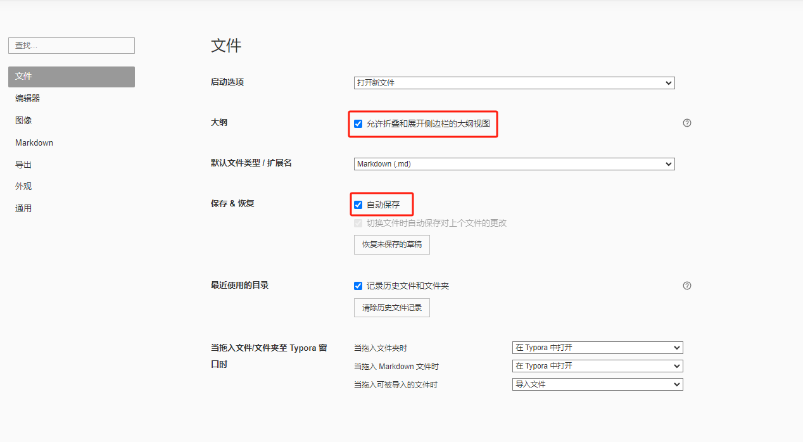
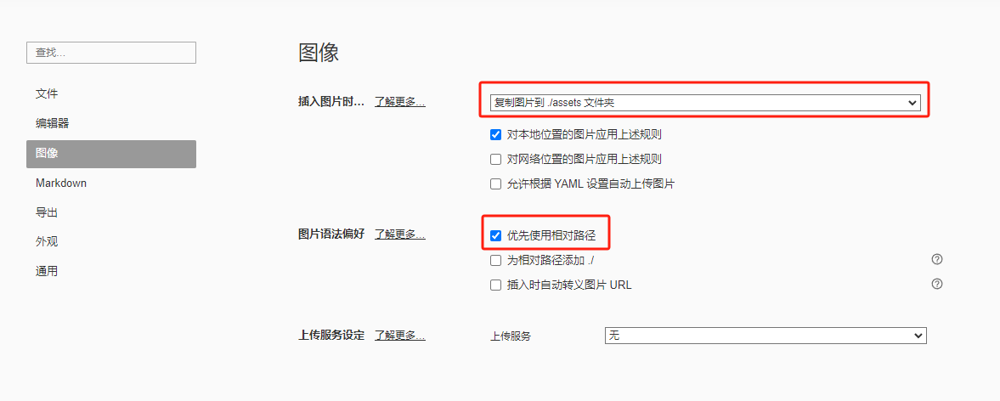
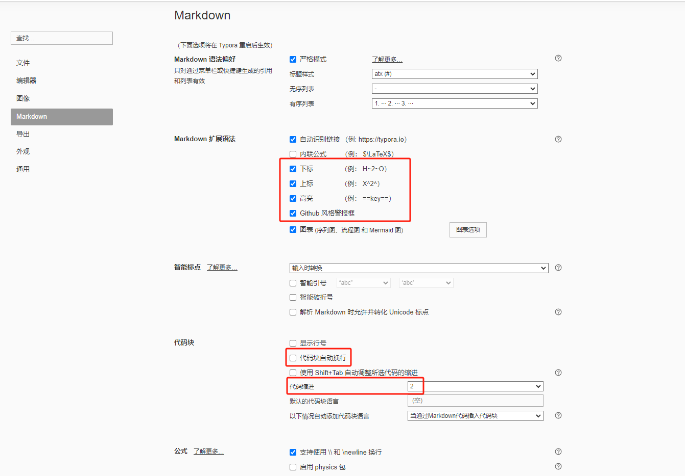
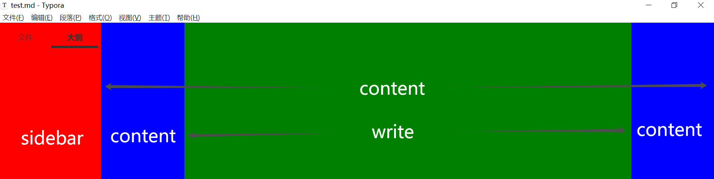

# MD Basics

​	Markdown 是一种轻量级标记语言，旨在通过使用易读易写的纯文本格式，使其易于转换为 HTML 或其他格式。它最初由 John Gruber 和 Aaron Swartz 在 2004 年创建，旨在提供一种易于阅读和书写的文本格式，同时也能方便地转换为 HTML。

# Indent

- **Right indent:** `Tap`
- **Left indent:** `Shift + Tap`

# Title

- **Titles 1 - 6:** `n#...`

# List

- **Ordered List:** `n.Space`
- **Unordered List:**  `-Space`

# Code Block

- **Unformatted:** ```` + Enter`
- **Formatted:** ````Code Kind + Enter`
- **Inline:** \`Code\`

# Text

- **\<em>**    `*$TEXT*`

  *This is an example of emphasized text.*

- **\<strong>**    `**$TEXT**`

  **This is an example of strong text.**

- **\<del>**    `~~$TEXT~~`

  ~~This is an example of deleted text.~~

- **\<sup>**    `^$TEXT^`    a^2^

- **\<sub>**    `~$TEXT~`    a~2~

- **Escape Character:** `\$TEXT`

- **Link:** `[$Describe]($URL)`

- **Image:** ``

# Typora

## Config

### Server

1. Use Typora server in China whether activate or use.
2. File > Preferences > General > Use Typora server in China.
3. E-mail: 393316146@qq.com
4. Activation code: QFW7SN-VHN2CC-SU7UJ5-XJ5S3S

### Config

- File

  

- Image

  

- markdown

  

### Image

1. Unlike Office, Markdown Notes doesn't store images in note file, but rather in the folder named assets.

2. File > Preferences > Image > Set the path as shown in the following image

3. Remember to move MD file together with image folder.

   

## Theme

### Install

1. [Download theme zip file](https://theme.typoraio.cn/).
2. Unzip theme file.
3. Copy the basic folder and CSS file into Typora Theme Folder.
   1. File > Preferences > Appearence > Open Theme Folder
   2. Don't look for theme folder by yourself in the Typora installation directory. Beacause they are diffrent.
4. Restart Typora.
5. Themes > $DES THEME

### General



```css
/* ---------------------- sidebar ---------------- */
/* sidebar 区背景色 */
#typora-sidebar {
  background-color: #fff;
}
/* ---------------------- content ---------------- */
/* content 区背景色 */
content {
  background-color: #f7f8fa;
}
/* ---------------------- write ---------------- */
/* write 区背景色 */
#write {
  background-color: #fff;
}

/* write 区加宽 */
#write {
    max-width: 1500px;
  	margin: 0 auto;
  	padding: 30px;
    padding-bottom: 100px;
}
/* ---------------------- 标题 ---------------- */
/* 一级标题居中 */
h1 {
  text-align: center; 
}
/* ---------------------- 代码块 ---------------- */
/* 行内代码高亮颜色 */
code {
  // color: #f50059;
}

/* 代码块背景色 */
pre {
    background-color: #dcdcdc !important;
}
/* ---------------------- 超链接 ---------------- */
/* 超链接取消下划线 */
a:link {
    text-decoration: none !important;
}

/* 超链接颜色 */
a:link {
    color: black !important;
}

/* 超链接悬停变色 */
a:hover {
    color: #4183C4 !important;
}
/* ---------------------- 图片 ---------------- */
/* 图片样式 */
#write img {
  border: 1px solid rgb(229, 229, 229);
}

/* 图片靠左 */
p .md-image:only-child{
    width: auto;
    text-align: left;
}
/* ---------------------- 其它 ---------------- */
/* 删除线颜色 */
del {
    text-decoration-color: red;
}

/* 未知代码继承 */
.md-heading code, #typora-sidebar code {
  color: inherit;
}
```

### Base

#### 自动编号

1. Typora 默认不支持标题自动编号，但官方给出了解决方案，但是不理想；
   - 1级标题有编号，通篇都是1点几
   - 大纲没有编号
   - 大纲有编号的方案需要禁止大纲自动折叠
2. [GitHub 网友给出了解决方案](https://github.com/lipengzhou/typora-theme-auto-numbering)
   - 1级标题没有编号，第几章可以手动填写
   - 大纲和正文都有自动编号，而且支持删除某个编号，其余编号自动更正
   - 不需要禁止大纲自动折叠
   - 导出至PDF时，保留编号

#### base.user.css

##### Install

1. Download `base.user.css` from GitHub or Baidu Netdisk.

2. Copy `base.user.css`  into Typora Theme Folder

   1. File > Preferences > Appearence > Open Theme Folder

3. Restart Typora.

4. It will apply to all the themes. So don't modify colors in this file.

   ```css
   /**
    * author: LPZ
    * email: lpzmail@163.com
    */
   
   /* 这是标题样式1修改版 */
   
   h1, h2, h3, h4, strong {
     font-weight: 600;
   }
   
   /* 添加自动序号样式 */
   #write {
     counter-reset: h2;
   }
   
   h1 {
     counter-reset: h2;
   }
   
   h2 {
     counter-reset: h3;
   }
   
   h3 {
     counter-reset: h4;
   }
   
   h4 {
     counter-reset: h5;
   }
   
   h5 {
     counter-reset: h6;
   }
   
   #write h2:before {
     counter-increment: h2;
     content: counter(h2) ". ";
   }
   
   #write h3:before,
   h3.md-focus.md-heading:before { /** override the default style for focused headings */
     counter-increment: h3;
     content: counter(h2) "."counter(h3) ". ";
   }
   
   #write h4:before,
   h4.md-focus.md-heading:before {
     counter-increment: h4;
     content: counter(h2) "."counter(h3) "."counter(h4) ". ";
   }
   
   #write h5:before,
   h5.md-focus.md-heading:before {
     counter-increment: h5;
     content: counter(h2) "."counter(h3) "."counter(h4) "."counter(h5) ". "
   }
   
   #write h6:before,
   h6.md-focus.md-heading:before {
     counter-increment: h6;
     content: counter(h2) "."counter(h3) "."counter(h4) "."counter(h5) "."counter(h6) ". "
   }
   
   /** override the default style for focused headings */
   #write>h3.md-focus:before,
   #write>h4.md-focus:before,
   #write>h5.md-focus:before,
   #write>h6.md-focus:before,
   h3.md-focus:before,
   h4.md-focus:before,
   h5.md-focus:before,
   h6.md-focus:before {
     color: inherit;
     border: inherit;
     border-radius: inherit;
     position: inherit;
     left: initial;
     float: none;
     top: initial;
     font-size: inherit;
     padding-left: inherit;
     padding-right: inherit;
     vertical-align: inherit;
     font-weight: inherit;
     line-height: inherit;
   }
   
   /* 自定义强制换号符，使得在导出PDF 或打印时强制换行 */
   @media print {
   
     /* 这是自定义标签, 在需要换行的地方插入：<pb> */
     pb {
       display: block;
       page-break-after: always;
     }
   
     h1 {
       page-break-before: always;
     }
   
     h1:first-of-type {
       page-break-before: avoid;
     }
   }
   
   /* 完成的 Task 添加删除线 */
   .task-list-done {
     text-decoration: line-through;
     color: #777;
   }
   
   .task-list-not-done {}
   
   /* 添加键盘样式 */
   kbd {
     box-shadow: inset 0 -2px 0 #c6cbd1;
     background-color: white;
   }
   
   /* TOC 中隐藏 H1 和 H6 */
   .md-toc-h1, .md-toc-h6 {
     display: none;
   }
   
   /* 添加 TOC 自动序号样式 */
   .md-toc-content {
     counter-reset: toc-h2;
   }
   
   .md-toc-h1 {
     counter-reset: toc-h2;
   }
   
   .md-toc-h2 {
     counter-reset: toc-h3;
   }
   
   .md-toc-h3 {
     counter-reset: toc-h4;
   }
   
   .md-toc-h4 {
     counter-reset: toc-h5;
   }
   
   .md-toc-h5 {
     counter-reset: toc-h6;
   }
   
   .md-toc-content .md-toc-h2 a:before {
     counter-increment: toc-h2;
     content: counter(toc-h2) ". ";
   }
   
   .md-toc-content .md-toc-h3 a:before {
     counter-increment: toc-h3;
     content: counter(toc-h2) "."counter(toc-h3) ". ";
   }
   
   .md-toc-content .md-toc-h4 a:before {
     counter-increment: toc-h4;
     content: counter(toc-h2) "."counter(toc-h3) "."counter(toc-h4) ". ";
   }
   
   .md-toc-content .md-toc-h5 a:before {
     counter-increment: toc-h5;
     content: counter(toc-h2) "."counter(toc-h3) "."counter(toc-h4) "."counter(toc-h5) ". ";
   }
   
   .md-toc-content .md-toc-h6 a:before {
     counter-increment: toc-h6;
     content: counter(toc-h2) "."counter(toc-h3) "."counter(toc-h4) "."counter(toc-h5) "."counter(toc-h6) ". ";
   }
   
   /* 侧边栏自动编号 */
   .outline-content {
     counter-reset: outline-h2;
   }
   
   .outline-h1 {
     counter-reset: outline-h2;
   }
   
   .outline-h2 {
     counter-reset: outline-h3;
   }
   
   .outline-h3 {
     counter-reset: outline-h4;
   }
   
   .outline-h4 {
     counter-reset: outline-h5;
   }
   
   .outline-h5 {
     counter-reset: outline-h6;
   }
   
   .outline-content .outline-h2 .outline-label:before {
     counter-increment: outline-h2;
     content: counter(outline-h2) ". ";
   }
   
   .outline-content .outline-h3 .outline-label:before {
     counter-increment: outline-h3;
     content: counter(outline-h2) "."counter(outline-h3) ". ";
   }
   
   .outline-content .outline-h4 .outline-label:before {
     counter-increment: outline-h4;
     content: counter(outline-h2) "."counter(outline-h3) "."counter(outline-h4) ". ";
   }
   
   .outline-content .outline-h5 .outline-label:before {
     counter-increment: outline-h5;
     content: counter(outline-h2) "."counter(outline-h3) "."counter(outline-h4) "."counter(outline-h5) ". ";
   }
   
   .outline-content .outline-h6 .outline-label:before {
     counter-increment: outline-h6;
     content: counter(outline-h2) "."counter(outline-h3) "."counter(outline-h4) "."counter(outline-h5) "."counter(outline-h6) ". ";
   }
   
   
   
   /* -----------------------以下为修改区域----------------- */
   
   /* write 区加宽 */
   #write {
       max-width: 1500px;
     	margin: 0 auto;
     	padding: 30px;
       padding-bottom: 100px;
   }
   
   /* 未知代码继承 */
   .md-heading code, #typora-sidebar code {
     color: inherit;
   }
   
   /* 一级标题居中 */
   h1 {
     text-align: center; 
   }
   
   /* 图片样式 */
   #write img {
     border: 1px solid rgb(229, 229, 229);
   }
   
   /* 图片靠左 */
   p .md-image:only-child{
       width: auto;
       text-align: left;
   }
   
   /* 超链接取消下划线 */
   a:link {
       text-decoration: none !important;
       color: black !important;
   }
   ```

### Themes

#### Github

- Github.css

  ```css
  /* -----------------------以下为修改区域----------------- */
  /* sidebar 区背景色 */
  #typora-sidebar {
    background-color: #fff;
  }
  
  /* content 区背景色 */
  content {
    background-color: #f7f8fa;
  }
  
  /* write 区背景色 */
  #write {
    background-color: #fff;
  }
  
  /* 行内代码高亮颜色 */
  code {
    // color: #f50059;
  }
  
  /* 代码块背景色 */
  pre {
      background-color: #dcdcdc !important;
  }
  
  /* 超链接颜色 */
  a:link {
      color: black !important;
  }
  
  /* 超链接悬停变色 */
  a:hover {
      color: #4183C4 !important;
  }
  
  /* 删除线颜色 */
  del {
      text-decoration-color: red;
  }
  ```


#### [github-night-dimmed](https://github.com/kinoute/typora-github-night-theme/releases/tag/v0.6.2)

- github-night-dimmed.c

  ```css
  /* -----------------------以下为修改区域----------------- */
  /* 超链接颜色 */
  a:link {
      color: #b8bfc6 !important;
  }
  /* 超链接悬停变色 */
  a:hover {
      color: #4183C4 !important;
  }
  
  /* 删除线颜色 */
  del {
      text-decoration-color: red;
  }
  ```

## Edit

​	Typora supports most Markdown HTML CSS syntaxes.

- **Shortcut keys**
  - **Title:** Ctrl + $N
  - **Strong:** Ctrl + B
  - **Underline:** Ctrl + U
  - **Strike(Delete):** Alt + Shift + 5

## 表格

- Typora 中的表格功能很鸡肋，无合并功能，所以使用 HTML 的表格元素添加表格，使用 CSS 修改内容的样式。

  ```HTML
  <!-- 全文居中 -->
  <table style="text-align: center;">
    <tr>
      <!-- 该单元格占2列 -->
      <th colspan="2">表头1</th>
      <th>表头2</th>
      <th>表头3</th>
      <th>表头4</th>
    </tr>
    <tr>
      <!-- 该单元格占3行 -->
      <td rowspan="3">内容</td>
      <td>内容</td>
      <td colspan="2">内容</td>
      <td>内容</td>
    </tr>
    <tr>
      <td>内容</td>
      <td colspan="3">内容</td>
    </tr>
    <tr>
      <td>内容</td>
      <td>内容</td>
      <td>内容</td>
      <td>内容</td>
    </tr>
  </table>
  ```

## 流程图

- Typora 没有流程图功能，使用 Mermaid 语法添加流程图。

- 实际使用中只需要将代码块语言添加 mermaid 即可

  ```
  %% 定义图的方向
  graph TD
  
  	%% 定义样式类
  	classDef israeliNode fill:#3c78d8,stroke:#333,stroke-width:0px,color:#ffffff;
  	classDef islamNode fill:#5fdd27,stroke:#333,stroke-width:0px,color:#ffffff;
  	classDef judaismNode fill:#FFB900,stroke:#333,stroke-width:0px,color:#ffffff;
  	classDef christNode fill:#F7630C,stroke:#333,stroke-width:0px,color:#ffffff;
  	
  	%% 定义节点和连接线
  	A(亚当&夏娃) --> B(赛特\n第1世孙)
  	B --> C(……)
  	C --> D(挪亚\n第9世孙)
  	D --> E(……)
  	E --> F(亚伯拉罕\n第20世孙)
  	F --> G(以撒)
  	G --> H(雅各)
  	H --> I(犹大)
  	I --> J(大卫\n第33世孙\n以色列联合王国)
  	J --> K(南方犹大)
  	K --> L(……)
  	L --> M(约西亚)
  	M --> N(西底家\n末代犹大君王)
  	N --> O(……)
  	O --> P(现代以色列人)
  	
  	F --> F1(以实玛利)
  	F1 --> F2(……)
  	F2 --> F3(阿拉伯人)
  	F3 --> F4(……)
  	F4 --> F5(穆罕默德)
  	F5 --> F6(伊斯兰教)
  	
  	H --> H1(利未)
  	H1 --> H2(……)
  	H2 --> H3(摩西)
  	H3 --> H4(犹太教)
  	
  	M --> M1(约雅敬\n倒数第3代犹大君王)
  	M1 --> M2(约雅斤\n倒数第2代犹大君王)
  	M2 --> M3(……)
  	M3 --> M4(约瑟)
  	M4 --> M5(耶稣\n第75世孙)
  	M5 --> M6(基督教)
  	
  	%% 应用样式类
  	class A,B,C,D,E,F,G,H,I,J,K,L,M,N,O,P israeliNode;
  	class F1,F2,F3,F4,F5,F6 islamNode;
  	class H1,H2,H3,H4 judaismNode;
  	class M1,M2,M3,M4,M5,M6 christNode;
  ```

  

## 其它

### 标注拼音

- 在需要标注拼音的文字后面加上`<ruby>`标签，同时在`<ruby>`标签中，用`<rb>`标签包裹原文，用`<rp>`标签包裹括号，用`<rt>`标签包裹拼音。

  ```markdown
  <ruby>汉字<rp>(</rp><rt>hàn zì</rt><rp>)</rp></ruby>
  ```


### 待办事项

- 待办事项

  ```markdown
  - [ ] 任务1
  - [x] 任务2
  - [ ] 任务3
  ```

### 文字颜色

- 使用 HTML

  ```html
  ```

  
