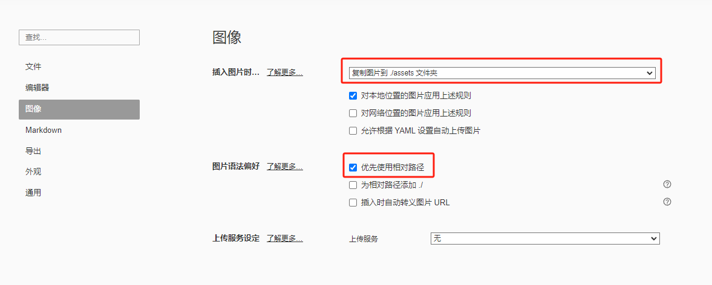
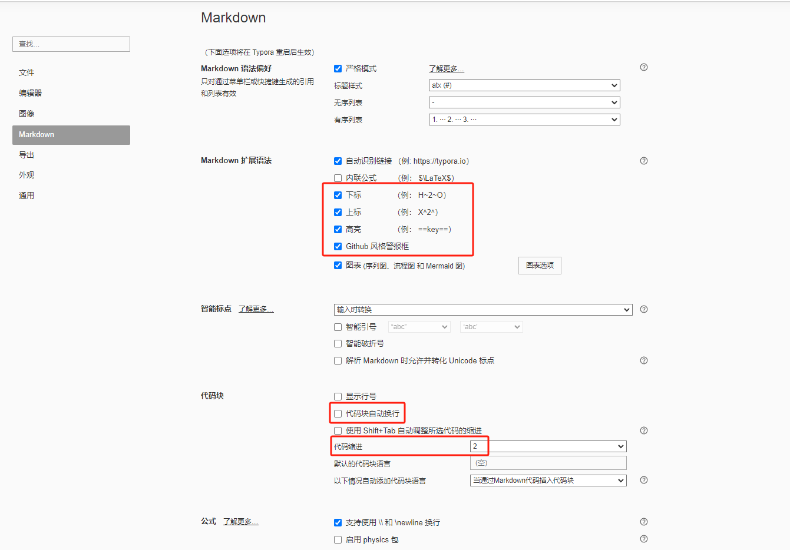

# 配置

## 服务器设置

- 无论是激活还是使用，都要使用国内服务器
- 文件 >>> 偏好设置 >>> 通用 >>> 使用国内服务器
- 注册邮箱：393316146@qq.com
- 激活码：QFW7SN-VHN2CC-SU7UJ5-XJ5S3S

## 配置

- 文件

  

- 图像

  

- markdown

  

## 图像存储配置

- 与office不同，markdown笔记不会把图片存入文档中，而是会在另一个文件夹中存储。

- 文件 >>> 偏好设置 >>> 图像 >>> 如下图设置存储路径

- 切记移动文件时一定要连同图像文件夹一起移动

  

## 标题自动编号

1. Typora默认不支持标题自动编号，但官方给出了解决方案，但是不理想；

   - 1级标题有编号，通篇都是1点几
   - 大纲没有编号
   - 大纲有编号的方案需要禁止大纲自动折叠

2. GitHub网友给出了[**解决方案**](https://github.com/lipengzhou/typora-theme-auto-numbering)
   - 1级标题没有编号，第几章可以手动填写
   - 大纲和正文都有自动编号，而且支持删除某个编号，其余编号自动更正
   - 不需要禁止大纲自动折叠
   - 导出至PDF时，保留编号
3. GitHub具体方法
  1. 从GitHub或者自己网盘下载配置文件base.user.css
  2. 将上述文件放入如下文件夹
     1. 文件 >>> 偏好设置 >>> 外观 >>> 打开主题文件夹
     2. 注意不要在Typora安装目录自己查找主题文件夹，此文件夹非上述通过面板打开的文件夹
  3. 重启Typora生效

## 安装主题

- **语法**
  1. 解压下载的主题文件
  2. 将其中的CSS文件复制到如下文件夹
     - 文件 >>> 偏好设置 >>> 外观 >>> 打开主题文件夹
  3. 重启Typora生效

# 层级控制

## 标题

1. 标题会出现在大纲内
2. **一级标题**
   - Ctrl + 1
   - \# + 空格
3. **n级标题**
   - Ctrl + n
   - n个# + 空格

## 列表

- **列表缩进**

  - 向右Tap

  - 向左Shift + Tap

- **有序列表**
  - n. + 空格

- **无序列表**
  - n. + 空格

## 代码块

- **无格式代码块**
  - \``` + 回车
- **有格式代码块**

  - \```python + 回车

- **内联代码块**

  使用反引号 `将文本包裹起来，就可以创建内联代码块。

  1. 强调特定文本，以便在渲染时以等宽字体突出显示。
     - 如`内联代码块`
  2. 避免Markdown语法冲突。
     - `__name__`会被md语法识别为加粗__name__，最后省略掉`__`
     - 避免Markdown语法冲突的另一种方法是在文本前加转义字符反斜杠`\`

# 其它

## 标注拼音

- 在需要标注拼音的文字后面加上`<ruby>`标签，同时在`<ruby>`标签中，用`<rb>`标签包裹原文，用`<rp>`标签包裹括号，用`<rt>`标签包裹拼音。

  ```markdown
  <ruby>汉字<rp>(</rp><rt>hàn zì</rt><rp>)</rp></ruby>
  ```

  

