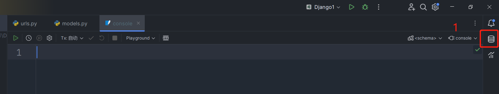
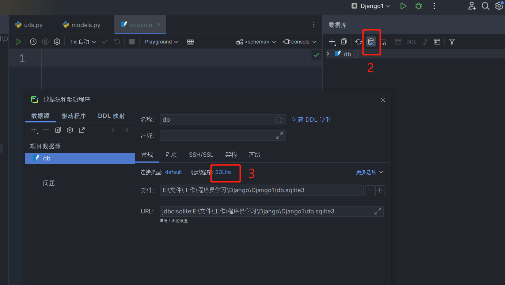
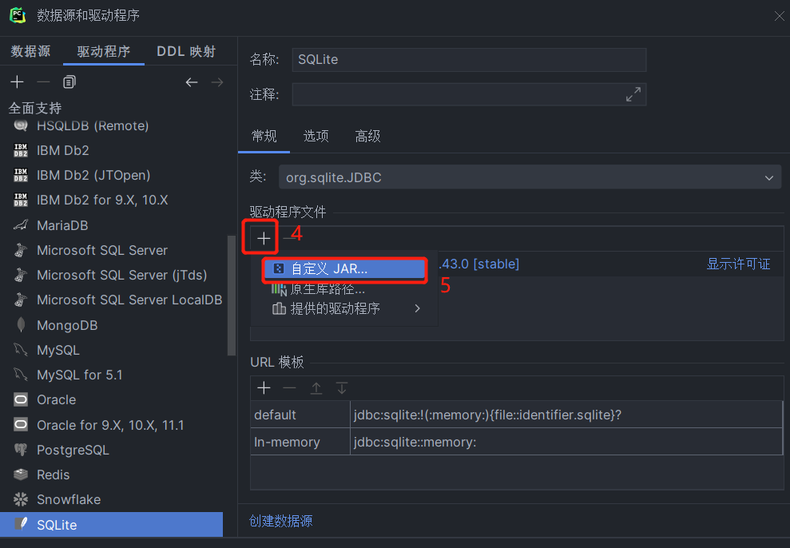
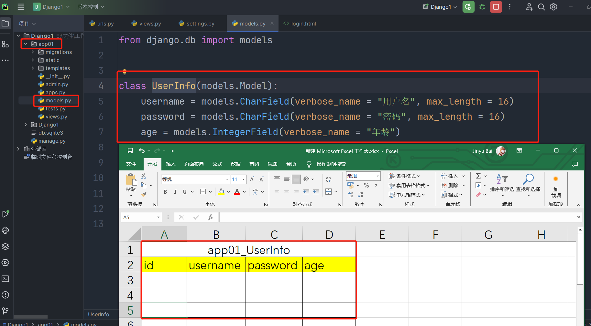

- 参考

```
- 我要自学网：燎原《Python编程入门2021新版教程》
- B站：银角大王-武沛齐《精品 Python全套教程》
```

# Python 基础

## 环境搭建

1. 以 Python3.9.2 为例

2. 双击解压包 python-3.9.2-amd64 运行

3. 勾选 `Add Python 3.9 to PATH`

  

4. 安装成功，点击Close

  

## 配置

- 关于安装目录

  - Lib：存放模块
  
  - site-packages：存放第三方模块
  
- 帮助

  ```
  - python 已加入环境变量
  - 进入 cmd
  ```

  - **列出模块中的函数**

  ```python
  > python
  > import urllib
  > dir(urllib)
  ```

  - **查看完整的python内置函数清单**

  ```python
  > dir(__builtins__)
  ```

  - **查看某个函数的文档帮助信息**

  ```python
  > help(sum)
  ```

## Pip

​	Pip 是 Python 的包管理工具

- **常用命令**

  ```bash
  # 查看 pip 版本
  pip --version
  # 升级 pip
  python -m pip install --upgrade pip
  
  # 查看 pip 下载源
  pip config get global.index-url
  # 设置 pip 下载源
  pip config set global.index-url https://pypi.tuna.tsinghua.edu.cn/simple/
  
  # 查看已经安装的第三方模块
  pip list
  # 安装模块（选项为指定下载源）
  pip install [-i https://pypi.tuna.tsinghua.edu.cn/simple] $MODULE_NAME
  # 卸载第三方模块
  pip uninstall $MODULE_NAME
  # 显示模块信息
  pip show $MODULE_NAME
  ```

## 编辑器

### IDLE

- IDLE（Integrated Development and Learning Environment，集成开发和学习环境），是一款 Python 自带的 IDE，稳定但界面不好；
- 打开 IDME，新建文件，新窗口编写代码，原窗口运行代码；

- 保存代码为文件，文件后缀名 `.py`，注意先保存后执行；

- 光标在“编写代码”窗口，按 `F5` 运行代码，“运行代码”窗口有显示运行结果。

### Pycharm

​	PyCharm 是由 JetBrains 开发的一款 Python IDE。它提供了丰富的功能和工具，包括代码编辑器、调试器、版本控制工具、代码分析、自动完成、重构、单元测试等，以帮助开发者提高 Python 开发的效率和质量。

​	PyCharm 有商业版和社区版两个版本。

#### 安装

1. [官网下载社区免费版 PyCharm Community Edition](https://www.jetbrains.com/pycharm/download/?section=windows)

2. 勾选如图 2 项

3. 继续安装直到 Finish

  


####  破解

1. [官网下载商业版 Pycharm Professional](https://www.jetbrains.com/pycharm/download/?section=windows)；

2. 默认安装，安装完成后不要立即运行；

3. 以下破解方法来源于[《小墨の博客》](https://www.only4.work/blog/?id=473)；

4. 博客地址或百度网盘下载并解压激活工具“【请解压】JetBrains 2023.1 永久激活插件”；

5. 为了避免路径问题，请将解压后的文件夹到本地一个没有中文以及特殊符号的路径下，且配置后不能移动和删除；

  

6. jetbra > scripts > 双击运行 install-all-users.vbs 脚本 > 出现 done 弹框，说明成功；

7. 由于存在环境变量配置，插件安装之后，需要重启电脑才会生效。

8. 重启后，在博客内获取激活码；

9. 最后一次获取到的是：

  ```
  # Pycharm
  EUWT4EE9X2-eyJsaWNlbnNlSWQiOiJFVVdUNEVFOVgyIiwibGljZW5zZWVOYW1lIjoic2lnbnVwIHNjb290ZXIiLCJhc3NpZ25lZU5hbWUiOiIiLCJhc3NpZ25lZUVtYWlsIjoiIiwibGljZW5zZVJlc3RyaWN0aW9uIjoiIiwiY2hlY2tDb25jdXJyZW50VXNlIjpmYWxzZSwicHJvZHVjdHMiOlt7ImNvZGUiOiJQU0kiLCJmYWxsYmFja0RhdGUiOiIyMDI1LTA4LTAxIiwicGFpZFVwVG8iOiIyMDI1LTA4LTAxIiwiZXh0ZW5kZWQiOnRydWV9LHsiY29kZSI6IlBDIiwiZmFsbGJhY2tEYXRlIjoiMjAyNS0wOC0wMSIsInBhaWRVcFRvIjoiMjAyNS0wOC0wMSIsImV4dGVuZGVkIjpmYWxzZX0seyJjb2RlIjoiUFBDIiwiZmFsbGJhY2tEYXRlIjoiMjAyNS0wOC0wMSIsInBhaWRVcFRvIjoiMjAyNS0wOC0wMSIsImV4dGVuZGVkIjp0cnVlfSx7ImNvZGUiOiJQV1MiLCJmYWxsYmFja0RhdGUiOiIyMDI1LTA4LTAxIiwicGFpZFVwVG8iOiIyMDI1LTA4LTAxIiwiZXh0ZW5kZWQiOnRydWV9LHsiY29kZSI6IlBDV01QIiwiZmFsbGJhY2tEYXRlIjoiMjAyNS0wOC0wMSIsInBhaWRVcFRvIjoiMjAyNS0wOC0wMSIsImV4dGVuZGVkIjp0cnVlfV0sIm1ldGFkYXRhIjoiMDEyMDIyMDkwMlBTQU4wMDAwMDUiLCJoYXNoIjoiVFJJQUw6MzUzOTQ0NTE3IiwiZ3JhY2VQZXJpb2REYXlzIjo3LCJhdXRvUHJvbG9uZ2F0ZWQiOmZhbHNlLCJpc0F1dG9Qcm9sb25nYXRlZCI6ZmFsc2V9-FT9l1nyyF9EyNmlelrLP9rGtugZ6sEs3CkYIKqGgSi608LIamge623nLLjI8f6O4EdbCfjJcPXLxklUe1O/5ASO3JnbPFUBYUEebCWZPgPfIdjw7hfA1PsGUdw1SBvh4BEWCMVVJWVtc9ktE+gQ8ldugYjXs0s34xaWjjfolJn2V4f4lnnCv0pikF7Ig/Bsyd/8bsySBJ54Uy9dkEsBUFJzqYSfR7Z/xsrACGFgq96ZsifnAnnOvfGbRX8Q8IIu0zDbNh7smxOwrz2odmL72UaU51A5YaOcPSXRM9uyqCnSp/ENLzkQa/B9RNO+VA7kCsj3MlJWJp5Sotn5spyV+gA==-MIIETDCCAjSgAwIBAgIBDTANBgkqhkiG9w0BAQsFADAYMRYwFAYDVQQDDA1KZXRQcm9maWxlIENBMB4XDTIwMTAxOTA5MDU1M1oXDTIyMTAyMTA5MDU1M1owHzEdMBsGA1UEAwwUcHJvZDJ5LWZyb20tMjAyMDEwMTkwggEiMA0GCSqGSIb3DQEBAQUAA4IBDwAwggEKAoIBAQCUlaUFc1wf+CfY9wzFWEL2euKQ5nswqb57V8QZG7d7RoR6rwYUIXseTOAFq210oMEe++LCjzKDuqwDfsyhgDNTgZBPAaC4vUU2oy+XR+Fq8nBixWIsH668HeOnRK6RRhsr0rJzRB95aZ3EAPzBuQ2qPaNGm17pAX0Rd6MPRgjp75IWwI9eA6aMEdPQEVN7uyOtM5zSsjoj79Lbu1fjShOnQZuJcsV8tqnayeFkNzv2LTOlofU/Tbx502Ro073gGjoeRzNvrynAP03pL486P3KCAyiNPhDs2z8/COMrxRlZW5mfzo0xsK0dQGNH3UoG/9RVwHG4eS8LFpMTR9oetHZBAgMBAAGjgZkwgZYwCQYDVR0TBAIwADAdBgNVHQ4EFgQUJNoRIpb1hUHAk0foMSNM9MCEAv8wSAYDVR0jBEEwP4AUo562SGdCEjZBvW3gubSgUouX8bOhHKQaMBgxFjAUBgNVBAMMDUpldFByb2ZpbGUgQ0GCCQDSbLGDsoN54TATBgNVHSUEDDAKBggrBgEFBQcDATALBgNVHQ8EBAMCBaAwDQYJKoZIhvcNAQELBQADggIBABqRoNGxAQct9dQUFK8xqhiZaYPd30TlmCmSAaGJ0eBpvkVeqA2jGYhAQRqFiAlFC63JKvWvRZO1iRuWCEfUMkdqQ9VQPXziE/BlsOIgrL6RlJfuFcEZ8TK3syIfIGQZNCxYhLLUuet2HE6LJYPQ5c0jH4kDooRpcVZ4rBxNwddpctUO2te9UU5/FjhioZQsPvd92qOTsV+8Cyl2fvNhNKD1Uu9ff5AkVIQn4JU23ozdB/R5oUlebwaTE6WZNBs+TA/qPj+5/we9NH71WRB0hqUoLI2AKKyiPw++FtN4Su1vsdDlrAzDj9ILjpjJKA1ImuVcG329/WTYIKysZ1CWK3zATg9BeCUPAV1pQy8ToXOq+RSYen6winZ2OO93eyHv2Iw5kbn1dqfBw1BuTE29V2FJKicJSu8iEOpfoafwJISXmz1wnnWL3V/0NxTulfWsXugOoLfv0ZIBP1xH9kmf22jjQ2JiHhQZP7ZDsreRrOeIQ/c4yR8IQvMLfC0WKQqrHu5ZzXTH4NO3CwGWSlTY74kE91zXB5mwWAx1jig+UXYc2w4RkVhy0//lOmVya/PEepuuTTI4+UJwC7qbVlh5zfhj8oTNUXgN0AOc+Q0/WFPl1aw5VV/VrO8FCoB15lFVlpKaQ1Yh+DVU8ke+rt9Th0BCHXe0uZOEmH0nOnH/0onD
  
  # IDEA
  6G5NXCPJZB-eyJsaWNlbnNlSWQiOiI2RzVOWENQSlpCIiwibGljZW5zZWVOYW1lIjoic2lnbnVwIHNjb290ZXIiLCJhc3NpZ25lZU5hbWUiOiIiLCJhc3NpZ25lZUVtYWlsIjoiIiwibGljZW5zZVJlc3RyaWN0aW9uIjoiIiwiY2hlY2tDb25jdXJyZW50VXNlIjpmYWxzZSwicHJvZHVjdHMiOlt7ImNvZGUiOiJQU0kiLCJmYWxsYmFja0RhdGUiOiIyMDI1LTA4LTAxIiwicGFpZFVwVG8iOiIyMDI1LTA4LTAxIiwiZXh0ZW5kZWQiOnRydWV9LHsiY29kZSI6IlBEQiIsImZhbGxiYWNrRGF0ZSI6IjIwMjUtMDgtMDEiLCJwYWlkVXBUbyI6IjIwMjUtMDgtMDEiLCJleHRlbmRlZCI6dHJ1ZX0seyJjb2RlIjoiSUkiLCJmYWxsYmFja0RhdGUiOiIyMDI1LTA4LTAxIiwicGFpZFVwVG8iOiIyMDI1LTA4LTAxIiwiZXh0ZW5kZWQiOmZhbHNlfSx7ImNvZGUiOiJQUEMiLCJmYWxsYmFja0RhdGUiOiIyMDI1LTA4LTAxIiwicGFpZFVwVG8iOiIyMDI1LTA4LTAxIiwiZXh0ZW5kZWQiOnRydWV9LHsiY29kZSI6IlBHTyIsImZhbGxiYWNrRGF0ZSI6IjIwMjUtMDgtMDEiLCJwYWlkVXBUbyI6IjIwMjUtMDgtMDEiLCJleHRlbmRlZCI6dHJ1ZX0seyJjb2RlIjoiUFNXIiwiZmFsbGJhY2tEYXRlIjoiMjAyNS0wOC0wMSIsInBhaWRVcFRvIjoiMjAyNS0wOC0wMSIsImV4dGVuZGVkIjp0cnVlfSx7ImNvZGUiOiJQV1MiLCJmYWxsYmFja0RhdGUiOiIyMDI1LTA4LTAxIiwicGFpZFVwVG8iOiIyMDI1LTA4LTAxIiwiZXh0ZW5kZWQiOnRydWV9LHsiY29kZSI6IlBQUyIsImZhbGxiYWNrRGF0ZSI6IjIwMjUtMDgtMDEiLCJwYWlkVXBUbyI6IjIwMjUtMDgtMDEiLCJleHRlbmRlZCI6dHJ1ZX0seyJjb2RlIjoiUFJCIiwiZmFsbGJhY2tEYXRlIjoiMjAyNS0wOC0wMSIsInBhaWRVcFRvIjoiMjAyNS0wOC0wMSIsImV4dGVuZGVkIjp0cnVlfSx7ImNvZGUiOiJQQ1dNUCIsImZhbGxiYWNrRGF0ZSI6IjIwMjUtMDgtMDEiLCJwYWlkVXBUbyI6IjIwMjUtMDgtMDEiLCJleHRlbmRlZCI6dHJ1ZX1dLCJtZXRhZGF0YSI6IjAxMjAyMjA5MDJQU0FOMDAwMDA1IiwiaGFzaCI6IlRSSUFMOi0xMDc4MzkwNTY4IiwiZ3JhY2VQZXJpb2REYXlzIjo3LCJhdXRvUHJvbG9uZ2F0ZWQiOmZhbHNlLCJpc0F1dG9Qcm9sb25nYXRlZCI6ZmFsc2V9-SnRVlQQR1/9nxZ2AXsQ0seYwU5OjaiUMXrnQIIdNRvykzqQ0Q+vjXlmO7iAUwhwlsyfoMrLuvmLYwoD7fV8Mpz9Gs2gsTR8DfSHuAdvZlFENlIuFoIqyO8BneM9paD0yLxiqxy/WWuOqW6c1v9ubbfdT6z9UnzSUjPKlsjXfq9J2gcDALrv9E0RPTOZqKfnsg7PF0wNQ0/d00dy1k3zI+zJyTRpDxkCaGgijlY/LZ/wqd/kRfcbQuRzdJ/JXa3nj26rACqykKXaBH5thuvkTyySOpZwZMJVJyW7B7ro/hkFCljZug3K+bTw5VwySzJtDcQ9tDYuu0zSAeXrcv2qrOg==-MIIETDCCAjSgAwIBAgIBDTANBgkqhkiG9w0BAQsFADAYMRYwFAYDVQQDDA1KZXRQcm9maWxlIENBMB4XDTIwMTAxOTA5MDU1M1oXDTIyMTAyMTA5MDU1M1owHzEdMBsGA1UEAwwUcHJvZDJ5LWZyb20tMjAyMDEwMTkwggEiMA0GCSqGSIb3DQEBAQUAA4IBDwAwggEKAoIBAQCUlaUFc1wf+CfY9wzFWEL2euKQ5nswqb57V8QZG7d7RoR6rwYUIXseTOAFq210oMEe++LCjzKDuqwDfsyhgDNTgZBPAaC4vUU2oy+XR+Fq8nBixWIsH668HeOnRK6RRhsr0rJzRB95aZ3EAPzBuQ2qPaNGm17pAX0Rd6MPRgjp75IWwI9eA6aMEdPQEVN7uyOtM5zSsjoj79Lbu1fjShOnQZuJcsV8tqnayeFkNzv2LTOlofU/Tbx502Ro073gGjoeRzNvrynAP03pL486P3KCAyiNPhDs2z8/COMrxRlZW5mfzo0xsK0dQGNH3UoG/9RVwHG4eS8LFpMTR9oetHZBAgMBAAGjgZkwgZYwCQYDVR0TBAIwADAdBgNVHQ4EFgQUJNoRIpb1hUHAk0foMSNM9MCEAv8wSAYDVR0jBEEwP4AUo562SGdCEjZBvW3gubSgUouX8bOhHKQaMBgxFjAUBgNVBAMMDUpldFByb2ZpbGUgQ0GCCQDSbLGDsoN54TATBgNVHSUEDDAKBggrBgEFBQcDATALBgNVHQ8EBAMCBaAwDQYJKoZIhvcNAQELBQADggIBABqRoNGxAQct9dQUFK8xqhiZaYPd30TlmCmSAaGJ0eBpvkVeqA2jGYhAQRqFiAlFC63JKvWvRZO1iRuWCEfUMkdqQ9VQPXziE/BlsOIgrL6RlJfuFcEZ8TK3syIfIGQZNCxYhLLUuet2HE6LJYPQ5c0jH4kDooRpcVZ4rBxNwddpctUO2te9UU5/FjhioZQsPvd92qOTsV+8Cyl2fvNhNKD1Uu9ff5AkVIQn4JU23ozdB/R5oUlebwaTE6WZNBs+TA/qPj+5/we9NH71WRB0hqUoLI2AKKyiPw++FtN4Su1vsdDlrAzDj9ILjpjJKA1ImuVcG329/WTYIKysZ1CWK3zATg9BeCUPAV1pQy8ToXOq+RSYen6winZ2OO93eyHv2Iw5kbn1dqfBw1BuTE29V2FJKicJSu8iEOpfoafwJISXmz1wnnWL3V/0NxTulfWsXugOoLfv0ZIBP1xH9kmf22jjQ2JiHhQZP7ZDsreRrOeIQ/c4yR8IQvMLfC0WKQqrHu5ZzXTH4NO3CwGWSlTY74kE91zXB5mwWAx1jig+UXYc2w4RkVhy0//lOmVya/PEepuuTTI4+UJwC7qbVlh5zfhj8oTNUXgN0AOc+Q0/WFPl1aw5VV/VrO8FCoB15lFVlpKaQ1Yh+DVU8ke+rt9Th0BCHXe0uZOEmH0nOnH/0onD
  ```

  

10. 此时运行PyCharm Professional，在 activation code 选项下，填入最新激活码，点击 Activate 就能完成激活了；

11. 注意激活以后，不要移动或删除激活插件文件夹；

12. 查看激活状态：Help > About

   

#### 配置

- **Shortcut Keys**

  - `Ctrl + Alt + S`: File > Settings
  
- **Autosave**

  1. `Ctrl + Alt + S` > Appearance & Behavior > System Settings > `Autosave`

- **缩进**

  1. Main menu > Settings > Editor > Code Style > Python
  2. Set `Tab size` `Indent` `Continuation indent` as "2"

- **设置鼠标滚轮**

  Main menu > Settings > Editor > General > `Mouse Control` 选项：Change font size with Ctrl + Mouse Wheel 打上对勾，All editors 打勾

- **设置代码字体大小**

  1. Main menu > Settings > Editor > Font

  2. Size = 24，Line Height = 1.2

  3. 如果设置不生效，Main menu > Settings > Editor > Color Scheme > Color Scheme Font

    取消勾选  `Use color scheme font instead of the default`

- **汉化**

  Main menu > Settings > Plugins，搜索“Chinese”，Install 安装汉化包。软件重启即汉化版

- **代码格式化**

  1. Main menu > Settings > Editor > Code Style > Python > `Space` 选项卡
  2. “在命名形参中的 = 周围”和“在关键字实参中的 = 周围”两项打勾，保存。
  3. 编辑完代码按 `Ctrl + Shift + L`，可实现自动更正空格格式。注意注释部分不会被更正

- **安装主题**

  主菜单 > 设置 > 外观与行为 > 外观 > 获取更多主题

- **创建文件**

  1. 项目路径右键 > New > Python Fire > 给文件命名> 回车；
  2. 编写代码，自动保存；
  3. 运行：（1、项目栏，2、右键，3、快捷键）快捷键：`Ctrl + Shift + F10`。

- **同一项目添加多个文件夹**

  1. Settings > Project > Project Structure >
  2. 右侧Add Content Root > 选择要添加的文件夹 > OK

- **将Terminal默认项切换至cmd**

  1. Terminal可以模拟cmd
  2. Settings > Tools > Terminal > Shell path下拉菜单，切换至cmd

- **无法调用第三方模块**

  1. Settings > Project：当前文件名 > Python Interpreter > 右侧Add Interpreter > Existing > 右侧… > 
  2. 找到python.exe/将python.exe拖入窗口 > OK


#### 创建项目

- 项目环境

  - Previously configured interpreter：已存在环境，使用全局的 Python 解释器，正常无法使用虚拟环境的依赖。
  - Viutualenv：虚拟环境，与全局环境隔离，不影响全局，可以使用全局环境依赖。

  

### Sublime

- **Sublime简介**

  ​	Sublime- Text 是一个用 C++ 和 Python 开发的跨平台文本编辑器。除了 Python 之外，它还提供对其他语言的支持。Sublime 有自己的包管理器，开发者可以用来安装组件，插件和额外样式。与 PyCharm、VS Code 不同，Sublime Text 并没有集成开发环境，而是作为一个纯粹的编辑器，提供了快速、便捷的编辑功能。
  ​	特点：第三方，轻量化，界面好，支持常见所有语言。

- **Sublime的安装**

  - 默认所有选项安装 Sublime

  - Sublime 原生环境不支持 input 语句的执行，所以要安装 SublimeREPL 插件。

- **SublimeREPL插件的安装**

  - Ctrl+shift+P 打开命令面板，输入 install，选择 Package Control：Install Package
  	

  ```
  - 程序包控件，安装程序包，需要等待一下，看左下角有“=”左右动；
  - 注意，如果没有这个选项，需要先安装 Package Control，点击 Install Package Control，等待安装，提示安装成功后再重新按 Ctrl+shift+P选择Package Control：Install Package；
  ```

  - 过一会“=”消失，弹出窗口，搜索 SublimeREPL，点击下载；

  - 安装成功后，在 Tools 选项里出现 SublimeREPL，表明安装成功；

  - 设置快捷键


  ```
  - 首先点击首选项 preference
  - 其次打开快捷键设置 key bindings
  - 在两个中括号之间那行，粘贴输入下面代码
  - 关闭快捷键设置页面，关闭 Sublime 软件，重新打开即可
  ```

  ``` json
  {"keys": ["f5"],
  "caption": "SublimeREPL: Python - RUN current file",
  "command": "run_existing_window_command",
  "args": {
  "id": "repl_python_run",
  "file": "config/Python/Main.sublime-menu"}}
  ```

  - 关闭快捷键设置页面，关闭 Sublime 软件，重新打开即可。

  - 需要注意，input 语句在 Sublime 中执行，需要按快捷键 F5，并且新跳出一个窗口显示。

  - 卸载 SublimeREPL 插件

  - Ctrl+shift+p，输入框中输入“remove package”；

  - 下面会有提示，直接点击或者输入后回车。

- **创建文件**
  - 右下角单击选择“Python”；
  
  - 编写代码，保存：文件名.py；
  
  - 运行：Ctrl+B（第一次选择“Python”）。
  

## 代码规范

- 除以下规范，其余同编程语言通用规范。

- **缩进**：敏感

  python最具特色的就是使用缩进来表示代码块，不需要使用大括号 **{}** 。

  缩进的空格数是可变的，但是同一个代码块的语句必须包含相同的缩进空格数。

- **分号**：每行代码结束不使用分号

## 标识符

- 除以下规范，其余同编程语言通用规范。

- **规范**

  - 只能含有字母、数字、下划线，且不能以数字或下划线开头

  - **区别常规**：不含$，不以下划线开头

- **命名习惯**
  
    - **变量名**：使用小写英文单词，多个单词时，用下划线间隔
    
	  在 Python 3 中，可以用中文作为变量名，非 ASCII 标识符也是允许的了
	
	- **全局变量**：全大写
	
	- **文件名**：不使用数字开头，不使用殊符号和关键字，后缀名为 `.py`

## 注释

- **单行注释**：Ctrl + /    **多行注释**

  ``` python
  # 这是一个单行注释
  a = 5
  b = 6
  print(a + b)
  '''
  多行注释第一行
  多行注释第二行
  多行注释第三行
  '''
  ```


## 变量

- Python 无需使用关键字声明变量

## 输入与输出

- **input() 输入**

  ```
  input 的返回结果为字符串
  ```

  ```python
  uname = input("请输入用户名")  # 提示并输入
  print("你的用户名：" + uname)  # 返回结果
  ```

  ```python
  input("按回车继续")  # 程序停顿，按回车继续
  ```

- **print() 输出**

  ```
  - 如果输出内容为字符串，加双/单引号。
  - a 可以是拼接数据
  - print("内容", end = "")：多行print显示结果不换行
  ```

  ```python
  print("a")  # a
  ```

## 运算符

- Python 中没有 `++` 和 `--`


## 其它基础

- **pass**

  什么都不执行，补充代码完整性。

- Python 中二、八、十六进制之间不能直接转换，需通过十进制

# 数据类型

## 数据类型

- Python 常见数据类型有 `整型 int`、`浮点型 float`、`字符串 str`、`布尔型 bool`、`空值 None`、`列表 list`、`字典 dict`、`集合 set`
- **容器**：在程序里，可以将多个数据通过容器保存在一个变量中，如列表、元组、字典和集合。

## 布尔型 bool

- Python 中 bool 型值 True 和 False 首字母大写。

## 字符串 str

- Python 中字符串作为值，原变量的值不支持修改，处理之后的值可作为新值赋给新的变量，详见数据类型的特殊说明；

- 特性：只可存放普通字符；元素可重复；有序索引（下标）；可切片；元素不支持修改；


- **常用功能**

  ```python
  # 其它公共功能：...
  
  list_a = ["中国", ["上海", "北京", "深圳"], 123]
  str_a = " ad min.123 "
  
  len(str_a)  # 获取长度
  
  str_a[0]  # 索引
  
  list_a[0][1]  # 多级索引
  
  str_a[0:6:2]  # 切片
  
  if "中国" in str_a:  # in 包含
    pass
  
  str_a.replace("a", "A")  # 替换
  
  str_a.split(".", 1)  # 切割
  
  str_a.strip()  # 去除空格/换行
  
  str_a.upper()  # 转大写
  
  str_a.startswith("a")  # 判断开头
  
  str_a.isdecimal()  # 判断数字
  ```

### 获取长度

- `len($STR)`

  ``` python
  len_a = len("中国江西联通")
  print(len_a)  # 6
  print(type len_a)  # <class 'int'>
  ```


### 索引

- **索引**：支持索引的数据类型每个元素都有一个索引号（下标），正序从0开始，逆序从-1开始。

- 一级索引

  `$STR/CONTAINER[$INDEX]`

  ``` python
  #       0 1 2 3 4 5，正向索引号
  #      -6-5-4-3-2-1，逆向索引号
  str_a = "中国江西联通"
  print(str_a[0])  # 中
  print(str_a[-6])  # 中
  print(type(str_a[0]))  # <class 'str'>
  ```

- 多级索引

  `$STR/CONTAINER[$INDEX][$INDEX]...`

  ``` python
  list_a = ["中国", ["上海", "北京", "深圳"], 123]
  data1 = list_a[1][0]
  data2 = list_a[1][0][0]
  print(data1)  # 上海
  print(data2)  # 上
  ```

- 实际示例

  ``` python
  str_a = "中国江西联通"
  index = 0  # index为索引号
  while index < len(str_a):
    data = str_a[index]
    print(data)
    index += 1
  # 依次打印“中国江西联通”
  ```

### 切片

- **切片**：切片是为了截取某一部分元素

  - 索引号左闭右开

  - 原字符串不受影响

  - 返回新字符串

- `$STR[$INDEX_START:$INDEX_END:$STEP_VALUE]`

  ``` python
  #      0 1 2 3 4 5，正向索引号
  str_a = "中国江西联通"
  print(str_a[2:4])  # 江西
  print(str_a[0:6:2])  # 中江联
  print(str_a[2:])  # 江西联通
  print(str_a[:4])  # 中国江西
  ```

### 遍历

详见 for 循环

### in 包含

- `$ELEMENT in $STR`

  ``` python
  str_a = "中国联通"
  res = "中国" in str_a
  print(res)  # True
  
  # use
  if "中国" in str_a:
  	pass
  ```

### 替换

- `$STR.replace("$ELEMENT_OLD", "$ELEMENT_NEW")`

  ``` python
  str_a = " 中国 联通 联通 "
  res = str_a.replace("联通", "移动")
  print(res)  # " 中国 移动 移动 "
  ```

### 去空格换行符

- 去除字符串开头和结尾的空格以及结尾的换行符，不能去除中间的空格

  - 去除中间空格应使用 `str_a.replace(" ", "")`，将空格替换成空白

- `$STR.strip()` `$STR.lstrip()` `$STR.rstrip()`

  ```python
  str_a = " 中国 联通 "
  
  res1 = str_a.strip()  # 去除开头和接尾空格
  print(res1)  # "中国 联通"
  
  res2 = str_a.lstrip()  # 去除开头空格
  print(res2)  # "中国 联通 "
  
  res3 = str_a.rstrip()  # 去除接尾空格
  print(res3)  # " 中国 联通"
  ```

  ```python
  str_a = "中国联通\n"
  print(str_a)  # 中国联通（后面有换行）
  
  res4 = str_a.strip()
  print(res4)  # 中国联通（后面没有换行）
  ```

### 切割

- `$STR.split("$SEPARATOR", [$MAX_SPLIT])`

  ``` python
  # 切割后会得到一个列表
  
  str_a = "马化腾,40,XXXX@qq.com"
  res1 = str_a.split(",")  # 把所有序列都切割，分别放入子字符串，逗号是切割标识依据
  res2 = str_a.split(".")  # "."为切割标识
  res3 = str_a.split(",", 1)  # 从左到右，保留几个单独子字符串，剩余放进另一个子字符串
  res4 = str_a.rsplit(",", 1)  # 从右到左，保留几个单独元素，剩余放进另一个子字符串
  
  print(res1)  # ['马化腾', '40', 'XXXX@qq.com']
  print(res1[1])  # 40  # 拿到单独一个元素
  print(res2)  # ['马化腾,40,XXXX@qq', 'com']
  print(res3)  # ['马化腾', '40,XXXX@qq.com']
  print(res4)  # ['马化腾,40', 'XXXX@qq.com']
  ```

### 转大小写

- `$STR.upper()` `$STR.lower()`

  ``` python
  str_a = "abc"
  res = str_a.upper()
  print(res)  # ABC
  ```


### 判断起始

- `$STR.startswith()`

  ``` python
  str_a = "中国联通"
  res = str_a.startswith("中国")
  print(res)  # True
  ```

### 判断数字

- `$STR.isdecimal()`

  ``` python
  str_a = "中国联通"
  res = str_a.isdecimal()
  print(res)  # False
  ```

## 列表 list

- Python 中字符串也是一种特殊的列表

- 特性：可存放多种数据类型；元素可重复；有序索引（下标）；可切片；元素支持修改。

- 基本示例

  ``` python
  list_a = ["中国", "上海", 123]
  print(list_a)  # ['中国', '上海', 123]
  print(type(list_a))  # <class 'list'>
  ```

- 功能

  ```python
  # 其它公共功能：获取长度；多级索引；for 循环；in 包含；嵌套
  
  list_a = ["中国", "上海", 123]
  
  list_a[0] = "北京"  # 修改
  
  list_a.append("北京")  # 追加
  
  list_a.insert(1, "北京")  # 插入
  
  list_a.remove("上海")  # 删除
  
  list_a.clear()  # 清空
  
  list_a.reverse()  # 反转
  
  sorted(list_a)  # 排序
  
  str_a = "_".join(list_a)  # join 连接
  ```

### 修改元素

- `$LIST[$INDEX] = $ELEMENT_NEW`

  ``` python
  list_a = ["中国", "上海", 123]
  list_a[0] = "北京"
  print(list_a)  # ['北京', '上海', 123]
  ```


### 追加元素

- 说明

  - 在列表末尾追加
  - Python中每次只能追加1个元素
  - 原列表受影响

- `$LIST.append($ELEMENT_NEW)`

  ``` python
  list_a = ["上海", 123]
  list_a.append("北京")
  list_a.append(456)
  print(list_a)  # ['上海', 123, '北京', 456]
  ```

### 插入元素

- `$LIST.insert($INDEX, $ELEMENT_NEW)`

  ``` python
  list_a = ["中国", "上海", 123]
  list_a.insert(1, "北京")  # 在第n序列号插入
  print(list_a)  # ['中国', '北京', '上海', 123]
  ```

### 删除元素

- `$LIST.remove($ELEMENT)`

  ``` python
  list_a = ["中国", "上海", 123]
  list_a.remove("上海")
  print(list_a)  # ['中国', 123]
  ```

- 其它方法

  ``` python
  # .pop(索引号)
  list_a = ["中国", "上海", 123]
  list_a.pop(0)
  print(list_a)  # ['上海', 123]
  
  # del 列表[索引号]
  list_a = ["中国", "上海", 123]
  del list_a[0]
  print(list_a)  # ['上海', 123]
  ```

### 清空

- `$LIST.clear()`

  ``` python
  list_a = ["中国", "上海", 123]
  list_a.clear()
  print(list_a)  # []
  ```

### 反转

- 反转列表：将列表里元素的顺序反转

  - Python 中没有 `.toReversed()` 方法
  - 原列表受影响

- `$LIST.reverse()`

  ``` python
  list_a = ["中国", "上海", 123]
  list_a.reverse()
  print(list_a)  # [123, '上海', '中国']
  ```

### 升序

- 对原列表有影响

- `sorted($LIST, [OPTION])`

  ```python
  # 升序
  lista = [21, 21, 31, 32, 33, 5454, 46, 65, 6]
  newList = sorted(lista)
  print(newList)  # [6, 21, 21, 31, 32, 33, 46, 65, 5454]
  
  # 降序
  lista = [21, 21, 31, 32, 33, 5454, 46, 65, 6]
  newList = sorted(lista, reverse = True)  # 降序，增加反转为真
  print(newList)  # [5454, 65, 46, 33, 32, 31, 21, 21, 6]
  ```

- **排序标准**：按首字的 ASCII 码转十进制的大小排序，如果首字相同，则逐一往后对比

  - 字符串与其它类型不能相互比较
  - 字符串一般规律，数字优先，其次英语，最后汉字
  - 数字按首位数字 ASCII 码转十进制的大小排序
  - 英语按字母顺序排序
      - 汉字按首字的 ASCII 码转十进制的大小排序
      - 整型/浮点型按数值大小排序

- 自定义排序标准

  ```
  - 自定义排序标准
  	sorted(列表名, key = 排序依据函数)
  ```

  ```python
  name_list = ["2.提升", "1.基础", "10.总结", "3.高阶"]
  
  # 排序依据key  key值为lambda表达式：将前面的数字转整型作为返回值
  sorted_list = sorted(name_list, key = lambda x: int(x.split(".")[0]))
  
  print(sorted_list)  # ['1.基础', '2.提升', '3.高阶', '10.总结']  否则正常排序10应在2前面
  ```

### join 连接

- **join 连接**：将一个列表中所有元素通过分隔符连接成一个字符串

- 如果不传入指定分隔符，返回结果各个元素将以 “,” 连接

- `$SEPARATOR.join($LIST)`

  ``` python
  list_a = ["张三", "李四", "王五"]
  str_a = "_".join(list_a)  # "_"为连接符，可替换，可不填
  print(str_a)  # 张三_李四_王五
  print(type(str_a))  # <class 'str'>
  ```

## 元组 tuple

- 元组 tuple 是一个有序的序列结构，用在对安全性有一定需求的数据上。

- 特性：除了元素不支持修改，其它与列表相同。

- 基本示例

  ``` python
  tuple_a = ("中国", "上海", 123)
  print(tuple_a)  # ('中国', '上海', 123)
  print(type(tuple_a))  # <class 'tuple'>
  ```
  
- **元组特殊格式**

  如果元组中只有一个元素，应该在后面多加一个逗号，否则会等同于给变量赋值，得到的结果就不是元组了

  ``` python
  tuple_a1 = ("中国")
  print(tuple_a1)  # 中国
  
  tuple_a2 = ("中国",)
  print(tuple_a2)  # ('中国',)
  ```

- **元组不支持修改的特殊情况**

  如果元组内部嵌套容器，该容器内部的元素可以修改

  ``` python
  v1 = ("中国", ["北京", "上海"], 123)
  v1[1][0] = "深圳"
  print(v1)  # ('中国', ['深圳', '上海'], 123)
  ```

- **元组公共功能**：获取长度；多级索引；for 循环；in 包含；嵌套

## 字典 dict

- 字典是一种键值对结构的序列结构，一对键值对被视为一个元素，用在高速查找的地方。

- 键必须是哈希类型：int、bool、str、tuple，一般用字符串作为键，不可重复。

- 基本示例

  ```python
  dict_a = { "A":1,"B":2,"C":3}  # "A"为键，1为值，"A":1为一个键值对；
  print(dict_a)  # {'A': 1, 'B': 2, 'C': 3}
  print(type(dict_a))  # <class 'dict'>
  ```

- **常用功能**

  ```python
  # 其它公共功能：获取长度；多级索引（用键作索引）；for 循环；in 包含（判断键）；嵌套
  
  dict_a = {"name": "ZhangSan", "age": 18, "hobby": "playBall"}
  
  v1 = dict_a.get("name")  # 获取值
  
  dict_a["hobby"] = "reading"  # 修改值
  
  dict_a["gender"] = "male"  # 增加元素，就是给一个原本不存在的键赋值
  
  dict_a.pop("hobby")  # 删除元素
  
  for x in dict_a.keys():  # 获取所有键
    print(x)
  
  for data in dict_a.values():  # 获取所有值
    print(data)
  
  for k, v in dict_a.items():  # 获取所有键和值
    print(k, v)
  ```

### 获取值

- `$DICT.get("$KEY")`

  ```python
  dict_a = {"name": "ZhangSan", "age": 18, "hobby": "playBall"}
  v1 = dict_a.get("name")
  print(v1)  # ZhangSan
  
  v2 = dict_a.get("XXXX")  # 输入不存在的键
  print(v2)  # None
  ```
  
  ```python
  # 索引
  
  dict_a = {"name": "ZhangSan", "age": 18, "hobby": "playBall"}
  v1 = dict_a["name"]
  print(v1)  # ZhangSan
  
  v2 = dict_a["XXXX"]  # 输入不存在的键
  print(v2)  # 报错
  ```

### 修改值

- `$DICT[$KEY] = "$VALUE"`

  ```python
  dict_a = {"name": "ZhangSan", "age": 18, "hobby": "playBall"}
  dict_a["hobby"] = "reading"
  print(dict_a)  # {'name': 'ZhangSan', 'age': 18, 'hobby': '看书'}
  ```

### 增加元素

- `$DICT[$KEY] = "$VALUE"`

  就是给一个原本不存在的键赋值

  ```python
  dict_a = {"name": "ZhangSan", "age": 18, "hobby": "playBall"}
  dict_a["gender"] = "male"
  print(dict_a)  # {'name': 'ZhangSan', 'age': 18, 'hobby': 'playBall', 'gender': 'male'}
  ```

### 删除元素

- `$DICT.pop("$KEY")`

  ```python
  dict_a = {"name": "ZhangSan", "age": 18, "hobby": "playBall"}
  dict_a.pop("hobby")  # 注意字典不能直接用remove删除
  print(dict_a)  # {'name': 'ZhangSan', 'age': 18}
  ```

- `del $DICT["$KEY"]`

  ```python
  dict_a = {"name": "ZhangSan", "age": 18, "hobby": "playBall"}
  del dict_a["hobby"]
  print(dict_a)  # {'name': 'ZhangSan', 'age': 18}
  ```

### 获取所有键

- `$DICT.keys()`

  ```python
  dict_a = {"name": "ZhangSan", "age": 18, "hobby": "playBall"}
  for x in dict_a.keys():
    print(x)  # 依次打印name age hobby
  
  # v = dict_a.keys()
  # print(v)  # dict_keys(['name', 'age', 'hobby'])
  # print(type(v))  # <class 'dict_keys'>
  ```

  ```python
  # 索引 + 遍历
  dict_a = {"name": "ZhangSan", "age": 18, "hobby": "playBall"}
  for x in dict_a:
    print(x)  # 依次打印name age hobby
  ```

### 获取所有值

- `$DICT.values()`

  ```python
  dict_a = {"name": "ZhangSan", "age": 18, "hobby": "playBall"}
  for data in dict_a.values():
    print(data)  # 依次打印ZhangSan 18 playBall
  
  # v = dict_a.keys()
  # print(v)  # dict_keys(['name', 'age', 'hobby'])
  # print(type(v))  # <class 'dict_keys'>
  ```

  ```python
  # 索引 + 遍历
  
  dict_a = {"name": "ZhangSan", "age": 18, "hobby": "playBall"}
  for x in dict_a:
    print(dict_a[x])
  ```

### 获取所有键和值

- `$DICT.items()`

  ```python
  dict_a = {"name": "ZhangSan", "age": 18, "hobby": "playBall"}
  for k, v in dict_a.items():
    print(k, v)  # name ZhangSan  age 18  hobby playBall
  
  # v = dict_a.items()
  # print(v)  # dict_items([('name', 'ZhangSan'), ('age', 18), ('hobby', 'playBall')])
  # print(type(v))  # <class 'dict_items'>
  ```

  ```python
  # 索引 + 遍历
  
  dict_a = {"name": "ZhangSan", "age": 18, "hobby": "playBall"}
  for x in dict_a:
    print(x, dict_a[x])
  ```

### 构造字典

- 构造字典
  
  ```python
  name = "ZhangSan"
  age = 18
  hobby = "playBall"
  dict_a = {"name": name, "age": age, "hobby": hobby}
  print(dict_a)  # {'name': 'ZhangSan', 'age': 18, 'hobby': 'playBall'}
  print(type(dict_a))  # <class 'dict'>
  ```

### 索引

## 集合 set

- **集合**：集合是一种无序的序列结构。用来去重复值和进行数学集合运算。

- 无序；元素不重复。

- 基本示例

  ```python
  data_seta = {1, 2, 2, 3, 3, 3, 4, 5, "hello"}
  print(data_seta)  # {1, 2, 3, 4, 5, 'hello'}
  print(type(data_seta))  # <class 'seta'>
  ```
  

### 去重复值

- `set($CONTAINER)`

  ```python
  list_a = [1, 2, 1, 1323, 2121, 2, 32323, 23, 23, 23]
  set_a = set(list_a)  # 将 list 转换成 set
  list_b = list(set_a)  # 将 set 转换成 list
  print(list_a)  # [1, 2, 1, 1323, 2121, 2, 32323, 23, 23, 23]
  print(set_a)  # {1, 2, 32323, 2121, 1323, 23}
  print(list_b)  # [1, 2, 32323, 2121, 1323, 23]
  ```


### 集合运算

- **集合运算**

  ```python
  set1 = {1, 2, 3, 4, 5, 6}
  set2 = {7, 8, 9, 4, 5, 6}
  print(set1 & set2)  # 获取交集，不能用加号，获取结果为：{4, 5, 6}
  print(set1 | set2)  # 获取并集，获取结果为：{1, 2, 3, 4, 5, 6, 7, 8, 9}
  print(set1 - set2)  # 获取差集，获取结果为：{1, 2, 3}
  ```

## 嵌套

​	容器与容器之间可相互嵌套，得到多维容器。

- 索引示例：找北京

  ```python
  lista = [213, 2432, 43, 545, 46]
  listb = [1212, 234, 35, 45, "你好", (1, 23, 2, "北京", 535, 4), 68, 12]  # 多维容器
  listc = [44, 67, 67, 8798, 64, 646, 5, 345]
  listx = [lista, listb, listc, [21, 322, 343, 5, 4, 6, 6]] 
  print(listx[1][5][3])  # 北京
  ```

  ```
  - 北京在 listb 中，所以第一个索引为1
  - 北京在元组(1,23,2,"北京",535,4,)中，此元组在 listb 中索引号为5，所以第二个索引号为5
  - 北京在元组(1,23,2,"北京",535,4,)中的索引号为3，所以第三个索引号为3。
  ```

## 数据类型的转换

### int()

- 将字符串转换成整型

  ```python
  v = int("565")
  print(v)  # 565
  print(type(v))  # <class 'int'>
  ```

- 将浮点型转换成整型

  ```python
  v = int(3.94)
  print(v)  # 3  # 直接去掉小数部分
  print(type(v))  # <class 'int'>
  ```

### float()

- 将字符串转换成浮点型

  ```python
  v = float("3.14")
  print(v)  # 3.14
  print(type(v))  # <class 'float'>
  ```

- 将整型转换成浮点型

  ```python
  v = float(3)
  print(v)  # 3.0
  print(type(v))  # <class 'float'>
  ```

### str()

- 将其他类型转换成字符串

  ```python
  v = str(123)
  print(v)  # 123
  print(type(v))  # <class 'str'>
  ```

### bool()

- 将其他类型转成布尔值

- 表示空意义的数据（0、None、空字符串和空容器）将被转成 False，其他数据都会转成 True。

  ```python
  v1 = bool(12)
  v2 = bool("hello")
  v3 = bool(None)
  v4 = bool(0)
  v5 = bool("")  # []  {}  ()空容器
  print(v1)  # True
  print(v2)  # True
  print(v3)  # False
  print(v4)  # False
  print(v5)  # False
  ```

## 数据的拼接

- **数据的拼接**

  - 数据的拼接就是通过拼接方式，将多个数据拼接成一整个数据。
  - 相同类型数据可以用逗号和加号拼接；
  - 不同数据类型只能用逗号拼接；
  - 字符串的拼接效率很低，尽量将字符串加到空列表，再通过"".join($LIST)拼接。

- **`+` 拼接**

  “+”只能拼接字符串，且拼接结果仍是字符串，显示结果无间隔

  ```python
  a1 = "张三"
  a2 = "李四"
  c = a1 + "爱" + a2
  print(c)  # 张三爱李四
  ```

- **`,` 拼接**

  用“,”拼接实质不是拼接，只是用在将多个数据打印在一句话内，拼接结果是一个元组，直接打印拼接内容显示结果有间隔。

  ```python
  name = "张三"
  age = 22
  data = "我叫", name,"今年",age,"岁"
  print(data) # ('我叫', '张三', '今年', 22, '岁')
  print("我叫", name,"今年",age,"岁") # 我叫 张三 今年 22 岁
  ```

- **`format` 函数拼接，推荐**

  ```python
  # 函数拼接时，拼接的数据可以是数值666，并且获取的结果666就变成了字符串。
  s1 = "hello!{}{}{}".format("张三","李四",666)
  print(s1)  # hello!张三李四666
  ```
  
- **其它拼接方式**

  ```python
  # 使用 % 拼接
  s1 = "hello!%s%s%s"%("张三", "李四", 666)
  print(s1)  # hello!张三李四666
  
  # 使用 f-string 拼接
  name = "张三"
  age = 22
  hobby = "看书"
  data = f"我叫{name}，今年{age}岁，爱好是{hobby}"
  print(data)  # 获取拼接结果为：我叫张三，今年22岁，爱好是看书
  ```

## 可变数据类型

​	某些数据类型作为变量值的时候，原变量本身不支持修改，处理之后的值可作为新值赋给新的变量。

​	可变类型在作为局部变量时，在global的作用下，可改变全局变量的值。

- 类型

  - 可变类型：列表，字典
  - 不可变类型：整型，浮点型，字符串，元组

- 字符串示例区分

  ```python
  name = "root"
  name.upper()  # 将 name 大写
  print(name)  # root  获取原 name 结果仍为小写
  ```
  
  ```python
  name = "root"
  name = name.upper()  # 将 name 大写并赋值给新变量 name
  print(name)  # ROOT  获取新 name 结果为大写
  ```
  
  ```python
  name = "root"
  def func():
    global name  # 此例有没有此行效果一样
    name.upper()
  func()
  print(name)  # root  由于字符串 “root” 不支持修改，故获取原 name 结果仍为小写
  ```
  
  ```python
  name = "root"
  def func():
    global name
    name = name.upper()  # 相当于在全局又定义了一遍 name，效果等同于示例 2
  func()
  print(name)  # ROOT  获取新 name 结果为大写
  ```
  
- 列表示例区分

  ```python
  name = ["Jerry", "Peter"]
  name.append("Andy")  # 添加andy
  print(name)  # ['Jerry', 'Peter', 'Andy']  获取原 name 列表增加 Andy
  ```
  
  ```python
  name = ["Jerry", "Peter"]
  def func():
    name.append("Andy")  # 添加Andy
  func()
  print(name)  # ['Jerry', 'Peter', 'Andy']  # 由于列表支持修改，故获取原 name 结果添加 Andy
  ```
  
  ```python
  name = [11, 22]
  def func():
    name = []
    name.append(666)  # 函数内部已经定义 name，所以此处 append 作用于局部变量
    print(name)  # [666]  此处的 name 是函数内部的 name
  func()
  print(name)  # [11, 22]  函数内部已经定义 name，此处的 name 是函数外部的 name
  ```

# 控制结构

## 选择结构

- Python中有 if 一种选择结构。

### if

- 语法

  ```
  - 语法
      if 条件表达式:
      	执行语句
  - 执行流程
  	if 语句在执行时，会先对条件表达式判断
  		- 如果结果为 True，则执行语句
  		- 如果结果为 False，则不执行语句
  ```

- 示例

  ```python
  money = 120
  if money >= 100:  # 等同于如果
    print("恭喜你！可以买宝马了！")  # print 前默认有一个缩进，表示与 if 的从属关系
    print("真开心！")  # 注意同一条件下的所有 print 缩进要统一
  else:  # 等同于否则，else 后面没有条件
    print("努力赚钱吧！")  # print 前默认有一个缩进
  print("程序结束!")  # 此处 print 前与 if 缩进一致，不受条件限制一定会执行
  ```

### if-elif-else

- 用 elif 判断，等同于“如果不是，那么如果”，既如果不是 if 的条件，那么如果是 elif 的条件。

  ```
  - 语法
      if 条件表达式1:
      	执行语句A
      elif 条件表达式2:
      	执行语句B
      elif 条件表达式3:
      	执行语句C
      else:
      	执行语句D		
  - 执行流程
  	- if-elif-else 语句在执行时，会先对条件表达式 1 进行判断
  		- 如果结果为 True，则执行语句A
  		- 如果结果为 False，则判断条件表达式2
  			- 如果结果为 True，则执行语句B
  			- 如果结果为 False，则判断条件表达式3
  				- 如果结果为 True，则执行语句C
  				- 如果条件表达式1、2、3...都为 False，则执行语句D
  ```

  ```
  - 如果 if 的条件成立了，那么后面的 elif 就都不执行了。
  
  - if 在开头，只有一个，不可省略
  
  - elif 可以有任意个
  
  - elif 多条件判断中，只执行第一个满足条件的语句，不必考虑前面的 if 是否会执行
  
  - 在 Python 中，elif 缩进与同级别 if 相同，将多个条件构成一个整体
  
  - else 只有末尾一个，可以省略
  ```

- **无elif示例**

  ```python
  money = 120
  if money >= 100:
    print("可以买宝马了！")
    print("真开心！")
  if money >= 50 and money < 100:  # 多个条件的 if 缩进相同
    print("买丰田！")
  if money >= 20 and money < 50:
    print("二手车！")
  else:
    print("骑共享单车")  # 此处 else 只与最近的 if 起作用，即当 money = 120 的时候，获取结果既有买宝马又有骑共享单车。
  ```
  
- **有elif示例**

  ```python
  money = 120
  if money >= 100:
    print("可以买宝马了！")
    print("真开心！")
  elif money >= 50:  # 缩进与同级别 if 相同，将多个条件构成一个整体
    print("买丰田！")
  elif money >= 20:
    print("二手车！")
  else:
    print("骑共享单车")
  
  # 此程序运行结果为：
  可以买宝马了
  真开心
  ```

### 嵌套选择结构

- 嵌套结构是将多个控制结构嵌套到一起

  Python 中要注意不同级别控制结构之间的缩进
  
  ```python
  money = int(input("请输入存款金额（万）？"))
  day = int(input("今天是星期几（1-7）？"))
  if money >= 100:
    print("可以买宝马了！")
    print("真开心！")
    if day <= 5:  # 此处的 if 在第一个 if 与其它 elif 的基础下，所以缩进要降一个等级
      print("周末去提车！")
    else:  # 此处的 else 在第一个 if 与其它 elif 的基础下，与第二个 if 同级
      print("今天下午就去提车！")
  elif money >= 50:
    print("买丰田！")
  elif money >= 20:
    print("二手车！")
  else:
    print("骑共享单车")
  ```

### 练习

#### 特价菜

- 根据用户输入星期几，输出特价菜是什么？

  ```
  星期一特价菜：水煮鱼
  星期二特价菜：烧排骨
  星期三，四特价菜：宫爆鸡丁
  星期五，六特价菜：清蒸鲈鱼
  其它：干锅肥肠
  ```

  ```python
  day = int(input("请输入星期几？（1-7）"))
  if day == 1:
    print("星期一特价菜：水煮鱼")
  elif day == 2:
    print("星期二特价菜：烧排骨")
  elif day == 3 or day == 4:
    print("星期三、四特价菜：宫爆鸡丁")
  elif day == 5 or day == 6:
    print("星期五、六特价菜：清蒸鲈鱼")
  else:
    print("星期日特价菜：干锅肥肠")
  ```

#### 成绩单

- 根据输入判断学生的成绩等级

  ```
  如果成绩>=90分，则输出“优秀”;
  如果成绩>=80分，则输出“良好”;
  如果成绩>=60分，则输出“中等”;
  否则，输出“差”
  ```

  ```python
  score = int(input("请输入考生成绩："))
  if score >= 90:
    print("优秀")
  elif score >= 80:
    print("良好")
  elif score >= 60:
    print("中等")
  else:
    print("差")
  ```

#### 保险柜

- 现在有一个银行保险柜，有两道密码。想拿到里面的钱必须两次输入的密码都要正确。

  ```
  如果第一道密码都不正确，那直接把你拦在外面；
  如果第一道密码输入正确，才能有权输入第二道密码。
  只有当第二道密码也输入正确，才能拿到钱！(两道密码自己设)(嵌套 if)
  ```

  ```python
  password1 = "123"
  password2 = "abc"
  
  pwd1 = input("请输入第一道密码：")
  if pwd1 == password1:
    print("第一道密码输入正确！")
    pwd2 = input("请输入第二道密码：")
    if pwd2 == password2:
      print("恭喜你，输入正确！拿到5毛钱！")
    else:
      print("很遗憾！第二道密码错误！")
  else:
    print("第一道密码输入错误，请出去吧！")
  ```

## 循环结构

- Python 中有 for 循环和 while 循环两种循环结构。

### for 循环

- Python 中没有纯粹的 for 循环，只有 for-in 语句。

#### for-in 语句

- for-in 语句用于枚举对象，即遍历

  ```
  - 语法
      for 变量名 in range/字符串/容器:
          循环体
  - 执行流程
  	- range/字符串/容器有几个元素，就会执行几次循环体
  	- 每次循环都会将相应元素赋值给变量
  ```

  ```python
  str_a = ["中国", "上海", 123]
  for data in str_a:
    print(data)
  ```

- 还可用索引思想遍历

  ```python
  str_a = ["中国", "上海", 123]
  for i in range(len(str_a)):
    print(str[i])
  ```

#### 循环序列

- range 序列，生成一个 a 到 b 的序列，左闭右开。

  ```
  - range (开始值, 结束值, 步长)
  - 包含开始值，不包含结束值，即左闭右开；
  - 步长可省略，默认为 1，步长不可为 0。
  ```

- 示例

  ```python
  for i in range(0, 10, 1):  # 开始值为 0 时，可简化为 for i in range(0, 10)/(10)
  	print(i)  # 依次打印从0到9
  ```
  
  ```python
  for i in range(10):
  	print("Hello world!")  # 依次输出 10 次 Hello world!
  ```
  
  ```python
  for i in range(10):
  	pass
  print(i)  # 9  i 最后一次的值为 9
  ```


#### 遍历列表

- 直接遍历

  - 字符串、元组和集合同理
  - 遍历集合无序输出

  ```python
  list_a = ["a", "b", "c"]
  for info in list_a:
    print(info)  # a b c
  ```

- 索引遍历

  - 字符串和元组同理

  ```python
  list_a = ["a", "b", "c"]
  for i in range(len(list_a)):
    print(list_a[i])  # a b c
  ```

#### 遍历嵌套容器

- 示例

  ```python
  reward_list = [
    ("三等奖", 5, "ipad"),
    ("二等奖", 3, "iPhone"),
    ("一等奖", 1, "马尔代夫"),
    ("特等奖", 1, "一套房")
  ]
  
  for title, count, detail in reward_list:  # 元素可写成 (title, count, detail)
  print(title)  # 三等奖  二等奖  一等奖  特等奖
  print(title, count)  # 三等奖 5  二等奖 3  一等奖 1  特等奖 1
  ```

#### 遍历字典

- 对于字典而言，直接遍历的是字典的键；关于函数获取键值，详见字典。

  ```python
  dict_a = {"name": "Jerry", "age": 18, "hobby": "football"}
  for key in dict_a:
      print(key)  # 依次输出name  age  hobby
  print(key, dict_a[key])  # 依次输出name Jerry  age 18  hobby football
  ```

- 函数获取键值，详见字典

  ```python
  for key in dict_a.keys():  # 获取键
      print(key)
  for values in dict_a.values():  # 获取值
      print(values)
  for k, v in dict_a.items():  # 获取键和值
  print(k, v)
  ```

#### 冒泡排序

- 冒泡排序：从第一个元素开始，往后比较相邻两个元素，按照需求进行交换（升序或降序），经过多轮比较完成的排序。

  ```python
  # 升序排列示例
  
  lista = [5, 2, 3, 4, 1]
  for x in range(1, len(lista)):  # x是比较的轮数，从1到4
      for y in range(0, len(lista) - x):  # y是每轮每次比较的前一位索引号
          if lista[y] > lista[y + 1]: #通过比较大小判断两个数是否交换
              # 两个数交换
              c = lista[y]  # 引入第三方变量
              lista[y] = lista[y + 1]
              lista[y + 1] = c
  print(lista)  # [1, 2, 3, 4, 5]
  ```


### while循环

- while 循环通过判断条件来控制一段代码（循环体）重复执行

  ```
  - 语法
      while 条件表达式:
      	循环体
  
  - 执行流程
      while循环在执行时，会先对条件表达式进行判断
          - 如果结果为True，则执行循环体
              - 执行完毕，继续判断条件表达式，直到判断结果为False
          - 如果结果为False，则循环结束
  ```

  ```python
  i = 1
  while i <= 10:
  	print("第", i, "次打印：hello world!")
  	i = i + 1  # 条件迭代
  # 依次打印第几次打印：hello world!
  ```

  ```python
  i = 100
  while i <= 200:
    print(i)
    i += 2  # 100-200之间的偶数
  ```

#### 无限循环

- 如果循环中的循环条件永远为真，且没有 break 关键字进行终止，就形成了一个无限循环，也叫死循环。

- 用在无限循环操作中，比如超市收银系统。

  ```python
  while True:
      pass
  while 1 == 1:
      pass
  ```


### 嵌套循环

- 语法

  ```
  当循环发生嵌套时，外层循环每执行一次，内层循环就会执行一个完整周期
  ```

  ```python
  for year in range(1,11):
  	print("----------第", year, "年到了！")
  	for month in range(1,13):
  		print("第", year, "年，第", month, "月，还款1000元！")
  ```

- 遍历多维容器

  ```python
  lista=[1,213,13,232,3,43,3,3]
  listb=[21,13,243,4,54,6]
  listc=[23,545,465,65,6565,76]
  listx=[lista,listb,listc]
  
  for x in listx:
  	for s in x:
  		print(s)  # 获取结果为：各个列表的各个值
  ```

### Continue、Break

- **语法**

  ```
  语法
  	- break 执行后，终止当前循环，程序向下执行当前循环以外内容
  	- continue 执行后，跳过本次循环，程序继续执行下次该循环
  	- break 和 continue 只会作用于离它最近的循环
  ```

- **具体示例**

  ```python
  for year in range(1, 11):
      if year == 5:
          print("第5年疫情原因，今年不用还款了！")
          # 此处如果没有continue，会同时正常显示：第五年到了，还款1.2万
          continue  # 第5年不用还，但从第6年继续还款 
      if year == 6:
          print("第", year, "年到了！还款2.4万！")
          continue
      if year == 8:
          print("第8年，提前还清，以后都不用还了！")
          break  # 从第9年不用再还款了，break只终止嵌套循环里离它最近的那个循环
      print("第", year, "年到了！还款1.2万！")
  ```

# 文件读写

## 文件读写基础

- **基础步骤**

  ```python
  data = "Hello world!"  # 确认要写入的内容并用data接收
  data = data.encode(utf-8)  # 将“青海联通”编码，转为字节型数据
  f = open (r"demo.txt", "a")  # 获取文件对象
  f.write(data)  # 写入
  # f.flush()  # 将数据强刷进硬盘，防止关闭文件前电脑死机数据不保存
  f.close()  # 关闭文件，不关不影响程序运行，但会耗内存
  ```

- **文件**

  - **文本文件**：也称字符型文件，只保存字符串的文本文档，如 txt，json，css 等。文本文件从本质上也是二进制文件。

  - **二进制文件**：也称字节型文件，可以保存任意格式的多媒体数据，如图片，音频，视频等。

- **文件路径**

  - 路径加 r 取消转义
  - 绝对/相对路径
  - 路径可以是变量，尤其是以文件名的相对路径

- **访问模式**

  - 读：r / rb
  - 写：w / wb
  - 追加：a
  - 文本文件为 r / w，二进制文件为 rb / wb。

## 读文件

- **基本示例**

  ```python
  f = open(r"demo.txt", "r", encoding = "utf-8")  # 二进制文件访问模式为 rb，不解码
  data = f.read()
  f.close()
  ```
  
- **读大体积文本文件**

  ```python
  f = open(r"demo.txt", "r", encoding = "utf-8")
  for line in f:  # 防止一次性读完，内存不够，所以逐行读
      data = line
  f.close()
  ```
  
- **读大体积二进制文件**

  ```python
  import os
  
  total_size = os.stat(r"英雄.mp4").st_size  # 获取总字节数
  f = open(r"英雄.mp4", "rb")
  has_read_size = 0
  while has_read_size < total_size:
    chunk = f.read(3)  # 每次读3个字节，防止一次性读完，内存不够
    print(chunk)
    has_read_size += len(chunk)
  f.close()
  ```

## 写文件

- 如果文件不存在，则创建新文件再写入；如果存在，则直接写入。

  - 覆盖写入 `w/wb`

  - 追加写入 `a/ab`

- **基本示例**

  ```python
  data = "你好，长春！" 
  f = open(r"demo.txt", "w"或"a", encoding = "utf-8")
  f.write(data)
  f.close()
  ```

## `with open()` 语句

- 使用 `with open()` 语句简化读写操作，且不必关闭

  ```python
  # 读
  with open(r"demo.txt", "r", encoding = "utf-8") as f:
    data = f.read()
  
  # 写
  with open(r"demo.txt", "a", encoding = "utf-8") as f:
    f.write("Hello world!")
  ```

## 文件处理

### 批量写入

- 批量写入示例

  ```python
  dict_a = {"zhangsan": 111, "lisi": 222, "wangwu": 333}
  for user, pwd in dict_a.items():
    with open(r"demo.txt", "a", encoding="utf-8") as f:
      line = "{}-{}\n".format(user, pwd)
      f.write(line)
  ```

### 复制粘贴

- 复制粘贴示例

  ```python
  with open(r"cat.jpg", "rb") as file1, open(r"cat-2.jpg", "wb") as file2:  # 用逗号连接，同时执行两次读写
    data = file1.read()
    file2.write(data)
  ```

### 处理 TXT 文件

- 要求：得到一个 TXT 文件，把文件名和网址作为键值对放入一个字典中

  ```
  # file.txt
  # 开头多个换行
  123.jpg,汽车,https://club2.autoimg.cn/album/g26/M0A/2C/E9/userphotos/2023/09/03/22/820_ChxkjmT0lFqAcBBbAAvcbidXiqQ277.jpg
  
  456.jpg,卡车,https://club2.autoimg.cn/album/g26/M0A/2C/E9/userphotos/2023/09/03/22/820_ChxkjmT0lFqAcBBbAAvcbidXiqQ277.jpg
  
  789.jpg,轿车,https://club2.autoimg.cn/album/g26/M0A/2C/E9/userphotos/2023/09/03/22/820_ChxkjmT0lFqAcBBbAAvcbidXiqQ277.jpg
  # 结尾多个换行
  ```
  
  ```py
  with open(r"file.txt", "r", encoding="utf-8") as f:
    # 获取到去除首尾空白行的文件内容
    data = f.read().strip()
  
  # 根据"\n"切割，获取到一个列表，文件每行内容为列表的一个元素
  list_a = data.split("\n")
  dict_a = {}
  for line in list_a:
    # 去除中间空白行
    if not line:
      continue
    # 根据","切割原列表的元素，切割之后的部分组成一个新列表，每个信息为新列表的一个元素
    list_new = line.split(",")  # ['zhangsansan', '123', '19999999999'] for 循环3次，分别得到3个列表
    # 向字典添加键值对
    dict_a[list_new[0]] = list_new[2]
  print(dict_a)
  ```

### 下载图片

- **语法**

  ```python
  import requests
  res = requests. get("$URL")  # 发送请求并用res接收数据
  data = res.content  # content解码
  # 接下来进行文件读写处理数据
  ```
  
- **下载图片示例**

  ```python
  import requests
  
  url = " https://club2.autoimg.cn/album/g26/M0A/2C/E9/userphotos/2023/09/03/22/820_ChxkjmT0lFqAcBBbAAvcbidXiqQ277.jpg"
  data = requests.get(url)
  image = data.content
  
  with open("Benz.png", "wb") as f:
    f.write(image)
  ```

- **批量下载图片示例**

  ```
  # file.txt
  # 开头多个换行
  123.jpg,汽车,https://club2.autoimg.cn/album/g26/M0A/2C/E9/userphotos/2023/09/03/22/820_ChxkjmT0lFqAcBBbAAvcbidXiqQ277.jpg
  456.jpg,卡车,https://club2.autoimg.cn/album/g26/M0A/2C/E9/userphotos/2023/09/03/22/820_ChxkjmT0lFqAcBBbAAvcbidXiqQ277.jpg
  789.jpg,轿车,https://club2.autoimg.cn/album/g26/M0A/2C/E9/userphotos/2023/09/03/22/820_ChxkjmT0lFqAcBBbAAvcbidXiqQ277.jpg
  # 接尾多个换行
  ```
  
  ```python
  import requests
  
  # 处理文件，详见处理 txt 文件
  with open(r"file.txt", "r", encoding="utf-8") as f:
    data = f.read()
  data = data.strip()
  list_a = data.split("\n")
  dict_a = {}
  for row in list_a:
    list_new = row.split(",")
    dict_a[list_new[0]] = list_new[2]
  
    # 详见下载图片
    # 批量下载，list_new[2]为之前获取到的 url
    data = requests.get(list_new[2])
    image = data.content
    # list_new[0]为之前获取到的文件名
    with open(list_new[0], "wb") as f:
    	f.write(image)
  ```

# 函数

​	函数是实现某个功能的业务代码，定义好可以重复使用。Python 中有内置函数和自定义函数。

## 自定义函数

​	自定义函数是开发人员自己编写的函数，可以在项目中的多个地方调用。

### 自定义函数的语法

- 语法

  ```
  - 定义
      def 函数名(形参):
          函数体
          
  - 调用
  	函数名(实参)
  ```

  ```python
  def get_sum(a, b):  # 定义函数格式
      result = a + b  # 定义函数规则
      print("相加的结果是：", result)  # 定义函数结果
  
  get_sum(4, 5)  # 9  调用函数
  print(type(get_sum))  # <class 'function'>
  ```

  ```
  - def为关键字，get_sum为函数名，a和b为形参，4和5为实参；
  - 函数里面定义的变量result，在函数外面无法不经全局化直接访问到；
  ```

### 函数名

- 在Python中，函数名通常使用小写单词，多个单词使用下划线连接；

- 函数名的巧用  函数名也是变量

  - **函数名重复**

  ```python
  def func():
    	print(1)
  def func():
    	print(2)
  
  func() # 2 执行最后一个func()
  ```

  - **函数名可用其它变量代替**

  ```python
  def f():
      print(123)
  f()  # 123
  
  f1 = f
  f1()  # 123 f1 = f, 故f1() = f()
  
  user_list = [11, "中国联通", (11, 22), f, f()]
  user_list[-2]()  # 123  user_list[-2]索引到函数名f，后面加()，整体作为函数名，相当于f()
  user_list[-1]  # 123  user_list[-1]索引到函数名f()
  ```

  - **变量接收函数**

  ```python
  def func():
      print(123)
      value = 999
      return value
  
  res = func()  # 123 此时res == value
  print(res)  # 999 
  ```

  - **for循环一次性调用多个函数**

  ```python
  def send_sms():
      print("发送短信")
  
  def send_email():
      print("发送邮件")
  
  def send_dingding():
      print("发送钉钉")
  
  def send_wechat():
      print("发送微信")
  
  func_list = [send_sms, send_email, send_dingding, send_wechat]  # 注意此处元素没有引号
  
  for func in func_list:
      func()  # 发送短信 发送邮件 发送钉钉 发送微信
  ```

- **字典一次性调用多个函数**

  ```python
  def register():
      print("运行注册程序")
  
  def login():
      print("运行登录程序")
  
  def user_info():
      print("运行查看用户信息程序")
  
  # 将函数放入字典
  mapping = {
      "1": register,
      "2": login,
      "3": user_info
  }
  
  print("1.注册")
  print("2.登录")
  print("3.查看用户信息")
  
  choice = input("请选择业务编号")
  func = mapping.get(choice)  # func将变为register/login/user_info
  if func:
      func()
  ```

### 参数

- 任意数据类型都可做实参；
- 形参和实参数量需相等。

#### 传参方式

- **正常传参方式**

  ```py
  def func(x1, x2):
      pass
  func(1, 2)  # 位置传参
  func(x1 = 1, x2 = 2)  # 关键字传参
  func(1, x2 = 2)  # 混合传参
  ```

- **默认传参  可传可不传**

  ```python
  def fun(x1, x2, x3 = 999):  # x3 = 999，默认传参
      pass
  func (1, 2)  # 不传默认参数x3，x3默认等于999
  func (1, 2, x3 = 888)  # 传默认参数x3，x3等于888
  ```

  - 默认参数易错案例

  ```python
  def func(a = []):
      a.append(2)
      print(a)
  func()  # [2]  未传递参数，故a仍为本身[]，append之后变为[2]
  func([1])  # [1, 2]  传递参数[1]，故a变为[1]，append之后变为[1, 2]
  func()  # [2, 2]  在第一步未未传递参数基础上，a为[2]，append之后变为[2, 2]
  func()  # [2, 2, 2]  在第二步未未传递参数基础上，a为[2, 2]，append之后变为[2, 2, 2]
  ```

- **位置传参**

  ```python
  def fun(x1, x2, x3 = 999):  # x3 = 999，默认传参
      pass
  func (1, 2)  # 不传默认参数x3，x3默认等于999
  func (1, 2, x3 = 888)  # 传默认参数x3，x3等于888
  ```

- **动态传参**

  - 动态传参：多个位置传参

  ```python
  def func(*args):  # 在形参前面加*，可传多个参数
      return args  # 返回参数
  
  res = func(45, "hj")
  print(res)  # (45, 'hj')  得到元组
  print(type(res))  # <class 'tuple'>
  print(res[0])  # 45  索引元组
  
  res2 = func()
  print(res2)  # ()  不传参数得到空元组
  print(type(res2))  # <class 'tuple'>
  ```

  - 动态传参：关键字传参

  ```python
  def func(**kwargs):  # 在形参前面加**，可传多个赋值参数
      return kwargs  # 返回参数
  
  res = func(v1 = 1, v2 = 2)
  print(res)  # {'v1': 1, 'v2': 2}  得到字典，v1/v2为键，1/2为值
  print(type(res))  # <class 'dict'>
  print(res["v1"])  # 1  根据键获得值
  
  res2 = func()
  print(res2)  # {}  不传参数得到空字典
  print(type(res2))  # <class 'dict'>
  ```

  - 动态传参：位置和关键字混合传参

  ```python
  def func(*args, **kwargs):  # 混合动态形参
      return args, kwargs  # 返回参数
  
  res = func(11, 22, v1 = 1, v2 = 2)
  print(res)  # ((11, 22), {'v1': 1, 'v2': 2})  得到元组
  print(type(res))  # <class 'tuple'>
  print(res[0])  # (11, 22)  索引元组
  
  res2 = func()
  print(res2)  # ((), {})  不传参数得到以空元祖和空字典为元素的元组
  print(type(res2))  # <class 'tuple'>
  print(res2[0])  # ()  索引元组
  ```

### 匿名函数

- 匿名函数，即lambda表达式，用在简单的地方。

- 匿名函数语法

  ```python
  func = lambda x, y: x + y  # func为函数名, x/y为形参，x + y为返回值
  res = func(1, 2)
  print(res)  # 3
  print(type(func))  # <class 'function'>
  
  等同于：
  def func(x, y):
      res = x + y
      return res
  ```

  ```
  - 支持没有参数，只有返回值
  - 支持动态参数
  - 支持没有函数名
  ```

### 返回值

- **语法**

  ```
  - 返回值就是函数执行后返回的结果
  - 函数内部遇到return，函数立即终止；
  - 返回值可以是任意类型；
  - 函数末尾没有return或return没有赋值，则默认返回None；
  ```

- **基础示例**

  ```python
  def get_sum(a, b):
      result = a + b
      return result  # 函数的输出结果返回result，函数停止
  	print("求和：", result)  # 由于前面有return，所以此行代码不执行
  
  res = get_sum(4, 5)  # 调用函数并接收返回值
  print(res)  # 9
  ```

- **多个返回值示例**

  ```python
  def func2():
      a = 11
      b = 22
      c = 33
      return a, b, c
  
  r1, r2, r3 = func2()  # 把返回值分别赋值给r1, r2, r3
  print(r1, r2, r3)  # 11 22 33
  print(r1)  # 11
  r4 = func2()  # 把返回值赋值给r4，并放入一个元组中
  print(r4)  # (11 22 33)
  print(type(r4))  # <class 'tuple'>
  ```

### 作用域global

- 作用域分全局作用域和局部作用域，分别对应全局变量和局部变量

  - 全局变量一般用全大写
  - 局部变量一般用全小写

- 函数内部优先使用局部变量，如果没有，再使用全局变量，函数外部不能直接调用未经全局化局部变量。

- 局部变量可以与全局变量重名
	- 如果函数内部未定义局部变量，则函数内部可以对全局变量做修改并作用到全局，从执行函数开始，同时原全局变量将更改，前提是全局变量值支持修改；
	- 如果函数内部定义局部变量，且局部变量与原全局变量重名，局部变量未经global全局化，则局部变量只作用于函数内部，全局变量作用于函数外部；
	- 如果函数内部定义局部变量，且局部变量与原全局变量重名，局部变量经global全局化，则局部变量作用于全局和局部，同时原全局变量将更改，前提是全局变量值支持修改；
	- 以上信息结合以下示例和数据类型特殊说明共同参考。
	
- 关键字global的作用就是将局部变量作用到全局

- 示例

  ```python
  v1 = 1
  v2 = 2
  v3 = 3
  
  def func():
      v2 = 3
      global v3
      v3 = 4  # 通过global，将全局变量v3的值改为4
      v4 = 4
      print(v1)  # 1  获取全局变量v1的值
      print(v2)  # 3  获取局部变量v2的值
      print(v3)  # 4  获取全局变量v3的新值
      print(v4)  # 4  取局部变量v4的值
  
  func()  # 1 3 4 4
  print(v1)  # 1  获取全局变量v1的值
  print(v2)  # 2  获取全局变量v2的值
  print(v3)  # 4  获取全局变量v3的新值
  print(v4)  # 报错  全局不能直接调用未经全局化的局部变量
  ```

## 内置函数

​	Python内部已经写好的公共函数

### 数学运算函数

- 部分

  ```python
  abs(-10)  # 10  求绝对值
  pow(2, 5)  # 32  求幂次方  等同于2 ** 5
  sum([11, 22])  # 33 求和及平均数 sum/len
  divmod(98, 10)  # (9, 8)  求商和余数  <class 'tuple'>
  round(3.1415, 2)  # 3.14  保留小数位
  max([1,2,3])  # 3 求最大值
  min([1,2,3])  # 1 求最小值
  len("name")  # 4  求长度
  range()  # 循环序列，详见for循环
  sorted()  # 升序  降序加reverse = True
  reversed()  # 反转
  enumerate()  # 枚举
  ```

- **sum()  求和**

  用来求和及平均数

  ```python
  # 求和
  lista = [21, 21, 31, 32, 33, 5454, 46, 65, 6]
  print(sum(lista))
  
  # 求平均数
  listb = [21, 21, 31, 32, 33, 5454, 46, 65, 6]
  print(sum(listb) / len(listb))
  
  ```

- **round() 保留小数位**

  ```python
  # 保留指定的小数位，末位后面四舍五入
  round(a,n)  # a为欲处理的数，n为保留的位数
  ```

  ```python
  a = 15.3
  b = 3
  c = a / b
  print(round(c, 1))  # 5.1
  print(round(3.1415926, 4))  # 3.1416  四舍五入
  ```

- **reversed() 序列反转**

  将序列中的排序进行反转

  ```python
  lista=[21, 21, 31, 32, 33, 5454, 46, 65, 6]
  new_list = reversed(lista)
  for x in new_list:
  	print(x)  # 依次打印反转后的各个元素  如果直接print(new_list)会得到迭代器
  ```

- **enumerate() 枚举**

  将元素加编号逐一列举

  ```python
  goods = ["电脑", "手机", "汽车"]
  for index, item in enumerate(goods, 1):  # index序号  1：从1号开始
      print(index, item)  # 依次打印1 电脑  2 手机  3 汽车
  ```

### 数据类型函数

- **部分**

  ```python
  int("90")  # 90  转整型
  float("90")  # 90.0  转浮点型
  str(90)  # '90'  转字符串
  bool(0)  # False  转换为布尔类型
  list((1, 2, 3))  # [1, 2, 3]  转列表
  tuple([1, 2, 3])  # (1, 2, 3)  转元组
  dict([('a', 1), ('b', 2), ('c', 3)])  # {'a': 1, 'b': 2, 'c': 3}  转字典
  set([1, 4, 2, 4, 3, 5])  # {1, 2, 3, 4, 5}  转集合
  
  iter(iterable)  # 返回一个可迭代的对象。 iter([1,2,3]) > <list_iterator object at 0x0000000003813B00>
  enumerate(iterable) : 返回一个枚举对象。
  bin(int) : 转换为2进制。 bin(1024) > '0b10000000000'
  oct(int) : 转换为8进制。 oct(1024) > '0o2000'
  hex(int) : 转换为16进制。hex(1024) > '0x400'
  chr(int) : 转换数字为相应ASCI码字符。 chr(65) > 'A'
  ord(str) : 转换ASCI字符为相应的数字。 ord('A') > 65
  
  all([0, 11, 22])  # False  检测列表中元素是否全部是True
  any([0, 11, 22])  # True  检测列表中元素是否有True
  bin(90)  # 0b1011010  十进制转二进制
  oct(90)  # 0o132  十进制转八进制
  hex(90)  # 0x5a  十进制转十六进制
  int("0b1011010", base = 2)  # 90  二进制转十进制  八、十六进制同理
  chr(65)  # 'A'  十进制 转ASCII码字符
  ord('A')  # 65  ASCII码字符转十进制
  bytes('abc', 'utf-8')  # b'abc'  将str转换成字节类型
  ```

### 操作型函数

- 部分

  ```python
  print()  # 输出。
  input()  # 输入。
  type(1)  # <class 'int'>  获取数据类型。
  id(4)  # 140725468128136  获取id
  print(__file__)  # 获取当前操作文件的路径（此处不是在cmd中）
  hash('python')  # 7070808359261009780  计算一个对象的hash值
  callable(func)  # True/False 判断func是否可执行，即是不是函数
  eval() : 执行一个表达式，或字符串作为运算。 eval('1+1') > 2
  exec() : 执行python语句。 exec('print("Python")') > Python
  
  filter(func, iterable) : 通过判断函数fun，筛选符合条件的元素。
  filter(lambda x: x>3, [1,2,3,4,5,6]) > <filter object at 0x0000000003813828>
  
  map(func, *iterable) : 将func用于每个iterable对象。
  map(lambda a,b: a+b, [1,2,3,4], [5,6,7]) > [6,8,10]
  
  zip(*iterable) : 将iterable分组合并。返回一个zip对象。
  list(zip([1,2,3],[4,5,6])) > [(1, 4), (2, 5), (3, 6)]
  
  help()：调用系统内置的帮助系统。
  isinstance()：判断一个对象是否为该类的一个实例。
  issubclass()：判断一个类是否为另一个类的子类。
  globals() : 返回当前全局变量的字典。
  next(iterator[, default]) : 接收一个迭代器，返回迭代器中的数值，如果设置了default，则当迭代器中的元素遍历后，输出default内容。
  
  ```

- **id() 获取id**

  获取一个数据的id，判断两个变量是不是同一个变量

  ```python
  a = 5
  b = "5"
  print(id(a))  # 获取结果为：140725472125864
  print(id(b))  # 获取结果为：140718218251616
  ```

## 生成器函数

​	避免一次性在内存中创建过多数据

- 基础示例

  ```python
  def func():
      print(456)
      yield "abc"
      print(789)
      yield "def"
      yield "ghi"
  
  func()  # 什么也没有
  obj = func()  # 返回一个生成器对象
  # 生成器对象.__next__()
  v1 = obj.__next__()  # 456  执行yield之前的函数，一旦遇到yield, v1 = yield
  print(v1)  # abc
  
  v2 = obj.__next__()  # 789  继续执行函数，一旦遇到下一个yield, v2 = yield
  print(v2)  # def
  
  v3 = obj.__next__()  # 继续执行函数，一旦遇到下一个yield, v3 = yield
  print(v3)  # ghi
  ```

- 简洁示例

  ```python
  def func():
      yield "abc"
      yield "def"
      yield "ghi"
  
  obj = func()  # 返回一个生成器对象
  for item in obj:
  print(item)  # 依次打印abc def ghi
  ```

- 应用场景

  ```python
  def func(limit):
      num = 0
      while num < limit:
          yield num
          num += 1
  
  obj = func(1000)
  for item in obj:
      print(item)
  ```

## 闭包

- 闭包

  ```
  - 闭包，通过函数嵌套机制，先将外部函数数据封装到内部函数作用域，后续再执行内部函数时，直接获取封装进内部函数作用域的数据即可。
  - 闭包的作用就是解决在全局无法调用函数内部定义的函数。
  - 在本质上，闭包是将函数内部和函数外部连接起来的桥梁。
  ```

- 高阶函数形式

  ```python
  def func():
      print(123)
      def new_func():
          print(456)
      return new_func
  
  v1 = func()  # 123
  v1()  # 456
  ```

## 装饰器

- 装饰器

  ```
  - 应用：自定义一个新功能，在不修改源函数内部代码的前提下，可以在源函数执行前后扩展自定义功能。
  - 把func()的函数名作为a传给outer()，把inner()的函数名作为返回值，赋给func的函数名。
  ```

  ```python
  def outer(a):
      def inner():
          print("before")  # 扩展功能
          res = a()  # res接收func()的返回值
          print("after")  # 扩展功能
          return res  # 以res作为inner()的返回值，为后续v1做准备
      return inner
  @outer  # a = func  func() = inner()
  def func():  # 源函数
      print(123)
      return 999
  
  v1 = func()  # 依次打印before 123 after
  # 此处的func()实际就是inner()，用v1接收inner()的返回值
  
  print(v1)  # 999
  # 结果：func()在inner()内执行，执行前后添加其它操作
  ```

## 推导器

### 列表推导式

- 格式

  ```python
  list_a = ["a" for i in range(1, 51)]
  print(list_a)  # 生成一个含有50个a的列表
  ```

  ```
  - a为要输出的内容/与i有关的内容
  - for语句后面也可加if条件
  ```

- 示例

  ```python
  list_a = ["用户_{}".format(i) for i in range(1, 51) if i > 10]
  print(list_a)  # [用户_11, 用户12, … , 用户50]
  ```

### 字典推导式

- 格式

  ```python
  info = {i: 123 for i in range(10) if i > 5}
  print(info)  # {6: 123, 7: 123, 8: 123, 9: 123}
  ```

- 示例

  - 将字典写成key1=v2&key2=v2字符串模式，并将key排序

  ```python
  dict = {
      'sign_type': 'MD5',
      'refund': '123',
      'app_id': 'wx55',
      'mch_id': '15260',
      'trade': 'ff'
  }
  
  result = "&".join(["{}={}".format(key, dict[key]) for key in sorted(dict.keys())])
  print(result)  # app_id=wx55&mch_id=15260&refund=123&sign_type=MD5&trade=ff
  ```

  - 将字符串写成字典

  ```python
  dict_string = "name=武沛齐&email=xxx@163.com&gender=男"
  result = {
      data.split('=')[0]: data.split('=')[1] for data in dict_string.split('&')
  }
  print(result)  # {'name': '武沛齐', 'email': 'xxx@163.com', 'gender': '男'}
  ```

# 模块

​	模块是Python中最高级别组织单元，它将程序代码和数据封装起来以便重复使用。

​	模块中包含了某一类业务中多个函数和属性。模块也称包或者库。

## 自定义模块

- **创建模块**

  项目已创建 > 在项目中创建包/py文件，在py文件中写模块

- **引入和使用模块**

  引入模块本质上就是在一个Python文件中引入另一个Python文件

  -  模块文件在以下目录时，调用和使用方法

  ```
  - 当前运行文件同级目录
  - 内置模块目录根目录
  - 第三方模块根目录
  - 以上三个目录依次查找
  ```

  ```
  import 模块名
  使用：模块名.函数名()
  ```

  -  模块文件在以下目录时，调用和使用方法

  ```
  - 模块文件与主文件不在同一目录
  - 内置模块的子模块
  - 第三方模块的子模块
  ```

  ```
  - 推荐用法
  	- from 同级文件夹.文件夹2…文件夹n import 模块名
  	- 使用：模块名.函数名()
  
  - 另一用法，繁琐
  	- import 同级文件夹.文件夹2…文件夹n.模块名
  	- 使用：同级文件夹.文件夹2…文件夹n.模块名.函数名()
  ```

  - 设置别名

  ```
  - 引入的模块在文档中还可以设置别名
  - improt 模块名 as 别名
  ```

- **\__name__**

  ```
  - 每个模块中都有一个__name__内部变量
  	- 当运行此模块时，__name__ = "__main__"
  	- 当导入此模块时，__name__ = "模块名"
  
  当直接执行当前文件时才运行接下来的语句，如果引用当前文件到另一个文件，那么在另一个文件中不执行当前文件接下来的语句。一般放在项目主函数中。
  ```

  ```python
  def run():
      print("程序启动")
  
  if __name__ == 'main':
      run()
  ```

## 内置模块

- 内置模块就是Python自带的模块。

- 内置模块存放路径：C:\Users\39331\AppData\Local\Programs\Python\Python311\Lib

### random 生成随机数

- **引入方式**

  import random

- **抽取**

  抽取原则：随机抽取对原数据没有影响，原数据不会更改

  ```python
  random(a, b)  左闭右闭
  random.randint(1, 10)  # 随机抽取整数
  random.uniform(1, 10)  # 随机抽取浮点数
  random.random()  # 随机抽取0到1的浮点数
  random.choice([1, 132, 32, 43, 43, 454])  # 随机抽取一个元素
  random.sample([1, 132, 32, 43, 43, 454], 2)  # [1, 43]  随机抽取2个元素
  ```

- **打乱次序**

  打乱次序以后，原数据会更改

  ```python
  import random
  num_list = [1, 132, 32, 43, 43, 454]
  random.shuffle(num_list)
  print(num_list)  # [1, 43, 32, 132, 454, 43]
  ```

### time 时间处理

- **获取时间戳**

  time.time()

  表示当前时间距离1970年元旦0时的秒数

  ```python
  import time
  
  time_stamp = time.time()
  print(time_stamp)  # 1697600152.2022958
  print(type(time_stamp))  # <class 'float'>
  ```

- **程序休眠**

  time.sleep() 

  程序休眠，用来处理程序停顿、定时程序

  ```python
  import time
  time.sleep(2)  # 程序休眠2秒
  ```

- **其它用法**

  ```
  - time.localtime() 获取当前日期时间
  - time.strftime() 获取特定格式的日期时间字符串
  - ("%Y-%m-%d----%H:%M:%S", time.localtime()) 获取特定格式的日期时间字符串
  	- 不常用，str表示字符串，f表示转换format
  ```

### datetime 日期时间

- **获取当前时间**

  datetime.now()

  ```python
  from datetime import datetime  # 第二个datetime是第一个的子模块
  
  time_date = datetime.now()
  print(time_date)  # 2023-10-18 09:07:47.664739
  print(type(time_date))  # <class 'datetime.datetime'>
  ```

- **获取指定时间**

  ```python
  from datetime import datetime
  
  data = datetime(2023, 10, 18, 9, 10, 55)
  print(data)  # 2023-10-18 09:10:55
  print(type(data))  # <class 'datetime.datetime'>
  ```

- **时间增量**

  timedelta()

  从当前时间往后/往前多长时间是什么时间

  ```python
  from datetime import datetime
  from datetime import timedelta
  
  res = datetime.now() + timedelta(days = 50)  # days  hours  minutes  seconds
  print(res)  # 2023-12-07 12:18:27.026529
  print(type(res))  # <class 'datetime.datetime'>
  ```

- **时间差**

  end_date - start_date

  ```python
  from datetime import datetime
  
  start_string = "2023-10-18 08:10:08"
  start_date = datetime.strptime(start_string, "%Y-%m-%d %H:%M:%S")
  end_string = "2024-06-18 16:15:15"
  end_date = datetime.strptime(end_string, "%Y-%m-%d %H:%M:%S")
  
  time_delta = end_date - start_date  # 两个时间的差
  print(time_delta)  # 244 days, 8:05:07
  print(type(time_delta))  # <class 'datetime.timedelta'>
  print(time_delta.seconds)  # 29107  # 切换成秒
  print(type(time_delta.seconds))  # <class 'int'>
  ```

### 时间格式的转换

- ```
  - 三种时间格式：时间戳time.time()、当前时间datetime.now()、字符串
  - 三种格式以datetime为核心相互转换
  ```

- **datetime和字符串的转换**

  - **datetime转字符串**

  ```python
  from datetime import datetime
  
  time_string = datetime.now().strftime("%Y-%m-%d %H:%M:%S")
  print(time_string)  # 2023-10-18 11:06:11
  print(type(time_string))  # <class 'str'>
  ```

  - **字符串转datetime**

  ```python
  from datetime import datetime
  
  time_string = "2023-10-18 11:06:11"
  time_date = datetime.strptime(time_string, "%Y-%m-%d %H:%M:%S")
  print(time_date)  # 2023-10-18 11:06:11
  print(type(time_date))  # <class 'datetime.datetime'>
  ```

- **datetime和时间戳的转换**

  - **datetime转时间戳**

  ```python
  from datetime import datetime
  
  time_stamp = datetime.now().timestamp()
  print(time_stamp)  # 1697599215.415559
  print(type(time_stamp))  # <class 'float'>
  ```

  - 时间戳转datetime

  ```python
  from datetime import datetime
  import time
  
  time_date = datetime.fromtimestamp(time.time())
  print(time_date)  # 2023-10-18 11:06:11
  print(type(time_date))  # <class 'datetime.datetime'>
  ```

### os 路径/创建文件夹

#### 获取路径

- **路径拼接**

  ```python
  import os
  
  file_path = os.path.join("python", "Python笔记2", "7.1.模块_时间处理.py")
  print(file_path)  # x1\x2\x3  自动拼接，系统不同，斜杠不同  Mac和Linux为x1/x2/x3
  print(type(file_path))  # <class 'str'>
  ```

- ```
  关于__file__
  
  __file__指的是脚本所在的路径，有可能是相对路径
  ```

- **获取当前文件绝对路径**

  ```python
  import os
  
  abs_path = os.path.abspath(__file__)
  print(abs_path)  # E:\文件\工作\程序员\python\Python笔记2\7.2.函数_路径.py
  print(type(abs_path))  # <class 'str'>
  ```

- **获取当前文件父级目录**

  ```python
  import os
  
  father_path = os.path.dirname(__file__)
  print(father_path)  # E:\文件\工作\程序员\python\Python笔记2
  print(type(father_path))  # <class 'str'>
  ```

- **获取当前文件父级目录的绝对路径**

  ```python
  import os
  
  base_dir = os.path.dirname(os.path.abspath(__file__))
  print(base_dir)  # E:\文件\工作\程序员\python\Python笔记2
  print(type(base_dir))  # <class 'str'>
  
  file_path = os.path.join(base_dir, "a1.txt")  # 获取到当前具体文件的绝对路径
  ```

#### 判断路径是否存在

- 语法

  ```python
  import os
  
  base_dir = os.path.dirname(os.path.abspath(__file__))
  file_path = os.path.join(base_dir, "a1.txt")
  res = os.path.exists(file_path)
  print(res)  # False
  ```

- 应用

  ```python
  if not os.path.exists("path"):
      pass
  ```

#### 创建文件夹

- 语法

  ```python
  import os
  
  base_dir = os.path.dirname(os.path.abspath(__file__))
  folder_path = os.path.join(base_dir, " xx/xx/xx ")
  if not os.path.exists(folder_path):
      os.makedirs(folder_path)
  ```

### urllib 爬虫

- **引入方式**

  from urllib import request

#### request

- **.urlopen(url)**

  爬取网页并存入本地html文件

  ```python
  from urllib import request
  
  url = "http://www.baidu.com"
  res = request.urlopen(url).read()  # 发送请求并读取数据
  print(res.decode())  # decode()解码，此行可以没有
  
  with open(r"8888.html", "wb") as f: 
  	f.write(res)  # 将data获取到的数据写到f中
  ```


### json 数据

​	JSON（JavaScript Object Notation， JS对象简谱）是一种轻量级的数据交换格式。json可以实现不同平台的数据交换，也可以使用它保存业务数据。

#### json语法

​	json数据本质上是一个固定格式的字符串。使用键值对的方式表示一个业务对象（类似于字典）。

- 保存一个对象

  ```json
  '{"键1": "值1", "键2": "值2", ....}'
  ```

  ```
  - a = '{"键1": "值1", "键2": "值2", ....}'
  - a为接收变量，整个json数据用单引号包围，但不包含单引号；
  - 键必须是字符串，必须使用双引号； 
  	- 如果Python数据键是单引号，转换后会自动变成双引号。
  - 序列化支持以下类型
  ```

  |   Python    | JSON     |
  | :---------: | -------- |
  |    dict     | object   |
  | list, tuple | array    |
  |     str     | string   |
  | int, float  | number   |
  |    True     | true     |
  |    False    | false    |
  |    None     | null     |
  |  '单引号'   | "双引号" |

- 保存多个对象

  ```json
  '[{"键1": 值1, "键2": 值2}, {"键1": 值1, "键2": 值2}, …]'
  ```

#### json与Python数据转换

- **Python转json**

  ```
  - 即序列化，实际就是将字典或者列表嵌套字典转成字符串。
  - 禁止使用str() 将Python数据转换成字符串，否则获取结果花括号里面会变单引号。
  - ensure_ascii=False 表示禁止ascii转换，就是禁止将中文的“张三”转换成字节。
  ```

  json.dumps()

  ```python
  import json
  
  data_python = {"user": "张三", "pwd": "123", "num": 100}  # Python格式的字典
  data_json = json.dumps(data_python, ensure_ascii = False)  # 将Python格式转换成json格式
  print(data_json)  # {"user": "张三", "pwd": "123", "num": 100}, 但注意这是一个字符串。
  print(type(data_json))  # <class 'str'>
  ```

- **json转Python**

  ```
  即反序列化，实际就是将字符串转成字典或者列表嵌套字典。
  ```

  json.loads()

  ```python
  import json
  
  data_json = '{"user": "张三", "pwd": "123", "num": 100}'  # json格式的字符串
  data_python = json.loads(data_json)  # 将json格式转换成Python格式
  print(data_python)  # {'user': '张三', 'pwd': '123', 'num': 100}
  print(type(data_python))  # <class 'dict'>
  ```

#### json模拟数据库

- 说明

  ```
  - 在文本文件中保存json字符，通过文件读写来操作数据。
  - 此示例只做保存，没验证，可能有bug。
  ```

  ```python
  import json
  
  # 1.创建数据库文件
  # 创建txt文件，将数据信息以json格式保存在该文件中
  # 注意使用编程程序创建文本文件，否则会出现编码问题
  with open(r"user.txt","w") as f:
  	users = '[{"name":"zhangsan","pwd":"123"},{"name":"lisi","pwd":"123"},{"name":"wangwu","pwd":"123"}]'
  	f.write(users)
  
  # 2.读数据（查询）
  # 获取数据库文件中的json数据，转换成Python数据userList，并返回至Python数据
  def read_data():
      with open(r"user.txt", "r") as f:
          data_json = f.read()  # 获取到json数据
      users_list = json.loads(data_json)  # 将json数据转化为Python数据
      return users_list  # 函数返回至Python数据
  
  # 3.写数据（修改）
  # 将新Python数据userList转换成json数据，并写入数据库文件
  def write_data(users_list):
      data_json = json.dumps(users_list, ensure_ascii = False)  # 将数据转化成json数据
      with open(r"user.txt", "w") as f:  # 打开文件
          f.write(data_json)  # 写入json数据
          print("----数据写入成功！")
  
  # 4.登录
  def login():
      name = input("请输入用户名：")
      password = input("请输入密码：")
      users_list = read_data()  # 读取数据库文件中的json数据，转换成Python数据，详见readData()，并用userList接收
      msg = "失败"
      for user in users_list:
          if name == user["name"] and password == user["pwd"]:
              msg = "成功"
              print("----恭喜登陆成功！")
      if msg == "失败":
          print("----登录失败！")
      return msg
  
  # 5.注册（在数据库中增加用户）
  def reg():
      name = input("请输入新用户名：")
      password = input("请输入密码：")
      user_new = {"uname": name, "upwd": password}  # 新用户
      users_list = read_data()  # 读取数据库文件中的json数据，转换成Python数据，详见readData()，并用userList接收
      users_list.append(user_new)  # 将新用户添加到用户列表
      write_data(users_list)  # 将Python数据usersList转换成json数据并写入数据库文件，详见writeData()
      print("-----新用户添加成功！")
  
  # -------------------------
  if __name__ == '__main__':
      login()
  ```

### hashlib 加密

​	hashlib模块可实现md5加密，md5无法解密。

- **语法**

  ```python
  import hashlib
  
  data = "admin"
  obj = hashlib.md5()
  obj.update(data.encode('utf-8'))  # 括号里必须是字节
  res = obj.hexdigest()
  print(res)  # 21232f297a57a5a743894a0e4a801fc3  加密字符
  ```

- 注册案例

  ```python
  import hashlib
  
  # 输入
  user = input("请输入用户名：")
  pwd = input("请输入密码：")
  
  # 加密密码
  obj = hashlib.md5("88888".encode('utf-8')) # 加盐
  obj.update(pwd.encode('utf-8'))  # 括号里必须是字节
  pwd_md5 = obj.hexdigest()
  
  # 写入文件
  with open("db.txt", 'a', encoding = 'utf-8') as f:
      line = "{}|{}\n".format(user, pwd_md5)
      f.write(line)
  ```

### socket 网络传输

​	socket是对TCP/IP协议的封装，socket本身是一个调用接口（API），方便程序员用socket使用TCP/IP协议簇，实现网络通信。

​	不同编程语言，使用socket的语法有所不同，但基本过程类似。

- **名词解释**

  ```
  - 通信选择
      - UNIX  本机通信
      - AF_INET  IPV4通信
      - AF_INET6  IPV6通信
  - 通信协议
      - SOCK_STREAM  TCP协议，面向连接
      - SOCK_DGRAM  UDP协议，面向非连接，速度快，可靠性差
  ```

- **引入方式**

  frome socket import*

- ```
  以下没学完！！！！！！！！！！！
  ```

- **客户端** 

- **服务端**

## 第三方模块

​	第三方模块是由第三方个人或者组织使用Python开发，需要先下载安装才能使用的工具包。

​	第三方模块安装的失败率很高，应该多试几次。

### 第三方模块的安装

​	第三方模块存放路径：C:\Users\39331\AppData\Local\Programs\Python\Python311\Lib \site-packages

- **pip 安装**

  ```bash
  pip install $MODULE_NAME
  ```
  
- **网上下载**

  ```
  - 在网上https://pypi.python.org，下载下来
      - cp311代表Python的版本3.11
      - win_amd64代表Windows 64位系统
      - 下载.whl文件或者压缩包.tar.gz文件，选择其中一个安装
  - .whl文件的安装方法
      - cmd进入whl文件所在目录
      - 在.whl文件所在文件夹空白处，Shift+右键—在此处打开powershell窗口
      - 在powershell中执行： pip install 文件名（包含后缀）
  - 压缩包的安装方法
      - 解压安装包
      - cmd进入setup.py文件所在目录
      - 在setup.py文件所在文件夹空白处，Shift+右键—在此处打开powershell窗口
      - 在powershell中输入： python setup.py install，回车
  ```

- **在Pycharm中安装**

  ```
  - 在创建项目时，需要选择系统环境，否则通过其它方式安装的模块，可能无法使用。
  - Settings—Project:Pycharm Project—Python Interpreter—点加号，搜索模块
  - 选中要安装的模块
  - 点方框——Install Packge
  ```

### pygame游戏开发

​	pygame是制作小游戏的第三方模块。

- **pygame主要用法**

  ```
  - pip命令添加pygame模块
  - 创建窗口  screen=pygame.display.set_mode((a,b))
      - (a,b)为背景图片的分辨率
  - 读取本地图片  img=pygame.image.load(r"文件路径\1.jpg")
      - 1.jpg为图片名
      - 如果图片文件夹picture与Python文件在同一路径，则(r"picture\1.jpg")
  - 在窗口中加入本地图片  screen.blit(img,(0,0))
      - img为接收读取的变量名
      - (0,0)显示的位置
  - 刷新窗口，显示窗口中所有对象  pygame.display.update() 
      - 记得后面加休眠时间  time.sleep(0.05)
  - 识别按键：
  	if event.type == KEYDOWN: # KEYDOWN按下键盘，KEYUP松开键盘
  	if event.key == K_LEFT: # K_LEFT为←键，SPACE为空格键
  - 退出程序：
      for event in pygame.event.get():
          if event.type == QUIT:
              sys.exit(0)
  ```

- pygame其它用法

  ```
  - 添加文字：pygame.init()
  	- 加文字需要初始化
  - 获取字体对象：text=pygame.font.Font(r"C:\Windows\Fonts\SIMLI.TTF",30)  
  	- (本机字体文件的路径,字号)
  - 设置具体文本内容 是否抗锯齿
  	- text_fmt=text.render(strr,True,(255,255,255))
  - 将文本加到窗口中 (80,100)文本显示位置
  	- screen.blit(text_fmt,(80,100))
  ```

  

# 面向对象

​	面向对象(Object Oriented)是软件开发方法，一种编程范式，面向对象是相对于面向过程来讲的。面向对象方法，把相关的数据属性和方法组织为一个整体来看待，从更高的层次来进行系统建模，更贴近事物的自然运行模式。

## 语法

- **格式**

  ```
  - 创建类
      - 创建初始方法
      - 创建方法
  - 创建对象（实例化对象）
  - 执行
  ```

- **示例**

  - 基础示例

  ```py
  # 1.创建类  class 类名:
  class Cat:
      
      # 1.1初始化方法，即定义类的属性
      # def __init__(self, 属性1, 属性2, 属性3, …)  属性，类似函数的形参
      # self关键词：在类的内部表示当前对象，即类以内的所有对象
      def __init__(self, nick, color, age):  # 定义属性：昵称，颜色，年龄
      
          # 给对象的属性赋值，赋的值就是类的属性，即给对象的city属性初始化值
          self.nick = nick
          self.color = color
          self.age = age
          self.strain = "加菲猫"  # 内部定义固定属性，所有对象的strain都是加菲猫
          
      # 1.2其它方法
      # def 方法名(self):  # 每个函数中都有固定形参self
      def eat1(self):
          print("猫在吃鱼！")
          
      def eat2(self):
          print("{}在吃鱼！".format(self.nick))  # 当前对象nick在吃鱼
          
      def eat3(self, count):
          print("{}在吃鱼！吃了{}条！".format(self.nick, count))  # 当前对象nick在吃鱼，吃了count条！
          
          
  # ----------------------------------------
  # 2.创建对象(实例化)
  # 2.1创建对象名  对象名 = 类名(属性值1, 属性值, 属性值3)  属性值，类似函数的实参
  cat1 = Cat("小苗", "白色", 2)
  cat2 = Cat("小黑", "黑色", 1)
  
  # 2.2.获取某个对象的实参   对象名. 属性名
  print(cat1.nick)  # 小苗
  print(cat2.strain)  # 加菲猫
  
  # 2.3.通过某个对象调用方法  对象名.方法名()
  cat1.eat1()  # 猫在吃鱼
  cat1.eat2()  # 小苗在吃鱼！
  cat1.eat3(3)  # 小苗在吃鱼！吃了3条！
  ```

  - 不定义初始化方法

  ```python
  class MessageInfo:
      def send_email(self, to_email):
          msg = "给{}发送了一封邮件！".format(to_email)
          print(msg)
  obj = MessageInfo()
  obj.send_email("Andy")  # 给Andy发送了一封邮件！
  # 代码中的to_email是方法的一个属性，Andy是obj赋给方法的属性值
  ```

  - 定义初始化方法

  ```python
  class MessageInfo:
      def __init__(self, city):  # 定义初始化方法
          self.city = city
          self.company = "联通"
  
  obj = MessageInfo("江西")
  # 实际拆分两步：
  # 1.隐藏执行：obj = 创建空对象
  # 2.自动执行一句：obj = __init__(obj, "江西")
  ```

- **方法分类**

  ```
  - 绑定方法
      - 绑定方法就是默认方法
      - 绑定方法至少有一个self参数
      - 必须先创建对象，再由对象调用执行
      - 需要对象封装数据时，使用绑定方法调用
  - 静态方法
      - 定义静态方法之前写“@staticmethod”，代表此方法是静态方法
      - 静态方法可以有任意个对象
      - 可以通过类调用执行，也可以通过对象调用执行
      - 当调用方法不需要对象属性值的时候，就可以批量使用静态方法调用
  - 类方法
      - 定义类方法之前写“@classmethod”，代表此方法是类方法
      - 类方法至少有一个cls参数，cls代表当前类，与self类似
      - 可以通过类调用执行，也可以通过对象调用执行
      - 当调用方法需要类名时，就可以使用类方法调用
  - 省略方法括号
      - 了解
      - 即obj.f()写成obj.f，其中f为方法名，直观感觉很像对象在调自己的属性
      - 定义类方法之前写“@property”，代表以后调用方法时，可以省略方法名后的括号
      - 此种方法只能有一个self参数
  ```

## 面向对象三大特性

### 类的封装

- 封装

  ```
  - 封装就是把对象的某个属性，只能通过类内部的方法访问，而不能从外部直接调用。
  - 方法：在定义类属性时，把“self.属性”改成“self.__属性”，然后把该属性的操作创建到一个方法内。
  ```

- 将数据封装到对象

  ```python
  class Foo:
      def __init__(self, name, age):
          self.name = name
          self.age = age
  obj = Foo("Jerry", 30)
  ```

- 将同一类方法封装到类

  ```py
  class Message:
      def email(self):
          pass
      def wechat(self):
          pass
      def sms(self):
          pass
  
  class FileHandler:
      def txt(self):
          pass
      def excel(self):
          pass
      def word(self):
          pass
  ```

### 类的继承

- 子类自动拥有父类的属性和方法。

- 语法

  ```python
  class Base:
      def func1(self):
          pass
  
  class Son(Base):
      def func2(self):
          pass
  
  obj = Son()  # 创建子类对象
  obj.func1()  # 子类自动拥有父类的属性和方法
  ```

  ```
  - 子类必须自动拥有父类属性和方法，但父类不拥有子类的属性和方法。
  - 当子类和父类拥有相同属性和方法时，子类只调用自己，而不调用父类。
  - 创建子类对象时，要填写父类的各个属性。
  - 在python中，一个父类可以有多个子类，一个子类也可以有多个父类。
  - 所有类的最终父类是object，如果不填写父类，系统默认为父类就是object。
  ```

### 类的多态

​	支持传入多种类型参数

## 对象的嵌套

- 没笔记

## 类的特殊成员

- **\__new__构造对象**

  ```
  - 构造对象，实际就是创建对象省略的那两步。
  - 用在想让初始化对象之前做一点操作，可以使用此方法。
  ```

  ```python
  class Foo:
      def __new__(self,*args,**kwargs):
          object=object.__new__(self) # 创建的空对象
          return object
  ```

- **\__call__对象执行方法**

  ```
  	普通对象自身没有方法，不能使用“对象名()”执行方法，只能通过“对象名.方法名()”调用类的方法，但此种模式可以让对象直接通过“对象名()”去执行一个定义好的自己的方法。
  ```

  ```python
  class Foo:
      def __call__(self,*args,**kwargs):
          print("1111")
  obj = Foo()
  obj() #获取结果为：1111。
  ```

# 异常处理

# Operate MySQL


## Operate MySQL

- 通过引入 DictCursor，查询结果为：每行数据都放在各自字典中，所有行都放在一个列表中，即列表嵌套字典，列名为字典的键，数据为字典的值。否则查询结果为：每行数据都放在各自元组中，所有行都放在一个大元组中，即元组嵌套元组。

- 此例作为 Python 操作 MySQL 的样板文件，可以替换中间 `文件处理` 和 `执行sql` 部分。

  ```python
  # 1.引入 pymysql 和 DictCursor
  # 确保第三方模块 pymysql、DictCursor 已安装
  import pymysql
  from pymysql.cursors import DictCursor
  
  # 2.连接 MySQL 服务器
  # 将连接部分写在循环以外，防止频繁连接
  # 确保已创建数据库 db_test 和数据表 tb_test (四列：id, username, password, mobile)
  conn = pymysql.Connect(
    host="localhost",  # 主机地址，如果要连接远程数据库，需填写对应数据库地址
    port=3306,  # 端口号，注意数字是整型
    user="root",
    password="123456",
    charset="utf8",  # 文件编码
    database="db_test"  # 可提前连接某个特定数据库，以减少后期进入数据库的步骤
  )
  print("MySQL已连接.....")
  cursor = conn.cursor(cursor=DictCursor)  # 创建游标对象（1.执行sql语句，2.处理数据查询结果）
  
  # 3.增删改查（以导入数据为例）
  # 3.文件处理
  # 确保已创建 users.txt 文件（zhangsan,123,19999999999...）
  # 关于文件处理，详见：处理 TXT 文件
  with open('users.txt', 'r', encoding='utf-8') as f:
    data = f.read().strip()
  list_a = data.split("\n")
  for line in list_a:
    if not line:
      continue
    list_new = line.split(",")  # ['zhangsansan', '123', '19999999999'] for 循环3次，分别得到3个列表
  
    # 4.执行sql
    # 不要直接将用户输入的值直接写入 sql 语句，防止 SQL 注入攻击。
    sql = "insert into tb_test(username, password, mobile) values(%s, %s, %s)"  # %s 占位符
    cursor.execute(sql, list_new)  # 将用户输入的值以列表的形式传递给 cursor.execute() 方法
    conn.commit()
    print("导入数据成功！")
  
  # 5.关闭游标对象和连接
  # 将关闭连接部分写在循环以外，防止频繁连接
  cursor.close()
  conn.close()
  print("MySQL 已断开连接！")
  ```

## Syntax

- SQL syntax in Python

  - 结尾不加分号也行
  - 整个 sql 语句用双引号包围
  - 作为数据的值时，应该使用单引号

- Template

  ```python
  cursor.execute("$SQL_STATEMENT")
  
  # 1. 如果是查询业务，则执行 fetchall
  result = cursor.fetchall()
  print(result)
  
  # 2. 如果是增删改业务，则执行 commit
  conn.commit()
  ```

## Database

- **查询所有数据库**

  ``` python
  cursor.execute("show databases;")
  result = cursor.fetchall()  # 接收查询结果
  print(result)
  ```

- **进入数据库**

  ``` python
  cursor.execute("use $DATABASE;")
  ```

- **创建数据库**

  ``` python
  cursor.execute("create database $DATABASE default charset=utf8;")
  conn.commit()  # 执行conn，提交数据
  print("创建数据库成功！")
  ```

- **删除数据库**

  ``` python
  cursor.execute("drop database $DATABASE;")
  conn.commit()
  print("删除成功！")
  ```


## Table

- **查询所有数据表**

  ``` python
  cursor.execute("show tables;")
  result = cursor.fetchall()
  print(result)
  ```

- **创建数据表**

  ``` python
  # 一般以id作为主键
  sql = """
  create table tb2(
  	id bigint unsigned primary key auto_increment not null,
  	name varchar(16),
    mobile char(11),
    email varchar(128),
    salary decimal(10, 2),
  	ctime datetime
  )default charset=utf8;"""
  cursor.execute(sql)
  conn.commit()
  print("创建数据表成功！")
  ```

- **删除数据表**

  ``` python
  cursor.execute("drop table $TABLE")
  conn.commit()
  print("删除数据表成功！")
  ```

## Row

- **增加数据行**

  ``` python
  sql = "insert into tb1(name, mobile, email, salary, ctime) values('zhaoliu', '18888888888', 'x@qq.com', 1000, '2023-11-01 12:30:30');"
  cursor.execute(sql)
  conn.commit()
  print("增加数据行成功！")
  ```

  ``` python
  # 增加多行数据行
  
  sql = """insert into tb1(name, mobile, email, salary, ctime) values
      ('mayun', '18888888888', 'x@qq.com', 1000, '2023-11-01 12:30:30'),
      ('zhangsan', '18888888888', 'x@qq.com', 1000, '2023-11-01 12:30:30'),
      ('lisi', '18888888888', 'x@qq.com', 1000, '2023-11-01 12:30:30');"""
  cursor.execute(sql)
  conn.commit()
  print("增加数据行成功！")
  ```

- **删除数据行**

  ``` python
  sql = "delete from tb1 where name='zhangsan';"
  cursor.execute(sql)
  conn.commit()
  print("删除数据行成功！")
  ```

  - 删除所有数据行

  ``` python
  cursor.execute("delete from tb1;")
  conn.commit()
  print("删除所有数据行成功！")
  ```

## Data

- **查询所有数据**

  ``` python
  cursor.execute("select * from tb_test;")
  result = cursor.fetchall()
  print(result)
  ```

- **查询特定数据**

  ``` python
  sql = "select id from tb1 where name = 'zhaoliu';"
  cursor.execute(sql)
  result = cursor.fetchall()
  print(result)
  ```

- **查询第一行数据**

  ``` python
  # fetchone在Python中查询结果是一个字典
  sql = "select * from tb1 where name = 'lisi';"
  cursor.execute(sql)
  result = cursor.fetchone()
  print(result)
  ```

- **修改数据**

  ``` python
  sql = "update tb1 set mobile = '1999998888' where name = 'zhangsan';"
  cursor.execute(sql)
  conn.commit()
  print("修改数据成功！")
  ```

  - **修改多个数据（某行）**

  ``` python
  sql = """update tb1 set
  	name = 'zhaoliu',
  	mobile = '1999999999'
  where name = 'zhangsan';"""
  cursor.execute(sql)
  conn.commit()
  print("修改某行数据成功！")
  ```

  - **修改多个数据（某列）**

  ``` python
  sql = "update tb1 set mobile = '1999998888';"
  cursor.execute(sql)
  conn.commit()
  print("修改某列数据成功！")
  ```

## Instance

### Add Data Manually

- 在程序中循环手动输入数据，添加至数据库

  ```python
  # 1.引入 pymysql 和 DictCursor
  import pymysql
  from pymysql.cursors import DictCursor
  
  # 2.连接 MySQL 服务器
  # 确保已创建数据库 db_test 和数据表 tb_test (四列：id, username, password, mobile)
  conn = pymysql.Connect(
    host="localhost",
    port=3306,
    user="root",
    password="123456",
    charset="utf8",
    database="db_test"
  )
  print("MySQL 已连接.....")
  cursor = conn.cursor(cursor=DictCursor)
  
  # 3.文件处理
  # 关于文件处理，详见：处理 TXT 文件
  while True:
    user = input("请输入用户名：")
    if user.upper() == "Q":
      break
    pwd = input("请输入密码：")
    phone = input("请输入手机号：")
  
    # 4.执行 sql
    # 关于执行 sql，详见操作 MySQL
    sql = "insert into tb_test(username, password, mobile) values(%s, %s, %s)"
    cursor.execute(sql, [user, pwd, phone])
    conn.commit()
    print("添加数据成功！")
  
  # 5.关闭游标对象和连接
  cursor.close()
  conn.close()
  print("MySQL 已断开连接！")
  ```

### Import Data

- 在程序中从文件获取数据，导入至数据库

  ```
  # users.txt
  # 开头多个换行
  zhangsansan,123,19999999999
  
  lisisi,123,18888888888
  
  wangwuwu,123,16666666666
  # 结尾多个换行
  ```

  ```python
  # 1.引入 pymysql 和 DictCursor
  import pymysql
  from pymysql.cursors import DictCursor
  
  # 2.连接 MySQL 服务器
  # 确保已创建数据库 db_test 和数据表 tb_test (四列：id, username, password, mobile)
  # 确保已创建 users.txt 文件（zhangsan,123,19999999999...）
  conn = pymysql.Connect(
    host="localhost",
    port=3306,
    user="root",
    password="123456",
    charset="utf8",
    database="db_test"
  )
  print("MySQL 已连接.....")
  cursor = conn.cursor(cursor=DictCursor)
  
  # 3.文件处理
  # 确保已创建 users.txt 文件（zhangsan,123,19999999999...）
  # 关于文件处理，详见：处理 TXT 文件
  with open('users.txt', 'r', encoding='utf-8') as f:
    data = f.read().strip()
  
  list_a = data.split("\n")
  for line in list_a:
    if not line:
      continue
    list_new = line.split(",")  # ['zhangsansan', '123', '19999999999'] for 循环3次，分别得到3个列表
  
    # 4.执行sql
    # 关于执行 sql，详见操作 MySQL
    sql = "insert into tb_test(username, password, mobile) values(%s, %s, %s)"
    cursor.execute(sql, list_new)
    conn.commit()
    print("导入数据成功！")
  
  # 5.关闭游标对象和连接
  cursor.close()
  conn.close()
  print("MySQL 已断开连接！")
  ```

### Export Data

- 在程序中从数据库获取数据（列表嵌套字典），导出至文件

  ```python
  # 1.引入 pymysql 和 DictCursor
  import pymysql
  from pymysql.cursors import DictCursor
  
  # 2.连接 MySQL 服务器
  # 确保已创建数据库 db_test 和数据表 tb_test (四列：id, username, password, mobile)
  conn = pymysql.Connect(
    host="localhost",
    port=3306,
    user="root",
    password="123456",
    charset="utf8",
    database="db_test"
  )
  print("MySQL 已连接.....")
  cursor = conn.cursor(cursor=DictCursor)
  
  # 3.执行sql
  # 关于执行 sql，详见操作 MySQL
  sql = "select id, username, password, mobile from tb_test"
  cursor.execute(sql)
  user_list = cursor.fetchall()  # [{},{}...]
  
  # 4.关闭游标对象和连接
  cursor.close()
  conn.close()
  print("获取数据成功！")
  print("MySQL 已断开连接！")
  
  # 5.文件处理
  for user in user_list:
    line = "{}, {}, {}\n".format(user['username'], user['password'], user['mobile'])
    with open('users.txt', 'a', encoding='utf-8') as f:
      f.write(line)
  print("导出数据成功！")
  ```

  

# 了解网络编程

# 了解多线程

# Flask框架

​	Flask 是一个轻量级的 Python Web 框架，用于构建 Web 应用程序。它由 Armin Ronacher 创建，基于 Werkzeug 和 Jinja2。Flask 的设计目标是简单而灵活，使得开发者能够快速地构建 Web 应用。

## 环境搭建

- 安装flask

  ```bash
  # 查看 flask
  pip show flask
  # 安装 flask
  pip install Flask
  ```

## 基本项目


1. [B 站武沛齐《精品 Python 全套课程》P19 10-1 前端开发 - 01:05:36](https://www.bilibili.com/video/BV1zd4y1y7px?p=19&vd_source=02dd98cfbf740b256dca0ec3e66776e6)

2. 此项目没有整理至《projects》，没有存储至 Git 托管平台

3. 创建 Flask 项目

4. 在项目根目录创建后端主程序文件 register.py

   ```python
   from flask import Flask, render_template, request, redirect
   app = Flask(__name__)
   
   # 定义注册路由
   @app.route("/register")
   def register():
       # 返回至register页面
       return render_template("register.html")
   
   # 定义submit路由
   @app.route("/register_ok", methods=["POST"])
   def register_ok():
       # 1.接收用户提交数据
       # 左侧user为要存入数据库的变量名，右侧user为form表单提交数据的变量名
       user = request.form.get("user")
       pwd = request.form.get("pwd")
       role = request.form.get("role")
       gender = request.form.get("gender")
       others = request.form.get("others")
       # 接收复选框  request.args.getlist()
       hobby = request.form.getlist("hobby")
   
       # 2.保存数据
       with open("users.txt", "a", encoding="utf-8") as f:
           line = "{}|{}|{}|{}|{}|{}\n".format(user, pwd, role, gender, hobby, others)
           f.write(line)
       # 3.返回至login页面
       return render_template("login.html")
   if __name__ == '__main__':
       app.run()
   ```

5. 在 templates 文件夹创建前端文件 register.html, login.html

   - register.html

     ```html
     <!DOCTYPE html>
     <html lang="en">
     <head>
         <meta charset="UTF-8">
         <title>Title</title>
     </head>
     <body>
     # 定义submit路由和HTTP协议
     <form action="/register_ok" method="POST">
         <div>
             <!--"user"作为接收用户输入内容的变量-->
             用户名：<input type="text" placeholder="请输入用户名" name="user">
         </div>
     
         <div>
             密码：<input type="text" placeholder="请输入密码" name="pwd">
         </div>
     
         <div>
             角色：
             <!--"role"作为接收用户选择内容的变量-->
             <select name="role">
                 <option value="teacher">老师</option>
                 <option value="student">学生</option>
             </select>
         </div>
     
         <div>
             性别：
             男<input type="radio" name="gender" value="male"/>
             女<input type="radio" name="gender" value="female"/>
         </div>
     
         <div>
             爱好：
             篮球<input type="checkbox" name="hobby" value="basketball"/>
             足球<input type="checkbox" name="hobby" value="football"/>
             游泳<input type="checkbox" name="hobby" value="swim"/>
         </div>
     
         <div>
             其它：<textarea name="others"></textarea>
         </div>
     
         <input type="submit" value="注册">
     </form>
     </body>
     </html>
     ```

   - login.html

     ```html
     <!DOCTYPE html>
     <html lang="en">
     <head>
         <meta charset="UTF-8">
         <title>login</title>
     </head>
     <body>
     <h1>注册完成，请登录</h1>
     </body>
     </html>
     ```

6. 运行项目，手动进入 register 页面：http://127.0.0.1:5000/register

7. 输入信息，点击注册

   1. 程序会自动在项目根目录创建一个 users.txt 文件，并将用户提交信息存储在文件中。
   2. 页面自动跳转至 login 页面。

# Django框架

​	Django 是一个用于构建 Web 应用程序的高级 Python Web 框架。它由 Adrian Holovaty 和 Simon Willison 创建，遵循了“Don't repeat yourself”（不要重复你自己）和“Convention over Configuration”（约定大于配置）等软件设计原则。Django 提供了一套功能强大而完整的工具，使得开发者能够更快速地构建复杂的 Web 应用。

## 创建项目-cmd

- 正常情况通过pycharm创建项目

- cmd中安装Django及创建项目

  - 安装django
  - 进入项目目录
  - 创建项目

  ```
  >pip install django
  >e:回车   进入E盘
  >cd 文件\工作\Pycharm项目\Web开发\Web开发文件笔记   进入想放项目的文件夹
  >django-admin startproject 项目名
  ```

  ```
  - 项目名
  	- manage.py       # 管理当前项目
  	- 项目名
  		- setting.py  # 一部分项目配置
  		- wsgi.py
  		- asgi.py     # 启动项目，接收浏览器发送的请求
  		- urls.py     # 对应关系   浏览器->函数
  ```

  - 启动和关闭项目

  ```
  >进入项目目录
  >python manage.py runserver
  
  关闭：Ctrl + c
  ```

## Django知识点

- **快速编写一个网站**

  ```python
  from django.contrib import admin
  from django.urls import path
  from django.shortcuts import HttpResponse
  
  def home(request):
      # 1.去request中可以获取请求的数据
      # 2.做一些业务处理
      # 3.给浏览器返回内容
      return HttpResponse("成功")
  
  urlpatterns = [
      path('xxx/xxx/', home),
  ]
  ```

- **app**

  app就是存放不同功能文件的文件夹

  - **创建app**

    终端terminal

  ```
  >python manage.py startapp app名字
  ```

  ```
  - day15
  	- app01   【所有功能放在一起管理】
  		- views.py   【视图函数：接收请求处理业务逻辑】
  		- models.py  【创建数据库表结构，操作表中数据】
  		- migrations  【数据库相关】
  		- tests.py    【单元测试】
  		- apps.py     【配置】
  		- admin.py    【django内置后台管理】
  ```

  - **注册app**

    settings.py

  ```python
  -> INSTALLED_APPS = [
      ...
      'app01.apps.App01Config',
  ]
  ```

  - **app创建文件夹**

  ```
  - day15
  	- app  【所有功能放在一起管理】
  		- static  【存放静态资源】
  			- 详见静态资源
  		- templates  【存放html文件】
  			- html模板
  ```

- **views**

  存放视图函数的文件

  ```python
  # views.py
  
  from django.shortcuts import render
  from django.shortcuts import HttpResponse
  
  def home(request):
      return HttpResponse("成功")
  ```

- **urls**

  存放路径的文件

  ```python
  # urls.py
  
  from django.urls import path
  from app01 import views
  
  urlpatterns = [
      # 访问xxx/xxx/路径，执行home函数
      path('xxx/xxx/', views.home),
  ]
  ```

## html模板

​	html模板就是存放html文件的文件夹

### 模板位置

- urls.py配置

  ```python
  from django.contrib import admin
  from django.urls import path
  from app01 import views
  
  urlpatterns = [
      path('xxx/xxx/', views.home),
      path('admin/', admin.site.urls),
  ]
  ```

- views.py配置

  ```python
  from django.shortcuts import render
  
  def home(request):
      return render(request, 'home.html')
  ```

- 位置1，推荐

  - 确保app01已注册
  - Django去settings.py文件中 INSTALLED_APPS（已注册的所有app）依次寻找templates模板
  - 在app01里创建templates文件夹，里面创建名为home的html文件

- 位置2，不推荐

  - Django优先去settings.py文件中  TEMPLATES -> 'DIRS': [], 寻找templates模板
  - 在项目根目录创建templates文件夹，里面创建名为home的html文件

  ```
  settings.py配置
  import os
  
  -> TEMPLATES -> 'DIRS': [os.path.join(BASE_DIR, 'templates'),],
  ```

### 模板语法

- 基本语法

  - urls.py

  ```python
  from django.urls import path
  from app01 import views
  
  urlpatterns = [
      path('index/', views.index),
  ]
  ```

  - views.py

  ```python
  from django.shortcuts import render
  def index(request):
      data = "中国联通"
      return render(request, 'index.html', {"v1": data})
  ```

  - index.html

  ```html
  <body>
  <!-- html里的变量加双层花括号-->
  <div>{{ v1 }}</div>
  </body>
  ```

- **模板for 循环**

  - 以列表为例，其它容器同理
  - urls.py同基本语法

  - views.py

  ```python
  def index(request):
      list_a = ["张三", "李四", "王五"]
      return render(request, 'index.html', {"v1": data, "v2": list_a})
  ```

  - index.html

  ```html
  <body>
  <ul>
      
          <li>{{ item }}</li>
      
  </ul>
  </body>
  ```

- **模板索引**

  - 以列表为例，其它容器同理

  - urls.py和views.py同基本语法

  - views.py

    v2[0] > v2.0

  ```python
  <div>{{ v2.0 }}</div>
  <div>{{ v2.1 }}</div>
  <div>{{ v2.2 }}</div>
  ```

  - 获取元素对应关系

  ```
  Python-----------html模板
  list[0]----------list.0
  dict["name"]-----dict.name
  dict.keys()------dict.keys
  ```

## 静态资源

​	静态资源：图片、CSS、JavaScript、及插件

### 静态资源位置

- 存储位置思路与html模板相同

- 位置1  推荐

  - 确保app已注册
  - Django去settings.py文件中 INSTALLED_APPS（已注册的所有app）依次寻找templates模板
  - 在app01里创建templates文件夹，里面创建名为static的文件夹

  - static里创建如下文件夹

  ```
  - app01
  	- static
          - CSS      放CSS
          - images   放图片
          - js       放js
          - plugins  放插件
  ```

- 位置2  不推荐

  - Django优先去settings.py文件中  TEMPLATES -> 'DIRS': [], 寻找templates模板
  - 在项目根目录创建templates文件夹，里面创建名为static的文件夹

  ```
  settings.py添加
  import os
  
  STATICFILES_DIRS = (
      os.path.join(BASE_DIR, 'static'),
  )
  ```

### 静态资源引入

- static里创建如下文件夹

  ```
  - CSS      放CSS
  - images   放图片
  - js       放js
  - plugins  放插件
  ```

- 引入方式

  ```html
  <!-- 顶部引入static文件夹 -->
  
  
  <!DOCTYPE html>
  <html lang="en">
  <head>
      <meta charset="UTF-8">
      <title>login页面</title>
      <link rel="stylesheet" href="">  <!-- head引入其它插件 -->
  </head>
  <body>
  	<!-- 引入图片同理 -->
      
      
      <a class="btn btn-danger">删除</a>
  </body>
  </html>
  ```

  - 在顶部引入static文件夹确保系统能找到路径，输入路径时才能有提示。
  - 引入路径时src=""
  - 定义class方式不变

## 请求与相应

- **请求与响应**

  

- **获取请求**

  ```python
  def login(request):
      # 1.1获取请求方式  GET/POST
      print(request.method)
      # 在pycharm底部可以看见用户请求数据的方式GET/POST
  
      # 1.2获取URL中传递的参数  浏览器地址由.../login/变为.../login/?n1=111&n2=222&n3=333
      print(request.GET)# <QueryDict: {'n1': ['111'], 'n2': ['222'], 'n3': ['333']}>
  
      # 1.3单独获取URL中传递的某个参数
      print(request.GET.get("n1"))  # 111
  
      # 1.4获取请求体中传递的数据
      print(request.POST)
  ```

- **响应**

  ```python
  from django.shortcuts import render
  from django.shortcuts import HttpResponse
  from django.shortcuts import redirect
  
  def login(request):
      # 2.1返回一个字符串
      return HttpResponse("你好")
  
      # 2.2返回一个html页面 + 数据渲染
      return render(request, 'login.html')
  
      # 2.3返回一个重定向
      return redirect("http://www.baidu.com")
  ```

- 案例：登录

  

  views.py

  ```python
  from django.shortcuts import render
  from django.shortcuts import HttpResponse
  from django.shortcuts import redirect
  
  def login(request):
      # 浏览器上输入地址/跳转
      # Django默认传递方式为GET
      if request.method == "GET":
          return render(request, 'login.html')
  
      # 否则就是以POST方式提交
      user = request.POST.get("username")
      pwd = request.POST.get("password")
  
      if user == "root" and pwd == "123":
          # 登录成功，跳转到百度首页
          return redirect("http://www.baidu.com")
  
      else:
          # 登录失败，依然返回登录页面
          # 向html传入占位符error的值
          return render(request, "login.html", {"error":"用户名或密码错误"})
  ```

  login.html

  ```html
  
  <!DOCTYPE html>
  <html lang="en">
  <head>
      <meta charset="UTF-8">
      <title>login页面</title>
      <link rel="stylesheet" href="">
  </head>
  <body>
  <h1>用户登录</h1>
  <form action="/login/" method="post">
      <!-- 校验，否则无法提交 -->
      
  
      <input type="text" name="username" placeholder="用户名"/>
      <input type="password" name="password" placeholder="密码"/>
      <input type="submit" value="提交"/>
  
      <!-- 错误提示，占位符error -->
      <span style="color: red;">{{ error }}</span>
  </form>
  
  </body>
  </html>
  ```

## 数据库操作

- Django操作数据库流程

  	

- 路径配置

  

  settings.py

  ```python
  DATABASES = {
      'default': {
          'ENGINE': 'django.db.backends.sqlite3',
          'NAME': BASE_DIR / 'db.sqlite3',
      }
  }
  ```

### 查看数据库

- sqlite驱动

  - 下载驱动https://github.com/xerial/sqlite-jdbc/releases

  

  

  - 将下载好的sqlite-jdbc-3.43.0.0.jar文件放入如下路径C:\Users\39331\AppData\Roaming\JetBrains\PyCharm2023.2\jdbc-drivers\Xerial SQLiteJDBC\3.43.0\org\xerial\sqlite-jdbc\3.43.0.0
  - 配置

  

  

  

  

- 查看数据库

  

  

### 创建数据表

- 创建类

  

  models.py

  ```python
  from django.db import models
  
  class UserInfo(models.Model):
      username = models.CharField(verbose_name = "用户名", max_length = 16)
      password = models.CharField(verbose_name = "密码", max_length = 16)
      age = models.IntegerField(verbose_name = "年龄")
  ```

  ```
  - 确保app01已经在settings中注册
  - 创建类以后就会自动生成db.sqlite3，这就是此项目的数据库
  	- 存放在项目根目录db.sqlite3
  - 表名  app名_类名
  - Django默认在第一列创建id，且主键、自增、不重复
  - CharField属性里必须写最大长度
  - verbose_name为了提示开发者，备忘
  ```

- 创建表

  

  - 终端中先后执行

  ```
  python manage.py makemigrations
  python manage.py migrate
  ```

  - 方法2

    Pycharm --> 工具 --> 运行manage.py任务（Ctrl+Alt+R）

    先后输入执行makemigrations和migrate

### 删除数据表

- 删除表

  

  ```
  - 将models.py中该表的类注释或者删除
  - 终端中先后执行
      - python manage.py makemigrations
      - python manage.py migrate
  ```

### 删除数据列

- 删除列

  

  ```
  - 将models.py中此类的该列注释或者删除
  - 终端中先后执行
      - python manage.py makemigrations
      - python manage.py migrate
  ```

### 增加数据行

- 

- **urls.py**

  ```python
  from django.urls import path
  from app01 import views
  
  urlpatterns = [
      path('demo/', views.demo),
  ]
  ```

- **models.py**

  ```python
  from django.db import models
  
  class UserInfo(models.Model):
      username = models.CharField(verbose_name = "用户名", max_length = 16)
      password = models.CharField(verbose_name = "密码", max_length = 16)
      age = models.IntegerField(verbose_name = "年龄")
  ```

- **views.py**

  models.UserInfo.objects.create(增加内容)

  ```python
  from django.shortcuts import HttpResponse
  
  def demo(request):
      from app01 import models
     
  	# 增加数据
      models.UserInfo.objects.create(username = "root", password = "123", age = 19)
      
      return HttpResponse("测试")
  # 访问demo页面就会触发增加数据行
  # 刷新并查看数据表得以验证已经增加数据
  ```

### 删除数据行

- **urls.py和models.py同增加数据行**

- **views.py**

  models.UserInfo.objects.filter(条件1, 条件2...).delete()

  ```python
  from django.shortcuts import HttpResponse
  
  def demo(request):
      from app01 import models
      
      # 删除数据行
      models.UserInfo.objects.filter(age = 20, username = "root").delete()
      
      return HttpResponse("测试")
  # 访问demo页面就会触发删除age = 20且username = "root"的数据行
  # 刷新并查看数据表得以验证已经删除数据
  ```

  ```python
  # 删除全部数据行
  models.UserInfo.objects.all().delete()
  ```

### 修改数据列

- **urls.py和models.py同增加数据行**

- **views.py**

  models.UserInfo.objects.all().update(修改内容1, 修改内容2...)

  ```python
  from django.shortcuts import HttpResponse
  
  def demo(request):
      from app01 import models
      
      # 删除数据列
      models.UserInfo.objects.all().update(username = "zhangsan", age = 90)
      
      return HttpResponse("测试")
  # 访问demo页面就会触发修改所有username都是zhangsan，所有的age都是90
  # 刷新并查看数据表得以验证已经修改数据列
  ```

### 修改数据

- **urls.py和models.py同增加数据行**

- **views.py**

  models.UserInfo.objects.filter(条件).update(修改内容1, 修改内容2...)

  ```python
  from django.shortcuts import HttpResponse
  
  def demo(request):
      from app01 import models
      
      # 修改数据
      models.UserInfo.objects.filter(id = 2).update(username = "lisi", age = 80)
      
      return HttpResponse("测试")
  # 访问demo页面就会触发将id = 2的username修改为lisi，age修改为80
  # 刷新并查看数据表得以验证已经修改数据
  ```

### 查询数据

- **urls.py和models.py同增加数据行**

- **views.py**

  models.UserInfo.objects.filter(条件1, 条件2...)

  ```python
  from django.shortcuts import HttpResponse
  
  def demo(request):
      from app01 import models
      
      # 查询并接收数据
      res = models.UserInfo.objects.filter(username = "zhangsan", age = 90)
      print(res)  # QuerySet类型：[obj1, obj2]
      
      # 遍历
      for obj in res:
          print(obj.id, obj.username, obj.password, obj.age)
          # 3 zhangsan 123 90
      
      return HttpResponse("测试")
  # 访问demo页面就会触发查询username = "zhangsan"且age = 90的数据行
  ```

  ```python
  # 查询所有条件数据
  models.UserInfo.objects.all()
  ```

### 案例：页面展示数据库

- 

- **urls.py**

  ```python
  from django.urls import path
  from app01 import views
  
  urlpatterns = [
      path('user/list/', views.user_list),
      path('user/delete/', views.user_delete),
  ]
  ```

- **models.py**

  只要数据库里有数据，不写也行

  ```python
  from django.db import models
  
  class UserInfo(models.Model):
      username = models.CharField(verbose_name = "用户名", max_length = 16)
      password = models.CharField(verbose_name = "密码", max_length = 16)
      age = models.IntegerField(verbose_name = "年龄")
  ```

- **views.py**

  ```python
  from app01 import models
  from django.shortcuts import render
  from django.shortcuts import redirect
  
  def user_list(request):
      list_a = models.UserInfo.objects.all()
      return render(request, "user_list.html", {"list_a": list_a})
  
  def user_delete(request):
      uid = request.GET.get('uid')
      models.UserInfo.objects.filter(id = uid).delete()
      return redirect("/user/list/")
  ```

- **user_list.html**

  ```html
  
  <!DOCTYPE html>
  <html lang="en">
  <head>
      <meta charset="UTF-8">
      <title>user_list</title>
      <link rel="stylesheet" href="">
  </head>
  <body>
  
  <div class="container">
      <h1>用户列表</h1>
      <table class="table table-bordered">
          <thead>
          <tr>
              <th>ID</th>
              <th>用户名</th>
              <th>密码</th>
              <th>年龄</th>
          </tr>
          </thead>
          <tbody>
          
              <tr>
                  <td>{{ obj.id }}</td>
                  <td>{{ obj.username }}</td>
                  <td>{{ obj.password }}</td>
                  <td>{{ obj.age }}</td>
                  <td>
                      <a href="/user/delete/?uid={{ obj.id }}" class="btn btn-danger btn-xs">删除</a>
                  </td>
              </tr>
          
          </tbody>
      </table>
  </div>
  </body>
  </html>
  ```

## 综合案例

### 创建项目

- 创建项目、创建app并注册、引入static、创建templates

### 表结构

- 表结构

  

  ```python
  from django.db import models
  
  # app01_Admin
  class Admin(models.Model):
      """ 管理员表 """
      username = models.CharField(verbose_name = "用户名", max_length = 16)
      password = models.CharField(verbose_name = "密码", max_length = 64)
  
  # app01_DepartMent
  class DepartMent(models.Model):
      """ 部门表 """
      title = models.CharField(verbose_name = "标题", max_length = 16)
  
  # app01_AssetSet
  class AssetSet(models.Model):
      """ 资产表 """
      name = models.CharField(verbose_name = "名称", max_length = 32)
      price = models.IntegerField(verbose_name = "价格")
      category = models.SmallIntegerField(verbose_name = "资产类型",choices = ((1, "办公类"), (2, "3C类"), (3, "房产类"),))                                                       
      # 外键             # DepartMent类                     
      depart = models.ForeignKey(verbose_name = "所属部门", to = "DepartMent", to_field = "id",on_delete = models.CASCADE)# 级联删除
  ```

### 用户登录

- 手动创建2个管理员
- 为了赶进度，停止本案例的学习。B站