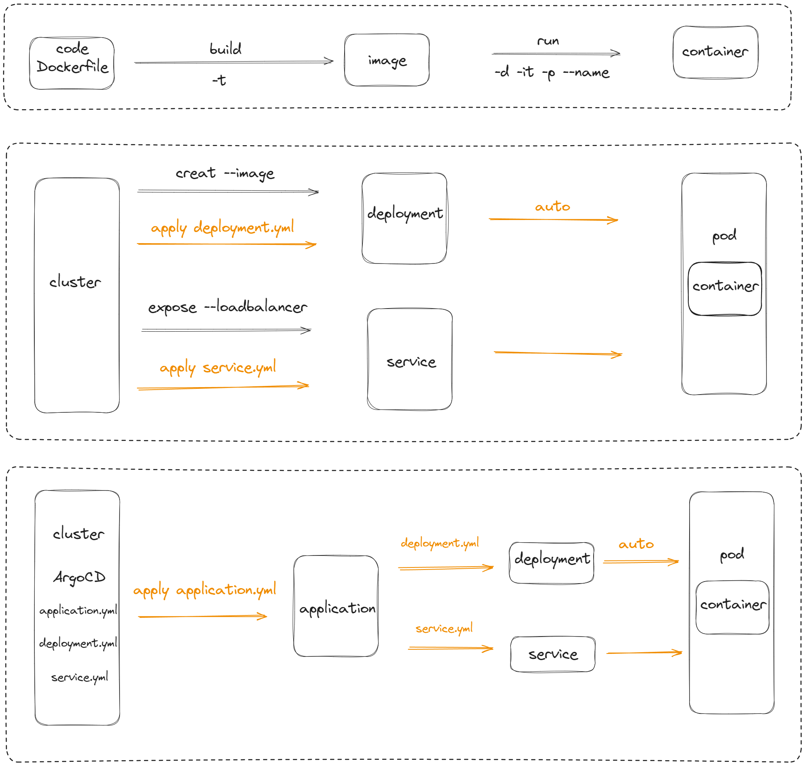

# 学习计划

**第一周：前期准备和 Argo CD 简介**

- **Day 1-2：** 阅读 Argo CD 官方文档的入门部分，了解 Argo CD 的基本概念和架构。
- **Day 3-4：** 安装 Argo CD 到你的 Kubernetes 集群，可以选择使用 Helm 或 kubectl 安装。
- **Day 5-7：** 创建一个简单的 Argo CD 应用程序，并进行初步的部署。

**第二周：深入 Argo CD 的核心概念**

- **Day 8-10：** 学习 Argo CD 中的应用程序、项目和同步状态等核心概念。
- **Day 11-14：** 实践使用 Argo CD 进行应用程序的部署、更新和回滚，了解同步状态的含义。

**第三周：版本控制和 GitOps**

- **Day 15-17：** 学习如何将应用程序配置纳入版本控制，了解 Argo CD 如何与 Git 集成。
- **Day 18-21：** 创建一个 Git 存储库，将应用程序配置进行版本控制，并通过 GitOps 实践实现自动化部署。

**第四周：高级功能和扩展**

- **Day 22-24：** 学习 Argo CD 中的高级功能，如自定义操作、钩子等。
- **Day 25-28：** 探索 Argo CD 的扩展性，了解如何使用 Argo CD API 和插件系统。

**第五周：实际项目经验和优化**

- **Day 29-31：** 在实际项目中应用 Argo CD，处理复杂场景和问题，例如多环境部署、安全性配置等。
- **Day 32-35：** 优化 Argo CD 的配置，了解性能调优和安全性最佳实践。

在整个学习过程中，建议结合实际的应用场景，通过不断实践来巩固学到的知识。同时，参与 Argo CD 社区，阅读更新的文档，关注新的功能和最佳实践，以保持学习的连续性。这个计划旨在帮助你逐步学习 Argo CD，但请根据个人学习进度和兴趣进行调整。


# Argo CD 基础

​	Argo CD 是一个持续部署工具，可以通过修改 yaml 文件，改变应用的运行。

## Argo CD 前置

1. **基础知识：**
   - 了解基本的计算机网络和操作系统概念。
   - 熟悉基本的编程和脚本语言，例如 Python 或 Shell。
2. **Linux基础：**
   - 熟悉Linux操作系统的基本命令和文件系统。
   - 学习Shell脚本编写。
3. **版本控制（Git）：**
   - 学习使用 Git 进行版本控制。
   - 熟悉分支管理、合并操作等 Git 高级特性。
4. **容器化基础（Docker）：**
   - 了解容器化的基本概念。
   - 安装和使用 Docker，创建和运行容器。
   - 学习 Dockerfile 编写和容器镜像的构建。
5. **容器编排（Kubernetes）：**
   - 了解 Kubernetes 的基本概念，例如 Pod、Service、Deployment 等。
   - 安装和配置 Kubernetes 集群，可以使用 Minikube 或 kind 进行本地环境的搭建。
   - 学习如何使用 kubectl 命令行工具进行 Kubernetes 集群操作。
   - 理解基本的部署和服务编排概念。
6. **微服务架构：**
   - 了解微服务架构的优势和挑战。
   - 学习如何拆分应用为微服务，并了解微服务通信和协同的方法。
7. **持续集成和持续部署（CI/CD）：**
   - 学习使用 CI/CD 工具，例如 Jenkins、GitLab CI 或 GitHub Actions。
   - 实践自动化构建、测试和部署流程。
8. **云原生安全：**
   - 了解云原生安全的基本概念，包括身份验证、访问控制、加密等。
   - 学习如何保护容器和 Kubernetes 集群。
9. **GitOps：**
   - 了解 GitOps 概念和原则。
   - 学习使用 GitOps 工具，例如 ArgoCD。
   - 实践将应用程序的配置存储在 Git 存储库中，使用 GitOps 模型进行部署和管理。
10. **实际项目经验：**
    - 参与实际的云原生项目，应用所学知识。
    - 解决实际问题，深化对整个生态系统的理解。

## 环境搭建

1. Linux 系统，Docker 已安装，kubectl 已安装，启动一个集群。

2. 安装 Argo CD

   ```bash
   kubectl create namespace argocd
   kubectl apply -n argocd -f https://raw.githubusercontent.com/argoproj/argo-cd/stable/manifests/install.yaml
   ```

3. 查看 pod 状态，直到全部运行

   ```bash
   kubectl get pod -n argocd
   ```

4. 查看并转发端口

   ```bash
   # 查看命名空间 argocd 的 service
   kubectl get svc -n argocd
   # 如果在本地跑集群，转发至本地即可，使用CLUSTER-IP访问
   kubectl port-forward -n argocd svc/argocd-server 8080:443
   # 如果在gcloud跑集群，需转发至公网，使用EXTERNAL-IP访问
   kubectl patch svc argocd-server -n argocd -p '{"spec": {"type": "LoadBalancer"}}'
   # 查看IP
   kubectl get svc -n argocd
   ```

5. 获取密码

   ```bash
   # 获取密码
   kubectl get secret argocd-initial-admin-secret -n argocd -o yaml
   # 解码，PASSWORD为上一步获取到的加密密码
   echo PASSWORD== | base64 --decode
   
   # 上次密码KYftEr-aAfYyInXB
   ```

6. 在本地或公网通过 IP 访问 Argo CD 页面登录，用户名为admin

## Ops 对比



# Nana 课程

## 视频信息

- 等价产品：Flux CD
- Argo CD 是一个持续交付工具
  - 传统 CD 工具：从外部将更改推送到集群
  - Argo CD：存在于集群内部，作为集群的代理，向集群拉取更改

流程

- 开发人员将代码推送至 GitHub
- A 自动构建 image 并推送至 Dockerhub
- 最后更新 K8S yaml 文件

Nana 说最好将代码源文件和 yaml 文件分别存储，以利于更改代码或部署时，不必检查另一方，最终有单独的 CI 和 CD

yaml 文件、helm 图表、K8S 清单、自定义文件或其它模板文件，所有都会自动转换为纯 K8S yaml 文件


A 不仅监视存储库更改，还会监视集群中的更改，双方任意一个改变，另一方将自动更改

一个 A 可以同时配置多个集群

## 视频步骤

1. [项目源自于 YouTube 博主 TechWorld with Nana](https://www.youtube.com/watch?v=MeU5_k9ssrs)

2. 完成 Argo CD 的环境搭建

3. 我已经在接下来的文件中替换了 Nana 的 Git 和 Docker 地址

   - 原地址

     GitLab：https://gitlab.com/nanuchi/argocd-app-config.git

     Docker：[nanajanashia/argocd-app:1.2](https://hub.docker.com/r/nanajanashia/argocd-app/tags)

   - 新地址

     GitLab：https://gitlab.com/jerrybai/devops-argocd.git

     Docker：jerrybaijy/jerry-image:v1.1

4. 将项目 `devops-argocd` clone 至本地，得到 `application.yaml`、`deployment.yaml`、`service.yaml` 文件

   - **application.yaml**

     ```yaml
     # API版本
     apiVersion: argoproj.io/v1alpha1
     
     # 资源类型为 Application
     kind: Application
     
     # 元数据
     metadata:
       name: myapp-argo-application # 应用程序名称
       namespace: argocd # 在 argocd 命名空间中创建
     
     spec:
       project: default # 使用 default 项目配置
     
       # 应用程序源
       source:
         # Git仓库
         repoURL: https://gitlab.com/jerrybai/devops-argocd.git
         targetRevision: HEAD # 使用仓库的 HEAD 作为目标修订版本
         path: dev # 从仓库的 'dev' 目录获取配置文件
     
       # 应用程序目的地
       destination:
         server: https://kubernetes.default.svc # Kubernetes 集群服务器地址
         namespace: myapp # 部署到 'myapp' 命名空间
     
       # 同步策略
       syncPolicy:
         syncOptions:
           - CreateNamespace=true # 在同步时创建命名空间
     
         # 自动化同步设置
         automated:
           selfHeal: true # 启用自愈功能
           prune: true # 启用修剪（删除未在源中定义的资源）
     ```

   - **deployment.yaml**

     ```yaml
     # 定义一个 Kubernetes 的 Deployment 资源
     apiVersion: apps/v1
     kind: Deployment
     metadata:
       # 设置 Deployment 的名称为 myapp
       name: myapp
     spec:
       # 定义 Pod 选择器，用于匹配属于该 Deployment 的 Pod
       selector:
         matchLabels:
           app: myapp
       # 定义要创建的 Pod 的副本数为 2
       replicas: 2
       # 定义 Pod 的模板
       template:
         metadata:
           # 给 Pod 设置标签
           labels:
             app: myapp
         spec:
           # 定义 Pod 的规格
           containers:
             - name: myapp
               # 定义镜像为自己的 Go 语言基础镜像
               image: jerrybaijy/jerry-image:v1.1
               # 定义容器公开的端口
               ports:
                 - containerPort: 8080
               env:
                 - name: PORT
                   value: "8080"
               resources:
                 requests:
                   memory: "1Gi"
                   cpu: "500m"
                   ephemeral-storage: "1Gi"
                 limits:
                   memory: "1Gi"
                   cpu: "500m"
                   ephemeral-storage: "1Gi"
     ```

   - **service.yaml**

     ```yaml
     # 定义 Kubernetes 的 Service 资源
     apiVersion: v1
     kind: Service
     metadata:
       # 设置 Service 的名称为 myapp-service
       name: myapp-service
     spec:
       # 定义用于选择与 Service 关联的 Pod 的标签
       selector:
         app: myapp
       # 定义 Service 所公开的端口配置
       type: LoadBalancer
       ports:
         - port: 80     
           # 定义将流量转发到 Pod 的端口号
           targetPort: 8080
     ```

     本地与公网对比

     ```yaml
     # 公网访问应用
     type: LoadBalancer
     ports:
       - port: 80
         targetPort: 8080
     
     # 本地访问应用
     ports:
     - port: 80
       protocol: TCP
       targetPort: 8080
     ```

5. 进入项目目录，部署应用

   ```bash
   cd devops-argocd
   kubectl apply -f application.yaml
   ```

6. 在 Argo CD 页面查看应用已启动

7. 查看应用

   ```bash
   # 查看命名空间 argocd 的 service
   kubectl get svc -n myapp
   # 如果在本地跑集群，转发至本地即可，使用CLUSTER-IP访问
   kubectl port-forward -n myapp svc/argocd-server 8080:443
   # 如果在gcloud跑集群，需转发至公网，使用EXTERNAL-IP访问
   kubectl patch svc myapp-service -n myapp -p '{"spec": {"type": "LoadBalancer"}}'
   # 查看IP
   kubectl get svc -n myapp
   ```

8. 在本地或公网通过 IP 访问应用


