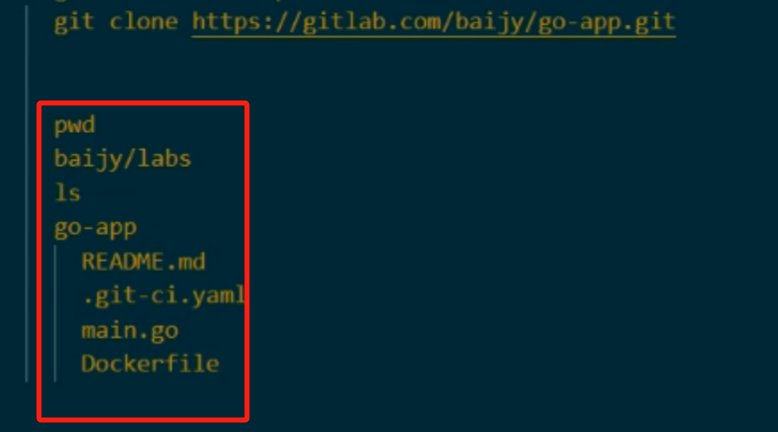

## docker ex01: copy a file out of a container and replace a word inside the file  
  On a Linux server  

```bash
# running
docker run -d --tty -p 8080:80 --entrypoint /bin/sh --name jerry-container03 -e FRONTEND_ADDR=frontend:80 -e USER=10 379124ecd86f
```


  ```bash
    ## run a docker container  
    ## -d 在后台运行容器，不占用终端
    docker run quay.io/signalfuse/microservices-demo-loadgenerator:latest
    docker run -d quay.io/signalfuse/microservices-demo-loadgenerator:latest
    ## 新建的容器未能运行，跟内部的环境变量 FRONTEND_ADDR 有关

    ## find its ID
    ## -a 列出全部容器（如果没有 -a 则列出正在运行的容器） 
    docker ps -a
      CONTAINER ID   IMAGE                                                                COMMAND                  
      0774836ec5ac   quay.io/signalfuse/microservices-demo-loadgenerator:latest           "/bin/sh -c ./loadge…"   
    
    ## copy out a file to local filesystem (/tmp/)
    docker cp 0774836ec5ac:/usr/local/lib/python3.9/site-packages/locust/html.py /tmp

    ## print & search (grep) a word  
    cat /tmp/html.py | grep jquery-1.11.3.min.js                                                                 
      js_files = ["jquery-1.11.3.min.js", "echarts.common.min.js", "vintage.js", "chart.js", "tasks.js"]
      ## grep检索到到了一个列表，列表中包含元素 jquery-1.11.3.min.js

    ## replace the word with a new one  
      ## 可能替换:sed -i 's/jquery-1.11.3.min.js/jquery-3.6.1.min.js/g' '/tmp/html.py'
      ## `sed`：流编辑器，用于对文本进行流式处理；`-i`：在原文件修改；`s`：替换；`g` ：全局替换
      sed -i ' ' 's/jquery-1.11.3.min.js/jquery-3.6.1.min.js/g' '/tmp/html.py'
    
    ## verify it's replace   
    cat /tmp/html.py|grep jquery-1.11.3.min.js                          
    cat /tmp/html.py|grep jquery-3.6.1.min.js 
        js_files = ["jquery-3.6.1.min.js", "echarts.common.min.js", "vintage.js", "chart.js", "tasks.js"]
  ```

## docker build a image manually (without push to Dockerhub)   
- Run `loadgenerator` container from the image on `quay.io`   
  ```bash 
    ## exit immidiately  
    $ docker container run -it --name load-gen03 -e FRONTEND_ADDR=frontend:80 -e USER=10 quay.io/signalfuse/microservices-demo-loadgenerator:latest 
      ++ curl --silent --output /dev/stderr --write-out '%{http_code}' http://frontend:80
      + STATUSCODE=000
      
  	## `-it`: 创建一个<span style="color:red;">交互式终端</span>。
  	## `--name load-gen03`: 指定容器的名称为 `load-gen03`。
  	## `-e FRONTEND_ADDR=frontend:80`: 设置一个<span style="color:red;">环境变量</span> `FRONTEND_ADDR`，前端服务的地址和端口，其值为 `frontend:80`。
  	## `-e USER=10`: 设置一个环境变量 `USER`，指定了用户数量，其值为 `10`。
  	## `quay.io/signalfuse/microservices-demo-loadgenerator:latest`: 指定要运行的 Docker 镜像，这是一个负载发生器的镜像，用于模拟对某个服务的请求负载。
  	## 结果
  	## 容器内部执行了一段脚本，其中使用了 `curl` 命令来向指定的前端服务发送 HTTP 请求。在这段脚本中，`curl` 命令的输出被重定向到标准错误输出设备 (`/dev/stderr`)，并且使用 `--write-out` 选项来输出 HTTP 响应码。
  	## 根据脚本的输出，`STATUSCODE` 变量的值为 `000`，这意味着 `curl` 命令没有成功连接到指定的前端服务，因此返回的 HTTP 响应码为 `000`。
  
  
  
    ## Check the errors 
    ## 这个练习旨在如何检查容器的报错，以及 `logs` 和 `inspect` 的区别
    $ docker logs load-gen03
      ++ curl --silent --output /dev/stderr --write-out '%{http_code}' http://frontend:80
      + STATUSCODE=000
  
    $ docker inspect load-gen03
      [
          {
              "Id": "b6c4782b2b8d53840c4ac0148d78d293efadb49a2d3b85efb9bd50c6ef53ccd2",
              "Created": "2022-10-10T12:48:28.899604154Z",
              "Path": "/bin/sh",
              "Args": [
                  "-c",
                  "./loadgen.sh",
                  "bin/sh"
              ],
              "State": {
                  ## 容器已退出
                  "Status": "exited",
                  "Running": false,
              ...
  
    ## right format
    ## docker container run -it --name load-gen03 -e FRONTEND_ADDR=frontend:80 -e USER=10 quay.io/signalfuse/microservices-demo-loadgenerator:latest
    $ docker container run --interactive --tty --entrypoint /bin/sh --name load-gen04 -e FRONTEND_ADDR=frontend:80 -e USER=10 quay.io/signalfuse/microservices-demo-loadgenerator:latest
      /app # 
  	## `--interactive` 或 `-i`: 交互式，让容器的标准输入保持打开，以便我们可以与容器进行交互。
  	## `--tty` 或 `-t`: 分配一个伪终端 (TTY) 给容器，这样可以在容器中执行交互式的命令。
  	## `--entrypoint /bin/sh`: 设置容器的入口点为 `/bin/sh`，即启动容器后直接进入 Shell 环境。
  	## 结果
  	## 表示进入容器后的命令提示符
  	## `/app`：当前位于容器内部的根目录
  	## `#`：表示当前用户是 root 用户
  	## <span style="color:red;">进入 `Shell` 环境之后</span>，Linux 常规命令能用，但我尝试在容器内安装 `docker`，找不到任何安装工具
    
    
    
    ## in case of using podman instead of docker  
    podman container  run -it --tty --entrypoint /bin/sh  -e FRONTEND_ADDR=frontend:80 -e USER=10 shaoych/online-boutique:loadgenerator_jquery-upg_3.6.1
      /app # find / -name jquery* -print
  
  ```
  
- find the jquery lib in the container   
  ```bash 
    /app # find / -name jquery* -print
      /usr/local/lib/python3.9/site-packages/locust/static/jquery.tools.min.js
      /usr/local/lib/python3.9/site-packages/locust/static/jquery.jqote2.min.js
      /usr/local/lib/python3.9/site-packages/locust/static/jquery-1.11.3.min.js
  ```
  
- upgrade the jquery  
  ...

- `commit` to create a `custom image`   
  
  ```bash
    $ docker container commit andy-container andy-image   
      sha256:587e663af0dab27a4d60d7ae6173927fd4808d71afec9a2c2087273fd0361683
    $ docker image ls -a
      REPOSITORY                  TAG       IMAGE ID       CREATED          SIZE
      andy-image                  latest    587e663af0da   19 seconds ago   11.2MB
  ```
  
- Run container from the new custom image  
  ```bash
    ## docker container run -d --tty --entrypoint /bin/sh --name andy-container01 -e FRONTEND_ADDR=frontend:80 -e USER=10 andy-image
    ## docker container run -d --tty -p 8080:80 --entrypoint /bin/sh --name andy-container02 -e FRONTEND_ADDR=frontend:80 -e USER=10 andy-image
    $ docker container run andy-image redis-server  
      ...
      1:M 10 Oct 2022 12:02:34.392 * Ready to accept connections
  
    ## on a new Terminal  
    $ docker container ls -a   # happy_chandrasekhar is the given name by docker  
      CONTAINER ID   IMAGE           COMMAND          CREATED          STATUS                      PORTS     NAMES
      fd8eb28dcfa0   andy-image      "redis-server"   5 minutes ago    Up 5 minutes                          happy_chandrasekhar
      3ac39fb78d9f   alpine:latest   "/bin/sh"        16 minutes ago   Exited (0) 15 minutes ago             andy-container
    
    $ docker container exec -it happy_chandrasekhar redis-cli  # run redis-cli  
      127.0.0.1:6379> help
        redis-cli 7.0.5 (git:7658871b)
        ...
      127.0.0.1:6379> exit  
  ```
  
- Reference: `docker run` with port mapping.  
  ```
    ## option: -p host_port:container_port   
    docker run -p 8080:80 -it docker-image bash  
  ```

## docker build manually with Google Cloud sample web server app (golang)  
- Download files from Sample web server app (golang)  
  https://cloud.google.com/kubernetes-engine/docs/deploy-app-cluster  
  main.go   
  Dockerfile   

- Dockerfile  
  ```
    FROM golang:1.21.0 as builder
    WORKDIR /app
    RUN go mod init hello-app
    COPY *.go ./
    RUN CGO_ENABLED=0 GOOS=linux go build -o /hello-app
  
    
    FROM gcr.io/distroless/base-debian11
    
    WORKDIR /
    COPY --from=builder /hello-app /hello-app
    ENV PORT 8080
    USER nonroot:nonroot
    CMD ["/hello-app"]
  ```
  
- Manually simulate the steps from Dockerfile   
  These commands are not verified but just ideas  
  
  ```bash
    docker container run --name builder golang:1.21.0
    ## docker run -d -it --name builder golang:1.21.0
    docker ps -A 
    
    ## 先进入容器：docker exec -it builder /bin/sh
    ## 创建工作目录app：cd / → mkdir app
    ## 模块化
    go mod init hello-app
    
    
    docker cp *.go builder:/app 
    docker exec -it builder bash   
      cd /app
      ## 编译你的 Go 应用程序为静态 Linux 可执行文件。然后，你将编译好的可执行文件保存为 /hello-app。
      CGO_ENABLED=0 GOOS=linux go build -o /hello-app
      exit  
  
    ## 由于不允许运行，我使用了一个新image
    #docker container run -d -it -p 80:8080 --entrypoint /bin/sh --name runner -e FRONTEND_ADDR=frontend:80 -e USER=10 debian
    docker container run -p 80:8080 --name runner gcr.io/distroless/base-debian11  
    #容器到容器复制
    docker cp builder:/hello-app /hello
    docker cp /hello/hello-app runner:/hello-app
    
    docker exec -it runner bash  
      export PORT=8080 
      
      # user nonroot does not exist or the user entry does not contain all the required fields
      sudo su - nonroot
      #adduser --disabled-password --gecos "" nonroot
      #系统自己创建了名字是nonroot的用户
      #su - nonroot
      #su: user nonroot does not exist or the user entry does not contain all the required fields
      #root@d1e21ed4b0ec:/# adduser --disabled-password --gecos "" nonroot
      #Adding user `nonroot' ...
      #Adding new group `nonroot' (1000) ...
      #Adding new user `nonroot' (1000) with group `nonroot (1000)' ...
      #Creating home directory `/home/nonroot' ...
      #Copying files from `/etc/skel' ...
      #Adding new user `nonroot' to supplemental / extra groups `users' ...
      #Adding user `nonroot' to group `users' ...
      
      #运行应用程序
      /hello-app
      exit
  ```
- Access the golang app   
  http://127.0.0.1:80

- build image from the running `container`  
  ```
    docker container commit runner andy-image   
    docker images 
  
    export IMAGE_NAME "shaoych/andy-image"  
    export IMAGE_TAG "v1.0"  
  
    docker login -u $REGISTRY_USER -p $REGISTRY_PASS  
    docker push $IMAGE_NAME:$IMAGE_TAG
  ```
  
- build image from Dockerfile   
  ``` 
    docker build -t $IMAGE_NAME:$IMAGE_TAG .   # (.) the current folder where Dockerfile locates  
    docker push $IMAGE_NAME:$IMAGE_TAG
  ```

## docker build via Gitlab CI/CD pipeline automation   
- Create a file `.gitlab-ci.yml` in the same folder as the `main.go` and `Dockerfile`  
  
  ```yaml
  # 全局变量
  variables:
    # 不加shaoych/行不行
    IMAGE_NAME: shaoych/online-boutique 
    IMAGE_TAG: loadgenerator_jquery-upg_3.6.1_06
  
  #  CI/CD 流水线的阶段
  stages: 
    - build
  
  build_image:
    stage: build
    image: docker:20.10.20
    services:
      - docker:20.10.20-dind
    variables:
      DOCKER_TLS_CERTDIR: "/certs"
    before_script:
      - docker login -u $REGISTRY_USER -p $REGISTRY_PASS # $这种格式的用法，有的是[]，有的没有标记，但都是大写加下划线？
      #- echo "test: $REGISTRY_USER:$REGISTRY_PASS"
    script:
      # 上面已经声明变量了，这里的$IMAGE_NAME:$IMAGE_TAG还用替换成明文么？
      # 我写成了明文，但跟上面的变量比，少了用户名部分 jerrybai/
      - docker build -t $IMAGE_NAME:$IMAGE_TAG ./loadgenerator_jquery-3.6.1
      - docker push $IMAGE_NAME:$IMAGE_TAG
  ```
  
  ```yaml
  variables:
    IMAGE_NAME: jerrybaijy/devops-ci-go
    IMAGE_TAG: v1.0
  
  stages: 
    - build
  
  build_image:
    stage: build
    image: docker:20.10.20
    services:
      - docker:20.10.20-dind
    variables:
      DOCKER_TLS_CERTDIR: "/certs"
    before_script:
      - docker login -u $DOCKER_USER -p $DOCKER_PASSWORD
    script:
      - docker build -t $IMAGE_NAME:$IMAGE_TAG .
      - docker push $IMAGE_NAME:$IMAGE_TAG
  ```
  
  
  
- Create a Gitlab Repo project on Gitlab UI  
  
  e.g,: https://gitlab.com/baijy/go-app.git   
  
- git clone the repo    
  git clone https://gitlab.com/baijy/go-app.git   
  
- copy the files into the repo folder  
  
  
  
  ```
    cd go-app  # 工作根目录
    cp app-source/* .  # 复制原文件
  ```
  
- git push to Gitlab repo   
  ```
    #git checkout -b my-branch    ## reference only  
    git status
    git add .
    git commit -m "Auto docker build"
    git push --set-upstream origin main
  ```
  
- view pipeline   
  https://gitlab.com/online-boutique1/upg_jquery_in_boutique_loadgenerator/-/pipelines    

- verify the image in Docker Hub   