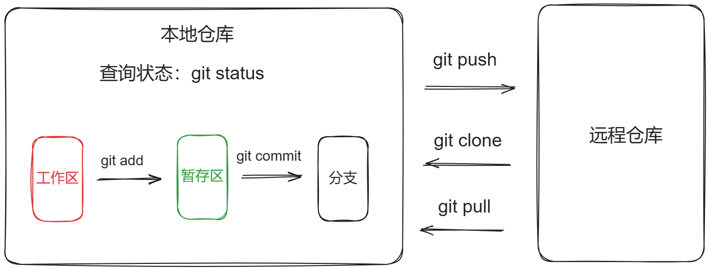

# Git

## Git基础

- [Git - 官方中文文档](https://git-scm.com/book/zh/v2/起步-关于版本控制)
- [Git 菜鸟教程](https://www.runoob.com/git/git-tutorial.html)

### 环境搭建

#### Windows 环境

- 官网下载安装包：**[64-bit Git for Windows Setup](https://github.com/git-for-windows/git/releases/download/v2.44.0.windows.1/Git-2.44.0-64-bit.exe)**
- 安装时注意选择 `main` 分支

#### 配置

1. 配置用户名和邮箱

   ```bash
   # 配置用户名，如果有空格，要用引号包含
   git config --global user.name JerryBai
   
   # 配置email
   git config --global user.email jerry.baijy@hotmail.com
   
   # 保存配置，这样就不用每次都配置
   git config --global credential.helper store
   
   # 查看配置信息
   git config --global --list
   ```

### 其它基础

- **Git 管理**

  ```bash
  # 查看git版本信息
  git -v
  ```

- **基本流程**

  

# Repo

- **基础命令**

  ```bash
  # 查看仓库状态
  git status
  # 下载
  git clone PATH
  # 跟踪
  git add .
  # 提交
  git commit -m "MESAGE"
  # 推送
  git push
  # 拉取
  git pull
  ```

- **配置两个 Remote Repo**

  ```bash
  # 查看本地 Repo 配置的 Remote Repo
  git remote -v
  # origin  https://gitlab.com/jerrybai/REPO_NAME.git (fetch)
  # origin  https://gitlab.com/jerrybai/REPO_NAME.git (push)
  
  # 添加 GitHub Remote Repo
  git remote set-url --add origin https://github.com/jerrybaijy/REPO_NAME.git
  
  git remote -v
  # origin  https://gitlab.com/jerrybai/jerry-test.git (fetch)
  # origin  https://gitlab.com/jerrybai/jerry-test.git (push)
  # origin  https://github.com/Jerrybaijy/jerry-test.git (push)
  
  # GitLab 作为默认 Remote Repo，可以 Pull 和 Push
  # GitHub 只可以 Push
  
  # 删除其中一个
  git remote set-url --delete origin https://github.com/jerrybaijy/REPO_NAME.git
  ```

- **git init 步骤**

  ```bash
  # 手动远程建立空仓库
  
  # 本地初始化仓库
  git init
  # 添加和提交
  git add .
  git commit -m "MESAGE"
  # 建立和远程仓库的关系
  git remote add origin PATH
  # 拉取
  git pull --rebase origin BRANCH_NAME # 这步一定要使用--rebase
  # 推送
  git push -u origin BRANCH_NAME
  ```

# Branch

## Branch 基础

​	安装 Git 时，有选项选择本地仓库默认分支为 main

- **基础命令**

  ```bash
  # 查看分支
  git branch
  # 创建分支
  git branch BRANCH_NAME # 使用-d删除
  # 切换分支
  git checkout BRANCH_NAME # 使用-b创建并切换新分支
  # 关联分支
  git push -u origin BRANCH_NAME # git pull -u origin BRANCH_NAME
  # 合并分支
  git merge BRANCH_NAME
  
  # 删除远程分支
  git push origin --delete REMOTE_BRANCH_NAME
  ```

## 其它

- **关联 Branch**

  ```bash
  # 关联分支
  git push -u origin BRANCH_NAME
  git pull -u origin BRANCH_NAME
  
  # 清除关联
  git remote rm origin
  ```

  解释：

  - **-u**：等价于 `--set-upstream`，设置上游分支

  - **origin**：远程仓库的别名；当克隆一个远程仓库时，Git 会默认创建一个名为 `origin` 的远程仓库别名，指向远程仓库地址。

  - **BRANCH_NAME**：远程分支名字
  
  - 设置上游分支以后，本地分支与上游分支建立关联，以后可在本分支下直接使用 `git push`
  
  - 每次新生成分支需将新分支与远程分支建立一次关联

# Version Control

- **基础命令**

  ```bash
  # 追溯
  git reset --hard SHA # SHA哈希值
  ```

- 

# GitHub

- 在 Linux 中从 GitHub 上下载特定文件

  ``` bash
  curl -O https://raw.githubusercontent.com/<user>/<repository>/<branch>/<path_to_file1> -O https://raw.githubusercontent.com/<user>/<repository>/<branch>/<path_to_file1>/file2
  # eg：同时下载两个
  curl -O https://raw.githubusercontent.com/GoogleCloudPlatform/kubernetes-engine-samples/main/quickstarts/hello-app/main.go -O https://raw.githubusercontent.com/GoogleCloudPlatform/kubernetes-engine-samples/main/quickstarts/hello-app/Dockerfile
  ```

  

# GitLab

## GitLab 基础

## 配置文件

​	目的是根据用户自己编写的应用文件 `main.go`、`Dockerfile`、 `.gitlab-ci.yml`，在将文件 psush 到 Gitlab 时，自动生成 Docker image 并推送到 Dockerhub。

- 创建配置文件：`.gitlab-ci.yml`

  ```yaml
  variables:
    IMAGE_NAME: jerrybaijy/jerry-image
    IMAGE_TAG: v1.0
  
  stages: 
    - build
  
  build_image:
    stage: build
    image: docker:20.10.20
    services:
      - docker:20.10.20-dind
    variables:
      DOCKER_TLS_CERTDIR: "/certs"
    before_script:
      - docker login -u $DOCKER_USER -p $DOCKER_PASSWORD
    script:
      - docker build -t $IMAGE_NAME:$IMAGE_TAG .
      - docker push $IMAGE_NAME:$IMAGE_TAG
  ```
  
  ```yaml
  # 这个配置文件设置了一个 CI/CD 流水线，有一个阶段 (`build`) 和一个任务 (`build_image`)
  # 定义可以在下文引用的变量
  variables:
    IMAGE_NAME: jerrybaijy/jerry-image
    IMAGE_TAG: v1.0
  
  # CI/CD 流水线的阶段
  stages:
    - build
  
  # 定义了一个名为 build_image 的任务
  build_image:
    stage: build # 指定了该任务属于 build 阶段
    image: docker:20.10.20 # 指定了要用作该任务环境的 Docker 镜像
    services: # 指定了主要任务容器旁边要运行的额外服务
      - docker:20.10.20-dind #  -dind 后缀代表 Docker in Docker，允许任务在容器内部运行 Docker 命令
    variables:
      DOCKER_TLS_CERTDIR: "/certs" # 此变量将 DOCKER_TLS_CERTDIR 环境变量设置为 /certs，指定 Docker TLS 证书存储的目录
    before_script: # 指定了在 script 部分之前要执行的命令。
      - docker login -u $DOCKER_USER -p $DOCKER_PASSWORD # 引用存储在托管平台variables中的用户名和密码
    script: # 指定了任务的主要命令
      - docker build -t $IMAGE_NAME:$IMAGE_TAG . # 三个原文件的路径，即当前目录
      - docker push $IMAGE_NAME:$IMAGE_TAG # 引用本文件开始定义的变量
  ```
  
- **使用方法**

  - 从 GitLab clone 项目 `webserver-go-gitlab-ci`
  - 项目包含三个文件 `main.go`,  `.gitlab-ci.yml` 和 `Dockerfile` 
  - 通过 `.gitlab-ci.yml` 和 `Dockerfile` ，经 `git push` 以后，产生两个效果
    - 把本仓库文件 Push 至 GitLab
    - 在 GitLab 的 Pipline 中自动生成一个名为 `jerry-image` 的 image，并同时推送至 DockerHub

  - 此方法的项目源文件存储在 GitLab 中的 `webserver-go-gitlab-ci`，供长期使用
  - 此方法生成的 image 存储在 DockerHub 中的 `jerry-image`，供长期使用


## 解决办法

### 配置变量

- 在配置文件中可能需要某些敏感信息（如密码），可在文件中使用 `$[VARIABLE_NAME]` 代替，然后在托管平台中设置这个变量信息，然后在执行配置文件时，平台会自动处理
- [PROJECT_NAME] → Settings → CI/CD → Variables → 添加变量信息
  - 注意一定要选择 Masked 选项，否则在 log 日志时会打印出来。
