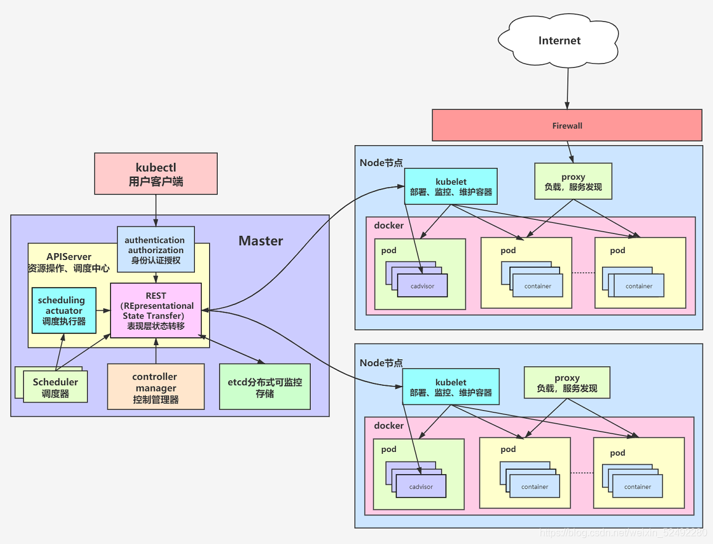

# Kubernetes 基础

## 环境搭建

- Kubernete 需运行在 Docker 基础上
- 在本地使用 Minikube 搭建集群
- 在 Cloud 中搭建集群

## Minikube

​	Minikube 用于创建本地集群，供学习使用，不能用于生产环境。

- **Minikube 安装**

  ```bash
  curl -LO https://storage.googleapis.com/minikube/releases/latest/minikube-linux-amd64
  sudo install minikube-linux-amd64 /usr/local/bin/minikube
  ```

- **Minikube 管理**

  ```bash
  # 列出 minkube 配置文件
  minikube profile list
  ```

- **基础命令**

  ```bash
  # 查看集群
  minikube status
  # 创建集群
  minikube start
  # 删除集群
  minikube delete
  ```

## Kubectl

​	kubectl 命令行工具用于与集群交互

- 安装 kubectl

  ```bash
  # 安装 kubectl
  sudo snap install kubectl --classic
  # 添加环境变量
  export PATH=$PATH:/snap/bin
  # 验证安装
  kubectl version --client
  ```

  解释：

  - `--classic` 用于允许 kubectl 访问系统上的文件系统。
  - `--client` 用于告诉 kubectl 仅显示客户端版本信息，而不连接到 Kubernetes 集群来获取服务器版本信息。

## 通用命令

- **通用命令**

  ```bash
  # 查看 get
  kubectl get pods
  
  # 删除 delete
  kubectl delete pods
  
  # 应用 apply
  kubectl apply -f deployment.yaml # `-f` 指定路径
  
  # 查看pod
  kubectl logs POD_NAME -n NAME_SPACE # -n指定命名空间
  ```

## 命令选项

- ` [-n NAMESPACE]`：指定命名空间

## K8S 架构



# Cluster

## Cluster 基础

- **基础命令**

  ```bash
  # 查看 Cluster
  kubectl cluster-info
  ```

# Namespace

## Namespace 基础

​	Namespace（命名空间）是 Kubernetes 中用于隔离和组织资源的虚拟工作空间。它是一种在逻辑上划分集群资源的方式，允许在同一集群内创建多个虚拟的独立环境。

- **基础命令**

  ```bash
  # 创建 namespace
  kubectl create namespace NAMESPACE_NAME
  ```

# Deployment

## Deployment 基础

​	Deployment（部署）是 Kubernetes 中用于管理 Pod 和 ReplicaSet 的控制器。它定义了您希望部署的应用程序的期望状态，并负责确保集群中的实际状态与所定义的状态匹配。

- **基础命令**

  ```bash
  # 查看deployment
  kubectl get deployment
  # 手动创建 deployment
  kubectl create deployment DEPLOYMENT_NAME --image=IMAGE
  # YAML 文件创建 deployment
  kubectl apply -f deployment.yaml
  # 删除 deployment
  kubectl delete deployment DEPLOYMENT_NAME
  ```

# Node

# Pod

# Service

- **基础命令**

  ```bash
  # 查看 service
  kubectl get svc [-n NAMESPACE]
  ```

- **port**

  - 在 Kubernetes 集群中创建一个 Service 资源，将其暴露为外部的负载均衡服务

    ```bash
    # `--port` 公网端口 80，`--target-port` 应用端口 8080
    kubectl expose deployment DEPLOYMENT_NAME --type LoadBalancer --port 80 --target-port 8080
    ```

  - 在本地计算机和 Kubernetes 集群中的 Pod 之间建立端口转发

    ```bash
    kubectl port-forward deployment/DEPLOYMENT_NAME HOST_PORT:POT_PORT
    # eg
    kubectl port-forward deployment/nginx 80:8080
    ```

# GKE

## [GKE 基础](https://cloud.google.com/kubernetes-engine/docs/concepts/kubernetes-engine-overview?hl=zh-cn)

GKE (Google Kubernetes Engine)，是由 Google 开发的代管式 Kubernetes 服务，可以使用 Google 的基础架构大规模部署和运营容器化应用。

## [部署容器化应用](https://cloud.google.com/kubernetes-engine/docs/deploy-app-cluster)

将一个简单的容器化的网络服务器应用部署到 GKE 集群，并可以在互联网访问

### 准备

1. Google Cloud CLI 环境搭建完成，详见 《Google Cloud》

3. 在 Google Cloud 中启用 API

4. 使用以下命令设置默认项目

   ```bash
   gcloud config set project opportune-study-413101
   ```

### 创建集群

1. 创建名为 `hello-cluster` 的 Autopilot 集群

   ```bash
   gcloud container clusters create-auto hello-cluster --location=us-central1
   ```
   
2. 获取用于集群的身份验证凭据

   创建集群后，您需要获取身份验证凭据才能与该集群交互

   ```bash
   gcloud container clusters get-credentials hello-cluster --location us-central1
   ```


### 部署应用

向集群里部署容器化应用

1. 创建 Deployment 的 Pod，作为运行 `hello-app` 容器映像

   ```bash
   kubectl create deployment hello-server --image=us-docker.pkg.dev/google-samples/containers/gke/hello-app:1.0
   ```
   
   在此命令中：

   - 使用的是 Google 的 image 镜像 `hello-app:1.0`，包含 `hello-app` 容器化应用。
- 也可使用自己创建的镜像，镜像的创建文件为谷歌提供的 `main.go`、`Dockerfile`，具体见 Dockerfile 手动训练

### 公开端口

- 公开端口

  `--port` 公网端口 80，`--target-port` 应用端口 8080

  ```bash
  kubectl expose deployment hello-server --type LoadBalancer --port 80 --target-port 8080
  ```
  
- 获取外部 IP

  输出结果的 `EXTERNAL-IP` 列中，复制 Service 的外部 IP 地址

  ```bash
  kubectl get service hello-server
  ```
  
- 访问应用

  ```bash
  curl http://EXTERNAL-IP
  ```

### 清理

- 删除 Service

  ```bash
  kubectl delete service hello-server
  ```
  
- 删除集群

  ```bash
  gcloud container clusters delete hello-cluster --location us-central1
  ```

## [部署特定语言应用](https://cloud.google.com/kubernetes-engine/docs/quickstarts/deploy-app-container-image?hl=zh-cn#go)

### 准备

1. Google Cloud CLI 环境搭建完成，详见 《Google Cloud》

2. 在 Google Cloud 中启用 API

3. 安装 Go 语言环境

   ```bash
   sudo apt-get install golang
   go version
   ```

4. 使用以下命令设置默认项目

   ```bash
   gcloud config set project opportune-study-413101
   ```

### 编写应用

1. 创建工作目录 `helloworld-gke` 并进入

2. 创建名为 `example.com/helloworld` 的新模块

   ```bash
   go mod init example.com/helloworld
   ```

3. 创建名为 `helloworld.go` 的新文件

   ```go
   package main
   
   import (
           "fmt"
           "log"
           "net/http"
           "os"
   )
   
   func main() {
           http.HandleFunc("/", handler)
   
           port := os.Getenv("PORT")
           if port == "" {
                   port = "8080"
           }
   
           log.Printf("Listening on localhost:%s", port)
           log.Fatal(http.ListenAndServe(fmt.Sprintf(":%s", port), nil))
   }
   
   func handler(w http.ResponseWriter, r *http.Request) {
           log.Print("Hello world received a request.")
           target := os.Getenv("TARGET")
           if target == "" {
                   target = "World"
           }
           fmt.Fprintf(w, "Hello %s!\n", target)
   }
   ```

###  创建镜像

1. 创建 Dockerfile

   ```dockerfile
   FROM golang:1.21.0 as builder
   WORKDIR /app
   RUN go mod init quickstart-go
   COPY *.go ./
   RUN CGO_ENABLED=0 GOOS=linux go build -o /quickstart-go
   
   # 使用 Docker 多阶段构建来创建精简的生产镜像
   # https://docs.docker.com/develop/develop-images/multistage-build/#use-multi-stage-builds
   # 原文件不是这个image，导致容器无法启动
   FROM debian
   WORKDIR /
   COPY --from=builder /quickstart-go /quickstart-go
   
   # 原文件没有这句，导致找不到nonroot用户，容器无法启动
   RUN groupadd -r nonroot && useradd -r -g nonroot nonroot
   
   USER nonroot:nonroot
   ENTRYPOINT ["/quickstart-go"]
   ```

2. 获取 Google Cloud 项目 ID

   ```bash
   gcloud config get-value project
   ```

3. 在集群所在的位置创建名为 `hello-repo` 的仓库

   ```bash
   gcloud artifacts repositories create hello-repo --project=opportune-study-413101 --repository-format=docker --location=us-central1 --description="Docker repository"
   ```

4. 创建镜像

   ```bash
   gcloud builds submit --tag us-central1-docker.pkg.dev/opportune-study-413101/hello-repo/helloworld-gke .
   ```

### 创建集群

​	GKE 集群是作为单个 GKE 集群运行的一组托管式 Compute Engine 虚拟机。

1. 创建集群

   ```sh
   gcloud container clusters create-auto helloworld-gke --location us-central1
   ```

2. 向 Kubernetes API 服务器进行身份验证

   此项不准确

   确认当前项目 Kubernetes API 已启用

   OAuth 客户端 ID：697852056773-029r83hmi8ugienfegmvvrubtbirrt1d.apps.googleusercontent.com

3. 验证有权访问该集群

   ```
   kubectl get nodes
   ```

### 创建 deployment

1. 创建 `deployment.yaml` 文件

   `$GCLOUD_PROJECT` 是您的 Google Cloud 项目 ID，$LOCATION 是代码库位置，例如 us-central1

   ```yaml
   apiVersion: apps/v1
   kind: Deployment
   metadata:
     name: helloworld-gke
   spec:
     replicas: 1
     selector:
       matchLabels:
         app: hello
     template:
       metadata:
         labels:
           app: hello
       spec:
         containers:
         - name: hello-app
           # Replace $LOCATION with your Artifact Registry location (e.g., us-west1).
           # Replace $GCLOUD_PROJECT with your project ID.
           image: $LOCATION-docker.pkg.dev/$GCLOUD_PROJECT/hello-repo/helloworld-gke:latest
           # This app listens on port 8080 for web traffic by default.
           ports:
           - containerPort: 8080
           env:
             - name: PORT
               value: "8080"
           resources:
             requests:
               memory: "1Gi"
               cpu: "500m"
               ephemeral-storage: "1Gi"
             limits:
               memory: "1Gi"
               cpu: "500m"
               ephemeral-storage: "1Gi"
   ```

2. 部署应用

   ```bash
   kubectl apply -f deployment.yaml
   ```

3. 查看应用

   如果所有 `AVAILABLE` 部署都为 `READY`，则表示 Deployment 已完成。否则再次运行 `kubectl apply -f deployment.yaml`，更新 Deployment 以纳入任何更改

   ```bash
   kubectl get deployments
   ```

4. 查看 Pod

   ```bash
   kubectl get pods
   ```

### 创建 service

Service 提供对一组 Pod 的单一访问点。尽管您可以访问单个 Pod，但 Pod 是临时性的，只有使用一个 Service 地址才能进行可靠的访问。在您的 Hello World 应用中，名为“hello”的 Service 定义了一个负载均衡器，用于通过一个 IP 地址访问多个 hello-app Pod。此 Service 在 service.yaml 文件中定义。

这些 Pod 与使用 Pod 的 Service 是分别定义的。Kubernetes 使用[标签](https://kubernetes.io/docs/concepts/overview/working-with-objects/labels/)来选择服务指向的 Pod。利用标签，您既可以让一个 Service 指向来自不同副本集的多个 Pod，也可以让多个 Service 指向同一个 Pod。

1. 创建 `service.yaml` 文件

   ```yaml
   # The hello service provides a load-balancing proxy over the hello-app
   # pods. By specifying the type as a 'LoadBalancer', Kubernetes Engine will
   # create an external HTTP load balancer.
   apiVersion: v1
   kind: Service
   metadata:
     name: hello
   spec:
     type: LoadBalancer
     selector:
       app: hello
     ports:
     - port: 80
       targetPort: 8080
   ```

2. 部署 Service

   ```sh
   kubectl apply -f service.yaml
   ```

### 访问应用

1. 获取外部 IP

   输出结果的 `EXTERNAL-IP` 列中，复制 Service 的外部 IP 地址

   ```bash
   kubectl get service
   ```

2. 访问应用

   ```bash
   http://EXTERNAL-IP
   ```

### 清理

1. Delete service

   ```bash
   kubectl delete service hello
   ```

2. Delete cluster

   ```bash
   gcloud container clusters delete helloworld-gke --location us-central1
   ```

3. Delete repo

   ```bash
   gcloud artifacts repositories delete hello-repo --location=us-central1 --project=opportune-study-413101
   ```

   

