# 大面

## 问题

- Git 版本回退之后无法 push，即使 --force 也不行

- 记笔记时变量的通用 表示法

  `sudo usermod -aG docker $USER` 

  USER  [USER]  \<user>  $USER

- 路径问题

  DIR   PATH   URL

## 欠账

- 写 Shell Script 脚本
  - Linux 和 Windows
- docker
  - kubectl login 看 docker 做了什么
- System
  - rdp   windows
  - ssh   linux
- 网络
  - 域名、IP、DNS
  - server
  - nslookup
- 浏览器
  - CS
  - BS  Java 客户端
- vi/vim
  - 文本编辑
- configmap
- 其它

# Google Cloud

## 环境搭建

- [Google Cloud CLI](https://cloud.google.com/sdk/gcloud?hl=zh-cn) 是一套用于创建和管理 Google Cloud 资源的工具。

### Windows

1. [根据操作系统选择安装 Google Cloud CLI](https://cloud.google.com/sdk/docs/install?hl=zh-cn)

2. 安装之后会出现 Google Cloud SDK Shell 应用

3. 根据提示在 SDK Shell 中选择并在浏览器中登录 Google

4. 使用本地 SDK Shell 代替网页版的 Cloud Shell 

5. 安装 gke-gcloud-auth-plugin 插件，否则无法使用 kubectl 命令来管理您的集群

   ```bash
   gcloud components install gke-gcloud-auth-plugin
   ```

### Linux

1. [根据操作系统选择安装 Google Cloud CLI](https://cloud.google.com/sdk/docs/install?hl=zh-cn)

2. 进入 User 目录

3. 下载 Linux 归档文件

   ```bash
   curl -O https://dl.google.com/dl/cloudsdk/channels/rapid/downloads/google-cloud-cli-469.0.0-linux-x86_64.tar.gz
   ```

4. 解压

   ```bash
   tar -xf google-cloud-cli-469.0.0-linux-x86_64.tar.gz
   ```

5. 将 gcloud CLI 添加到路径

   ```bash
   ./google-cloud-sdk/install.sh
   ```

6. 初始化

   ```bash
   ./google-cloud-sdk/bin/gcloud init
   ```

   1. 选择第 2 项：Log in with a new account
   2. 点击输出的网址，跳转到网页获取 authorization code，并粘贴回至 bash
   3. 选择项目，目前项目为 opportune-study-413101
   4. 选择默认区域：上次选 [7] us-central1-c

7. 安装 kubectl

   ```bash
   gcloud components install kubectl
   ```

## 常用命令

- **账户**

  ```bash
  # 查看登录账户
  gcloud auth list
  # 切换登录账户
  gcloud config set account YOUR_ACCOUNT
  ```

- **项目**

  ```bash
  # 查看当前项目ID
  gcloud config get-value project
  # 查看当前项目
  gcloud config list project
  # 切换项目
  gcloud config set project $PROJECT_ID
  ```

- **镜像**

  ```bash
  # 创建镜像
  gcloud builds submit --tag us-central1-docker.pkg.dev/PROJECT_ID/REPO_NAME/IMAGE_NAME .
  # 查看仓库镜像
  gcloud artifacts docker images list LOCATION-docker.pkg.dev/PROJECT_ID/REPO_NAME
  # 
  ```

- **仓库**

  ```bash
  # 创建仓库
  gcloud artifacts repositories create REPO_NAME --project=$PROJECT_ID --repository-format=docker --location=LOCATION --description="MESSAGE"
  # 查看仓库
  gcloud artifacts repositories list
  # 删除仓库
  gcloud artifacts repositories delete REPO_NAME --location=$LOCATION --project=$PROJECT_ID
  ```

- **集群**

  ```bash
  # 创建集群
  gcloud container clusters create-auto $CLUSTER_NAME --location=$LOCATION
  # 查看集群
  gcloud container clusters list
  # 删除集群
  gcloud container clusters delete $CLUSTER_NAME --location=$LOCATION
  # 停止集群
  gcloud container clusters resize $CLUSTER_NAME --size=0 --zone=$LOCATION
  ```

## [GKE](https://cloud.google.com/kubernetes-engine/docs/concepts/kubernetes-engine-overview?hl=zh-cn)

GKE (Google Kubernetes Engine)，是由 Google 开发的代管式 Kubernetes 服务，可以使用 Google 的基础架构大规模部署和运营容器化应用。

### 手动部署

1. 来源：[部署容器化应用](https://cloud.google.com/kubernetes-engine/docs/deploy-app-cluster)

2. 这是一个 GKE 练习，将一个简单的容器化 Web Server 部署到 GKE 集群，并可以在互联网访问

3. 此练习没有使用  Yaml 文件部署

4. **准备**

   1. Google Cloud CLI 环境搭建完成，详见 《Google Cloud》

   2. 在 Google Cloud 中启用 API

   3. 设置默认项目

      ```bash
      gcloud config set project opportune-study-413101
      ```

5. **创建集群**

   1. 创建集群

      ```bash
      gcloud container clusters create-auto hello-cluster --location=us-central1
      ```

   2. 获取用于集群的身份验证凭据

      ```bash
      gcloud container clusters get-credentials hello-cluster --location us-central1
      ```

6. **部署应用**

   - 手动部署应用

     ```bash
     kubectl create deployment hello-server --image=us-docker.pkg.dev/google-samples/containers/gke/hello-app:1.0
     ```

   - 可替换为自己创建的镜像

7. **公开端口**

   ```bash
   kubectl expose deployment hello-server --type LoadBalancer --port 80 --target-port 8080
   ```

8. **获取外部 IP**

   ```bash
   kubectl get service hello-server
   ```

9. **访问应用**

   ```bash
   curl http://EXTERNAL-IP
   ```

10. **清理**

    1. 删除 Service

       ```bash
       kubectl delete service hello-server
       ```

    2. 删除集群

       ```bash
       gcloud container clusters delete hello-cluster --location us-central1
       ```

### Yaml 部署

- 来源：[部署特定语言应用](https://cloud.google.com/kubernetes-engine/docs/quickstarts/deploy-app-container-image?hl=zh-cn#go)
- 这是一个 GKE 练习，将一个简单的容器化 Web Server 部署到 GKE 集群，并可以在互联网访问
- 此练习使用  Yaml 文件部署

#### 准备

1. Google Cloud CLI 环境搭建完成，详见 《Google Cloud》

2. 在 Google Cloud 中启用 API

3. 设置默认项目

   ```bash
   gcloud config set project opportune-study-413101
   ```

4. 安装 Go 语言环境

   ```bash
   sudo apt-get install golang
   go version
   ```

#### 编写应用

1. 如果使用自己的镜像，可以跳过此步

2. 创建工作目录 `helloworld-gke` 并进入

3. 创建名为 `example.com/helloworld` 的新模块

   ```bash
   go mod init example.com/helloworld
   ```

4. 创建名为 `helloworld.go` 的新文件

   ```go
   package main
   
   import (
           "fmt"
           "log"
           "net/http"
           "os"
   )
   
   func main() {
           http.HandleFunc("/", handler)
   
           port := os.Getenv("PORT")
           if port == "" {
                   port = "8080"
           }
   
           log.Printf("Listening on localhost:%s", port)
           log.Fatal(http.ListenAndServe(fmt.Sprintf(":%s", port), nil))
   }
   
   func handler(w http.ResponseWriter, r *http.Request) {
           log.Print("Hello world received a request.")
           target := os.Getenv("TARGET")
           if target == "" {
                   target = "World"
           }
           fmt.Fprintf(w, "Hello %s!\n", target)
   }
   ```

#### 创建镜像

1. 如果使用自己的镜像，可以跳过此步

2. 创建 Dockerfile

   ```dockerfile
   FROM golang:1.21.0 as builder
   WORKDIR /app
   RUN go mod init quickstart-go
   COPY *.go ./
   RUN CGO_ENABLED=0 GOOS=linux go build -o /quickstart-go
   
   # 使用 Docker 多阶段构建来创建精简的生产镜像
   # https://docs.docker.com/develop/develop-images/multistage-build/#use-multi-stage-builds
   # 原文件不是这个image，导致容器无法启动
   FROM debian
   WORKDIR /
   COPY --from=builder /quickstart-go /quickstart-go
   
   # 原文件没有这句，导致找不到nonroot用户，容器无法启动
   RUN groupadd -r nonroot && useradd -r -g nonroot nonroot
   
   USER nonroot:nonroot
   ENTRYPOINT ["/quickstart-go"]
   ```

3. 获取 Google Cloud 项目 ID

   ```bash
   gcloud config get-value project
   ```

4. 在集群所在的位置创建名为 `hello-repo` 的仓库

   ```bash
   gcloud artifacts repositories create hello-repo --project=opportune-study-413101 --repository-format=docker --location=us-central1 --description="Docker repository"
   ```

5. 创建镜像

   ```bash
   gcloud builds submit --tag us-central1-docker.pkg.dev/opportune-study-413101/hello-repo/helloworld-gke .
   ```

#### 创建集群

1. 创建集群

   ```sh
   gcloud container clusters create-auto helloworld-gke --location us-central1
   ```

2. 验证有权访问该集群

   ```
   kubectl get nodes
   ```

#### 创建 Deployment

1. 创建 `deployment.yaml` 文件

   `$GCLOUD_PROJECT` 是您的 Google Cloud 项目 ID，$LOCATION 是代码库位置，例如 us-central1

   ```yaml
   apiVersion: apps/v1
   kind: Deployment
   metadata:
     name: helloworld-gke
   spec:
     replicas: 1
     selector:
       matchLabels:
         app: hello
     template:
       metadata:
         labels:
           app: hello
       spec:
         containers:
         - name: hello-app
           # Replace $LOCATION with your Artifact Registry location (e.g., us-west1).
           # Replace $GCLOUD_PROJECT with your project ID.
           image: $LOCATION-docker.pkg.dev/$GCLOUD_PROJECT/hello-repo/helloworld-gke:latest
           # This app listens on port 8080 for web traffic by default.
           ports:
           - containerPort: 8080
           env:
             - name: PORT
               value: "8080"
           resources:
             requests:
               memory: "1Gi"
               cpu: "500m"
               ephemeral-storage: "1Gi"
             limits:
               memory: "1Gi"
               cpu: "500m"
               ephemeral-storage: "1Gi"
   ```

2. 部署应用

   ```bash
   kubectl apply -f deployment.yaml
   ```

3. 查看应用

   如果所有 `AVAILABLE` 部署都为 `READY`，则表示 Deployment 已完成。否则再次运行 `kubectl apply -f deployment.yaml`，更新 Deployment 以纳入任何更改

   ```bash
   kubectl get deployments
   ```

4. 查看 Pod

   ```bash
   kubectl get pods
   ```

#### 创建 Service

1. 创建 `service.yaml` 文件

   ```yaml
   apiVersion: v1
   kind: Service
   metadata:
     name: hello
   spec:
     type: LoadBalancer
     selector:
       app: hello
     ports:
     - port: 80
       targetPort: 8080
   ```

2. 部署 Service

   ```sh
   kubectl apply -f service.yaml
   ```

#### 访问应用

1. 获取外部 IP

   输出结果的 `EXTERNAL-IP` 列中，复制 Service 的外部 IP 地址

   ```bash
   kubectl get service
   ```

2. 访问应用

   ```bash
   http://EXTERNAL-IP
   ```

#### 清理

1. Delete service

   ```bash
   kubectl delete service hello
   ```

2. Delete cluster

   ```bash
   gcloud container clusters delete helloworld-gke --location us-central1
   ```

3. Delete repo

   ```bash
   gcloud artifacts repositories delete hello-repo --location=us-central1 --project=opportune-study-413101
   ```

# MySQL

​	MySQL 是一个关系型数据库管理系统，由瑞典 MySQL AB 公司开发，属于 Oracle 旗下产品。MySQL 是最流行的关系型数据库管理系统之一。MySQL 使用  C 和 C++ 编写，使用标准的 SQL 数据语言形式是用于访问数据库的最常用标准化语言。MySQL 支持多线程。

## 环境搭建

### MySQL 安装

​	详见《我要自学网Python课程》软件安装包说明

1. 安装之前创建一个系统还原点，以防不测

2. [官网下载 MySQL：**Windows (x86, 64-bit), MSI Installer**](https://dev.mysql.com/downloads/mysql/)

3. 开始安装，安装方式选择 custom

   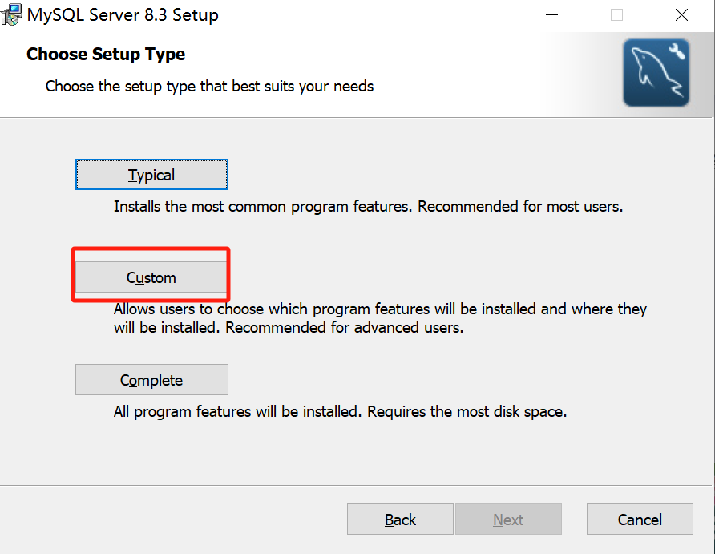

4. 安装完成之后会出现 MySQL 配置的引导界面

5. Data Directory：D:\ProgramData\MySQL\MySQL Server 8.3\

6. Type and Networking：Config Type 选择 DeveloperMachine

   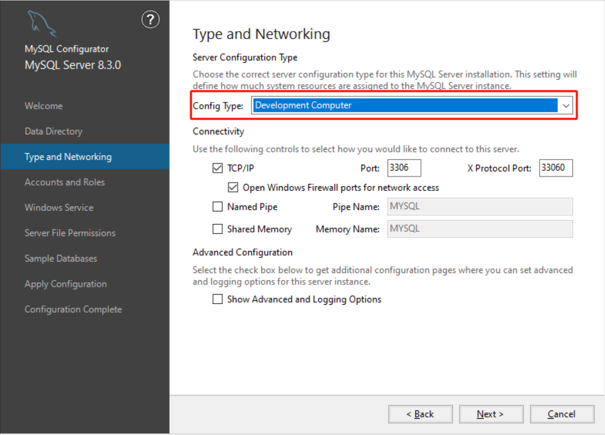

7. 创建 root 账户

   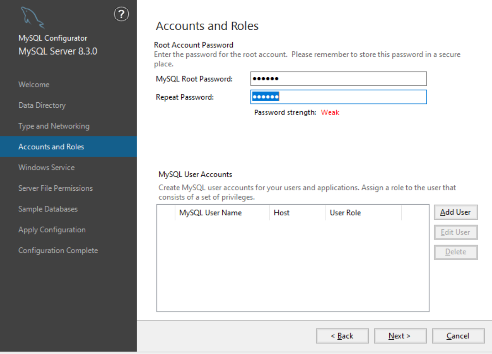

8. Apply Configuration：Execute

   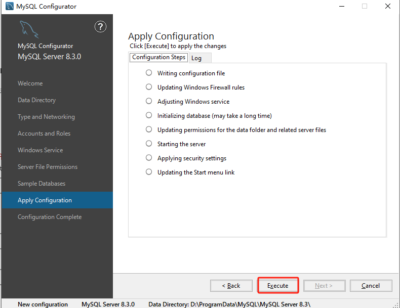

9. 将 MySQL 加入系统环境变量，详见《Windows 笔记》。

10. 安装完成，检查

   ```bash
   # 查看版本
   mysql --version
   # 登录
   mysql -u root -p
   ```

### MySQL 卸载

​	详见《我要自学网Python课程》软件安装包说明

1. 必须先停止 MySQL 服务！！
   1. 控制面板 > 系统与安全 > 管理工具 > 服务界面
   2. 找到 MySQL 服务，右键点击该服务，选择“停止”
   3. 服务停止完毕后，右键点击 MySQL 服务，选择“属性”，进入“属性”窗口
   4. 在“属性”窗口中，找到“启动类型”，将其改为“手动”
   5. 点击“确定”保存设置，关闭窗口

2. 停止 MySQL 服务后，删除 MySQL 服务
   1. 打开命令提示符窗口（管理员权限）
   2. 输入 `sc delete MySQL`，执行删除操作

3. 卸载 MySQL，并删除安装目录
4. 删除安装盘下 D:\ProgramData\MySQL 文件夹（可能需要取消隐藏），里面包含了上一次安装的数据库中的所有数据、用户名和密码。
5. 打开注册表：regedit.exe，删除以下注册表，如果没有可以不删
   - HKEY_LOCAL_MACHINE\SYSTEM\ControlSet001\Services\Eventlog\Application\MySQL 文件夹
   - HKEY_LOCAL_MACHINE\SYSTEM\ControlSet002\Services\Eventlog\Application\MySQL 文件夹
   - HKEY_LOCAL_MACHINE\SYSTEM\CurrentControlSet\Services\Eventlog\Application\MySQL 文件夹
6. 完全卸载了以后就可以正常重新安装了
7. 如想彻底删除，记得删除安装时自己配置的系统环境变量

### MySQL 解决方法

- MySQL 默认端口 3306
- 关于忘记密码，需先进入无授权模式，改完之后再切换回正常模式。

## 数据类型

- **跳过没详细学**
- **整型**
  - int 整型
  - tinyint 有范围的整型
  - int/tinyint unsigned 无符号整型，即没有负数
- 小数
  - float 单精度
  - double 双精度
  - decimal 非常精准
- **字符串**
  - varchar 变长字符串，最多65535/3个
  - varchar(10) 最大长度为10的变长字符串
  - char 定长字符串
  - char(11) 长度为11的定长字符串（比如手机号）
  - text 更长的字符串，最多65535*(2^16^-1)个
- **时间类型**
  - datetime 日期时间   2023-10-31 23:23:23
  - date 日期   2023-10-31

## 指令

- 一行指令完成必须加英文分号，或者\g

- 上下键，翻出历史输入

- Esc键，退出历史输入

- exit;  退出

- set password = password('123456');  设置密码

- 查看数据库编码

  ```sql
  show variables like '%char%';
  ```

## 数据操作

### 数据库

- 查看所有数据库

  ```sql
  show databases; 
  ```

- 进入数据库

  ```sql
  use 数据库名;
  ```

  - 除了查看和创建数据库以外，其余对MySQL操作，必须先进入数据库
    - Python在连接MySQL时可以指定某个数据库

- 创建数据库

  ```sql
  create database 数据库名字 default charset=utf8;
  ```

  - default charset=utf8编码

- 删除数据库

  ```sql
  drop database 数据库名字;
  ```

- 查看数据库所有数据表

  ```sql
  show tables;
  ```

### 数据表

- **查看所有数据表**

  ```sql
  show tables;
  ```

- **创建数据表**

  ```
  use 数据库名;
  create table 表名(
  	列名 类型,
  	列名 类型,
  	列名 类型
  )default charset=utf8;
  ```

  ``` sql
  create table day15(
      id int, 
      name varchar(16), 
      age int
  )default charset=utf8;
  ```

- **表头属性**

  - 显示表头属性

  ``` sql
  desc 表名；
  ```

  ``` 
  mysql> desc tb2;
  +-------+-------------+------+-----+---------+----------------+
  | Field | Type        | Null | Key | Default | Extra          |
  +-------+-------------+------+-----+---------+----------------+
  | id    | int(11)     | NO   | PRI | NULL    | auto_increment |
  | name  | varchar(16) | NO   |     | NULL    |                |
  | age   | int(11)     | YES  |     | 3       |                |
  +-------+-------------+------+-----+---------+----------------+
  3 rows in set (0.02 sec)
  ```

  - 是否为空

  ```sql
  create table tb2(
  	id int,  # 默认可以为空
  	name varchar(16) not null,  # 不准为空
  	age int
  )default charset=utf8;
  ```

  - 默认值

  ```sql
  create table tb2(
  	id int,
  	name varchar(16),
  	age int default 3  # 给值就为给的值，不给值就默认为3
  )default charset=utf8;
  ```

  - 自增

  ``` sql
  create table tb2(
  	id int auto_increment,  # 自增
  	name varchar(16),
  	age int
  )default charset=utf8;
  ```

  - 主键
    - 值不能重复
    - 值不为空
    - 查询速度非常快

  ```sql
  create table tb2(
  	id int primary key auto_increment not null,  # 一般以id作为主键
  	name varchar(16),
  	age int
  )default charset=utf8;
  ```

- **删除数据表**

  ```sql
  drop table 表名
  ```

### 数据行

- ！！！！！！！！！！没有解决编码问题！！！！！！！！！

- 对数据行操作，必须先进入其所属数据库

  - Python在连接数据库时可以指定某个数据库

- **查询数据行**

  ```sql
  select * from 表名 where 条件;
  ```

  - 查询所有数据行

  ``` sql
  select * from 表名;
  ```

- **增加数据行**

  ``` 
  insert into 表名(列名1, 列名2...) values("值1", "值2"...);
  ```

  ``` sql
  insert into tb1(name, mobile, email, salary, ctime) values('mayun', '18888888888', 'x@qq.com', 1000, '2023-11-01 12:30:30');
  ```

  - 增加多行数据行

  ``` 
  insert into 表名(列名1, 列名2...) values("值1", "值2"...), values("值1", "值2"...)...;
  ```

  ``` sql
  insert into tb1(name, mobile, email, salary, ctime) values
  	('mayun', '18888888888', 'x@qq.com', 1000, '2023-11-01 12:30:30'),
  	('mayun', '18888888888', 'x@qq.com', 1000, '2023-11-01 12:30:30'),
  	('mayun', '18888888888', 'x@qq.com', 1000, '2023-11-01 12:30:30');
  ```

- **删除数据行**

  ``` 
  delete from 表名 where 条件;
  ```

  ``` sql
  delete from tb1 where id = 4;
  delete from tb1 where id > 4;
  delete from tb1 where id in (1, 3);
  delete from tb1 where id = 4 and name = 'jerry';
  ```

  - 删除所有数据行

  ``` 
  delete from 表名;
  ```

### 数据

- **修改数据**

  ``` 
  update 表名 set 列名1 = 值1, 列名2 = 值2... where 条件;
  ```

  ``` sql
  update tb1 set mobile = '1999999999' where name = 'zhangsan';
  
  update tb1 set 
  	name = 'zhangsan', 
  	mobile = '1999999999' 
  where name = 'zhaoliu';
  ```

  - 修改整列数据

  ``` 
  update 表名 set 列名1 = 值1;
  update 表名 set 列名1 = 值1, 列名2 = 值2...;
  ```

- **查询数据**

  ``` 
  select * from 表名;  # 查询所有列数据
  select 列名1 from 表名;  # 查询某列数据
  select 列名1, 列名2... from 表名;  # 查询某几列数据
  select 列名1 from 表名 where 条件;  # 查询符合条件某列数据
  ```

  ``` sql
  select * from tb1;
  select id from tb1;
  select id, name from tb1;
  select id from tb1 where name = 'zhaoliu';
  ```

# Podman

Podman 是一个用于管理容器的工具，类似于 Docker。

## 环境搭建

- 安装

  ```bash
  sudo apt install podman
  ```

- 验证

  ```bash
  podman --version
  ```


# Postman

Postman 是一个 API 开发工具，用于创建、测试和调试 API。它可以用来发送 HTTP 请求到特定的 API 端点，并查看响应。

## 环境搭建

1. [官网下载 Postman](https://www.postman.com/downloads/?utm_source=postman-home)

## 使用方法

- 模拟浏览器向后端发送请求

  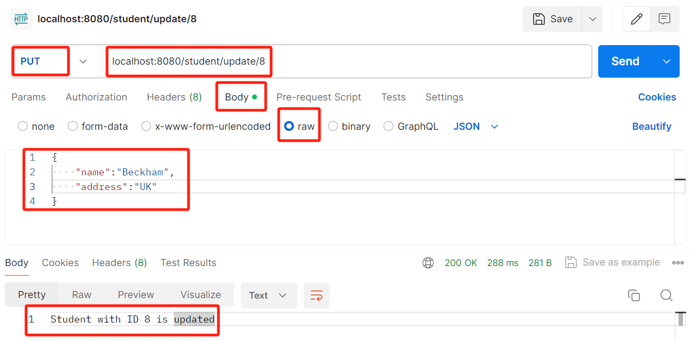

- **请求方法**：例 PUT，对应前端的 method

- **请求地址**：对应后端的接口，例子中 /student 是类，/update/{studentId} 由 controller 定义

- **Body**：即用户要发送的请求内容，以 JSON 格式发送

- 最后一行是反馈结果，类似于 console

# SSH

## 连接 Google Cloud 实例

1. 全程都可以在 `Powershell` 中执行，无需切换目录

2. **创建 SSH 密钥对**

  ```bash
  ssh-keygen -t rsa -f C:\Users\<windows_user>\.ssh\<key_file_name> -C <linux_username> -b 2048
  # eg
  ssh-keygen -t rsa -f C:\Users\39331\.ssh\windows_key -C max_shaoych -b 2048
  ```

  解释：

  - 新生成的密钥存储在`C:\Users\39331\.ssh\`

  - 一个是私钥，另一个是同名的公钥（.pub）

3. **发送 SSH 密钥对**

  1. 创建 Google 实例时，在 `高级选项` → `安全` → `管理访问权限` 手动添加本地 `Windows公钥` 内容
  2. 记事本打开新生成的公钥，复制内容，粘贴至 Google

4. **连接虚机**

  ```bash
  ssh -i <PATH_TO_PRIVATE_KEY> <LINUX_USERNAME>@<LINUX_EXTERNAL_IP>
  # eg
  ssh -i ~/.ssh/windows_key max_shaoych@34.16.204.233
  ```

  - 如果收到警告无法连接，原因是远程主机的公钥已经发生了变化，而 `known_hosts` 文件中的条目与之前保存的公钥不匹配。应该删除 `known_hosts` 文件的冲突条目，重新连接。

# VMware

## VMware基础

### 环境搭建

1. 百度搜索 `Vmware workstation` 下载官方安装包，正常安装 VMware，从网上找秘钥激活。
2. VMware Workstation Pro 17秘钥：MC60H-DWHD5-H80U9-6V85M-8280D
3. 15.5秘钥：YG5H2-ANZ0H-M8ERY-TXZZZ-YKRV8
4. 设置客户机存储位置
  - 编辑 > 首选项 > 虚拟机默认存储位置


### 名词解释

- 主机：指电脑正常的系统。

- 客户机：指虚拟的系统

- 虚拟机：指虚拟机软件

### 创建虚拟机

#### CD 创建

1. 创建虚拟机 > 典型 > 安装程序光盘映像文件

   - 选择已下载的系统文件，如 Windows 的 ISO 文件

     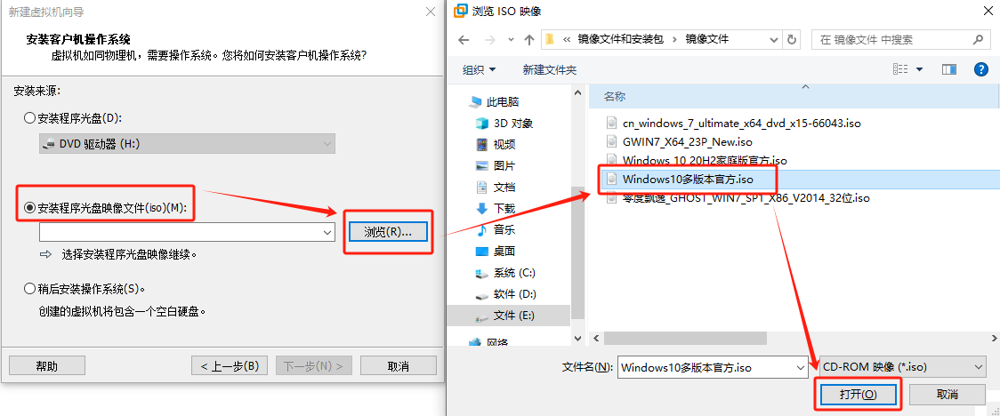

2. 更改虚拟系统显示名称和存储位置

   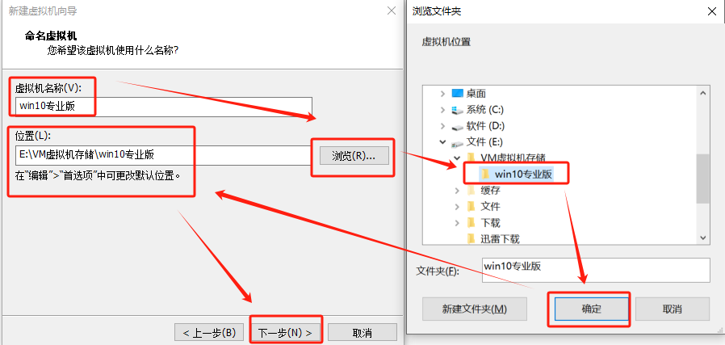

3. 配置磁盘

   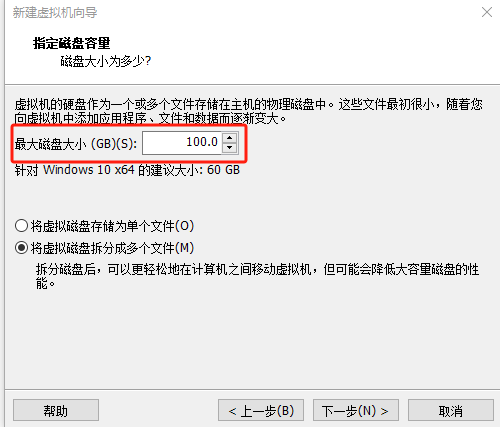

4. 运行已创建的客户机安装系统

5. 刚进入时显示黑屏正常，等几分钟

6. 选择从哪进系统，这里选择从 CD，回车确认

   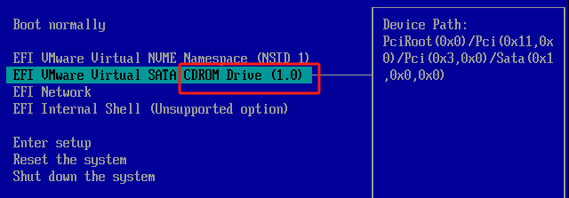

7. 确认以后还会进入黑屏，有提示字符，按任意键继续安装

8. 具体安装过程详见《Windows 笔记》

9. 系统安装完毕以后需要把 CD 切换至物理驱动器的“自动选择”

10. 安装 VM Tools

11. 共享主机文件夹

#### CD创建（后安装）

1. 此方法是后配置 ISO 文件

   - 不配置 SCSI 的方式还没验证

2. 创建虚拟机 > 典型 > 稍后安装操作系统 > 更改虚拟系统显示名称和存储位置 > 直到完成

3. 修改CD路径

  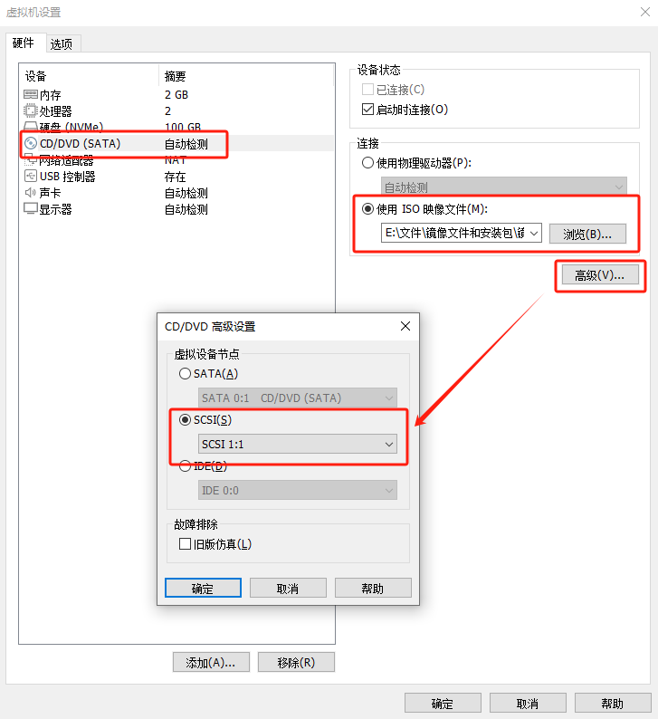

4. 其余同先安装

#### U 盘创建

1. 尽量不要使用 U 盘做系统，因为启动 U 盘会捆绑大量垃圾软件
2. 创建虚拟机 > 典型 > 稍后安装操作系统 > 更改虚拟系统显示名称和存储位置 > 一直到完成
3. 添加 U 盘
   1. 编辑虚拟机 > 添加硬盘 > 选“NVMe” > 使用物理磁盘 > 设备选最后一个
   2. 如果使用物理磁盘报错，找到 VMware 安装目录，右键属性，在“兼容”窗口勾选“以管理员身份运行此程序”
   3. 新添加的 U 盘 > 高级 > 勾选“独立”，这样 U 盘不会被快照还原
   4. 注意，待做完系统应该把新添加的硬盘删除，否则会影响其它虚拟机
4. 进入 BIOS 选择 PE
   1. 菜单栏 > 虚拟机 > 电源 > 打开电源时进入固件
   2. 选择代表 U 盘的选项启动进入 PE
5. 分区
   1. 进入 PE 以后，使用分区软件分区
6. 做系统
   1. 使用“老毛桃一键装机”
   2. 注意选择目标系统盘和系统 ISO 镜像

### VMware Tools

1. 安装VMware Tools，客户机可以调分辨率，可以全屏幕
2. Windows 系统安装 VMware Tools
   1. 必须在安装好虚拟系统以后
   2. 点击虚拟机界面的“虚拟机”，安装VMware Tools，下方有提示
   3. 然后进客户机，我的电脑，光盘那个磁盘就是，双击安装
   4. 安装完成弹出 CD

3. 其它

### 共享主机文件

- 步骤如图

  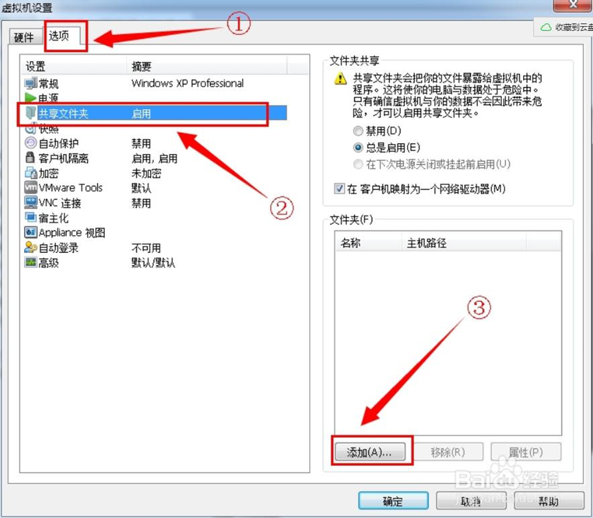

  

  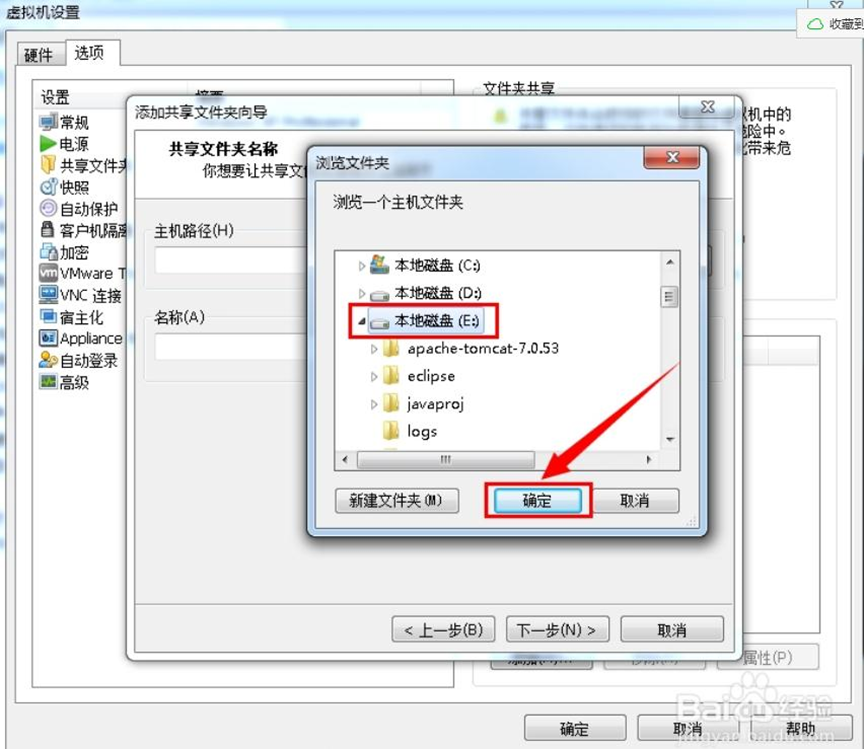

- 确定直到完成，最后启动虚拟机在我的电脑里能看见（前提是必须安装vm tools）。

- 设置完以后，为了防止客户机污染主机，应该在虚拟机将共享权限设为只读

  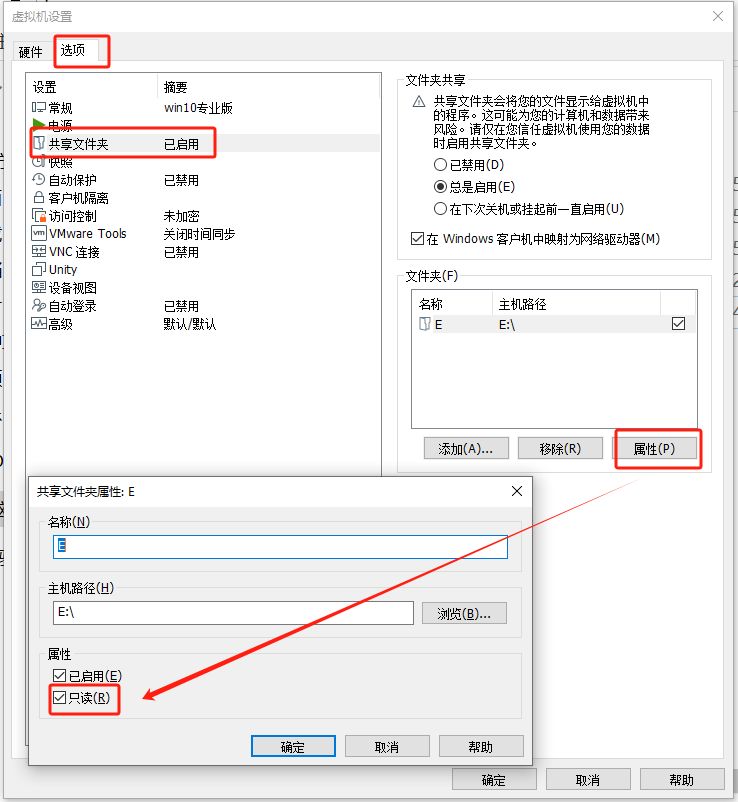

## MAC OS系统

1. 由于VM ware不自带MAC OS系统选项，所以先要添加unlocker.exe文件。

2. 安装及破解完成以后，关闭科学上网，将VMware进程全部结束（注意会自动启动），管理员运行unlocker.exe文件，读取完成以后，虚拟机系统选项即可看见MAC OS系统选项。

3. 典型安装 > 安装程序光盘映像文件 > 所有文件 > 选择Mac os的cdr文件 > 下一步；

   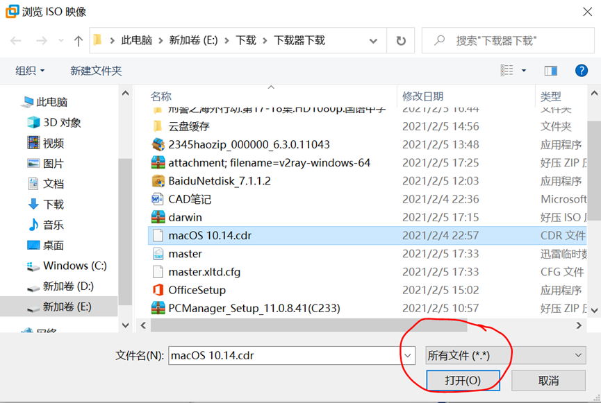

4. 选择Apple Mac OS，版本号为系统的版本号；

   

5. 注意内存至少为3G；进入虚拟机，开始做系统；

6. 选完语言不要点继续，在空白处单击，屏幕上方给虚拟机分区：实用工具-磁盘工具-选择VM开头的磁盘-抹掉；

7. 关闭磁盘工具-继续；正常安系统，等进度条走完，开始配置电脑。

8. 网络配置

   - 网络选择“以太网”

   - 主机设置-网络-网络和共享中心—单击wifi名-属性-共享-允许其它网络用户通过此计算机的internet连接来连接-“家庭网络连接”选择VMware net1；

   - 虚拟机设置-网络适配器-仅主机模式：与主机共享的专用网络；

9. 如果网络配置成功，则系统可以继续配置；

10. 安装VM tools

    - 单击访达，弹出光驱，虚拟机设置，将光驱定位至darwin.iso文件，在虚拟机右下角右键光驱，连接，mac系统自动弹出VM tools安装，双击安装并授权允许安装。安装完会重启。

# 阿里云

# Windows Terminal

Windows Terminal 是 Windows 系统下的终端集合工具

## 环境搭建

- Microsoft Store 安装

## 添加终端

1. 以 Git Bash 为例

2. 电脑中安装好 Git

3. 在 Microsoft Store 中安装 Windows Terminal 并运行

4. 下拉菜单中进入设置

5. 左下角打开 JSON 文件，用 VS Code 编辑

6. 将以下内容加入到 `profiles` 的 `list` 中添加一项

  ```json
  {
      "guid" : "{96E6AB7F-8963-20F8-5068-014DFAA8C12A}",
      "name" : "Git Bash",
      "commandline" : "D:\\Program Files\\Git\\bin\\bash.exe -l -i -c 'cd ~ && exec bash'",
      "icon" : "D:\\Program Files\\Git\\mingw64\\share\\git\\git-for-windows.ico"
  }
  ```

  - guid：唯一标识本命令行配置，可以使用[在线guid工具](http://tool.pfan.cn/guidgen)随机生成一个和list中其他配置不一样的guid即可

  - name：本命令行配置的名字，会显示在菜单中

  - commandline：表示如何启动一个命令行，前面是 Git Bash 的安装目录

    `- l`：表示以登录模式启动 Bash shell

    `- l`：表示以交互模式启动 Bash shell

    `- c`：直接进入 Users 的 Home 目录，即 `C:\Users\39331`

  - icon：显示在菜单中的图标

7. 保存以后直接在下拉菜单打开 Git Bash

# XAMPP

XAMPP 是一个流行的免费开源的跨平台软件包，用于搭建和运行 Web 服务器环境。XAMPP 包含了 Apache HTTP 服务器、MySQL 数据库、PHP 和 Perl 等工具，以及一些其他必要的组件，使用户能够在本地计算机上轻松地搭建和运行 Web 应用程序。

## 使用方法

1. **关于环境搭建**

   - [官网下载 XAMPP](https://www.apachefriends.org/download.html)

   - 安装之前把以前的 MySQL 清理干净

2. 启动 XAMPP，启动 Apache 和  MySQL

  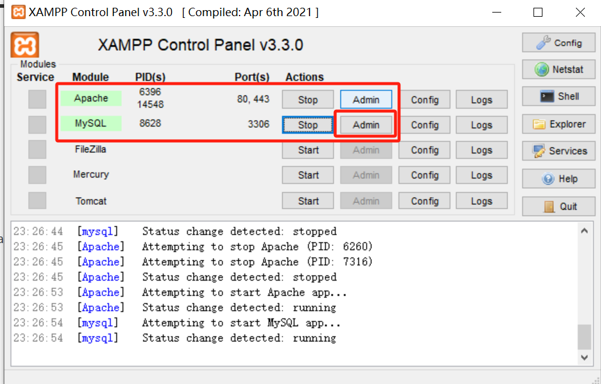

3. 进入 Admin 新建一个数据库，其余交给后端


# YAML

​	YAML 是 "YAML Ain't a Markup Language"（YAML 不是一种标记语言）的递归缩写。在开发的这种语言时，YAML 的意思其实是："Yet Another Markup Language"（仍是一种标记语言）。

- 大小写敏感
- 缩进
  - 使用缩进表示层级关系
  - 缩进的空格数不重要，只要相同层级的元素左对齐即可
  - 缩进不允许使用 Tab，只允许 Space
  - 上下级缩进 2 个空格
  - 字符（如冒号）后缩进 1 个空格
- `#` 表示注释
- `-` 表示列表项
