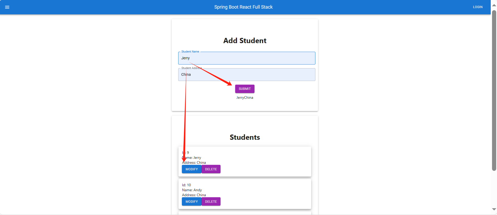

# Dockerfile Build Image

## 项目概述

- **来源**：[GoogleCloudPlatform/kubernetes-engine-samples/quickstarts/hello-app/](https://github.com/GoogleCloudPlatform/kubernetes-engine-samples/tree/da3e2c22c727e3b6d72d4eea04c19335db0727cb/quickstarts/hello-app)
- **概述**：这是一个简单的 Go 语言 Web Server 应用项目，旨在实现在本地通过 Dockerfile 创建镜像。
- **存储**
  - 代码存储在 Git 托管平台
  - 镜像存储在 DockerHub

## 创建过程

1. 创建 web-server.go 文件

   ```go
   package main
   
   import (
   	"fmt"
   	"log"
   	"net/http"
   	"os"
   )
   
   func main() {
   	mux := http.NewServeMux()
   	mux.HandleFunc("/", hello)
   
   	port := os.Getenv("PORT")
   	if port == "" {
   		port = "8080"
   	}
   
   	log.Printf("Server listening on port %s", port)
   	log.Fatal(http.ListenAndServe(":"+port, mux))
   }
   
   func hello(w http.ResponseWriter, r *http.Request) {
   	log.Printf("Serving request: %s", r.URL.Path)
   	host, _ := os.Hostname()
   	fmt.Fprintf(w, "你好, 世界!\n")
   	fmt.Fprintf(w, "Version: 1.0.0\n")
   	fmt.Fprintf(w, "Hostname: %s\n", host)
   }
   ```

2. 创建 Dockerfile 文件

   ```dockerfile
   FROM golang:1.21.0 as builder
   WORKDIR /app
   RUN go mod init hello-app
   COPY *.go ./
   RUN CGO_ENABLED=0 GOOS=linux go build -o /hello-app
   
   FROM gcr.io/distroless/base-debian11
   WORKDIR /
   COPY --from=builder /hello-app /hello-app
   ENV PORT 8080
   USER nonroot:nonroot
   CMD ["/hello-app"]
   ```

3. 创建镜像

   ```bash
   docker build -t dockerfile-build-image .
   ```

4. 运行容器

   ```bash
   docker run -d -p 80:8080 --name test dockerfile-build-image:latest
   ```

5. 本地访问应用：http://127.0.0.1:80

# GitLab CI Image

## 项目概述

- **来源**：[GoogleCloudPlatform/kubernetes-engine-samples/quickstarts/hello-app/](https://github.com/GoogleCloudPlatform/kubernetes-engine-samples/tree/da3e2c22c727e3b6d72d4eea04c19335db0727cb/quickstarts/hello-app)
- **文件**：web-server.go 和 Dockerfile 从 Dockerfile Build Image 项目复制
- **概述**：这是一个简单的 Go 语言 Web Server 应用项目，旨在实现通过 GitLab CI 创建镜像。
- **存储**
  - 代码存储在 Git 托管平台
  - 镜像存储在 DockerHub

## 创建过程

1. 创建 web-server.go 文件

   ```go
   package main
   
   import (
   	"fmt"
   	"log"
   	"net/http"
   	"os"
   )
   
   func main() {
   	mux := http.NewServeMux()
   	mux.HandleFunc("/", hello)
   
   	port := os.Getenv("PORT")
   	if port == "" {
   		port = "8080"
   	}
   
   	log.Printf("Server listening on port %s", port)
   	log.Fatal(http.ListenAndServe(":"+port, mux))
   }
   
   func hello(w http.ResponseWriter, r *http.Request) {
   	log.Printf("Serving request: %s", r.URL.Path)
   	host, _ := os.Hostname()
   	fmt.Fprintf(w, "你好, 世界!\n")
   	fmt.Fprintf(w, "Version: 1.0.0\n")
   	fmt.Fprintf(w, "Hostname: %s\n", host)
   }
   ```

2. 创建 Dockerfile 文件

   ```dockerfile
   FROM golang:1.21.0 as builder
   WORKDIR /app
   RUN go mod init hello-app
   COPY *.go ./
   RUN CGO_ENABLED=0 GOOS=linux go build -o /hello-app
   
   FROM gcr.io/distroless/base-debian11
   WORKDIR /
   COPY --from=builder /hello-app /hello-app
   ENV PORT 8080
   USER nonroot:nonroot
   CMD ["/hello-app"]
   ```

3. 创建 .gitlab-ci.yml 文件

   ```yaml
   variables:
     IMAGE_NAME: jerrybaijy/gitlab-ci-image
     IMAGE_TAG: v1.0
   
   stages: 
     - build
   
   build_image:
     stage: build
     image: docker:20.10.20
     services:
       - docker:20.10.20-dind
     variables:
       DOCKER_TLS_CERTDIR: "/certs"
     before_script:
       - docker login -u $DOCKER_USER -p $DOCKER_PASSWORD
     script:
       - docker build -t $IMAGE_NAME:$IMAGE_TAG .
       - docker push $IMAGE_NAME:$IMAGE_TAG
   ```

4. 推送至 GitLab

   - 项目文件推送至远程仓库
   - GitLab 在 Pipeline 中自动生成 Image 并推送至 DockerHub

# Student Spring Boot React Full Stack



## 项目概述

- **来源**：[YouTube 博主 Arjun Full Stack web application using Spring Boot and React | REST API | MySQL | React Hooks](https://www.youtube.com/watch?v=O_XL9oQ1_To)
- **项目概述**：这是一个全栈 Web 应用项目，主要功能是网页端与数据库的数据交互。
- **前端**：使用 Java Script 的 React 框架搭建
- **后端**：使用 Java 的 Spring Boot 框架搭建
- **数据库**：使用 XAMPP 集成的 MySQL
- **代码存储**：前后端以两个分项目形式分别存储在托管平台
  - student-springboot-react-frontend
  - student-springboot-react-backend


## 后端

### 后端环境搭建

- **框架**：Spring Boot
- **语言**：Java
- **环境依赖**：JDK
- **IDE**：IDEA

### 创建后端项目

- 完成  Spring Boot 环境搭建，详见  Spring Boot

- 项目依赖：Spring Web, MySQL Driver, Spring Data JPA

- IDEA 打开项目文件夹


### 创建包和类

- 创建 package `model`
  - 创建 class `Student`
- 创建 package `respository`
  - 创建 class - Interface `StudentReporitory`（数据库接口）
- 创建 package `controller`（用于映射所有 http 方法）
  - 创建 class `StudentCtroller`
- 创建 package `service`
  - 创建 class - Interfaces `StudentService` （服务接口）
  - 创建 class `StudentServiceImpl` （服务实现）

### model

- 类和对象：model / Student.java

  ```java
  package com.jerrycodes.studentsystem.model;
  
  import com.jerrycodes.studentsystem.repository.StudentRepository;
  import jakarta.persistence.*;
  
  @Entity
  public class Student {
      @Id
      @GeneratedValue(strategy = GenerationType.IDENTITY)
      // 类的属性
      private int id;
      private String name;
      private String address;
  
  
      // 类的实例对象：Alt + Insert - Constructor - int.int
      public Student() {}
  
      // 为删除学生而写
      public Student(String name, String address) {
          this.name = name;
          this.address = address;
      }
  
      // 类的方法：Alt + Insert - Getter and Setter - int.int, name:String, address:String
      public int getId() {
          return id;
      }
      public void setId(int id) {
          this.id = id;
      }
      public String getName() {
          return name;
      }
      public void setName(String name) {
          this.name = name;
      }
      public String getAddress() {
          return address;
      }
      public void setAddress(String address) {
          this.address = address;
      }
      // 删除学生信息
      public void delete(EntityManager entityManager) {
          entityManager.getTransaction().begin();
          entityManager.remove(this);
          entityManager.getTransaction().commit();
      }
      // 修改学生信息
      public void update(String newName, String newAddress) {
          if (newName != null) {
              this.name = newName;
          }
          if (newAddress != null) {
              this.address = newAddress;
          }
      }
  }
  ```


### repository

- 数据库接口：repository / StudentRrpository.java

  ```java
  package com.jerrycodes.studentsystem.repository;
  
  import com.jerrycodes.studentsystem.model.Student;
  import org.springframework.data.jpa.repository.JpaRepository;
  import org.springframework.stereotype.Repository;
  
  @Repository
  public interface StudentRepository extends JpaRepository<Student, Integer> {
  }
  ```

### service

- 服务接口：service / StudentService.java

  ```java
  package com.jerrycodes.studentsystem.service;
  
  import com.jerrycodes.studentsystem.model.Student;
  
  import java.util.List;
  
  public interface StudentService {
      public Student saveStudent(Student student);
      public List<Student> getAllStudents();
      public void deleteStudent(int studentId);
      public void updateStudent(int studentId, String name, String address);
  }
  ```

- 服务实现：service / StudentServicelmpl.java

  ```java
  package com.jerrycodes.studentsystem.service;
  
  import com.jerrycodes.studentsystem.model.Student;
  import com.jerrycodes.studentsystem.repository.StudentRepository;
  import org.springframework.beans.factory.annotation.Autowired;
  import org.springframework.stereotype.Service;
  import com.jerrycodes.studentsystem.exception.StudentNotFoundException;
  
  import java.util.List;
  
  @Service
  public class StudentServicelmpl implements StudentService{
      // 连接数据库
      @Autowired
      private StudentRepository studentRepository;
  
      // 保存，Alt + Insert - Override Methods... - SaveStudent(student:Student):Student
      @Override
      public Student saveStudent(Student student) {
          return studentRepository.save(student);
      }
  
      // 获取：Alt + Insert - Override Methods... - getALLStudents():List<Student>
      @Override
      public List<Student> getAllStudents() {
          return studentRepository.findAll();
      }
  
      @Override
      public void deleteStudent(int studentId) {
          studentRepository.deleteById(studentId);
      }
      @Override
      public void updateStudent(int studentId, String name, String address) {
          Student studentToUpdate = studentRepository.findById(studentId).orElse(null);
          if (studentToUpdate != null) {
              studentToUpdate.setName(name);
              studentToUpdate.setAddress(address);
              studentRepository.save(studentToUpdate);
          } else {
              throw new StudentNotFoundException("Student with ID " + studentId + " not found.");
          }
      }
  }
  ```

### controller

- 控制器：controller / StudentController.java

  ```java
  package com.jerrycodes.studentsystem.controller;
  
  import com.jerrycodes.studentsystem.model.Student;
  import com.jerrycodes.studentsystem.service.StudentService;
  import org.springframework.beans.factory.annotation.Autowired;
  import org.springframework.web.bind.annotation.*;
  
  import java.util.List;
  
  
  @RestController
  @RequestMapping("/student")
  @CrossOrigin
  public class StudentController {
      @Autowired
      private StudentService studentService;
  
      @PostMapping("/add")
      public String add(@RequestBody Student student){
          studentService.saveStudent(student);
          return "New student is added";
      }
  
      @GetMapping("/getAll")
      public List<Student> getAllStudents(){
          return studentService.getAllStudents();
      }
  
      @DeleteMapping("/delete/{studentId}")
      public String delete(@PathVariable int studentId){
          studentService.deleteStudent(studentId);
          return "Student with ID " + studentId + " is deleted";
      }
      @PutMapping("/update/{studentId}")
      public String update(@PathVariable int studentId, @RequestBody Student updatedStudent) {
          studentService.updateStudent(studentId, updatedStudent.getName(), updatedStudent.getAddress());
          return "Student with ID " + studentId + " is updated";
      }
  }
  ```

### 数据库

- **工具**：使用 XAMPP 集成的 Apache MySQL Tomcat 创建数据库
- 启动 XAMPP，创建数据库 fullstack

### 连接数据库

- 提前完成数据库搭建

- 连接数据库：resources / application.properties

  ```properties
  # configuration
  spring.jpa.hibernate.ddl-auto=update
  spring.datasource.url=jdbc:mysql://localhost:3306/fullstack
  spring.datasource.username=root
  spring.datasource.password=
  spring.datasource.driver-class-name=com.mysql.cj.jdbc.Driver
  ```

  删掉了原文件自动生成的一句代码：`spring.application.name=studentsystem`

- 此时转到 StudentsystemApplication.java 文件即可运行应用，验证数据库启动成功

- 在数据库 Admin 页面可以看到已经创建了 student 数据表

### 调试后端

- 启动 APP 后端
- 使用 Postman 模拟前端浏览器与后端交互
- 调试通过即可转向前端开发

## 前端

### 前端环境搭建

- **框架**：React
- **语言**：HTML, CSS, Java Script, JavaScript XML, React Hooks
- **环境依赖**：Node.js
- **IDE**：VS Code, IDEA
- **其它工具**
	- **Postman**：模拟浏览器
	- **Material UI**：React 组件依赖

### 具体步骤

1. 创建 React 项目，具体方法详见 React

   1. 创建 React APP
   2. 安装 Material-UI 和 Material Icons
   3. 创建组件文件 `Appbar.js` 和  `Student.js`

2. 创建组件 `Appbar.js`

   ```js
   import * as React from 'react';
   import AppBar from '@mui/material/AppBar';
   import Box from '@mui/material/Box';
   import Toolbar from '@mui/material/Toolbar';
   import Typography from '@mui/material/Typography';
   import Button from '@mui/material/Button';
   import IconButton from '@mui/material/IconButton';
   import MenuIcon from '@mui/icons-material/Menu';
   
   // 此处的 Appbar 即主程序文件 App.js 中的 <Appbar />
   export default function Appbar() {
     return (
       <Box sx={{ flexGrow: 1 }}>
         <AppBar position="static">
           <Toolbar>
             <IconButton
               size="large"
               edge="start"
               color="inherit"
               aria-label="menu"
               sx={{ mr: 2 }}
             >
               <MenuIcon />
             </IconButton>
             <Typography variant="h6" component="div" sx={{ flexGrow: 1 }}>
               Spring Boot React Full Stack
             </Typography>
             <Button color="inherit">Login</Button>
           </Toolbar>
         </AppBar>
       </Box>
     );
   }
   ```

3. 创建组件  `Student.js`

   ```js
   import * as React from 'react';
   import Box from '@mui/material/Box';
   import TextField from '@mui/material/TextField';
   import { Button, Container, Paper } from '@mui/material';
   
   // 此处的 Student 即主程序文件 App.js 中的 <Student />
   export default function Student() {
     const paperStyle = { padding: '50px 20px', width: 600, margin: '20px auto' }
   
     const [students, setStudents] = React.useState([])
     const [name, setName] = React.useState('')
     const [address, setAddress] = React.useState('')
   
     // 定义 getAll
     const fetchStudents = () => {
       fetch("http://localhost:8080/student/getAll")
         .then(res => res.json())
         .then((result) => {
           setStudents(result);
         })
     }
   
     // 在组件挂载时获取学生信息
     React.useEffect(fetchStudents, [])
   
     // 定义 add
     const handleClick = (e) => {
       e.preventDefault()
       const student = { name, address }
       console.log(student)
       fetch("http://localhost:8080/student/add", {
         method: "POST",
         headers: { "Content-Type": "application/json" },
         body: JSON.stringify(student)
       }).then(() => {
         console.log("New Student added")
         fetchStudents();
       })
     }
   
     // 定义 delete
     const handleDelete = (studentId) => {
       fetch(`http://localhost:8080/student/delete/${studentId}`, {
         method: "DELETE"
       }).then(() => {
         console.log(`Student with ID ${studentId} deleted`);
         // 删除学生后更新页面以显示删除后的学生信息
         setStudents(students.filter(student => student.id !== studentId));
       });
     }
   
     // 定义 update
     const handleUpdate = (studentId) => {
       const updatedName = name;
       const updatedAddress = address;
       const updatedStudent = { name: updatedName, address: updatedAddress }
       fetch(`http://localhost:8080/student/update/${studentId}`, {
         method: "PUT",
         headers: { "Content-Type": "application/json" },
         body: JSON.stringify(updatedStudent)
       }).then(() => {
         console.log(`Student with ID ${studentId} updated`);
         // 更新学生信息后更新页面以显示最新的学生信息
         fetchStudents();
       });
     }
   
   
     return (
       <Container>
         {/* 提交框 */}
         <Paper elevation={3} style={paperStyle}>
           <h1>Add Student</h1>
           <Box
             component="form"
             sx={{
               '& > :not(style)': { m: 1 },
             }}
             noValidate
             autoComplete="off"
           >
             <TextField id="outlined-basic" label="Student Name" variant="outlined" fullWidth
               value={name}
               onChange={(e) => setName(e.target.value)}
             />
   
             <TextField id="outlined-basic" label="Student Address" variant="outlined" fullWidth
               value={address}
               onChange={(e) => setAddress(e.target.value)}
             />
   
             <Button variant="contained" color="secondary" onClick={handleClick}>
               Submit
             </Button>
   
           </Box>
           {name}
           {address}
         </Paper>
   
         {/* 展示框 */}
         <Paper elevation={3} style={paperStyle}>
           <h1>List Students</h1>
           {students.map(student => (
             <Paper elevation={6} style={{ margin: "10px", padding: "15px", textAlign: "left" }} key={student.id}>
               <div>
                 Id: {student.id}<br />
                 Name: {student.name}<br />
                 Address: {student.address}
               </div>
   
               <Button variant="contained" color="primary" onClick={() => handleUpdate(student.id)}>
                 Modify
               </Button>
   
               <Button variant="contained" color="secondary" onClick={() => handleDelete(student.id)}>
                 Delete
               </Button>
             </Paper>
           ))}
         </Paper>
       </Container>
     );
   }
   ```

4. 创建主程序 `App.js`

   ```js
   import './App.css';
   // 引入 Appbar.js 文件
   import Appbar from './components/Appbar';
   // 引入 Student.js 文件
   import Student from './components/Student';
   
   // APP 主函数
   function App() {
     return (
       <div className="App">
         {/* 调用 Appbar.js 中的 Appbar 函数 */}
         <Appbar />
   
         {/* 调用 Student.js 中的 Student 函数 */}
         <Student />
       </div>
     );
   }
   export default App;
   ```

5. 生成静态文件夹

6. 创建 Dockerfile

   ```dockerfile
   FROM node:latest
   WORKDIR /app
   COPY ./build .
   RUN npm install -g http-server
   CMD ["http-server", "-p", "8080"]
   ```

7. 通过 GitLab Pipeline 生成 Image


